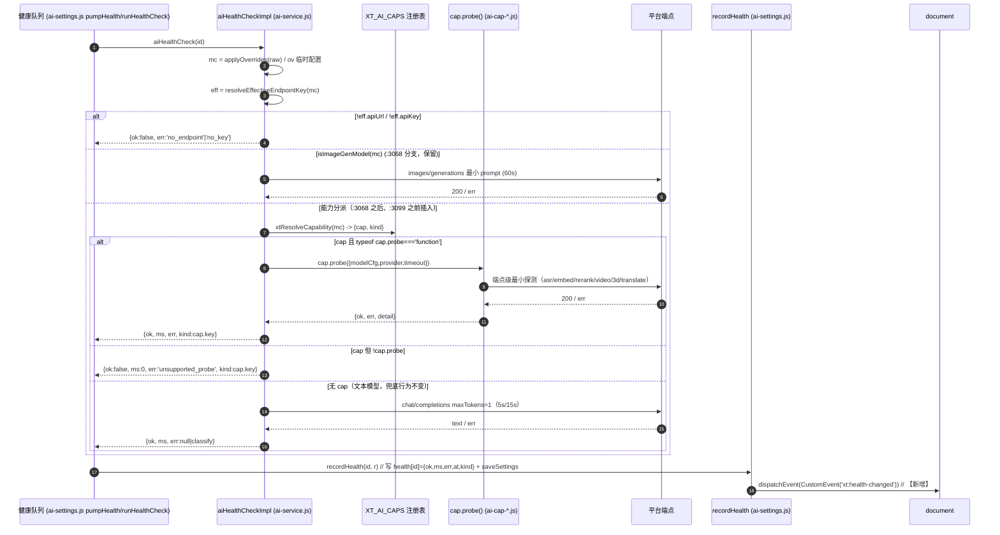
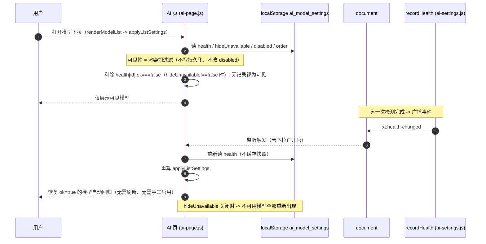
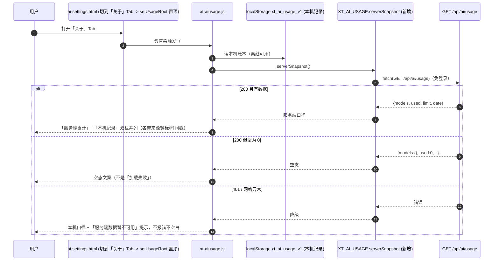
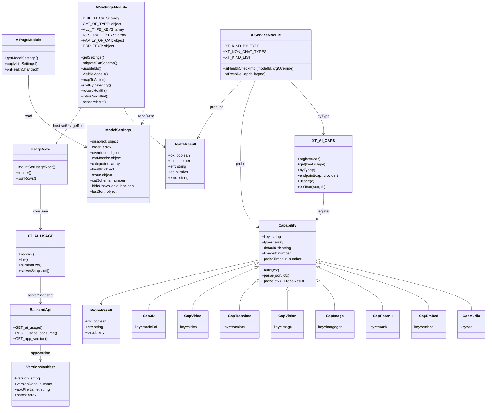

# 增量系统设计・AI 模型设置整改
# （真实能力分类 / 可用性映射 / 能力接线 / 用量统计 / 检测更新）

> 类型：**增量系统设计 + 任务分解**（仅描述变更，不重写全量设计，不改任何代码）
> 架构师：高见远（Gao）｜编制日期：2026-09-18
> 权威需求来源：`deliverables/software-company/ai-models-incremental-PRD-20260918.md`
> 事实来源：`tools/_r87_recon_facts.txt`
> 唯一可写代码树：`D:\下载的文件\学习工作台`
> ⛔ 绝不触碰 `C:\Users\ATM\WorkBuddy\Worktrees\学习工作台\main-*`（停在 R70 的过期空壳）
> 状态：待工程线实现・本文**不含代码改动**，只描述「怎么改 / 改哪些 / 谁独占」

---

## §1 设计概览：改造前后对比 + 为什么这样改

### 1.1 一句话

把 AI 模型设置的「检测 → 分类 → 映射 → 展示 → 计费」这条链从**用错接口的假数据**修成**按真实能力的真数据**，并补上两条缺失的运维事实通路（用量后端联通、版本单一真源）。

### 1.2 改造前后对比

| 维度 | 改造前（现状） | 改造后（本设计） | 对应需求/PRD |
| --- | --- | --- | --- |
| 健康检测探针 | 所有非生图模型统一打 `chat/completions` → ASR/embedding/rerank 必返 HTTP 400 | 按模型主 `type` 分派到 cap 的专用 `probe()`；无 probe 的能力返回新 err 值 `unsupported_probe` | 需求1/3/4/5 ・ P0-4 |
| 功能分类 | `BUILTIN_CATS` 仅 3 类；audio/embedding/rerank 全塞 `general`（权宜） | 12 个内置分类，与 `FUNC_TYPES` 槽位一一对应；14 键完整 `CAT_OF_TYPE` | 需求1 ・ P0-1 |
| 排序 | 仅「有效性 / 速率」两种 | 新增「按功能分类」下拉 + 分类内排序 + `lastSort` 记忆 | 需求2 ・ P1-1 |
| 映射「可用」定义 | = 未停用（`availableIds()`），与检测无关 → 坏模型照样进下拉 | = `health[id].ok===true`（`usableIds()`）；未检测/失败不清 `disabled`、不写 order 前段 | 需求3 ・ P0-2 |
| 下拉隐藏 | 无 | 渲染期过滤 `health.ok===false`，**不写持久化**；恢复后自动回归；`hideUnavailable` 开关 | 需求4 ・ P0-3 |
| 能力接线 | `ai-cap-video/3d/translate.js` 被 **0 页面**引用；`XT_KIND_*` 未登记 video/3d/translate | translate / video / 3D **全部真接入**：补页面引用 + `XT_KIND_*` 登记 + 新增 8 条 ark 模型；video/3D 探针走成本保护 | 需求5 ・ P0-5 |
| 模型说明 | 三行（星级/速度/说明），多模型「暂无说明」 | 五段式（定位/优势/场景/计费口径/端点），分类筛选叠加 | 需求6 ・ P2 |
| 用量统计 | `xt-aiusage.js` 全文无 `fetch`，只读本机 `xt_ai_usage_v1` | 新增 `serverSnapshot()` 打 `GET /api/ai/usage`，双口径并列 + 降级 | 需求7 ・ P0-7 |
| 版本检测 | 三处版本号不一致 + APK 不存在 → 必失败 | `version.json` 单一真源，脚本三处派生，前端三态文案 | 需求8 ・ P0-6 |

### 1.3 为什么这样改（对应 PRD 条目）

1. **先修数据源，再修展示**（PRD 交接要点 1）：需求 3/4 的「可用」判定、需求 2 的分类下拉取值域，全部建立在 `health` 数据正确之上。故 **P0-4 探针分派是 1 号任务的数据前提**（本设计 §6 排序第一位）。
2. **三处「扩展而非重写」**（PRD 交接要点 2）：`aiHealthCheckImpl` 只**插入**分派分支（保留文本兜底）；`mapToAiList` 只**收窄**写入范围（不删 `availableIds`）；`BUILTIN_CATS` **扩容**（不改 `vision` key）。全部为最小侵入，避免触碰历史事故高发区。
3. **隐藏=渲染期过滤**（PRD 自主裁定 2）：不改 `disabled`、不写隐藏名单 → 「恢复后自动回归」天然成立、零脏数据、完全可逆。这是需求 4 唯一正确口径。
4. **诚实优先**（PRD §1.1）：未检测→可见（不误伤 App 首装）；无 probe→`unsupported_probe`（不误报 400）；video/3D **本期真接入**（补 8 条模型 + 页面引用 + `XT_KIND_*` 登记），探针走成本保护（§3.3.1）。

---

## §2 文件清单（全部需新增/修改的文件）

> 行尾（EOL）为书写约定，**一律二进制读写** `open(p,'rb')` → 替换 → `open(p,'wb')`，见 §9。
> 「独占线」= §7 的并行工线编号；**同一独占线的文件必须由同一人串行改**。

| # | 相对路径 | EOL | 改动类型 | 独占线 | 预计改动量 |
| --- | --- | --- | --- | --- | --- |
| 1 | `assets/ai-service.js` | LF | 插入分支（`:3068` 后 / `:3099` 前）+ 替换常量块（`:1551-1562`） | L1 | +45 ~ +70 行 |
| 2 | `assets/ai-settings.js` | LF | 替换函数（`BUILTIN_CATS`/`CAT_OF_TYPE`/`ALL_TYPE_KEYS`）+ 新增块（迁移/排序下拉/可见性/说明卡）+ 移动 DOM 顺序 | L2 | +260 ~ +340 行 |
| 3 | `ai-settings.html` | LF | 新增 script 引用（+3 行）+ 排序弹窗新增 DOM（+~14 行）+ 关于页 DOM 上移（移动 `#setUsageRoot`） | L2 | ~ +20 行 |
| 4 | `assets/ai-config.js` | CRLF | 批量注入（`FUNC_TYPES` +5 槽位）+ 文案补全（`modelDetails`） | L5 | +90 ~ +160 行 |
| 5 | `assets/ai-cap-audio.js` | **LF** | 新增 `probe()`（内联 0.5s 静音 WAV） | L4 | +30 ~ +45 行 |
| 6 | `assets/ai-cap-embed.js` | **LF** | 新增 `probe()` ×2（embed / rerank） | L4 | +35 ~ +55 行 |
| 7 | `assets/ai-cap-image.js` | **LF** | 新增 `probe()`（可选，现有 `isImageGenModel` 分支保留） | L4 | +15 ~ +25 行 |
| 8 | `assets/ai-cap-vision.js` | **LF** | 不实现专用 probe（显式声明 `probe:null`，走文本探测） | L4 | +3 ~ +8 行 |
| 9 | `assets/ai-cap-translate.js` | **LF** | 补 `probe()` + `build()` 端点降级（真接线 P0） | L4 | +30 ~ +50 行 |
| 10 | `assets/ai-cap-video.js` | **LF** | 新增异步 `probe()`（只提交不轮询） | L4 | +30 ~ +45 行 |
| 11 | `assets/ai-cap-3d.js` | **LF** | 新增异步 `probe()`（只提交不轮询） | L4 | +30 ~ +45 行 |
| 12 | `assets/ai-page.js` | LF | 替换函数（`applyListSettings` 加 health 过滤）+ 新增事件监听 | L3 | +40 ~ +60 行 |
| 13 | `assets/xt-aiusage.js` | CRLF | 新增 `serverSnapshot` 拉取 + 双口径渲染 + `sortRows` 统一排序 | L6 | +140 ~ +200 行 |
| 14 | `assets/xt-update.js` | CRLF | 替换函数（三态文案：有新版/已最新/检测失败原因） | L8 | +25 ~ +45 行 |
| 15 | 36 个非 `ai-settings.html` 的页面 HTML | CRLF | 批量注入（+3 行 `<script>`：translate/video/3d cap） | L8 | 每页 +3 行 |
| 16 | `server/routers/ai.py` | CRLF | **确认不改**（`GET /api/ai/usage` 已存在且免登录）；仅新增契约注释 | L7 | 0（核验） |
| 17 | `server/routers/version.json` | JSON | **工程线不改**（版本真源，由主理人统一 bump）；结构已含 `apkFileName` | L7 | 0（核验） |
| 18 | `android/AndroidManifest.xml` | CRLF/XML | **由脚本派生**（`versionName`/`versionCode`），工程线不手改 | L7 | 脚本改写 |
| 19 | `tools/bump_versions_safe.py` | 按现文件 | 替换函数：扩为三处同步 bump（含 APK 文件名） | L7 | +60 ~ +90 行 |
| 20 | `tools/qa/check_version_consistency.py` | 新增(CRLF) | **新增**：三处不一致即 `exit != 0` | L7 | +60 ~ +80 行 |
| 21 | `web/static/apk/`（目录） | — | **新建目录**（APK 产物落点，交付时） | L7 | 目录 |

> 工具辅助脚本（非交付）：`tools/_r87_*.py`（扫描/注入/校验），按 §9 约定 Write 到 `tools/` 再执行。

---

## §3 数据结构与接口

### 3.1 `ai_model_settings`（localStorage 单键 JSON）扩展

```js
// 现状：{ disabled:{}, order:[], overrides:{}, catModels:{}, categories:[], health:{}, stars:{} }
// 改造后（新增 3 字段；其余字段一律不删不改名）：
{
  disabled: {}, order: [], overrides: {}, catModels: {}, categories: [], health: {}, stars: {},
  catSchema: 2,                                   // 新增：迁移幂等闸门（<2 才跑迁移）
  hideUnavailable: true,                          // 新增：AI 页隐藏不可用模型开关（默认 true）
  lastSort: { mode: '', catKey: '', innerMode: '' } // 新增：排序弹窗记忆
}
```

**`health[id]` 扩展**（⚠️ 真实字段名是 `at` 不是 `ts`，见 `ai-settings.js:901-907` `recordHealth`）：

```js
health[id] = {
  ok: boolean,          // 现有
  ms: number,           // 现有
  err: string | null,   // 现有；值域新增 'unsupported_probe'
  at: number,           // 现有（Date.now()，**保持 at，勿改名 ts**）
  kind: string          // 【新增】探测所用能力 key：text|vision|imagegen|asr|embed|rerank|video|model3d|translate
}
```

**`catModels` 扩展键**：新增 `audio` / `embedding` / `rerank` / `imagegen` / `translate` / `longtext` / `content`；迁移后 `general` 不再含纯能力模型。`categories`（自定义，`key=custom_*`）保持不变。

### 3.2 `err` 值域（`aiHealthCheckImpl` 返回 `{ok, ms, err, kind}`）

| err 值 | 含义 | 来源 |
| --- | --- | --- |
| `not_found` / `no_endpoint` / `no_key` | 模型不存在 / 端点缺 / Key 缺 | 现有 |
| `http_XXX` / `cors` / `network` / `timeout` / `empty` / `truncated` | 分类现状 | 现有（`classifyHealthErr`） |
| **`unsupported_probe`** | **【新增】该能力未实现自动探测**（不再误报 `http_400`） | 本设计 |

> `ERR_TEXT`（`ai-settings.js:105-111`）补该键：`unsupported_probe: '该能力暂不支持自动检测'`。

### 3.3 `probe(ctx)` 契约（能力模块可选方法，加在 cap 对象上）

```js
// cap.probe 为可选方法；注册表 XT_AI_CAPS.register() 签名【一字不改】。
// 位置：与现有 build/parse 平级，写在 cap 字面量里。
cap.probe = function (ctx) {
  // ctx = { modelCfg, provider, timeout }
  // 返回 Promise<{ ok: boolean, err: string|null, detail?: any }>
  //   ok=true  -> err 置 null
  //   ok=false -> err 取 3.2 值域之一（http_XXX / cors / network / timeout / empty / unsupported_probe）
};
cap.probeTimeout = 15000;   // 可选；缺省用 cap.timeout 或 60000
cap.probeNoAuto = true;     // 可选；true = 该能力探针【不进「检测全部」自动批量】（video/3D 必须置 true，见 §3.3.1）
```

| 能力 cap | 端点 | 探针载荷 | 判定 | 超时 |
| --- | --- | --- | --- | --- |
| `asr` | `POST /v1/audio/transcriptions` | 内联 base64 **0.5s 静音 WAV**（随脚本内联，不依赖网络） | 200 即通过 | 15s |
| `embed` | `POST /v1/embeddings` | `{input:'hi', model}` | 200 且 `data[0].embedding` 为数组 | 10s |
| `rerank` | `POST /v1/rerank` | `{query:'hi', documents:['hi'], top_n:1}` | 200 且 `results` 为数组 | 10s |
| `imagegen` | `POST /v1/images/generations` | 现有最小 prompt（或保留 `isImageGenModel` 分支不实现 probe） | 现有 | 60s |
| `vision` | chat（多模态） | **沿用现有文本探测**（`probe:null`，勿传图省额度） | 现有 | 5s/15s |
| `translate` | 见 3.6 | 最小 1 词翻译 | 200 且语料非空 | 10s |
| `video` / `model3d` | 异步任务端点 | **仅提交最小任务拿 taskId 即判连通，不轮询到完成** | 200 且有 task id | 15s |

> **探针一律不进 10 次/分钟限频、不写 `recordCall`**（健康检查本就不 `recordCall`，probe 沿用同层）。

#### 3.3.1 video / 3D 探针「成本保护」硬规则（必须实现）

video / 3D 是**真计费**能力，探针不能随便跑。实测：**video 5s/720p ≈ 103,818 tokens；3D 一次 ≈ 30,000 tokens**；200 万额度只够约 **19 个视频**。若把 video/3D 纳入「检测全部」批量，一次约 `2×103,818 + 3×30,000 ≈ 297,636` tokens，**≈ 烧掉 15% 额度**。故：

1. **video / 3d 的 `probe` 不进「检测全部」自动批量**：`pendingHealthIds()` / `pumpHealth()`（ai-settings.js）必须排除 `probeNoAuto:true` 的能力模型（即 `types` 含 `video`/`3d`）。
2. video/3D 靠 §9.6 既有语义「**无 health 记录 → 视为可见**」保持可见（**默认可用，不需探针证明**）。
3. **仅当用户单独点某个 video/3D 模型的检测按钮**时才提交探针，且**前置 `uiConfirm`**，文案明示「将向火山方舟提交真实任务并真实计费（约 X tokens）」。
4. video/3D 探针仍遵守「**只提交不轮询**」，`probe` 只判 `404 ModelNotOpen` / 未开通这类**不可用信号**。

### 3.4 注册表扩展方式（`ai-cap-registry.js` 不改）

- `register(cap)` 签名不变；新增能力只提交带 `probe` 的 cap 字面量。
- 各 cap 文件在加载时即 `var R = global.XT_AI_CAPS`，**必须在 `ai-cap-registry.js` 之后加载**（§9）。
- 运行时按 `typeof cap.probe === 'function'` 动态判定，**无 probe ≠ 报错**。

### 3.5 `XT_KIND_*` 三个常量表目标形态（`ai-service.js:1551-1562`，逐项）

```js
var XT_KIND_BY_TYPE = {
  imagegen: 'imagegen',
  audio: 'asr',
  embedding: 'embed',
  rerank: 'rerank',
  image: 'vision',
  translate: 'text',     // 【新增】翻译走文本 token 口径
  video: 'video',        // 【新增】
  '3d': 'model3d'        // 【新增】注意：type 值保持既有 '3d'（cap-3d 已登记），kind 记 'model3d'
};
var XT_NON_CHAT_TYPES = ['imagegen', 'audio', 'embedding', 'rerank', 'video', '3d']; // 【新增 video/3d】
// translate 不进 NON_CHAT（走 chat 链，见 3.6）；故此处不加 'translate'
var XT_KIND_LIST = ['text', 'vision', 'imagegen', 'asr', 'embed', 'rerank', 'video', 'model3d']; // 【新增 video/model3d】
```

> ⚠️ **与 PRD §4.1 的一处修正**：PRD 的 `CAT_OF_TYPE` 片段把 3D 写成 `three_d: 'three_d'`（当作 type 键）。但既有 `ai-cap-3d.js` 的 `types:['3d']`、`key:'model3d'`。本设计**保持模型 type = `'3d'` 不变**，仅在**分类 key** 层用 `three_d`（满足「避免数字开头 key 作 data-cat」的初衷）。映射为 `'3d' → 'three_d'`。已列入 §10 待明确。

### 3.6 translate 路由决策（P0，真接线）

`sf-hunyuan-mt-7b` 在 **SiliconFlow**，其 `chat/completions` 可用；而 recon 显示 `ai-cap-translate.js` 的 `defaultUrl` 指向 ark `/v3/responses`（Volcengine）。为「真接线」且不误伤 SiliconFlow 模型：

- **translate 作为文本族**：`kind='text'`，**不进** `XT_NON_CHAT_TYPES`，默认走 `chat/completions`（含健康探测走文本探测）。
- `ai-cap-translate.js` 的 `build()`：仅当 provider 显式配置了 `responsesUrl` 时接管（返回请求对象）；否则 **`build()` 返回 `null`** → 触发既有「缺失降级原则」回落到 chat 链（`ai-service.js:1749-1762`）。
- `probe()`：仅在 `responsesUrl` 已配置时实现专用探针；否则 `probe:null` → 走文本探测。

> 目的：既恢复 `translate` 分类槽位与能力接线，又不因端点误配破坏 SiliconFlow 的现成 MT 模型。

### 3.7 后端接口契约

| 接口 | 方法 | 鉴权 | 返回 |
| --- | --- | --- | --- |
| `GET /api/ai/usage` | GET | `get_current_user_optional`（免登录） | `{ models: {...全局累计...}, used:int, limit:int, date:"YYYY-MM-DD" }` |
| `POST /api/ai/usage/consume` | POST | 无（沿用） | `{ ok:true, used:int, status:"ok\|low\|exhausted" }` |
| `POST /api/ai/usage/reset` | POST | `X-Admin-Token` | `{...}` |
| `GET /api/app/version` | GET | 免登录 | 一律 HTTP 200：`{status:"ok\|starting", version, versionCode, apkUrl, apkReady, notes[], changelog[], publishedAt, forced}` |

**`GET /api/ai/usage` 返回结构**（`server/routers/ai.py:86-103`，现网已存在，**无需改后端**）：

```jsonc
{
  "models": { "ark-seedream-4-0828": { "used": 12, "failCalls": 1, ... } }, // ledger_snapshot()
  "used": 3,            // 当前登录用户今日调用数（游客 0）
  "limit": 999,         // AI_DAILY_LIMIT
  "date": "2026-09-18"
}
```

### 3.8 `visibleModels()` / `usableIds()` 契约（跨线，见 §7）

```js
// ai-settings.js 导出面（供 settings 页排序预览与说明）
usableIds()   -> [id]  // health[id].ok === true 的 id 集合（未检测不算可用）
visibleModels(ids) -> [id]
   // 规则：hideUnavailable===false -> 原样返回；
   //       hideUnavailable!==false  -> 剔除 health[id] 存在且 ok===false 的项；
   //       无 health 记录 -> 视为可见（保留）
// ai-page.js 侧自实现等价过滤（不依赖 ai-settings.js，因为 ai-page.js 不加载它）
```

---

## §4 程序调用流程（Mermaid）

### 4.1 健康检查能力分派



> 关键：**全程不 `recordCall`、不进 10 次/分钟限频**（沿用现状）；`unsupported_probe` 是值域新增，杜绝把「用错接口的 400」呈现为「模型不可用」。

### 4.2 隐藏 / 自动恢复



### 4.3 用量统计前后端联通



---

## §5 分类体系设计

### 5.1 最终 `BUILTIN_CATS`（12 类）+ `RESERVED_KEYS`

```js
var BUILTIN_CATS = [
  { key: 'general',   label: '文本对话',   family: 'text' },
  { key: 'longtext',  label: '长文本理解', family: 'text' },
  { key: 'content',   label: '内容创作',   family: 'text' },   // 覆盖 creative + interview
  { key: 'reasoning', label: '推理与数学', family: 'text' },   // 覆盖 reasoning + math
  { key: 'translate', label: '翻译',       family: 'text' },   // 恢复（撤销 R72-15 停用）
  { key: 'vision',    label: '视觉识图',   family: 'vision' }, // ⚠️ key 不可改名
  { key: 'imagegen',  label: '图像生成',   family: 'vision' }, // 新增成卡
  { key: 'audio',     label: '语音识别',   family: 'audio' },  // 新增成卡
  { key: 'embedding', label: '向量嵌入',   family: 'retrieval' },
  { key: 'rerank',    label: '结果重排',   family: 'retrieval' },
  { key: 'video',     label: '视频生成',   family: 'video' },  // 本期【真接入】
  { key: 'three_d',   label: '3D 生成',    family: 'three_d' } // 本期【真接入】
];
// 常量名保留（便于将来再加预留类）；本期无预留类
var RESERVED_KEYS = [];
```

**video / three_d 与其余 10 类完全同等对待**：正常成卡、组内计数、参与「按功能分类排序」下拉、可加入优先级链。**不再有「预留 / 默认折叠 / UI 标注『未接入』」的语义**（用户 2026-09-18 已决策本期真接入，见 §10.1 Q-C）。

### 5.2 完整 `CAT_OF_TYPE`（14 键，不留隐式兜底）

```js
var CAT_OF_TYPE = {
  general: 'general', longtext: 'longtext',
  creative: 'content', interview: 'content',
  math: 'reasoning', reasoning: 'reasoning',
  translate: 'translate',
  image: 'vision', imagegen: 'imagegen',
  audio: 'audio', embedding: 'embedding', rerank: 'rerank',
  video: 'video',
  '3d': 'three_d'          // ⚠️ 模型 type 保持 '3d'，映射到分类 key 'three_d'
};
```

`ALL_TYPE_KEYS`（自定义模型表单类型 chip，按此顺序回写 types）扩为 14：

```js
var ALL_TYPE_KEYS = [
  'general','reasoning','math','image','imagegen','translate','longtext',
  'creative','interview','audio','embedding','rerank','video','3d'
];
```

### 5.3 `FAMILY_OF_CAT` 分组（6 组）

```js
var FAMILY_OF_CAT = {
  general:'text', longtext:'text', content:'text', reasoning:'text', translate:'text',
  vision:'vision', imagegen:'vision',
  audio:'audio',
  embedding:'retrieval', rerank:'retrieval',
  video:'video', three_d:'three_d'
};
// 组展示顺序（固定）
var FAMILY_ORDER = ['text', 'vision', 'audio', 'retrieval', 'video', 'three_d'];
var FAMILY_LABEL = { text:'文本', vision:'视觉', audio:'语音', retrieval:'检索', video:'视频', three_d:'3D' };
```

- **6 组展示顺序（固定）**：文本 → 视觉 → 语音 → 检索 → 视频 → 3D。
- **空组折叠规则**：某组内**既无候选模型、又无用户配置链**时，该组标题与卡片**均不渲染**（空组不渲染，不出现空壳）。有模型或已配置链的组正常渲染，标题显示「组名（组内分类数）」。
- 组内分类计数与卡片顺序按 §5.1 `BUILTIN_CATS` 声明顺序。

> `FUNC_TYPES` 需补 5 个槽位：`audio` / `embedding` / `rerank` / `video` / `three_d`（`general/reasoning/vision/translate/longtext/interview/creative/imagegen` 已存在）。补齐后「UI 上能配的链 = 路由上能用的槽位」一一对齐。

### 5.4 迁移算法（幂等）

```text
migrateCatSchema(s):                        # 在 getSettings() 首次 readSettings() 之后调用
  if (s.catSchema >= 2) return false        # 幂等闸门
  # 1) 撤销 R72-15 的 translate 清洗：不再删除 catModels.translate / categories.translate
  #    （替换 ai-settings.js:359-369 现有清洗块；历史已删的不恢复用户数据，仅恢复内置卡）
  # 2) 把「能力归属无歧义」的模型从 general 迁出
  for each id in COPY(s.catModels.general):
     cat = soleCategoryOfModel(id)          # 该模型所有 types 经 CAT_OF_TYPE 映到【同一个】非 general 分类才返回，否则 null
     if (cat && cat !== 'general'):
        remove id from s.catModels.general
        if (s.catModels[cat] 不含 id): s.catModels[cat] = (s.catModels[cat] || []).concat([id])  # 追加尾部
  # 3) 保序去重：所有 s.catModels[*]
  # 4) s.catSchema = 2 ; 若发生变更 -> saveSettings()
  return true
```

**安全边界**：只搬不删、只追加不改序；混合类型模型（如 `['general','translate']`）留在原处（`soleCategoryOfModel` 返回 null）。

**幂等证明（连续执行 3 次结果一致）**：

- 第 1 次：`catSchema<2` → 执行搬移 + 去重 → 置 `catSchema=2`。
- 第 2 次：`catSchema>=2` → 立即 `return false`，**无任何写入** ⇒ 快照与第 1 次相等。
- 第 3 次：同第 2 次 ⇒ 相等。
- **补充不变量**：即使移除闸门，算法本身幂等 —— 搬移只遍历 `general` 中的 id，被搬走的 id 已不在 `general`，第 2 次遍历无从再搬；去重为集合收敛；「追加尾部」对已存在 id 走 `不含 id` 判断不重复追加。故 3 次结果恒等。
- 对应验收：PRD A3（快照两次完全相等）、A4（`catModels.general` 原双向顺序不变）。

---

## §6 任务列表（有序，按依赖/实现顺序）

> 遵循团队硬性上限：**5 个任务**。每个任务内部按「独占文件」拆成可并行的**工线**（§7）。
> 任务即依赖单元，工线即并行人单元。

### T01 数据与能力契约层（cap.probe + 配置槽位）

| 项 | 内容 |
| --- | --- |
| 负责人画像 | 前端能力层工程师（熟悉 `XT_AI_CAPS` 注册表、multipart/XHR、异步任务端点） |
| 独占文件 | `assets/ai-config.js`；`assets/ai-cap-audio.js`、`ai-cap-embed.js`、`ai-cap-image.js`、`ai-cap-vision.js`、`ai-cap-translate.js`、`ai-cap-video.js`、`ai-cap-3d.js` |
| 工作内容 | ① 各 cap 新增 `probe()`（§3.3 表）；② `ai-config.js` 的 `FUNC_TYPES` 补 5 槽位（含 `video`/`three_d`）、`modelDetails` 文案补全（含 ASR 按秒 / embed·rerank 按条 / 生图按张 / **视频·3D 按次**计费口径）；③ **新增 8 条 ark video/3D 模型**（见 T01-a）；④ 加**防回归断言**：生图条目 `types` 必须为 `["imagegen"]`（现状已正确，非现存缺陷，见 T01-c） |
| 依赖 | 无 |
| 预估改动量 | ≈ +420 ~ +620 行（7 文件，含 8 条模型新增） |
| 完成判据 | `typeof cap.probe==='function'` 逐 cap 成立；video/3D cap 置 `probeNoAuto:true`（§3.3）；`node --check` 全通过；Grep 自查 0 处 ES2017 违禁；**防回归**：生图条目 `types==['imagegen']`（非修复缺陷）；8 条 video/3D 模型 id/type 正确且**沿用既有字段集** |
| 对应 PRD 验收 | P0-4(D1·D2·D3·D6)、P0-5(E1·E2·E5 改写为「接入后可用」)、P2(J1·J2·J3·J4 之数据源部分) |

#### T01-a 新增 8 条 ark 模型（video / 3D，本期真接入）

| 显示名 | 前端 id | 真实 API ID | 额度 | 状态 |
| --- | --- | --- | --- | --- |
| Doubao-Seedance-1.0-pro | `ark-seedance-1-0-pro` | `doubao-seedance-1-0-pro-250528` | 2000000 | 可用 |
| Doubao-Seedance-1.0-pro-fast | `ark-seedance-1-0-pro-fast` | `doubao-seedance-1-0-pro-fast-251015` | 2000000 | 可用 |
| Doubao-Seedance-1.5-pro | `ark-seedance-1-5-pro` | `doubao-seedance-1-5-pro-251215` | 2000000 | 退役中 |
| Doubao-Seedance-1.0-lite-t2v | `ark-seedance-1-0-lite-t2v` | `doubao-seedance-1-0-lite-t2v-250428` | 2000000 | 退役中 |
| Doubao-Seedance-1.0-lite-i2v | `ark-seedance-1-0-lite-i2v` | `doubao-seedance-1-0-lite-i2v-250428` | 2000000 | 退役中 |
| Doubao-Seed3D-2.0 | `ark-seed3d-2-0` | `doubao-seed3d-2-0-260328` | 2000000 | 可用 |
| Hyper3D-Gen2 | `ark-hyper3d-gen2` | `hyper3d-gen2-260112` | 150000 | 可用 |
| Hitem3D-2.0 | `ark-hitem3d-2-0` | `hitem3d-2-0-251223` | 500000 | 可用 |

**统一字段模板**（`provider:"ark"`；5 条 video → `types:['video']`，3 条 3D → `types:['3d']`；`tag` —— 可用=`'免费'`、退役=`'即将下线'`；`rate` 只填真实倍率，无实测填 `''`）：

```js
// video 可用示例
{ id: 'ark-seedance-1-0-pro', name: 'Doubao-Seedance-1.0-pro',
  provider: 'ark', model: 'doubao-seedance-1-0-pro-250528',
  types: ['video'], tag: '免费', rate: '', temperature: 0.7, maxTokens: 1000, fallback: '' }
// video 退役示例（tag 承载状态，rate 不写状态文案）
{ id: 'ark-seedance-1-5-pro', name: 'Doubao-Seedance-1.5-pro',
  provider: 'ark', model: 'doubao-seedance-1-5-pro-251215',
  types: ['video'], tag: '即将下线', rate: '', temperature: 0.7, maxTokens: 1000, fallback: '' }
// 3D 示例
{ id: 'ark-seed3d-2-0', name: 'Doubao-Seed3D-2.0',
  provider: 'ark', model: 'doubao-seed3d-2-0-260328',
  types: ['3d'], tag: '免费', rate: '', temperature: 0.7, maxTokens: 1000, fallback: '' }
```
> 退役三兄弟（`ark-seedance-1-5-pro` / `-1-0-lite-t2v` / `-1-0-lite-i2v`）统一 `tag:'即将下线'`、`rate:''`；退役说明写 `modelDetails[id].applicable`。

#### T01-b 硬约束（防臆造）

- **(a) 字段集不得臆造**：`ai-config.js` 里 `deprecated` / `usable` / `expireAt` / `freeQuota` / `quotaType` / `imageSize` **全部 0 命中** —— 对接文档 §5 的字段规范是**目标态、不是现状**。现有条目字段集**只有** `id / name / provider / model / types / tag / rate / temperature / maxTokens / fallback`。新增 8 条**必须沿用此字段集**。
- **(b) 3 条「退役中」video 的写法（本期按选项 B）**：
  - **状态标签一律走 `tag`**：3 条退役 video 用 `tag:'即将下线'`（其余 5 条保持 `tag:'免费'`）。
  - **`rate` 只填真实倍率**（无实测就填 `''`），**严禁写中文状态文案**。原因：`rate` 是**倍率**槽位 —— `ai-page.js:1609` 渲染为「消耗速度 … 倍率」、`ai-page.js:1882` 走 `getModelRate(m)`、`ai-page.js:44` 注释「倍率兜底 `AI_CONFIG.builtinModels[i].rate`」。写「退役中」会产出「退役中 倍率」的**错误 UI**。
  - **人可读退役说明放 `modelDetails[id].applicable`**（如「已停主推，建议改用 Doubao-Seedance-1.0-pro / -pro-fast」）—— 该字段**确实会被渲染**（`ai-page.js:1888-1889` 渲染 `advantage` 与 `适用：applicable`）。
  - **不新增字段**（`deprecated` / `expireAt` 等一律不加，防臆造）。
  - ⚠️ **现状提醒**：`ai-page.js:1873` 的 `tagText` 是**按 `m.custom` 派生**（内置/自定义），**不读 `m.tag`** —— 故 `tag:'即将下线'` 目前**不会自动出现在「模型介绍」浮层**。要让退役角标在设置页模型列表可见，须在设置页侧自行渲染 `tag`（见 T03 可选项 ⑩）。
- **(c) 额度数字不在 `ai-config.js`**：`2000000` / `150000` / `500000` 落在 **`server/data/model_quota.json`**，**归 T05**。T01/T05 边界：**T01 = 模型条目（`ai-config.js`：id/name/provider/model/types/文案）；T05 = 额度表（`model_quota.json`）+ 版本/后端**。

#### T01-d 关于 `type:"image"`（澄清：防回归，非修复）

`ai-config.js` **现无** `type:"image"` 的生图误路由（生图条目已是 `types:["imagegen"]`：`ark-seedream-4-0415` / `ark-seedream-4-0828` / `sf-kolors`；`"image"` 的 6 处命中全是视觉理解 `glm-4v-flash` / `glm-4.6v-flash` / `sf-paddleocr-vl-1.5`）。该判据是**防回归断言，不是现存缺陷** —— 工程师**不要**去修一个不存在的问题，只需加一条断言守住。

### T02 核心运行时・健康检查能力分派（热共享文件）

| 项 | 内容 |
| --- | --- |
| 负责人画像 | 核心运行时工程师（熟悉 `ai-service.js` 请求层与 `xtResolveCapability`） |
| 独占文件 | `assets/ai-service.js`（**同一时刻只许一人改**） |
| 工作内容 | ① 在 `:3068` 生图分支之后、`:3099` 文本兜底之前插入能力分派（复用 `xtResolveCapability`，按 `cap.probe` 动态判定）；② 替换 `:1551-1562` 的 `XT_KIND_BY_TYPE`/`XT_NON_CHAT_TYPES`/`XT_KIND_LIST`（§3.5）；③ `err` 值域新增 `unsupported_probe` 并写入返回 `kind` |
| 依赖 | T01（`cap.probe` 契约 + 注册先到位；运行时按 `typeof` 守卫，也可并行起草，但合并顺序在前） |
| 预估改动量 | ≈ +45 ~ +70 行 |
| 完成判据 | 文本模型零回归（`glm-4.7` 仍打 `chat/completions` 且 `maxTokens=1`）；连续检测 20 模型 `recordCall` 调用次数为 0；无 probe 能力返回 `unsupported_probe`；video/3D 仅按显式请求触发 probe（不进自动批量，§3.3.1） |
| 对应 PRD 验收 | P0-4(D1·D2·D4·D5·D6) |

### T03 设置页・分类/排序/映射/说明/关于

| 项 | 内容 |
| --- | --- |
| 负责人画像 | 前端设置页工程师（熟悉 `ai-settings.js` 的 settings/render 体系） |
| 独占文件 | `assets/ai-settings.js`、`ai-settings.html` |
| 工作内容 | ① `BUILTIN_CATS` 12 类 / `CAT_OF_TYPE` 14 键 / `ALL_TYPE_KEYS` / `RESERVED_KEYS=[]` / `FAMILY_OF_CAT`+`FAMILY_ORDER` 6 组（§5）；② `catSchema=2` 幂等迁移（替换 `:359-369`）；③ 排序弹窗新增 `#setSortCat` / `#setSortCatInner` + `hideUnavailable` 开关 + `lastSort` 记忆；④ `mapToAiList` 收窄为 `usableIds()`（只改 `overrides[id].name`，不清不可用的 `disabled`）；⑤ `recordHealth` 末尾派发 `xt:health-changed`；⑥ 说明卡改五段式；⑦ `#setUsageRoot` 上移到 `#setPanelAbout` **首子元素**；⑧ `ai-settings.html` 补 3 个 cap 的 `<script>` 引用；⑨ **`pendingHealthIds()` / `pumpHealth()` 排除 `probeNoAuto === true` 的能力模型（即 `types` 含 `video`/`3d`）**，使 video/3D 不进「检测全部」自动批量（§3.3.1）；⑩（可选·不阻塞）退役角标在**设置页模型列表**可见 —— 注：`ai-page.js:1873` 的 `tagText` 按 `m.custom` 派生、**不读 `m.tag`**，故 `tag:'即将下线'` 不会自动出现在「模型介绍」浮层，需设置页侧自行渲染 `tag` |
| 依赖 | T01（分类槽位/文案）、T02（`health.kind`、`unsupported_probe` 文案） |
| 预估改动量 | ≈ +280 ~ +360 行 |
| 完成判据 | A1~A6 / B1~B4 / C4 / H1~H5 / I1~I4 / J1·J2·J4 全部通过；迁移连跑 3 次快照恒等；`pendingHealthIds()` 排除 video/3D（§3.3.1）；video/three_d 正常成卡、参与排序下拉 |
| 对应 PRD 验收 | P0-1、P0-2、P0-3(C4)、P1-1、P1-2、P2(渲染) |

### T04 呈现层・AI 页可见性 + 用量统计

| 项 | 内容 |
| --- | --- |
| 负责人画像 | 前端呈现 / 数据展示工程师 |
| 独占文件 | `assets/ai-page.js`、`assets/xt-aiusage.js` |
| 工作内容 | ① `ai-page.js` `applyListSettings` 增 health 过滤（`hideUnavailable`，无记录视为可见）+ 监听 `xt:health-changed` 重算（不缓存快照）；② `xt-aiusage.js` 新增 `serverSnapshot()` 打 `GET /api/ai/usage`，双口径并列、空态/降级区分、`sortRows` 统一排序（今日次数↓ → 最近时间↓ → 名称↑） |
| 依赖 | T03（`hideUnavailable` 字段名、事件名）、T05（后端接口就绪；本地 mock 可先行） |
| 预估改动量 | ≈ +180 ~ +260 行 |
| 完成判据 | C1~C5（含 C4 不写 `disabled`）、G1~G5（含 G1 确实发起 fetch、G4 降级） |
| 对应 PRD 验收 | P0-3、P0-7 |

### T05 交付层・后端/版本真源/页面引用

| 项 | 内容 |
| --- | --- |
| 负责人画像 | 后端 / 交付构建工程师（Python + 打包） |
| 独占文件 | `server/routers/ai.py`（核验不改）、`tools/bump_versions_safe.py`、`tools/qa/check_version_consistency.py`(新增)、`assets/xt-update.js`、`android/AndroidManifest.xml`(由脚本)、`web/static/apk/`(目录)、36 个非 `ai-settings.html` 页面 HTML |
| 工作内容 | ① `bump_versions_safe.py` 扩为三处同步 bump（`version.json` + `AndroidManifest.xml` + APK 文件名），`version.json` 为唯一真源；② 新增一致性检查脚本（三处不一致 `exit!=0`）；③ `xt-update.js` 三态文案（有新版/已最新/检测失败含原因）；④ 批量给页面补 `ai-cap-translate/video/3d.js` 引用（对齐现有 cap 引用集） |
| 依赖 | T01（cap 文件存在方可引用） |
| 预估改动量 | ≈ +150 ~ +220 行 + 108 行（36 页 ×3） |
| 完成判据 | F1·F2（本地）/ F3·F4（jsdom mock）/ E2（引用数对齐）；`check_version_consistency` exit 0 |
| 对应 PRD 验收 | P0-6、P0-5(E2) |

> **生产相关（部署 / 删用户数据 / 改 nginx / 构建上传 APK）必须先问用户**（PRD §7-Q1/Q2），不在工程线自主范围。F5 依赖用户授权。

---

## §7 并行工线划分（独占文件零重叠）

### 7.1 工线—文件—任务映射

| 工线 | 独占文件 | 属任务 | 可并行性 |
| --- | --- | --- | --- |
| **L1** 核心运行时 | `assets/ai-service.js` | T02 | ⚠️ **热共享文件，全局只能一条线**；按 T02 完成后再并入 |
| **L2** 设置页 | `assets/ai-settings.js`、`ai-settings.html` | T03 | 与 L1/L3/L4/L5/L6/L7/L8 并行（ai-settings.html 除外于 L8 批处理） |
| **L3** AI 页可见性 | `assets/ai-page.js` | T04 | 与 L2 并行（契约：字段名/事件名固定） |
| **L4** 能力探针 | `assets/ai-cap-{audio,embed,image,vision,translate,video,3d}.js` | T01 | 各 cap **文件级独立，可再拆 7 人并行** |
| **L5** 配置/文案 | `assets/ai-config.js` | T01 | 与 L4 并行（不同文件） |
| **L6** 用量统计 | `assets/xt-aiusage.js` | T04 | 与 L3 并行（不同文件） |
| **L7** 后端/版本 | `server/**`、`tools/**`、`android/**`、`web/static/apk/` | T05 | 与全部前端线并行 |
| **L8** 页面批处理 | 36 个非 `ai-settings.html` 页面 HTML、`assets/xt-update.js` | T05 | 与 L2 并行（**不得碰 `ai-settings.html`**，避免与 L2 冲突） |

> 建议并行度：**L1 单独先跑（瓶颈）**；L2~L8 可 7 条线同时开工。总并行度上限 8。

### 7.2 跨线契约（这些签名 / 结构**一字不改**）

| 契约 | 值 | 约束方 |
| --- | --- | --- |
| `aiHealthCheck(modelId, cfgOverride)` 签名与返回 `{ok, ms, err, kind}` | 不变 / 加 `kind` | L1 定义，L2 消费 |
| `XT_AI_CAPS.register(cap)` 签名 | **一字不改** | L1/L2/L4 共同遵守 |
| `cap.probe(ctx)` 契约 + `probeTimeout` | §3.3 | L4 实现，L1 调用 |
| `err` 值域新增 `unsupported_probe`（文案键同名） | §3.2 | L1 产生，L2 渲染 |
| localStorage 字段名 `catSchema` / `hideUnavailable` / `lastSort` | 字面量固定 | L2 写，L3/L6 读 |
| `health[id]` 字段名 `at`（**非 `ts`**）+ `kind` | 固定 | L1/L2 写，L3 读 |
| 事件名 `xt:health-changed` | 固定字符串 | L2 派发，L3 监听 |
| `visibleModels()` / `usableIds()` 语义 | §3.8 | L2 提供，L3 自实现等价 |
| `ai_model_settings` 键名 / `xt_ai_usage_v1` 键名 | 不变 | 全线 |
| `GET /api/ai/usage` 返回结构 | §3.7 | L5 不改，L6 消费 |
| `XT_KIND_BY_TYPE` / `XT_NON_CHAT_TYPES` / `XT_KIND_LIST` 目标值 | §3.5 | L1 定义 |
| `#setUsageRoot` 为 `#setPanelAbout` 首子元素 | DOM 顺序 | L2 改 DOM，L6 依赖挂载点 |
| `vision` key 字面量 / `overrides[id].name` 只写子字段 | 不改名 / 不整体覆盖 | 全线 |

---

## §8 依赖包列表

**零新增依赖（确认）。**

- 前端：沿用现有原生 ES2017 + 现有 `assets/*.js` 体系；**不引新前端框架 / 不引 CDN / 不换字体配色**（PRD §1.3、§8）。
- 后端：沿用现有 FastAPI / SQLAlchemy / `server/quota_ledger.py`；`GET /api/ai/usage` 已存在，无新包。
- 工具：沿用 `tools/bump_versions_safe.py`、`tools/verifier/`(jsdom)、`tools/qa/`；校验脚本仅用 Python 标准库。
- 环境（既有，非新增）：Python `C:/Users/ATM/.workbuddy/binaries/python/versions/3.13.12/python.exe`；Node `C:/Users/ATM/.workbuddy/binaries/node/versions/22.22.2-3/node.exe`；jsdom `C:/Users/ATM/node_modules/jsdom`。

---

## §9 共享知识（跨文件约定，逐条可照抄）

### 9.1 语法与运行时硬约束

```
- ES2017 语法上限（老 Android WebView）。禁：?.  ??  对象展开 {...obj}  对象剩余解构
  .replaceAll(  Object.fromEntries  .at(  正则后行断言 (?<= (?<!  指数 **  可选 catch 绑定
  CSS 另禁 clamp()/min()/max()。
  ⚠️ node --check 抓不到这些，必须 Grep 逐项自查 0 命中。
- 顶层禁重复声明已有全局名（本项目「AI 功能集体失效」的历史元凶）；新增全局一律写 typeof 守卫：
  if (typeof window.X === 'function') { ... }
- 禁原生 alert / confirm / prompt → 用 uiConfirm / toast（设置页用 pageConfirm / toast）。
- 不删任何现有功能与既有 DOM id / 全局函数名（尤其 vision key、availableIds、mapToAiList 名称保留）。
- 二进制读写：open(p,'rb') 读 → 替换 → open(p,'wb') 写。绝不文本模式读写（防行尾被改）。
- 改文件前备份：同名 xxx.bak-pre-rNN-日期；不清理任何 .bak-pre-r* 备份。
```

### 9.2 行尾矩阵（改前必查）

```
LF   : ai-settings.html（根）/ assets/ai-settings.js / assets/ai-page.js / assets/ai-service.js
       / assets/ai-cap-*.js（含 ai-cap-registry.js）—— 实测 2026-09-18
CRLF : 其余根 HTML、其余 assets/*.js、assets/*.css、server/**/*.py
       （assets/ai-config.js = CRLF，已复核）
```
**纪律：行尾以文件真实探测结果为准，本矩阵仅作先验；改前必须逐文件数 `\r\n`。**（防后人照文档改错，把 8 个 cap 文件全变成 CRLF 污染 diff。）

### 9.3 高危文件

```
- assets/app.js（7,087,964 B，第 665 行约 2.7 MB 超长行）：任何批量脚本都不要碰它。
- assets/app.js 是共享文件：同一时刻只许一条线改。
- 38 页面脚本引用批处理：每个 HTML 只加 script 行，绝不整体重写；ai-settings.html 由 L2 手工加，不在批处理内。
```

### 9.4 加载顺序（改了必崩）

```
ai-service.js  →  ai-cap-registry.js  →  各 ai-cap-*.js（必须在 registry 之后）
→ ai-settings.js  →  xt-aiusage.js
顺序错则能力全废（静默降级）。
```

### 9.5 工程纪律

```
- 工程线不得自行 bump 版本戳（20260918x）：只 bump 内容真改过的资产，由主理人统一做。
- 工程线不得执行 git add / commit / push（主理人统一收口）。
- 生产操作（部署 / 删用户数据 / 改 nginx / 构建上传 APK）必须先问用户。
- 本机 bash 缺 coreutils（无 ls/grep/head/cp）→ 扫描一律 Write 一个 .py 到 tools/ 再执行；
  PowerShell stdout 常被吞成空 → 结果写文件再 Read。
- Node 脚本写中文字面量会编码损坏 → 批量脚本用 python + encoding='utf-8'。
```

### 9.6 语义约定

```
- 「可用」= health[id].ok === true；未检测（无 health 记录）视为【可见】。
- 隐藏 = 渲染期过滤：不写持久化、不改 disabled、不删模型。
- 探针一律不进 10 次/分钟限频、不写 recordCall；异步能力探针只提交不轮询到完成。
- video / 3D 探针【不进自动批量】：靠「无 health 记录→视为可见」保持可见；仅在用户单独点该模型检测按钮时、经 uiConfirm 明示真实计费后提交（约 video 103,818 / 3D 30,000 tokens/次）。
- version.json 为版本唯一真源；AndroidManifest.xml / APK 文件名 / 前端展示一律由它派生。
- type（能力语义，供 XT_AI_CAPS.byType 路由）≠ cat（文档分类）：生图 type 必须是 'imagegen'，绝非 'image'。
- `rate` = 倍率（渲染为「… 倍率」），**禁止承载状态文案**；状态标签（如「即将下线」）一律走 `tag`。人可读说明走 `modelDetails[id].applicable`。
- 结果落本地：生图 URL 1h 失效、视频/3D 24h 失效 → 能力层拿到结果必须立即落本地存储，不裸存远端 URL；
  UI 对「已过期且未落本地」显示「结果已过期」而非破图。
```

---

## §10 待明确事项 + 风险

### 10.1 待明确（需确认，不阻塞最小依赖链）

| # | 事项 | 建议 / 现状 |
| --- | --- | --- |
| Q-A | **3D 模型 type 命名**：既有 `ai-cap-3d.js` 的 `types:['3d']`，PRD §4.1 的 `CAT_OF_TYPE` 片段写 `three_d:'three_d'` | 本设计**保持 type='3d'**，分类 key 用 `three_d`，映射 `'3d'→'three_d'`（避免数字开头 key 作 data-cat）。若要求 type 也改 `three_d`，需同步改 cap-3d + ai-config，churn 更大，**建议不改** |
| Q-B | **translate 端点族**：PRD 说走 chat；recon 显示 `ai-cap-translate.js` 指向 ark `/v3/responses` | 本设计将 translate 定为**文本族**（走 chat，SiliconFlow MT 可用）；cap 仅在 provider 配了 `responsesUrl` 时接管（§3.6）。需产品确认「翻译是否必须走 ark」 |
| Q-C | 视频 / 3D 是否本期接入（PRD Q3） | **已决策（用户 2026-09-18）：本期真接入**。8 条 ark 模型进 `ai-config.js`（T01-a）；`ai-cap-video.js` / `ai-cap-3d.js` 补页面引用与 `XT_KIND_*` 登记；分类正常成卡（§5.1）。探针走成本保护（§3.3.1） |
| Q-D | **生产部署授权**（PRD Q1）+ **APK 重打包/上传**（PRD Q2） | 属生产操作，**必须问用户**；F5 / 真机下载安装依赖此授权 |
| Q-E | **用量「服务端累计」鉴权语义**：免登录下 `used` 游客为 0 | 前端须区分「0 是游客」与「0 是无用量」（§4.3 空态口径） |

### 10.2 风险（含最小依赖链与可延后项）

| 风险 | 等级 | 处置 |
| --- | --- | --- |
| **L1（ai-service.js）是全局瓶颈**：热共享文件，其余展示线依赖其 `kind`/`unsupported_probe` | 高 | L1 优先完成；L2/L3 用 `typeof` 守卫与默认值先行，降低耦合 |
| 探针被平台计费 / 限频 | 中 | 载荷最小化（0.5s 静音 / 单条文本 / 单文档 / 单任务提交）；不进限频 |
| 迁移误伤老用户链 | 中 | 幂等 + 只搬不删 + 只追加不改序 + 单测断言（A3/A4） |
| 36 页面批量引用变更 | 中 | 每页只加 script 行；改完跑全站 AI 冒烟；`ai-settings.html` 不在批处理内 |
| 版本号三处不一致 | 中 | 单一真源 + bump 脚本 + QA 检查（F1） |
| 部署欠账（现网 `/api/ai/usage` 401、`/api/app/version` 404） | 高 | 本地等价验证先行；部署需用户授权 |
| APK 产物缺失（`web/static/apk/` 不存在） | 高 | 目录交付出产物；一致性脚本交付前校验 |
| 视频/3D 单次消耗巨大 + 结果 URL 仅 24h | 高 | **已核实无需新平台 / 新 Key**：`providers.ark` 已配 `apiKey`，`ai-cap-video.js` / `ai-cap-3d.js` 的 `defaultUrl` 已指向 `https://ark.cn-beijing.volces.com/api/v3/contents/generations/tasks`。真实风险 = **单次消耗巨大**（video ≈103,818 / 3D ≈30,000 tokens，200 万额度仅约 19 个视频）+ **结果 URL 仅 24h 有效**。处置：调用前 `uiConfirm` + 结果落本地（§9.6）+ 探针不进批量（§3.3.1） |
| `ai-config.js` 历史 `type:"image"` 生图误路由 | 中 | J3 防回归断言（生图必须 `type:"imagegen"`） |

**最小依赖链（必须按序）**：`T01（cap.probe + 配置槽位）` → `T02（ai-service 分派）` → `T03（设置页）` → `T04（可见性/用量）`；`T05（后端/版本/页面引用）` 仅依赖 T01。

**可延后（下标下一批）**：模型说明全文案精修、APK 产物与生产部署（Q-D，需授权）。

---

## 附录：Mermaid 源文件

- 时序图（3 张）：见 §4；另存 `deliverables/software-company/sequence-diagram.mermaid`
- 类图：见下（另存 `deliverables/software-company/class-diagram.mermaid`）


