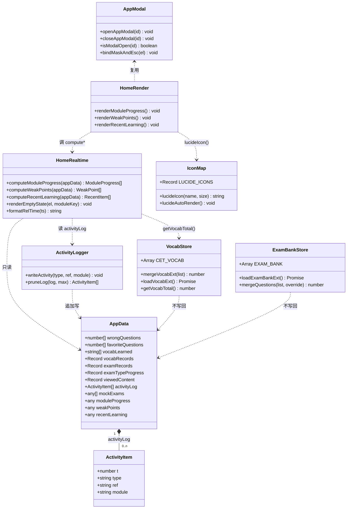
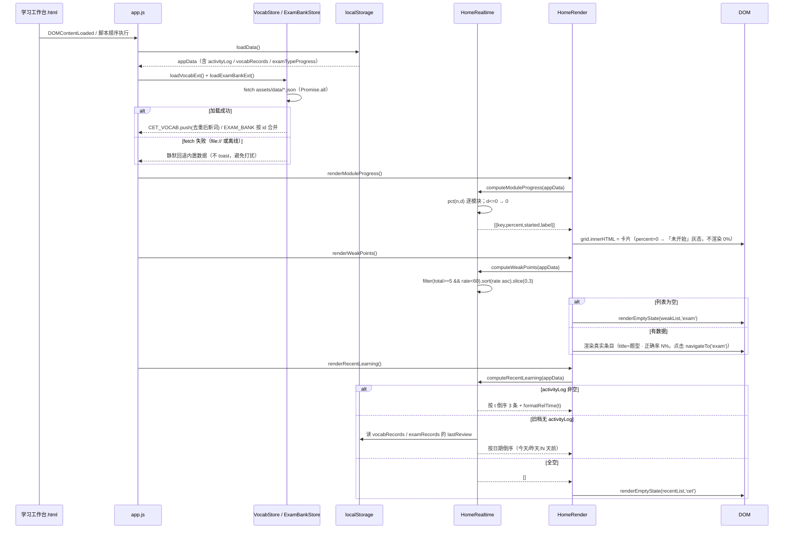
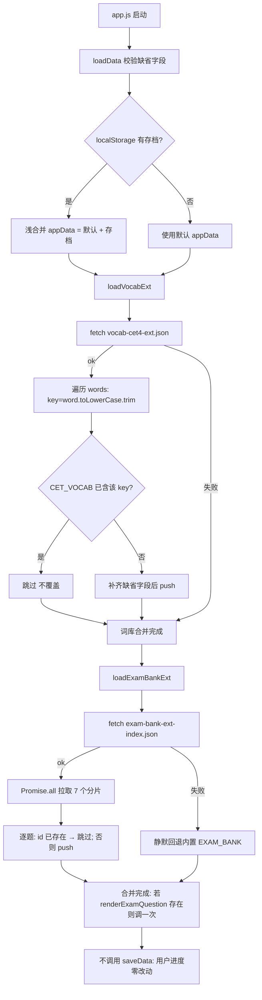
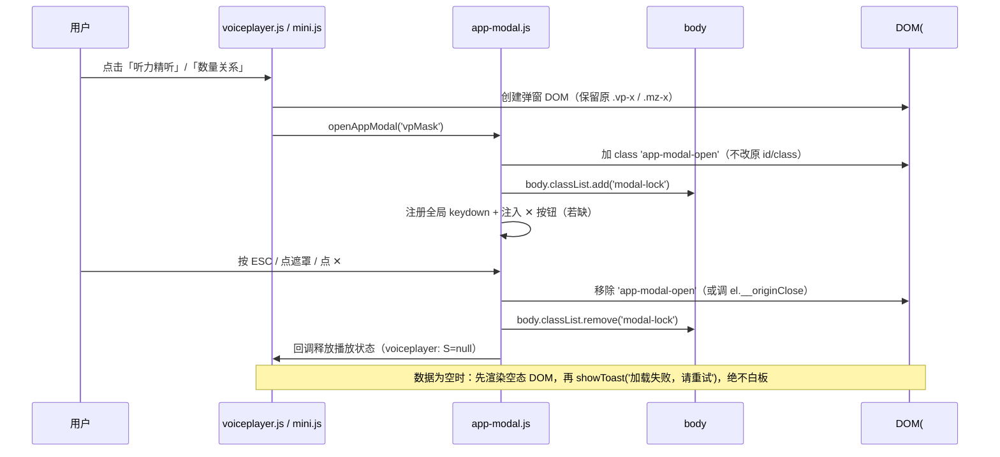
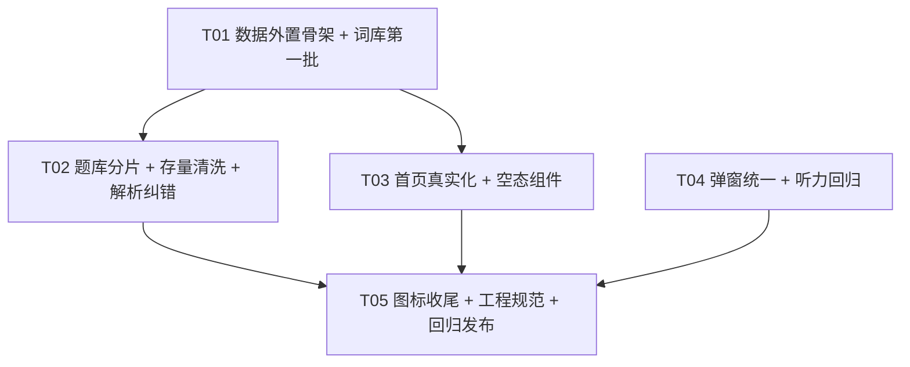

# 增量系统设计 + 任务分解 · 整改批次三

> 类型：**增量设计**（只设计变更部分，不重复整体架构）
> 依据：`deliverables/software-company/batch3-incremental-PRD.md`（许清楚）+ 2026-09-13 代码实测
> 编制：高见远（架构师） · 项目根：`C:\Users\ATM\WorkBuddy\Worktrees\学习工作台\main-8d0a1649`
> 状态：**待工程师（寇豆码）执行** · 本文不改任何现有源文件
> 用户已拍板：① 内容分批灌、第一批 1066 词 / 200 题 + 3 篇听力、不阻塞上线；② 词库走公开四六级高频词表（仅单词+释义）；③ **问题 5（首屏压缩）整批跳过**；④ **APK 不打包**

> **本版相对上一版设计稿的修订**：修正 app.js 行数（1300→**6432**）、内置题量（81→**实测 68 / 最大 id 60**）、笔试题库弹窗定位（`笔试.html` → **`assets/mini.js` 的 `#mzMask`**）、面试进度字段（新增 `interviewDone` → **改用 `viewedContent.ivQuestions`**）、最近学习时间源（`wrongQuestions` 补 `ts` → **新增 `activityLog` 环形日志**）、bump 工具（`bump_versions_0911e.py` → **新建 `bump_versions_0913a.py`**）。详见 §0。

---

## 0. 开工前必读：现状核实修正（与转述/PRD/上一版设计不一致处，以本节为准）

| # | 项 | 转述 / PRD | **实测** | 影响 |
|---|----|-----------|---------|------|
| A1 | `assets/app.js` 行数 | 约 1300 行 | **6432 行** | 影响面比预估大得多，**题库/词库外置是硬要求**；改动必须先备份 + `node --check` |
| A2 | 内置题量 | 81 题 | `grep -c "\{ id: [0-9]*, type: '"` = **68**；注释写「41-100」但实际只到 **id 60** | 第一批目标以**脚本实测基数**为准（总量 ≥200），不要按固定 +119 灌 |
| A3 | 词库 | 466 词 | `grep -c "\{ word: '"` = **466** ✅ | 第一批 +600 → 1066 |
| A4 | 假数据位置 | app.js:250-262 | ✅（`moduleProgress` 250-252 / `weakPoints` 253-257 / `recentLearning` 258-262） | — |
| A5 | 渲染入口 | 1241/1267/1285 | ✅（`renderModuleProgress` 1240 / `renderWeakPoints` 1264 / `renderRecentLearning` 1282） | — |
| A6 | 题库 fetch | — | **`app.js:360-374` 已有 exam-bank.json 异步覆盖逻辑**（按 id 覆盖/追加，失败静默回退） | 本批**复用这段模式**，不新造轮子 |
| A7 | `wrongQuestions` / `favoriteQuestions` | 含时间戳 | **只存题目 id（数字），无 ts、无模块**（4268 / 4333） | "最近学习"**无法**从这两个数组取时间 → 新增 `activityLog`（§1.3） |
| A8 | 时间字段 | — | `vocabRecords[w].lastReview` / `examRecords[id].lastReview` = `YYYY-MM-DD`（**无时分秒**） | 分钟级相对时间只能靠新增 `activityLog`；旧档回退到"天"级 |
| A9 | 面试完成场数 | 存在 | **全仓无 `interviewDone` / 任何面试场次记录字段** | 改用 `viewedContent.ivQuestions.length / INTERVIEW_QUESTIONS.length`；预留 `interviewSessions: []` 标【后续扩展点】 |
| A10 | 弹窗现状 | 各写各的 | `#countdownModal` 用 `.active`；**`mini.js` 的 `.mz-mask` 已自带点遮罩关闭（91 行）**；`voiceplayer.js` `#vpMask` 无 ESC/锁滚动 | 迁移范围收敛：mini.js **只需补空态+toast**，不重写关闭逻辑 |
| A11 | 听力"下一句" | 需接线 | **`voiceplayer.js:140-144` 已有 `__next()` 且逻辑正确**（末句 toast「🎉 本情景完成」） | R6-7 性质改为**回归验证**，不改代码 |
| A12 | 图标库 | 19 个 | ✅ `icon-map.js` 19+ key、`lucideIcon(name,size)`、`data-icon` 自动扫描 + `window.lucideAutoRender()` | 严禁新建第二套 |
| A13 | 版本脚本 | `bump_versions_safe.py` | 该脚本**只替换 app.js / api.js / polish.css 三个正则**且自述"已废弃"；**`bump_versions_0912a.py` 才是全资源版**（`--check` 预演 + 配对校验） | 本批**新建 `tools/bump_versions_0913a.py`**（照抄 0912a 模板） |
| A14 | 空态样式 | 无 | 已有 `.week-chart-empty`(common.css:710)、`.stats-empty-hint`(720) | `.empty-hint` 追加在 **common.css:728 之后**（与既有空态同区） |
| A15 | 词库字段 | PRD 写 `detail` 字段 | **真实 `CET_VOCAB` 无 `detail`**，实际为 `word/phonetic/meaning/root/collocation[]/synonym[]/antonym[]/example/example2` | 增量 JSON **严格沿用真实字段**，`detail` 不采用 |
| A16 | 常量所在行 | — | `EXAM_BANK` 288、`CET_VOCAB` 377、`INTERVIEW_QUESTIONS` 2641、`PPT_LAYOUTS` 2654、`COMM_SCENES` 2777（均在 app.js 同一作用域） | 三个 compute 函数可直接引用，无需跨文件传参 |

---

## 1. 实现方案与关键决策

### 1.1 总体思路：**代码先行、数据后补、两批解耦**

```
【第一批（本批上线）】                       【第二批（长尾，可延后/并行外包）】
代码：空态 + 真实化 + 合并框架 + 入库关卡       数据：词汇 1066→2000、题库 200→300、听力 +9~15 篇
数据：词汇 466→1066、题库 →200、听力 +3 篇
      ↑ 第二批只改 assets/data/*.json + 版本 bump，代码零改动
```

**为什么这么切**：数据工程是长尾且不可控（版权 / 质量 / 人工校验），代码是确定性的。把「合并框架 + 空态」先上线，用户立刻拿到可信的首页；数据分批只往 `assets/data/` 丢 JSON，**不改一行 JS**，风险隔离。

### 1.2 决策 1：题库/词库**强制外置 JSON**，`app.js` 只留合并逻辑

| 理由 | 依据 |
|------|------|
| app.js 已 **6432 行**，再加 220 题 ≈ +1500 行，改一处风险外溢 | A1 |
| 已有可复用的 fetch 覆盖模式（`app.js:360-374`） | A6 |
| 外置后数据分批上线 = 只换 JSON + bump，零代码风险 | §1.1 |

**合并策略（核心，务必按此实现）**：

| 数据 | 键 | 冲突规则 | 写回 localStorage |
|------|----|---------|------------------|
| 词汇 | `word`（`toLowerCase().trim()`） | **已存在则跳过**（不覆盖） | ❌ 不写 |
| 存量题（`exam-bank.json`） | `id` | **同 id 以 JSON 覆盖内置**（唯一来源，内置仅离线兜底） | ❌ 不写 |
| 增量题（ext 分片） | `id`（1101+ 段位） | **只 push 不覆盖**（与内置不撞 id） | ❌ 不写 |
| 用户进度 | — | `vocabLearned` / `vocabRecords` / `examTypeProgress` / `wrongQuestions` / `favoriteQuestions` **一律不动** | ✅ 原逻辑不变 |

> **关键**：合并只作用于内存中的 `const` 数组（`CET_VOCAB` / `EXAM_BANK` 是 `const` 但可 `push` / 按索引赋值），**绝不调 `saveData()`** → 老存档的学习标记、复习间隔、错题本 100% 不丢（R3-8）。
> **可接受副作用（需在上线说明告知）**：词库 466→1066 后，老用户"已学 N / 总数"分母变大 → 首页四级进度百分比**下降**。这是真实反映（"还有更多要背"），不是 bug。

### 1.3 决策 2：新增 `activityLog` 环形行为日志（解决 A7 / A8）

现有数据**没有分钟级时间戳**，而 R1-3 要求"含相对时间（如 3 分钟前）"。

- 新增 `appData.activityLog: [{ t:<epoch ms>, type:'vocab'|'exam'|'fav'|'listen', ref, module }]`
- 只追加、**环形截断 200 条**、随 `saveData()` 落盘（体积 < 20KB）
- 老存档无此字段 → `computeRecentLearning()` **自动回退**到 `vocabRecords.lastReview` / `examRecords.lastReview`（`YYYY-MM-DD`）排序，显示"今天 / 昨天 / N 天前"，**不报错、不空态**
- 写入点只有 3 处（app.js）：`recordVocab` 末尾（≈3479）、`recordExamQuestion` 末尾（≈3525）、收藏分支（≈4333）

### 1.4 决策 3：三个纯函数 + 三个渲染函数解耦（R1-6）

```
computeModuleProgress(appData) -> ModuleProgress[]   // 纯函数，不碰 DOM
computeWeakPoints(appData)     -> WeakPoint[]
computeRecentLearning(appData) -> RecentItem[]
renderModuleProgress() / renderWeakPoints() / renderRecentLearning()  // 只负责 DOM
```

六个函数全部挂 `window`，供 `tools/verifier` 直接断言（R1-6 验收）。

### 1.5 决策 4：弹窗统一 = **新增独立文件 `assets/app-modal.js`**，不塞进 app.js

- 独立文件（约 120 行，含 CSS 注入），避免再给 6432 行的 app.js 加压
- 提供 `openAppModal(id)` / `closeAppModal(id)` + 全局 ESC / 遮罩 / `body.modal-lock`
- **渐进迁移**：本批只接 2 处（`voiceplayer #vpMask` 补齐 ESC/锁滚动；`mini #mzMask` 补空态+toast）；`#countdownModal` **结构不动**
- 兼容：原有 `.vp-x` / `.mz-x` DOM **不删**，作为冗余关闭入口保留

### 1.6 决策 5：图标 = 只追加不新建（R4）

在 `LUCIDE_ICONS` 字典尾部追加 ≤10 个 key，沿用现有 `svg(body)` 模板；静态处写 `data-icon="xxx"`，JS 动态处调 `lucideIcon(name, size)`。
**白名单（不替换）**：`assets/emoji/manifest.js`、播控 ⏮🔊🐢⏭、状态 ✅❌⚠️🎉、成就徽章 🌟🔥📝🗣️、主题 🌙☀️、打招呼 👋、侧栏 logo 📚。

### 1.7 决策 6：版本 bump 新建脚本（A13）

新建 `tools/bump_versions_0913a.py`（照抄 `bump_versions_0912a.py` 的 `--check/--write` + 配对校验框架，`VERSION="20260913a"`，`PAGES` = 本批改动页）。**不用** `bump_versions_safe.py`（只覆盖 3 个资源且已废弃），也**不用** `bump_versions_0911e.py`（默认版本号写死 20260911g，无参运行会反向降级）。

---

## 2. 文件清单

> 备份约定：被修改的现有文件先 `cp` 到 `备份/<原文件名>.bak-20260913a`（该目录已存在，被 `check_icons_0912.js` 排除扫描）

| # | 相对路径 | 动作 | 作用 | 备份 |
|---|---------|------|------|------|
| 1 | `assets/data/vocab-cet4-ext.json` | 🆕 | 增量词库第一批（+600 词；ASCII 名 / UTF-8 内容） | — |
| 2 | `assets/data/exam-bank-ext-index.json` | 🆕 | 题库分片清单，**加题只改此文件，代码零改动** | — |
| 3 | `assets/data/exam-bank-ext-figure.json` | 🆕 | 图形推理增量（id 1101+） | — |
| 4 | `assets/data/exam-bank-ext-define.json` | 🆕 | 定义判断增量（id 1201+） | — |
| 5 | `assets/data/exam-bank-ext-analogy.json` | 🆕 | 类比推理增量（id 1301+） | — |
| 6 | `assets/data/exam-bank-ext-logic.json` | 🆕 | 逻辑判断增量（id 1401+） | — |
| 7 | `assets/data/exam-bank-ext-verbal.json` | 🆕 | 言语理解增量（id 1501+） | — |
| 8 | `assets/data/exam-bank-ext-quant.json` | 🆕 | 数量关系增量（id 1601+） | — |
| 9 | `assets/data/exam-bank-ext-data.json` | 🆕 | 资料分析增量（id 1701+） | — |
| 10 | `assets/data/listening-ext.json` | 🆕 | 听力三类题型第一批（news / longconv / passage 各 1 篇） | — |
| 11 | `assets/app-modal.js` | 🆕 | 弹窗公共类：CSS 注入 + `openAppModal/closeAppModal` + ESC/遮罩/锁滚动 | — |
| 12 | `tools/qa/scan_question_leak.py` | 🆕 | 泄题扫描关卡（命中即 `exit(1)`） | — |
| 13 | `tools/qa/check_icons_0913.js` | 🆕 | 非白名单 emoji 残留扫描（基于 `check_icons_0912.js` 扩展） | — |
| 14 | `tools/bump_versions_0913a.py` | 🆕 | 本批版本 bump（照 0912a 模板） | — |
| 15 | `tools/verifier/verify_batch3_0913.js` | 🆕 | 本批 jsdom 回归断言 | — |
| 16 | `assets/app.js` | ✏️ | ① 增量数据加载合并 ② `activityLog` 写入 ③ 三个 compute/render 改造 ④ 内置题清洗 + id25 纠错 ⑤ 动态图标换 `lucideIcon` | ✅ **必备份**（6432 行） |
| 17 | `assets/common.css` | ✏️ | 追加 `.empty-hint`（R1-4）+ `.app-modal*` 兜底 | ✅ |
| 18 | `assets/icon-map.js` | ✏️ | 追加 ≤10 个 lucide 图标（只增不改） | ✅ |
| 19 | `assets/voiceplayer.js` | ✏️ | 接 `.app-modal`；`__next()` 回归；`loadListeningExt()` 合并三类题型 | ✅ |
| 20 | `assets/mini.js` | ✏️ | 空题/空数据 → 空态 + `showToast`，消除白板路径 | ✅ |
| 21 | `学习工作台.html` | ✏️ | 底部导航 `.bn-icon` / 更多面板 `.bm-icon` / 首页 `.title-icon` 改 `data-icon` | ✅ |
| 22 | `assets/data/exam-bank.json` | ✏️ | 与内置副本同步清洗，保持唯一来源 | ✅ |
| 23 | `备份/*.bak-20260913a` | 🆕 | 各任务开工前备份 | — |

**本批明确不碰**：`server/`、`android/`、`data/mock-papers.js`、`#countdownModal` 结构、首页轮播卡片数与圆点数（问题 5 整批跳过）。

---

## 3. 数据结构与接口设计

### 3.1 类图



### 3.2 增量词库 JSON（`assets/data/vocab-cet4-ext.json`）

```json
{
  "version": "2026-09-13a",
  "comment": "四级高频词增量（公开词频表；仅收录单词与释义，规避版权）",
  "words": [
    { "word": "aboard", "phonetic": "/əˈbɔːd/", "meaning": "prep./adv. 在（船/车/飞机）上",
      "root": "", "collocation": [], "synonym": [], "antonym": [], "example": "", "example2": "" }
  ]
}
```

- **字段严格沿用真实 `CET_VOCAB`（app.js:379）**：`word / phonetic / meaning / root / collocation[] / synonym[] / antonym[] / example / example2`。**PRD 里的 `detail` 字段不存在，不采用**（A15）；缺失一律填空串 / 空数组
- **合并键** = `word.toLowerCase().trim()`；已存在 → **跳过**（不覆盖）
- 内容来源：公开四六级高频词表（按词频排序），**只收单词 + 释义，不收录原文例句**

### 3.3 题库分片 JSON（7 个文件同构）

```json
{
  "version": "2026-09-13a",
  "type": "图形推理",
  "id_base": 1100,
  "questions": [
    { "id": 1101, "type": "图形推理", "sub": "位置类", "diff": 2,
      "q": "题干只描述图形事实，不出现规律结论",
      "o": ["A", "B", "C", "D"], "a": 1,
      "x": "解析（必填，不得自相矛盾；规律只写在这里）", "tip": "解题技巧" }
  ]
}
```

**八字段必填**：`type / sub / diff / q / o / a / x / tip`（R3-2）。

**id 段位分配**（避免与内置 / 存量撞车）：

| 来源 | id 区间 | 合并语义 |
|------|---------|---------|
| `app.js` 内置 `EXAM_BANK` | 1 – 999（实测只到 60） | 离线兜底 |
| `assets/data/exam-bank.json`（存量） | 1 – 999 | 同 id **覆盖**内置（唯一来源） |
| `-figure` / `-define` / `-analogy` / `-logic` / `-verbal` / `-quant` / `-data` | 1101+ / 1201+ / 1301+ / 1401+ / 1501+ / 1601+ / 1701+ | **只 push 不覆盖** |

**分片清单** `assets/data/exam-bank-ext-index.json`：
```json
{ "version": "2026-09-13a",
  "shards": ["exam-bank-ext-figure.json","exam-bank-ext-define.json","exam-bank-ext-analogy.json",
             "exam-bank-ext-logic.json","exam-bank-ext-verbal.json","exam-bank-ext-quant.json",
             "exam-bank-ext-data.json"] }
```
> 第二批加题 = 往 `shards` 追加文件名，**代码零改动**。

### 3.4 行为日志与派生数据结构

```js
// appData 新增字段（缺省 []，完全兼容旧档）
activityLog: [{ t: 1750000000000, type: 'vocab', ref: 'abandon', module: 'cet' }]

// computeModuleProgress() -> ModuleProgress[]
[{ key:'cet', name:'四级', icon:'book-open', percent: 12, started: true, label:'12%' }]
// started === false 时 label 渲染为「未开始」灰态，不显示 0%

// computeWeakPoints() -> WeakPoint[]
[{ type:'数量关系', total: 6, correct: 2, rate: 33, title:'数量关系 · 正确率 33%', module:'exam' }]

// computeRecentLearning() -> RecentItem[]
[{ icon:'book-open', title:'背单词 · abandon', meta:'四级备考 · 3 分钟前', module:'cet', t: 1750000000000 }]
```

### 3.5 空态判定逻辑（R1-1 ~ R1-4）

```js
/* ===== 模块进度映射（常量化，杜绝写死；分母 0 一律返回 0，杜绝 NaN） ===== */
const MODULE_PROGRESS_TARGET = { exam: 300 };   // 笔试：300 题 = 100%（PRD「做题数/3」）

function pct(n, d) { return d > 0 ? Math.min(100, Math.max(0, Math.round(n / d * 100))) : 0; }

cet       : pct( union(vocabLearned, keys(vocabRecords)).size , CET_VOCAB.length )   // 合并后总数
exam      : Math.min(100, Math.round( Σ examTypeProgress[*].total / 3 ))
comm      : pct( viewedContent.commScenes?.length  , COMM_SCENES.length )        // A16: 2777
interview : pct( viewedContent.ivQuestions?.length , INTERVIEW_QUESTIONS.length )// A16: 2641
ppt       : pct( viewedContent.pptLayouts?.length  , PPT_LAYOUTS.length )        // A16: 2654

/* ===== 薄弱点派生 ===== */
Object.entries(appData.examTypeProgress)
  .map(([type, v]) => ({ type, total: v.total|0, correct: v.correct|0,
                         rate: v.total > 0 ? Math.round(v.correct / v.total * 100) : 0 }))
  .filter(x => x.total >= 5 && x.rate < 60)      // 门槛：≥5 题 且 正确率 <60%
  .sort((a, b) => a.rate - b.rate || b.total - a.total)
  .slice(0, 3);                                  // 最多 3 条

/* ===== 最近学习（三级回退，绝不报错） ===== */
if (activityLog?.length)              → 按 t 倒序取 3 条 + formatRelTime(t)
else if (vocabRecords / examRecords)  → 按 lastReview(YYYY-MM-DD) 倒序，显示「今天/昨天/N 天前」【旧档兼容】
else                                  → [] → 空态

/* ===== 空态渲染（三件套之 DOM + 函数） ===== */
renderEmptyState(el, moduleKey)
  → el.innerHTML = '<div class="empty-hint" data-module="' + moduleKey + '">暂无数据，去开始学习吧 →</div>'
  → 点击委托 → navigateTo(moduleKey)（复用现有函数，不新写跳转）
```

**空态模板（统一，禁止各写各的）**：
```html
<div class="empty-hint" data-module="cet">暂无数据，去开始学习吧 →</div>
```
```css
/* assets/common.css：追加在 .stats-empty-hint（720 行）之后 —— A14 */
.empty-hint{
  padding:20px 12px;text-align:center;color:var(--text-muted);
  font-size:var(--xt-font-sm);border:1px dashed var(--border);
  border-radius:10px;cursor:pointer;transition:.2s;
}
.empty-hint:hover{color:var(--primary);border-color:var(--primary);}
/* 【后续扩展点】可升级为骨架屏或带插画的引导卡 */
```
模块进度 0% → 显示灰态标签 **「未开始」**（不是 `0%`，避免误读为"已开始但没进展"）。

### 3.6 泄题扫描关卡（`tools/qa/scan_question_leak.py`）

```python
LEAK_PATTERNS = [r"依次", r"规律", r"顺时针", r"逆时针", r"递增", r"递减",
                 r"等差", r"等比", r"去同存异", r"去异存同", r"叠加", r"遍历"]
```
- 扫描目标：`assets/data/exam-bank*.json` 的 `questions[].q` + `assets/app.js` 中 `EXAM_BANK` 段的 `q:` 内容
- **只扫 `q`，不扫 `x` / `tip`**（解析里出现"顺时针"是正确答案所需）
- 命中 → 打印 `文件:题号:命中词:题干片段` 并 `sys.exit(1)`，作为**入库前关卡**

---

## 4. 程序调用流程

### 4.1 首页真实化渲染流程（R1）



### 4.2 增量数据加载合并流程（R3-1 / R3-3）



### 4.3 弹窗统一调用流程（R6-2/3/4/5）



---

## 5. 有序任务列表

> 执行顺序即编号顺序。每个任务开工前：先备份 → 改完 `node --check` → div 配平 → 跑对应 verifier。
> 复杂度：S(<0.5d) / M(0.5–1d) / L(1–2d)

### T01 · 数据外置骨架 + 增量词库第一批（R3-1 / R3-3 / R3-4）

| 项 | 内容 |
|----|------|
| **依赖** | 无（全批第一个任务） |
| **复杂度** | **M**（代码量小，数据整理耗时） |
| **涉及文件** | 🆕 `assets/data/vocab-cet4-ext.json`；🆕 `assets/data/exam-bank-ext-index.json`；🆕 `tools/qa/scan_question_leak.py`；✏️ `assets/app.js`（**先备份 `备份/app.js.bak-20260913a`**） |
| **实现要点** | ① 在 `loadData()`（849）之后新增 `mergeVocabExt()` / `mergeQuestions()` / `loadVocabExt()` / `loadExamBankExt()`（约 60 行），**复用 `app.js:360-374` 已有 fetch 覆盖模式**；② 词库键 `word.toLowerCase().trim()`，已存在跳过；③ 题库按 id，**全部不调 `saveData()`**；④ `scan_question_leak.py` 只扫 `q` 字段，命中 `exit(1)`；⑤ 词库第一批 +600 词（→1066），按公开四六级高频词表词频排序，**只收单词 + 释义** |
| **验收** | `python tools/qa/scan_question_leak.py` 零命中；`node --check assets/app.js` 通过；四级词汇页总词数 = 466 + 增量；老存档载入后 `vocabLearned` / `vocabRecords` 逐字段不变 |

### T02 · 题库增量分片 + 存量清洗 + 解析纠错（R3-2 / R3-5 / R3-6）

| 项 | 内容 |
|----|------|
| **依赖** | T01（需要 scan 脚本 + 合并框架） |
| **复杂度** | **L**（数据工程主体，可并行外包） |
| **涉及文件** | 🆕 `assets/data/exam-bank-ext-{figure,define,analogy,logic,verbal,quant,data}.json`；✏️ `assets/data/exam-bank.json`；✏️ `assets/app.js`（**备份**） |
| **实现要点** | ① **先实测内置题量**（`grep -c "{ id: "`，PRD 记 81、实测约 68 / 最大 id 60），第一批目标 **总量 ≥200**；② 分片 id 按 §3.3 段位；③ 八字段必填，`x` 不得自相矛盾；④ 清洗 `app.js:290-299` 内置图形推理，与 `exam-bank.json` 对齐，**以 JSON 为唯一来源**，内置仅留离线兜底；⑤ 修复 id25（`app.js:317`）解析自相矛盾——建议**补条件**（追加"乙不是广州人"，使答案唯一为上海），**不改答案**（改答案会让已答用户看到历史记录对不上），并把选择理由写进注释 |
| **验收** | 行测页题量 ≥200；随机抽 20 题 `x` 非空且逻辑自洽；scan 脚本对 app.js 内置段 + 全部 JSON 零命中；两份数据 diff 为空 |

### T03 · 首页真实化 + 空态组件（R1-1 ~ R1-6）

| 项 | 内容 |
|----|------|
| **依赖** | T01（`CET_VOCAB` 合并后总数才准） |
| **复杂度** | **M** |
| **涉及文件** | ✏️ `assets/app.js`（**备份**）；✏️ `assets/common.css`；✏️ `学习工作台.html`（可选：仅当容器缺 `data-module` 时） |
| **实现要点** | ① 新增 `activityLog` 字段 + `writeActivity(type,ref,module)`（环形 200 条），3 个写入点：`recordVocab` 末尾（≈3479）/ `recordExamQuestion` 末尾（≈3525）/ 收藏分支（≈4333）；② 新增 `computeModuleProgress` / `computeWeakPoints` / `computeRecentLearning` / `renderEmptyState` / `formatRelTime` / `writeActivity`，**全部挂 window**；③ 改写 `renderModuleProgress`(1240) / `renderWeakPoints`(1264) / `renderRecentLearning`(1282)，删掉对 `appData.moduleProgress / weakPoints / recentLearning` 的读取；④ **保留** 250-262 三个旧字段定义并加注释"已废弃，仅兼容旧档，不再参与渲染"；⑤ `.empty-hint` CSS 追加在 common.css:728 之后 |
| **验收** | 全新 localStorage 打开首页：5 个模块进度全「未开始」、薄弱点空态、最近学习空态；源码/渲染结果中不出现 45/30/20/15/10 任一写死值；做 6 题对 2 题后薄弱点出现"数量关系 · 正确率 33%"；载入含三旧字段的旧存档零异常 |

### T04 · 弹窗统一 + 听力回归（R6-2/3/4/5/7 + R3-7）

| 项 | 内容 |
|----|------|
| **依赖** | 无（与 T02/T03 文件不重叠，**可并行**） |
| **复杂度** | **M** |
| **涉及文件** | 🆕 `assets/app-modal.js`；✏️ `assets/common.css`；✏️ `assets/voiceplayer.js`（**备份**）；✏️ `assets/mini.js`（**备份**）；🆕 `assets/data/listening-ext.json` |
| **实现要点** | ① `app-modal.js`：注入 `.app-modal-open` / `.app-modal-mask` / `.app-modal-close` CSS（**禁 mask/filter/symbol use**），导出 `openAppModal(id)` / `closeAppModal(id)` / `isModalOpen(id)`，全局 ESC + 遮罩 + `body.modal-lock`，空函数区标【后续扩展点：焦点陷阱 / 过渡动画】；② `voiceplayer.js`：`openVoice()` 中 `appendChild(m)` 后调 `openAppModal('vpMask')`，`__close()` 内调 `closeAppModal('vpMask')`，**`.vp-x` DOM 不删**；③ **`__next()`（140-144）只做回归验证，不改逻辑**（A11）；④ 新增 `loadListeningExt()` 合并 `listening-ext.json` 的 news / longconv / passage 三类（各 1 篇，6–10 句），沿用 `SCENES` 结构 `{key:{t,lines:[{en,zh}]}}`；⑤ `mini.js`：`begin()` 中 `cat.q` 缺失或 `qs` 为空 → 先渲染空态再 `showToast('加载失败，请重试')`，**禁止白板**（A10：其遮罩关闭已可用，不要重写） |
| **验收** | jsdom：派发 `keydown Escape` 后弹窗关闭；点遮罩关闭；`body.modal-lock` 正确增删；听力三类新题型可播放/切句/显隐中文，原 6 个日常场景不受影响；人为置空 `MINI_BANK['exam-quant'].q` → 出现空态 + toast，无白板 |

### T05 · 图标收尾 + 工程规范 + 回归发布（R4 / R7）

| 项 | 内容 |
|----|------|
| **依赖** | T01 / T02 / T03 / T04 全部完成 |
| **复杂度** | **M** |
| **涉及文件** | ✏️ `assets/icon-map.js`（**备份**）；✏️ `学习工作台.html`（**备份**）；✏️ `assets/app.js`；🆕 `tools/qa/check_icons_0913.js`；🆕 `tools/bump_versions_0913a.py`；🆕 `tools/verifier/verify_batch3_0913.js` |
| **实现要点** | ① `icon-map.js` 尾部追加 ≤10 个 key：`home` / `message-circle` / `wrench` / `menu` / `bar-chart` / `folder` / `book` / `info` / `alert-triangle` / `list-checks`，沿用现有 `svg()` 模板（key 总数 ≥29）；② 替换 4 处：底部导航 `.bn-icon`(271-277)、更多面板 `.bm-icon`(290-302)、首页 `.title-icon`(101/113/124/161/170/178/186/252)、JS 动态图标(`app.js:1243-1247` / `1254` / `1288` 改调 `lucideIcon()`)；③ 白名单写入代码注释，非白名单不替换；④ `check_icons_0913.js` 输出残留 emoji 的 `文件:行号` 清单；⑤ `bump_versions_0913a.py` 照 `bump_versions_0912a.py` 模板（`--check` 预演 → `--write` 落盘），`VERSION="20260913a"`，**只改本批被改页**；⑥ `verify_batch3_0913.js` 断言：零未捕获异常 + `showToast` 可用 + 空态节点存在 + ESC 关弹窗 + 三个 `compute*` 空数据返回 `0 / [] / []`；**`ROOT` 用 `path.resolve(__dirname,'..','..')`，勿硬编码绝对路径** |
| **验收** | `node --check` 全通过；div 配平通过；grep 损坏特征 `\.js\?v=...["][^>]` 零命中；verifier 全绿；全站零外链；亮/暗主题各目视一遍 |

### 5.6 任务依赖图



**并行建议**：T04 与 T02/T03 可并行（文件不重叠）。
**串行硬要求**：T01 → T02 → T03 都改 `app.js`，必须**逐个提交、逐个 `node --check`**，禁止三任务改动混在一起一次性提交（6432 行文件，出问题无法定位）。

---

## 6. 共享知识 / 跨文件约定

### 6.1 命名与函数签名

```js
// —— 数据合并（app.js，T01）——
function mergeVocabExt(list)            // 返回新增条数；键 = word.toLowerCase().trim()，已存在跳过
function mergeQuestions(list, override) // override=true 时同 id 覆盖；返回新增条数
function loadVocabExt()                 // Promise<number>
function loadExamBankExt()              // Promise<number>
function loadListeningExt()             // Promise<number>（voiceplayer.js）

// —— 首页真实化（app.js，T03）——
function computeModuleProgress(appData)  // -> [{key,name,icon,percent,started,label}]
function computeWeakPoints(appData)      // -> [{type,total,correct,rate,title,module}]
function computeRecentLearning(appData)  // -> [{icon,title,meta,module,t}]
function renderEmptyState(el, moduleKey) // -> void
function formatRelTime(ts)               // -> '刚刚'|'N 分钟前'|'N 小时前'|'N 天前'|'M月D日'
function writeActivity(type, ref, module)// -> void（环形 200 条）
// 以上 6 个全部 window.XXX = XXX; 暴露给 verifier

// —— 弹窗（app-modal.js，T04）——
window.openAppModal(id)   // id: 弹窗根元素 id（不带 #）
window.closeAppModal(id)
window.isModalOpen(id)
```

### 6.2 CSS 类名（只增不改）

| 类名 | 位置 | 说明 |
|------|------|------|
| `.empty-hint` | `common.css:728` 之后 | 统一空态，配 `data-module` 属性 |
| `.app-modal-open` | `app-modal.js` 注入 | 加在**已有弹窗根元素**上，不改原 id/class |
| `.app-modal-mask` / `.app-modal-close` | `app-modal.js` 注入 | 新建弹窗时使用 |
| `.modal-lock` | `app-modal.js` 注入 | 加在 `body` 上，`overflow:hidden` |
| `.module-progress-card` / `.weak-item` / `.recent-item` | 既有 | **结构不动**，只换内容来源 |

### 6.3 事件与跳转

- 空态点击：`navigateTo(moduleKey)`（**复用现有函数**，不新写跳转）
- 模块 key：`cet` / `exam` / `comm` / `interview` / `ppt`
- 主题：一律走全局 `isDarkMode`（app.js:1417），**禁止重写 `body.className`**（会清掉 `theme-home` 等类，见 app.js:944）

### 6.4 图标约定

- 属性固定：`fill="none" stroke="currentColor" stroke-width="2" stroke-linecap="round" stroke-linejoin="round" viewBox="0 0 24 24"`
- **禁 mask / filter / symbol use**（老 WebView 不支持）；零 CDN、零图标字体
- 静态 HTML：`<span class="bn-icon" data-icon="home"></span>`
- JS 动态：`<div class="module-icon">${lucideIcon('book-open', 20)}</div>`（找不到 name 返回 `''`，不会崩）

### 6.5 emoji 白名单（不替换）

`assets/emoji/manifest.js` 全部 · 播控 ⏮ 🔊 🐢 ⏭ · 状态 ✅ ❌ ⚠️ 🎉 · 成就徽章 🌟🔥📝🗣️ · 主题 🌙☀️ · 打招呼 👋 · 侧栏 logo 📚

### 6.6 数据文件约定

- 文件名 **ASCII**（`vocab-cet4-ext.json`），内容 **UTF-8 中文**，**不写 BOM**
- JSON 顶层统一带 `version` 字段
- 入库前必过 `tools/qa/scan_question_leak.py`

### 6.7 上线前检查单（R7-2/3/4）

```
 1. 备份/ 下有本批所有被改文件的 .bak-20260913a
 2. node --check assets/{app.js,app-modal.js,mini.js,voiceplayer.js,icon-map.js}
 3. div / script / link 标签配平（bump 脚本自带校验）
 4. python tools/bump_versions_0913a.py --check   → 预演
    python tools/bump_versions_0913a.py --write   → 落盘
 5. node tools/verifier/verify_batch3_0913.js     → 全绿
 6. node tools/qa/check_icons_0913.js             → 残留 emoji 清单为空（白名单除外）
 7. python tools/qa/scan_question_leak.py         → 零命中
 8. 全站 grep 外链（http:// / https:// / cdn.）  → 零命中
 9. 真实存档回归：灌库前后 vocabLearned / wrongQuestions / favoriteQuestions / examTypeProgress 逐字段一致
10. 按既有 SOP 部署（pscp ASCII 中转 → MD5 三重核验 → 重启 → 探针 → git 提交不推 GitHub；
    用户数基线 6，临时探针账号用完清理）
```

---

## 7. 待明确事项

| # | 问题 | 我的建议 | 需谁拍板 |
|---|------|---------|---------|
| D1 | 面试进度取什么？全仓**无面试场次字段**（A9） | 用 `viewedContent.ivQuestions.length / INTERVIEW_QUESTIONS.length`，同时新增 `interviewSessions: []` 预留字段标【后续扩展点】。若产品要"真实场次"，需先在模拟面试页加写入逻辑（**超出本批范围**） | 产品 / 主理人 |
| D2 | id25 解析纠错（`app.js:317`）改答案还是补条件？ | **补条件**（追加"乙不是广州人"使答案唯一为上海），不改答案——改答案会让已答用户看到历史记录对不上 | 产品 |
| D3 | 词库灌库后老用户四级进度百分比**下降**（分母 466→1066） | 接受，属真实反映；上线说明里加一句提示 | 产品确认文案 |
| D4 | 笔试进度目标：PRD 写「做题数/3」= 300 题满 | 采纳 `/3`，但抽为常量 `MODULE_PROGRESS_TARGET.exam = 300`，可随时调 | 产品 |
| D5 | bump 工具（A13） | 新建 `tools/bump_versions_0913a.py`（照 0912a 模板）。若坚持用 `bump_versions_safe.py`，需人工补齐其余资源版本（风险高，不建议） | 主理人 |
| D6 | `activityLog` 是否需在设置页提供"清空"入口 | **本批不做**，标【后续扩展点】；环形 200 条已限制体积 | — |
| D7 | 第二批数据（词汇→2000 / 题库→300 / 听力全量）何时启动 | 第一批上线观察 1–2 天后启动；**只改 JSON + bump，不阻塞** | 主理人 |

---

*编制：高见远（架构师） · 依据 `batch3-incremental-PRD.md` + 2026-09-13 代码实测（16 项核实修正见 §0）*
