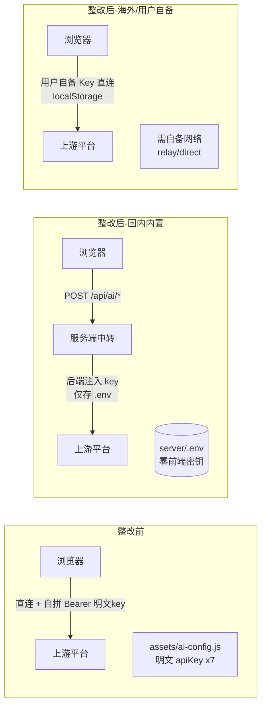
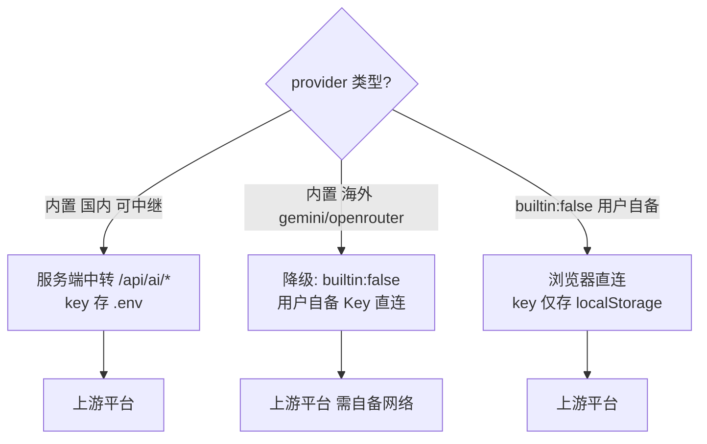

# R131 增量 PRD（简单版）—— 前端去明文 API Key 安全整改

> 文档性质：增量 PRD（仅需求分析，不改代码）。
> 关联问题：R131「assets/ai-config.js 明文硬编码 7 家平台密钥，已被第三方盗刷」。
> 编写角色：产品经理（许清楚）。
> 生效范围铁律：后端改动 → Web 与 App 同时生效；前端 html/js/css 改动 → 仅 Web 生效，App 须重打 APK。

---

## 1. 产品目标

彻底消除「项目密钥硬编码在前端公开静态资源」这一泄露源，使**任何 provider 密钥只存在于服务器 `.env`**，前端零明文。在 2026-09-19 已发生一次盗刷的前提下，本次整改聚焦：

1. **止血**：从前端移除 7 家内置 provider 的项目密钥明文。
2. **闭环**：内置 provider 的 AI 调用统一改走**服务端中转**（密钥由后端注入），覆盖 chat / 嵌入 / 重排 / 生图 / ASR / 视频。
3. **不误伤用户自备 Key 场景**：保留「用户自备 Key」能力，但维持「key 不上行」设计。
4. **不误伤海外平台用户**：对需梯子的 gemini / openrouter，以「降级为用户自备 Key 直连」方式保留功能。

成功标准：生产 `curl http://110.42.134.62/assets/ai-config.js` 返回内容中**不含任何 `apiKey` 字段值**；7 家项目密钥仅存于服务器 `.env`。

---

## 2. 现状核实（一次抽验，采信为事实）

| 核实项 | 结论 | 来源 |
|---|---|---|
| 前端明文密钥 | `assets/ai-config.js` 的 `providers` 中 **7 家内置 provider** 含明文 `apiKey`：智谱 zhipu、百度千帆 qianfan、火山方舟 ark、火山方舟图片 arkimage、OpenRouter、硅基流动 siliconflow、Google Gemini | `assets/ai-config.js` L20-74 |
| 用户自备 Key 模板 | `providerGroups` 中 **7 个 `builtin:false / needKey:true`** 模板（deepseek / tongyi / kimi / openai / claude / xfyun / custom），密钥由用户本地输入存 localStorage，不硬编码 | `assets/ai-config.js` L184-274 |
| 前端直连+自拼 Bearer 文件 | 含 `ai-config.js`、`ai-service.js`、`ai-page.js`、`ai-settings.js`、`chat-local.js`、`app.js`、`api.js` 及 `ai-cap-*.js`（embed / 3d / audio / translate / video / vision 等能力模块）约 17 个核心文件 | Grep `Bearer / apiKey: / Authorization` 命中 |
| 后端中转现状 | `server/routers/ai.py` 已支持：`/api/ai/chat`（按 `model_registry.json` 的 type 分流 chat / embeddings / rerank）、`/api/ai/model3d/preview`（仅解包 zip）、`/models`、`/usage`、`/usage/consume`、`/usage/reset`、`/history` | `server/routers/ai.py` |
| 后端缺的中转端点 | **无图片生成、ASR 语音转写、视频生成**中继端点（当前这三类为前端直连 + 明文 key） | `server/routers/ai.py` 全量核对 |
| 后端密钥机制 | `server/config.py` 的 `AI_PROVIDERS` 已从 `.env` 注入密钥（ark / deepseek / qwen / kimi / zhipu / qianfan / siliconflow / openai），`configured_providers()` 返回「有 key 的 provider」，chat 用 `cfg["api_key"]` 注入。**不含 openrouter / gemini** | `server/config.py` L49-98、L101-103 |
| 模型注册表 | `server/data/model_registry.json` 79 条映射；已知「45 个前端 id 仅 5 个与 registry 键同名」，需校验中转分流不误判 | `server/routers/ai.py` 注释 L34-43 |

**已确认泄露路径**：`assets/ai-config.js` 为公开静态资源（`curl` 可读），明文 key 即泄露面；交接文档仅写硅基流动 1 家，**实际暴露面为 7 家**。

---

## 3. 用户故事

| 编号 | 角色 | 故事 |
|---|---|---|
| US-1 | 普通学习用户 | 我希望用内置 AI 模型时功能不变，但我的使用不会让平台密钥被别人偷走。 |
| US-2 | 高级 / 技术用户 | 我希望仍能填自己的 Key 用 deepseek / openai / 通义等未内置平台，且我的 Key 只存在我自己设备上，不会上传给你们。 |
| US-3 | 海外模型用户 | 我之前用 Gemini / OpenRouter 内置模型，整改后若不能内置，我希望能自备 Key 继续用，至少知道为什么不可用。 |
| US-4 | 平台运营 / 主理人 | 我希望密钥只在我能管控的服务器 `.env` 里，前端发版不带入密钥，且能快速轮换泄露的 key。 |
| US-5 | App 用户 | 我希望 App 更新后 AI 功能与 Web 一致，不会出现「Web 修了、App 还是明文」的窗口期。 |

---

## 4. 需求池

### 4.1 P0（关闭泄露源 + 闭环服务端中转，必须做）

| 编号 | 需求 | 说明 / 验收 |
|---|---|---|
| P0-1 | 前端零项目密钥 | 从 `assets/ai-config.js` 的 `providers` 删除所有内置 provider 的 `apiKey` 字段值（arkimage 与 ark 同 key，一并移除）。整改后 `curl` 该文件 grep `apiKey` 命中 0 条项目密钥。 |
| P0-2 | 密钥入库 `.env` | 服务器 `server/.env` 补全可中继的国内 4 类 key：`ZHIPU_API_KEY`、`QIANFAN_API_KEY`、`ARK_API_KEY`（ark 与 arkimage 共用）、`SILICONFLOW_API_KEY`。openrouter / gemini **不配**服务端 key（见决策 B）。git 忽略 `.env`。 |
| P0-3 | 前端改走服务端中转（文本/嵌入/重排/翻译/视觉） | `ai-service.js` / `ai-page.js` / `chat-local.js` / `api.js` / `app.js` 中内置 provider 的 chat / embed / rerank / translate / vision 调用改 `POST /api/ai/chat`（已支持 embed/rerank 分流）。移除前端自拼 `Authorization: Bearer <项目key>`。模型列表数据源改为 `GET /api/ai/models`。 |
| P0-4 | 补后端缺失中转端点 | 新增 `POST /api/ai/image`（生图，覆盖 arkimage / siliconflow `imageUrl`）、`POST /api/ai/audio`（ASR 转写，siliconflow `audioUrl`）、`POST /api/ai/video`（视频生成）。密钥统一后端注入，前端不再直连上游。 |
| P0-5 | 模型注册表核对 | 校验 `model_registry.json`（79 条）覆盖新增中转（图片 / ASR / 视频）的 `model → provider/type`，且前端 id 与 registry 键映射不导致中转误分流（沿用 R88/R103 的 modelId + modelName 双解析白名单）。 |
| P0-6 | 设置页调整 | `ai-settings.js`：内置 provider **不再展示密钥输入框**（密钥服务端托管）；用户自备 Key 输入仅对 `builtin:false` 模板开放（含降级后的 gemini / openrouter）；新增「自备 Key 安全 / 费用 / 网络」风险说明文案。 |
| P0-7 | 部署门禁联动 | `?v=` 版本戳由主理人统一 bump（只前进不回落）；逐文件 md5 比对确保 `ai-config.js` 等上新；服务器重启加载 `.env`；校验 `.env` 未进 git。 |

### 4.2 P1（闭环后稳健性与一致性）

| 编号 | 需求 | 说明 |
|---|---|---|
| P1-1 | 用量记账口径切换 | 生图 / ASR / 视频改服务端中转后，用量由服务端 `record_usage` 记账，前端不再（或仅本地展示）调用 `/usage/consume`。确保禁上线运行时数据（`model_usage.json` / `model_quota.json` / `geo_*.json` / `feedback.json`）不进生产。 |
| P1-2 | 服务端密钥容错 | 某 provider `.env` 缺失 key 时 `/chat` 返回明确 401 文案（已有 `_STATUS_HINTS[401]`），fail-closed，不崩溃、不回退明文。 |
| P1-3 | 友好降级 UI | 内置 provider 中转失败（429/402/5xx）、gemini/openrouter 未配自备 Key 时，AI 页给出明确提示与切换建议（复用 `X-Ai-Model-Fallback` 机制扩到能力模块）。 |
| P1-4 | App 重打 APK | 所有前端 js/css/html 改动需重打并发布新 APK（生效范围铁律），与 Web 同步排期，避免明文窗口期。 |
| P1-5 | 交接文档补全 | 把暴露面从「硅基流动 1 家」更正为「7 家」，记录本次整改与两个决策结论。 |

### 4.3 P2（后续增强，非阻塞）

| 编号 | 需求 | 说明 |
|---|---|---|
| P2-1 | 异常调用 / 泄露监控 | 服务端对单 key 异常高频调用告警、`.env` key 轮换 SOP。 |
| P2-2 | 海外平台服务端中继评估 | 是否引入服务端代理让 openrouter / gemini 也能中继（需额外代理资源 + 合规评估）——本次不做。 |
| P2-3 | 能力模块调用契约收敛 | 逐步废弃 R77 的客户端 `relay` 中转逻辑，仅保留「用户自备网络」场景的 `direct`；ai-cap-* 统一走服务端中转契约。 |

---

## 5. 受影响的 UI / 交互

| 页面 / 模块 | 改动 | 用户可见变化 |
|---|---|---|
| AI 对话页（`ai-page.js` / `chat-local.js`） | 内置模型列表数据源由前端 `ai-config` 改为 `GET /api/ai/models`；调用改 `/api/ai/chat` | 模型列表 = 服务端已配密钥的 provider；选择/回答行为不变 |
| 设置页（`ai-settings.js`） | 内置 provider 去密钥输入框；gemini / openrouter 移入「需自备 Key」分组并标注「需自备网络」；新增风险提示 | 内置厂商不再有 Key 填写项；海外平台置灰/提示 |
| 能力模块入口（生图 / ASR / 视频 / 翻译 / 视觉 / 嵌入 / 重排 / 3D） | 生图 / ASR / 视频由前端直连改服务端中转；3D 仍走 `/model3d/preview` 解包 | 无明显 UI 变化，仅 loading / 错误提示文案走服务端返回 |
| 关于 → 用量面板 | 数据源不变（`/usage`），但生图/ASR/视频记账由「前端上报」切「服务端记账」 | 用量明细口径统一到服务端账本 |
| 海外平台不可用提示（新增） | gemini / openrouter 被选但未填自备 Key 时，顶部提示条：「该平台需自备 Key 且自备网络，当前不可用，请切换或填写」 | 新增降级提示 |

---

## 6. 两个决策点的明确结论与理由

### 决策点 A —— 用户自备 Key 怎么办

**结论：保留「用户自备 Key」能力，但严格区分两条通道，绝不强制上行到服务器。**

- **内置 7 家项目密钥**：全部迁服务器 `.env`，前端走服务端中转，前端零项目密钥（P0-1/P0-2/P0-3）。
- **用户自备 Key（`builtin:false / needKey:true` 模板）**：**维持浏览器直连 + localStorage 存储，不改走服务端中转。**

**理由：**
1. 该设计初衷即「key 不上行、责任在用户」——这与本次整改目标（项目密钥硬编码泄露）是两类完全不同的风险。项目密钥泄露是因为硬编码在公开前端资源；用户自备 Key 由用户自愿输入、仅存本机、仅用于该用户自己设备直连，泄露面本就不在我们。
2. 强制用户自备 Key 改走服务端中转，会**破坏「key 不上行」初衷**，且把用户密钥的保管责任转移到我们（服务器泄露面扩大、合规与责任归属变复杂），得不偿失。
3. 因此：**内置 = 服务端托管中转；用户自备 = 客户端直连**。二者解耦，互不影响。

**向用户说明的风险（需在设置页文案落地）：** 自备 Key 由用户自担安全 / 费用 / 合规责任；站点为纯 HTTP，自备 Key 直连时同样存在本地网络暴露风险，建议仅在可信网络使用。

**App 端影响（排期）：** 设置页逻辑改动需重打 APK 才能生效（P1-4），与 Web 同步排期，避免明文窗口期。

### 决策点 B —— 需梯子的海外平台（gemini / openrouter）怎么办

**结论：从「内置项目密钥直连」下线，改为「`builtin:false / needKey:true` 模板 + 用户自备 Key 直连」，并加「需自备网络」标注与友好降级。功能不消失，只是默认不可用。**

**理由：**
1. 生产服务器位于国内机房，**服务端同样连不上这两家**——`server/config.py` 的 `AI_PROVIDERS` 本就**未配置 openrouter / gemini**，「改走服务端中转」对它们不成立。
2. 硬编码的前端项目密钥是泄露源，去掉后仅当用户自备 Key 才可用——直接消除这两家的项目密钥泄露面。
3. 前端已支持 R77 的 `relay / direct` 模式（用户自备网络中转），保留「用户自备 Key 直连」通道即可让有需求的用户继续用，**功能不消失**，只是默认不可用。

**影响面评估：** 内置 gemini 2 模型（gm-flash-lite / gm-flash）、openrouter 3 模型（or-auto / or-nemotron-super / or-nemotron-ultra）。正在用这两家**内置模型**的用户会被影响（项目密钥失效）。

**迁移 / 提示方案：**
- 默认引导切换至国内可中继的同等能力模型（ark 系 reasoning / general、qianfan、siliconflow 等）。
- 确有海外模型需求的用户：引导其在设置页填自备 Key + 自备网络（relay 模式）继续使用。
- UI 友好降级：选定这两家且未填自备 Key 时，明确提示「需自备 Key 且自备网络，当前不可用」。

---

## 7. 调用流对比（整改前后）

---

## 8. 约束（硬约束，写进实现）

1. **密钥只进服务器 `.env`**，不准进前端、不准进 git。本 PRD 全文不含任何密钥明文。
2. 前端 ES2017 上限：禁可选链 `?.`、空值合并 `??`、顶层 await；禁 `clamp()/min()/max()` CSS 函数；禁 `prompt/alert/confirm`。改前检测行尾并保持（多数 html 为 CRLF，`ai-page.js`/`xt-region.js` 为 LF）。
3. 部署门禁：「本地 md5 == 生产 md5 逐文件判定」；`?v=` 版本戳由主理人统一 bump，只前进不回落。
4. 禁止上线的运行时数据：`server/data/model_usage.json`、`model_quota.json`、`geo_place_count.json`、`geo_staticmap_count.json`、`feedback.json`。
5. 生效范围铁律：后端改动 → Web 与 App 同时生效；前端改动 → 仅 Web 生效，App 须重打 APK。

---

## 9. 待确认问题

1. gemini / openrouter 是否从「内置模型计数（47 个）」中剔除，还是仅改为 `builtin:false` 模板？影响内置模型数口径与文档。
2. openrouter / gemini 是否允许保留「用户自备 Key + 客户端直连（relay 模式）」通道，还是直接功能消失？——本 PRD 建议保留用户自备通道（决策 B）。
3. 生图 / ASR / 视频改服务端中转后，是否需要新增服务端配额 / 限流（当前这几类靠前端 `/usage/consume` 上报，转入服务端后如何防滥用）？
4. 7 家项目密钥的轮换责任人与 `.env` 上线流程（主理人 bump 版本戳 + md5 门禁）由谁执行？
5. App APK 重打的发版窗口与 Web 上线如何对齐？
6. **运营并行动作（非本 PRD 代码范畴但必须同步）**：历史已泄露的 7 家 key 是否立即在各自平台侧吊销 / 轮换？

---

## 10. 明确不在本次范围内

- 后端新增「服务端代理」让海外平台（openrouter / gemini）也能中继（需额外代理资源 + 合规评估）。
- 用户自备 Key 的服务端托管 / 上行（违背「key 不上行」）。
- 前端语法升级（ES2017 限制保持）。
- 竞品分析 / 市场调研。
- HTTPS 改造（明确纯 HTTP 不变）。
- 禁上线运行时数据的清理 / 迁移（仅确保不进生产，不处理历史文件）。
- 新 AI 能力的功能开发（本次只做安全整改，不做功能新增）。
