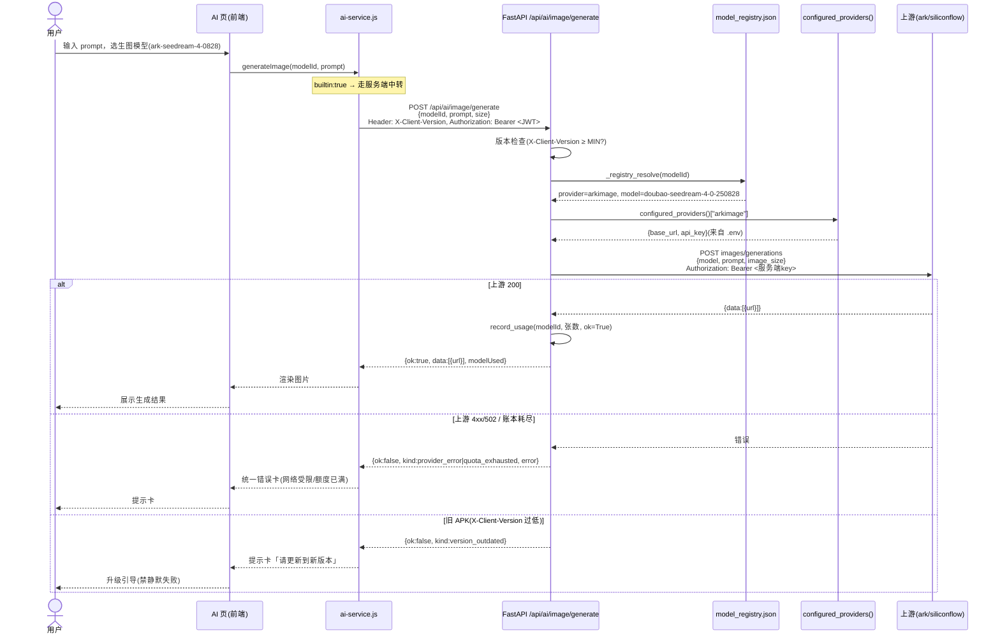

# R131 增量架构设计：AI 调用服务端中转（去明文 Key）

| 项 | 内容 |
|---|---|
| 文档编号 | R131-ARCH |
| 版本 | v1.0（增量架构设计，仅设计不改码） |
| 设计 | 高见远（架构师） |
| 关联 PRD | `docs/R131-PRD-前端去明文key.md`（许清楚） |
| 真实代码树 | `D:\下载的文件\学习工作台`（main @ `d185665`） |
| 线上 | `http://110.42.134.62`（纯 HTTP） |

> **本文档全程不含任何密钥明文。** 所有 Key 仅从 `server/.env` 注入，前端零密钥。

---

## 0. 约束（沿用 PRD 硬约束，设计不得违反）

1. 任何 provider key 只进服务器 `.env`，不进前端、不进 git、不进本文档。
2. 后端改动 → Web 与 App **同时生效**（0 次打包）；前端 html/js/css 改动 → **只有 Web 生效，App 必须重打 APK**。本 R131 前端改动**只攒批 1 次 APK**。
3. 前端 ES2017 上限（禁可选链 `?.`、空值合并 `??`、顶层 await、正则后行断言）；禁 `clamp()/min()/max()` 函数；禁 `prompt/alert/confirm`（提示一律自定义 Modal / `xt-toast`）。
4. 改前检测行尾并保持（多数 html=CRLF；`ai-page.js`/`xt-region.js`=LF）。
5. 部署门禁：本地 md5 == 生产 md5，逐文件判定；`?v=` 戳由主理人统一 bump、只前进不回落，**工程师不自行改戳**。
6. 禁止上线的运行时数据：`server/data/model_usage.json`、`model_quota.json`、`geo_place_count.json`、`geo_staticmap_count.json`、`feedback.json`。
7. 不上 HTTPS（维持纯 HTTP）。
8. `providerGroups` 为结构契约固定字段，本次只删 `apiKey` 相关 UI + 新增可用性标记，**不重排、不改写既有分组顺序与文案**。

---

## 1. 增量架构总览

改造后所有「内置 7 家 + 图片/ASR/视频/3D」上游调用一律经自有 FastAPI 后端中转；用户自备 Key（`builtin:false`）维持本地直连、密钥只进 localStorage、永不上行（决策 A）。

```
                Web 页面 / App WebView
                         │
        ┌────────────────┴─────────────────┐
        │ 内置模型(builtin:true)            │ 自备Key(builtin:false)
        │  → /api/ai/* 服务端中转          │  → 本地直连（用户Key，不上行）
        └────────────────┬─────────────────┘
                         │ 所有上游调用在此汇聚
                  FastAPI /api/ai/*
                         │
        ┌────────────────┼───────────────────────┐
        │ 文本/嵌入/重排   │ 图片/ASR/视频/3D(新)    │ gemini/openrouter(软下线)
        │ /chat(已有)      │ 新增独立端点            │ 不配置、不代理、置灰
        │ model3d/preview  │ 复用 usage/consume 记账 │ 保留条目+不可用标记
        └────────────────┴───────────────────────┘
                         │ 服务端 .env 注入密钥
                  国内上游(ark/siliconflow/zhipu/qianfan)
```

**核心判断**：凡是能下沉到后端的逻辑一律下沉（G3 排期约束）。前端只做「选模型 → 调 `/api/ai/*`」与「渲染结果/错误」，不再持有任何 provider key、不再拼 `Authorization: Bearer`。

---

## 2. 后端设计

### 2.1 `server/config.py` — provider 表扩展

现状 `AI_PROVIDERS` 仅有 `ark/deepseek/qwen/kimi/zhipu/qianfan/siliconflow/openai`，**没有 `arkimage`/`arkvideo`/`ark3d`**。而 `model_registry.json` 里 image/video/3d 条目的 `provider` 字段正是这三个值 → 当前 `configured_providers()` 永远取不到它们，是「注册表就绪、通道缺失」的根因。

**改动**：新增三个 provider，全部**复用 `ARK_API_KEY`**（火山方舟 chat/image/video/3d 是同一账号、同一密钥；泄露配置已证实 `arkimage.apiKey == ark.apiKey`）。无需新增 `.env` 变量。

```python
# 复用 ARK_API_KEY（同一火山方舟账号覆盖 chat/图片/视频/3D）
"arkimage": {
    "name": "火山方舟·图片生成",
    "base_url": _get("ARKIMAGE_BASE_URL",
                     "https://ark.cn-beijing.volces.com/api/v3/images/generations"),
    "model": _get("ARKIMAGE_MODEL", "doubao-seedream-4-0-250828"),
    "api_key": _get("ARK_API_KEY"),
},
"arkvideo": {
    "name": "火山方舟·视频生成",
    "base_url": _get("ARKVIDEO_BASE_URL",
                     "https://ark.cn-beijing.volces.com/api/v3/contents/generations/tasks"),
    "model": _get("ARKVIDEO_MODEL", "doubao-seedance-1-0-pro-250528"),
    "api_key": _get("ARK_API_KEY"),
},
"ark3d": {
    "name": "火山方舟·3D 生成",
    "base_url": _get("ARK3D_BASE_URL",
                     "https://ark.cn-beijing.volces.com/api/v3/contents/generations/tasks"),
    "model": _get("ARK3D_MODEL", "doubao-seed3d-2-0-260328"),
    "api_key": _get("ARK_API_KEY"),
},
```

ASR 复用现有 `siliconflow` provider（其 `api_key` 即 `SILICONFLOW_API_KEY`），上游端点 `audio/transcriptions` 由端点契约写死，不依赖前端 `audioUrl`。

> **待明确 Q-arkimage**：本设计建议 **arkimage/arkvideo/ark3d 一律复用 `ARK_API_KEY`**，不新增变量。理由：单火山账号、密钥同源、泄露配置已证实一致；少一个变量就少一个待泄露资产，也少一处 `.env.example` 维护。若主理人坚持分别轮换，再新增 `ARKIMAGE_API_KEY` 等，但当前无必要。

### 2.2 三个（+一个)新端点：接口契约

**设计决策：新增独立端点，不复用 `_serve_special`（理由见 2.4）。** 视频/3D 为异步任务（先创建拿 taskId，再轮询），需要 create + poll 两个端点；故实际新增 **6 个路由**：图片 1、ASR 1、视频 2、3D 2。

所有媒体端点：
- 限流挂 **`rate_limit("consume")` 桶**（与现有 `/usage/consume` 同口径，60 次/分钟/IP）。
- 成功后服务端**直接记账** `record_usage(model_id, amount, ok=True)`（权威记录，不依赖前端上报；前端若再上报只是幂等叠加，见 Q2）。
- 鉴权：允许游客（与 `/usage/consume` 一致，前端视频/3D 上报不带令牌），仅做服务端加固。
- 统一错误体（见 2.5 / 第 7 节）。

#### 2.2.1 `POST /api/ai/image/generate`
请求体（JSON）：
```json
{ "modelId": "ark-seedream-4-0828", "prompt": "一只戴学士帽的猫", "size": "1024x1024", "n": 1 }
```
- `modelId` 必填，须命中 `model_registry.json` 且 `provider ∈ {arkimage, siliconflow}`（可选校验 `type=="imagegen"`）。
- 解析出真实模型名 → 组装上游 `{ model, prompt, image_size: size||"1024x1024", n: n||1 }`。
- 失败：400（缺 prompt/modelId）、400（未知 modelId 白名单不命中）、503（服务端未配置该 provider key，fail-closed）、502（上游不可达）、4xx（映射 `_STATUS_HINTS`）、429（账本耗尽 → `kind:"quota_exhausted"`）。
响应体（成功）：
```json
{ "ok": true, "data": [ { "url": "https://...presigned...", "index": 0 } ], "modelUsed": "doubao-seedream-4-0-250828" }
```
记账：`record_usage(modelId, len(data), ok=True)`（**按张计**）。

#### 2.2.2 `POST /api/ai/audio/transcribe`
请求体（multipart/form-data）：`modelId` + `file`（音频 blob）+ 可选 `language`。
- 解析 `modelId` → `provider=="siliconflow"` + 真实 ASR 模型名（如 `FunAudioLLM/SenseVoiceSmall`）。
- 组装 multipart（`file` + `model` + 可选 `language`）→ POST 上游 `https://api.siliconflow.cn/v1/audio/transcriptions`。
- 响应：`{ "ok": true, "text": "转写结果", "modelUsed": "..." }`。
- 记账：`record_usage(modelId, 1, ok=True)`（**按次计**）。
- 错误同 2.2.1（未知 modelId / 未配置 / 上游 4xx/502 / 账本耗尽）。

#### 2.2.3 `POST /api/ai/video/generate` + `GET /api/ai/video/task/{id}`
创建请求（JSON）：
```json
{ "modelId": "ark-seedance-1-0-pro", "prompt": "海岸日落延时", "image": "<可选首帧图URL>", "audio": false }
```
- 解析 → `provider=="arkvideo"` + 真实模型名 → POST `ark .../contents/generations/tasks`，body：`{ model, content:[{type:"text",text:prompt}, ...可选{type:"image_url",...}], generate_audio: audio }`。
- 响应：`{ "ok": true, "taskId": "xxx" }`。记账：`record_usage(modelId, 1, ok=True)`（**按次计**；若上游回 `usage`，可改按 token，见 Q2）。
轮询：`GET /api/ai/video/task/{id}` → 服务端用 `ARK_API_KEY` 代理 GET 上游 `tasks/{id}`（**前端不持有 key**），返回：
```json
{ "ok": true, "status": "processing" | "succeeded" | "failed", "videoUrl": "https://...mp4", "error": "..." }
```
前端按 `status` 轮询直到 `succeeded`/`failed`（轮询节奏沿用 `ai-cap-video.js` 现有 POLL_MS/POLL_MAX）。

#### 2.2.4 `POST /api/ai/3d/generate` + `GET /api/ai/3d/task/{id}`（**新增建议，见 2.6 缺口**）
与视频**同构**：同一火山 `tasks` 端点，仅 `content` 里塞 `image_url`（图生 3D），`provider=="ark3d"`。契约完全镜像 2.2.3。

### 2.3 `GET /api/ai/models` — provider 可用性过滤（决策 B）

现有 `list_models()` 只返回 `configured_providers()` 的平台。新增：**对 `gemini`/`openrouter` 做软下线过滤**——
- 服务端**不配置**这两家 key → `configured_providers()` 自然不含它们 → 列表自动剔除。后端一次改动，Web 与 App 同时生效（满足 G3）。
- 模型条目本身（`model_registry.json` 那 5 条）**不动**；前端 `ai-config.js` 仅给 gemini/openrouter 分组加 `status:"unavailable"` 标记用于置灰（前端展示用，不影响后端）。
- 迁移映射（前端 toast 用，前端常量，不入后端）：`gm-flash → ark-v4-pro`；`gm-flash-lite → ark-v4-flash`；`or-* → ark-v4-flash` / `qf-ernie-32k`。

### 2.4 与 `_serve_special` 的关系：独立端点，不复用（含理由）

`_serve_special`（L208）是「chat 风格」分流：从 `base_url` 字符串替换 `chat/completions` 派生 `embeddings`/`rerank` 端点，请求体是 `messages`，走 SSE/JSON 透传，记账走 chat 的每日限额 `_record_usage`。

**不复用、改为独立端点的理由**：
1. **URL 形态不兼容**：`_upstream_special_url` 靠 `find("chat/completions")` 替换。图片端点是 `images/generations`、音频是 `audio/transcriptions`、视频/3D 是 `contents/generations/tasks`——没有 `chat/completions` 可替换，硬套会逼出畸形 URL 或一堆特判。
2. **请求/响应契约完全不同**：图片（prompt→图 URL 数组）、ASR（multipart→文本）、视频/3D（异步 task 轮询）。塞进 chat 风格 `{messages}` 体是过度扭曲，且视频/3D 的「创建+轮询」天然需要两个路由。
3. **记账口径不同**：chat 用「每用户每日限额」；媒体用「`usage/consume` 账本，按张/次/任务计」（PRD P1-4）。混用会污染 chat 每日限额语义。
4. **媒体端点是 JSON 非 SSE**：与已有 `model3d/preview`（JSON）风格一致，便于前端统一处理。

**但共享内部基建**（避免重复造轮子）：
- 新增私有 helper `_registry_resolve(model_id) -> (provider_key, real_model, type|"")`：扩展现有 `_model_type_index` 思路，但**不要求必须有 type**——只要命中注册表即返回 provider+model（白名单校验）。
- 新增私有 helper `_relay_media(cfg, url, payload, *, is_json=True, files=None)`：注入 `Authorization: Bearer cfg["api_key"]`、调 httpx、按 `_STATUS_HINTS` 映射错误、返回 `(status_code, json_or_text)`。三个/四个端点都调它。
- 复用：`configured_providers()`、`rate_limit("consume")`、`record_usage`、`known_model_ids()` 白名单、`_STATUS_HINTS`。

### 2.5 统一错误体（跨端点契约）

所有 `/api/ai/*`（含现有 `/chat`、新端点）返回统一结构：
```json
{ "ok": false,
  "kind": "quota_exhausted | network_limited | version_outdated | provider_error | bad_request | unavailable",
  "error": "面向用户的友好文案（中文）",
  "code": 429,
  "hint": "可选：替代模型 id 或操作建议" }
```
- `quota_exhausted`：账本/每日限额耗尽 → UI 渲染「额度已达上限」。
- `network_limited`：502 上游不可达、决策 B 海外平台不可达 → UI 渲染「服务端网络受限」。
- `version_outdated`：见 2.6 / P0-9，旧 APK 降级 → UI 渲染「请更新到新版本」提示卡（**禁静默失败**）。
- `provider_error`：上游 4xx（401 key 失效 / 402 欠费 / 429 限流），文案用 `_STATUS_HINTS` 映射。
- `bad_request`：参数缺失 / modelId 白名单不命中。
- `unavailable`：模型被软下线（如 gemini 被点选，理论不会到后端，兜底用）。

### 2.6 版本检查与旧 APK 降级（P0-9）

- 前端在**所有** `/api/ai/*` 请求头带 `X-Client-Version`（如 `20260919q`，随 `?v=` 戳同步由主理人 bump）。
- 服务端常量 `MIN_RELAY_CLIENT_VERSION`（由主理人在本次 bump 时设定）。新端点（以及 `/chat`）入口统一检查：
  - header 缺失或 `< MIN` → 返回 `200 + {ok:false, kind:"version_outdated", error:"当前版本已停用，请更新到最新版以继续使用 AI 功能"}`。
- 效果：密钥轮转后旧 APK 调任何 AI 接口都拿到可读「请更新」提示，**禁止静默白屏/裸错误码**。
- 触发条件：P0-1 密钥轮转后立即生效（PRD Q1 建议立即轮转，不为旧 APK 留过渡期）。

### 2.7 缺口发现：3D 生成仍是明文直连（建议补第 4 个端点）

PRD P0-5 只列了 image/ASR/video 三个新端点，但 `ai-cap-3d.js`（L32 `authHeaders` 用 `provider.apiKey`）**当前仍以明文 key 直连火山 `tasks` 端点生成 3D**，仅「结果解包」走了已有的 `/api/ai/model3d/preview`。这违反 G1（前端零密钥）。PRD P0-6 又明确把 `ai-cap-3d.js` 列入「17 文件去密钥化」。

**建议**：把 `2.2.4` 的 3D 端点**纳入本次范围**（与视频同构、成本极低），否则 3D 生成会留下一条活着的 key 直连路径。若主理人确认 3D 暂不在 R131，须显式标注为已知残留风险（不推荐）。**本设计默认纳入。**

---

## 3. 前端设计

### 3.1 双通道路由约定（跨文件核心规则）

前端如何判断某 provider 走中转还是本地直连：

```
model.provider / model.builtin
  ├─ builtin:true  → 一律走服务端中转 /api/ai/*（前端零 key）
  │     ├─ chat/embed/rerank → /api/ai/chat（已有）
  │     ├─ imagegen          → /api/ai/image/generate（新）
  │     ├─ audio(ASR)        → /api/ai/audio/transcribe（新）
  │     ├─ video             → /api/ai/video/generate + /video/task/{id}（新）
  │     └─ 3d                → /api/ai/3d/generate + /3d/task/{id}（新）
  └─ builtin:false（用户自备 Key）→ 本地直连，Key 只进 localStorage 永不上行
        （决策 A 保留；且禁止用自备 Key 覆盖内置 7 家，见 PRD Q3）
```

现有 `ai-service.js` 已用 `XT_NON_CHAT_TYPES = ["imagegen","audio","embedding","rerank","video","3d"]`（L1771）区分非对话类型。本次把该集合里的 media 类型**从「直连 Bearer」改为「调服务端媒体端点」**；`embedding`/`rerank` 已走 `/chat`，保持。

### 3.2 各前端文件改动（详见第 5 节清单）

要点：
- `ai-config.js`：删除 `providers` 下 7 个 `apiKey`（含 arkimage）、删除 `proxy` 直连相关 key 引用；`providerGroups` 给 gemini/openrouter 加 `status:"unavailable"`；**修正自检函数**——当前 `providerOk()` 要求 `apiKey` 非空（L1012-1014），删 key 后会误触发「回退最小默认配置」，而该最小配置 **L1043-1048 仍硬编码了 zhipu 明文 key**（必须一并删除）。改为 builtin 只校验 `apiUrl` 非空，最小默认配置也不得含任何 key。
- `ai-service.js`：`imagegen` 直连分支（L1651 `Bearer + apiKey`）改指 `/api/ai/image/generate`；`buildHeaders`(L1870) 仅当 `apiKey` 来自用户自备（`builtin:false`）才注入；删除 Gemini 直连分支（L2690 附近 `isGemini` 直接拼 key，决策 B 后 gemini 既不直连也不中转）；media 类型 dispatch 改走服务端。
- `app.js`：`fetchProviderReply()`（L3121，被 L3738 调用）是**仍活跃的 builtin-key 直连对话路径**（用 `cfg.apiKey`+`cfg.baseUrl`），必须删除/改指 `relayChat`，消除内置 key 直连。
- `ai-cap-image/audio/video/3d.js`：删除各自 `authHeaders`/`pHeaders` 里的 `Bearer + provider.apiKey` 直连；改为调用对应服务端端点（视频/3D 把轮询改调 `/task/{id}`）；`cap.probe` 探针（embed/vision/3d/translate/audio 里 L142/91/207/158/98 等）改为走服务端或弃用（内置模型可用性以 `GET /api/ai/models` 为权威源，前端不再用 provider key 探活）。
- `ai-cap-embed/vision/translate.js`：embed/vision/translate 已走 `/chat` 中继，其 cap 内直连/`pHeaders` 的 key 构造一并清除（属探针去 key，非新增端点）。
- `ai-settings.js` + `ai-settings.html`：内置模型去掉密钥输入框（P0-7）；自备 Key 保存弹**自定义 Modal**（非 `confirm`）+ 风险文案（P1-1）；加「清除本机已保存密钥」按钮（Q6）。
- `chat-local.js`：语音输入 ASR 改调 `/api/ai/audio/transcribe`（Q5：展示服务端返回的 ASR 模型名，前端不再决策 `im_asr_model_id`）；其余 `Bearer + getToken()` 是用户 JWT，不动。
- `ai-page.js`：模型下拉 gemini/openrouter 置灰 + 点击 toast 给替代建议（决策 B）；统一错误卡渲染三类（`quota_exhausted`/`network_limited`/`version_outdated`）。

### 3.3 gemini / openrouter 软下线 UI（决策 B）

- `ai-config.js` 给这两组加 `status:"unavailable"`；下拉渲染时置灰、标「暂不可用（服务端网络受限）」、不可选中。
- 点击时 `xt-toast`：`该模型需海外网络，当前服务暂不可用，建议使用 DeepSeek-V4-Pro（ark-v4-pro）`（gm-flash）/ 对应替代。
- 迁移映射在前端常量（不入后端）。

---

## 4. 完整文件清单（区分后端 / 前端）

> 路径前缀 `D:\下载的文件\学习工作台\`。后端改动 → 两端生效（0 打包）；前端改动 → 攒批 1 次 APK。

### 后端（server/）

| 文件 | 类型 | 改动一句话 |
|---|---|---|
| `server/config.py` | 修改 | `AI_PROVIDERS` 新增 `arkimage`/`arkvideo`/`ark3d`（均复用 `ARK_API_KEY`，含 base_url）；`configured_providers()` 自动覆盖。 |
| `server/routers/ai.py` | 修改 | 新增 6 路由：image/generate、audio/transcribe、video/generate、video/task/{id}、3d/generate、3d/task/{id}；私有 helper `_registry_resolve`/`_relay_media`；`GET /api/ai/models` 按可用 provider 过滤；所有 `/api/ai/*` 入口加 `X-Client-Version` 版本检查（P0-9）；限流挂 `rate_limit("consume")`；服务端 `record_usage` 记账。 |
| `server/data/model_registry.json` | 修改 | 给 arkimage(4)/arkvideo(9)/ark3d(3)/siliconflow-ASR(5) 条目补 `type`（imagegen/asr/video/3d），供 dispatch 与过滤；gemini/openrouter 5 条**保持不变**。 |
| `server/.env.example` | 修改 | 明确 `ARK_API_KEY` 同时覆盖 chat/图片/视频/3D；列出 `ARKIMAGE_BASE_URL`/`ARKVIDEO_BASE_URL`/`ARK3D_BASE_URL` 可选覆盖；不含真实值。 |

### 前端（assets/ + html）—— 全部攒批进 1 次 APK

| 文件 | 类型 | 改动一句话 |
|---|---|---|
| `assets/ai-config.js` | 修改 | 删 7 个 `apiKey`（含 arkimage）；`providerGroups` 给 gemini/openrouter 加 `status:"unavailable"`；修正自检函数（builtin 不要求 apiKey；最小默认配置删明文 key）。 |
| `assets/ai-service.js` | 修改 | media 类型（imagegen/audio/video/3d）改指服务端端点；`buildHeaders` 仅对自备 Key 注入；删 Gemini 直连分支；dispatch 路由调整。 |
| `assets/app.js` | 修改 | 删除 `fetchProviderReply()`(L3121/L3738) 内置 key 直连对话路径，改走 `relayChat`；确保内置模型不再 `Bearer + cfg.apiKey`。 |
| `assets/ai-cap-image.js` | 修改 | 删直连 Bearer，改调 `/api/ai/image/generate`；`cap.probe` 改服务端/弃用。 |
| `assets/ai-cap-audio.js` | 修改 | ASR 直连(L98)改指 `/api/ai/audio/transcribe`（multipart 上传到服务端）。 |
| `assets/ai-cap-video.js` | 修改 | 视频直连(L34/L227)改指 `/api/ai/video/generate` + `/video/task/{id}` 轮询；probe 改服务端。 |
| `assets/ai-cap-3d.js` | 修改 | 3D 生成直连(L32)改指 `/api/ai/3d/generate` + `/3d/task/{id}`；probe(L207)去 key。 |
| `assets/ai-cap-embed.js` | 修改 | 删 `pHeaders`(L142) 的 provider key 构造（embed 已走 /chat）。 |
| `assets/ai-cap-vision.js` | 修改 | 删 `pHeaders`(L91) 的 provider key 构造（vision 已走 /chat）。 |
| `assets/ai-cap-translate.js` | 修改 | 删直连(L43)+`pHeaders`(L158) 的 provider key 构造（translate 已走 /chat）。 |
| `assets/ai-settings.js` | 修改 | 内置模型去密钥输入框(P0-7)；自备 Key 保存弹自定义 Modal+风险文案(P1-1)；加「清除本机密钥」按钮(Q6)。 |
| `assets/ai-settings.html` | 修改 | 与 `ai-settings.js` 同步（设置页「添加模型」UI 裁剪）。 |
| `assets/chat-local.js` | 修改 | 语音 ASR 改调 `/api/ai/audio/transcribe`（展示服务端返回模型名，Q5）；其余 JWT Bearer 不动。 |
| `assets/ai-page.js` | 修改 | 模型下拉 gemini/openrouter 置灰+toast(决策 B)；统一错误卡渲染三类。 |

### 假阳性（本次不动 / 仅确认是用户 JWT）

`admin-contact.js`、`api.js`(apiGetToken)、`notify.js`、`study-stats.js`、`xt-moments.js`、`chat-local.js` 绝大多数 Bearer（均 `tok()`/`getToken()` 用户登录 JWT，非 provider key）；`ai-service.js` 的 `relayToken` 分支（用 JWT 调 `/api/ai/chat`，正确，保留）。这些**不改动**，避免误伤。

---

## 5. 有序任务列表（依赖关系 + 实现顺序）

核心原则：**后端优先（两端生效、0 打包）→ 前端攒批（1 次 APK）**。

| # | 任务 | 依赖 | 端 | 说明 |
|---|---|---|---|---|
| T1 | 轮转并吊销已泄露 7 key，写入 `server/.env`（P0-1） | — | 后端 | 运营动作，因果起点；新 key 只进 `.env` 不进 git。 |
| T2 | `config.py` 新增 arkimage/arkvideo/ark3d provider（复用 ARK_API_KEY） | T1 | 后端 | 通道就绪，`configured_providers()` 覆盖。 |
| T3 | `model_registry.json` 补 media `type`（imagegen/asr/video/3d） | — | 后端 | 仅加字段，不改映射；gemini/or 不动。 |
| T4 | 新增 `_registry_resolve` + `_relay_media` 私有 helper | T2 | 后端 | 共享基建。 |
| T5 | 实现 6 个媒体端点 + 限流 + 服务端记账 | T2,T3,T4 | 后端 | image/audio/video(+task)/3d(+task)。 |
| T6 | `GET /api/ai/models` 按可用 provider 过滤（决策 B） | T1 | 后端 | 两端生效。 |
| T7 | 所有 `/api/ai/*` 加 `X-Client-Version` 版本检查（P0-9） | T5,T6 | 后端 | 旧 APK 优雅降级。 |
| T8 | `server/.env.example` 更新 + 部署 md5 门禁验证 | T2,T5 | 后端 | 0 打包已生效，可先上生产验证两端。 |
| T9 | 【攒批开始】`ai-config.js` 删 7 key + 软下线标记 + 修自检 | — | 前端 | P0-2 + 决策 B。 |
| T10 | `ai-service.js` media 改指服务端 + 删 gemini 直连 + buildHeaders 收窄 | T9 | 前端 | 路由核心。 |
| T11 | `ai-cap-image/audio/video/3d.js` 删直连改服务端；probe 去 key | T10 | 前端 | P0-3/4/5 + 3D 缺口。 |
| T12 | `ai-cap-embed/vision/translate.js` 删探针 key 构造 | T10 | 前端 | 去密钥收尾。 |
| T13 | `app.js` 删 `fetchProviderReply` 内置直连 | T10 | 前端 | 消除残留内置 key 直连。 |
| T14 | `ai-settings.js`+`.html` 去密钥框 + 自备 Key Modal + 清除按钮 | T9 | 前端 | P0-7 + P1-1 + Q6。 |
| T15 | `chat-local.js` ASR 改服务端；`ai-page.js` 软下线 UI + 统一错误卡 | T10,T11 | 前端 | 决策 B UI + P0-9 提示卡。 |
| T16 | ES2017 校验 `node tools/qa/escheck_es2017.js` → DONE 0；行尾保持；`?v=` 由主理人 bump | T9–T15 | 前端 | 门禁（P0-10）。 |
| T17 | **打 1 次 APK**（主理人执行） | T16 | 前端 | 全前端改动一次打包。 |
| T18 | 生产 md5 逐文件校验 + 7 类能力 Web/App 各抽验 + 旧 APK 降级验证 | T8,T17 | 双端 | DoD。 |

> 后端 T1–T8 完成即可上生产（Web 与旧 App 同时生效）；前端 T9–T17 攒批后打 1 次 APK，App 获得中转能力。

---

## 6. 共享知识 / 跨文件约定

1. **通道判定**：`builtin:true` → 服务端中转；`builtin:false` → 用户本地直连（Key 仅 localStorage，永不上行，禁止覆盖内置 7 家）。
2. **统一错误体**：`{ok, kind, error, code, hint}`，`kind ∈ {quota_exhausted, network_limited, version_outdated, provider_error, bad_request, unavailable}`（见 2.5）。
3. **限流桶**：媒体端点统一 `rate_limit("consume")`（60/min/IP），与 `/usage/consume` 同桶。
4. **记账**：媒体成功后服务端 `record_usage(model_id, amount, ok=True)`；amount 单位：图片=张、ASR=次、视频/3D=次（见 Q2）。
5. **`?v=` 戳**：由主理人统一 bump，工程师**不自行改戳**；前端请求头 `X-Client-Version` 与之同步。
6. **行尾**：改前检测并保持（html=CRLF，`ai-page.js`/`xt-region.js`=LF）。
7. **密钥红线**：任何 provider key 只进 `server/.env`，不进前端/git/文档/交付物。
8. **禁用 API**：`model_usage.json` 等 5 个运行时文件禁止上线（约束 6）。
9. **错误体兼容**：媒体端点恒返回结构化 JSON（仿 `model3d/preview` 的 `ok` 分支），不抛 FastAPI 默认 `{"detail":...}` 分叉，降低前端判断成本。

---

## 7. Mermaid 时序图（图片生成完整链路）



（视频/3D 链路同构，仅多出 `POST .../generate` → 轮询 `GET .../task/{id}` 两步；ASR 为 multipart 上传到 `/audio/transcribe` 返回 text。）

---

## 8. 待明确事项（交团队负责人定夺）

1. **Q-arkimage 变量**：本设计建议 `arkimage`/`arkvideo`/`ark3d` 全部**复用 `ARK_API_KEY`**，不新增 `.env` 变量（同源火山账号、泄露配置已证实一致）。若坚持分别轮换再新增变量。
2. **Q-计费/限流口径**（PRD Q2）：建议三个新端点**复用 `usage/consume`**（同 `rate_limit("consume")` 桶），单位：**图片按张、ASR 按次、视频/3D 按次**（视频可选改按上游 `usage` token，但按次更简单且足够防刷）。服务端在成功后**直接 `record_usage`** 作权威记录，前端上报仅作冗余。具体配额数值需主理人定。
3. **Q-紧急回退开关（PRD Q4）**：**建议不保留，本设计未设计该开关。** 理由：① 保留「前端直连/remoteOnly」开关 = 保留一条可重新引入明文 key 的路径，与 G1（前端零密钥）根本目标直接冲突；② 回退开关本身需要被「谁能开」保护，否则等于留后门；③ 本次后端中转已覆盖全部内置能力，无必须回退的理由；④ 真出服务端故障，由运维重启/降级，而非把密钥重新塞回前端。与 PM 建议一致，**写入硬约束**。
4. **Q-旧 APK 降级**（PRD Q1/P0-9）：密钥轮转后旧 APK 必然失效。本设计用 `X-Client-Version` + 服务端 `MIN_RELAY_CLIENT_VERSION` 返回 `kind:"version_outdated"` 提示卡，**禁止静默失败**。建议立即轮转（不为旧 APK 留过渡期，否则漏洞继续开着）。
5. **Q-3D 生成端点**（本设计新增发现）：PRD P0-5 只列 image/ASR/video，但 `ai-cap-3d.js` 仍明文直连 3D 生成（仅结果解包走了已有 `model3d/preview`），违反 G1。**建议把 3D generate+task 端点纳入本次**（与视频同构、成本极低）。请确认是否采纳；若否，须显式标注为已知残留风险（不推荐）。
6. **Q-ASR 模型展示**（PRD Q5）：采纳建议——前端不再决策 `im_asr_model_id`，改展示服务端返回的 `modelUsed` 字段，前端只透传。
7. **Q-清除本机密钥**（PRD Q6）：顺带加「清除本机已保存密钥」按钮（P1，成本极低），建议采纳。

---

## 9. 17 个涉 key 文件「真假阳性」甄别

| 文件 | 判定 | 说明 / 动作 |
|---|---|---|
| `ai-config.js` | **真阳性** | 7 个 provider `apiKey` 明文（核心泄露源）+ 自检函数硬编码 zhipu key。删 key + 修自检。 |
| `ai-service.js` | **真阳性** | L1651 imagegen `Bearer+apiKey` 直连 → 改服务端；L1870 `buildHeaders` 收窄到自备 Key；L2690 Gemini 直连分支删除；media dispatch 改路由。 |
| `app.js` | **真阳性** | `fetchProviderReply()`(L3121，被 L3738 调用) 是**仍活跃的内置 key 直连对话路径**（`cfg.apiKey`+`cfg.baseUrl`），必须删/改指 `relayChat`。 |
| `ai-cap-image.js` | **真阳性** | 直连生图（经 ai-service L1651）→ 改 `/api/ai/image/generate`。 |
| `ai-cap-audio.js` | **真阳性** | L98 ASR `Bearer+key` 直连 → 改 `/api/ai/audio/transcribe`。 |
| `ai-cap-video.js` | **真阳性** | L34/L227 视频 `Bearer+key` 直连 → 改 `/api/ai/video/generate`+`/task/{id}`。 |
| `ai-cap-3d.js` | **真阳性** | L32 生成 `Bearer+key` 直连（**缺口，见 2.7**）→ 改 `/api/ai/3d/generate`+`/task/{id}`；L207 探针去 key。 |
| `ai-cap-embed.js` | **真阳性(探针)** | L142 `pHeaders` provider key 构造（embed 已走 /chat）→ 删 key 构造。 |
| `ai-cap-vision.js` | **真阳性(探针)** | L91 `pHeaders` provider key 构造（vision 已走 /chat）→ 删。 |
| `ai-cap-translate.js` | **真阳性(探针+直连)** | L43 直连 + L158 探针 provider key → 删（translate 已走 /chat）。 |
| `ai-settings.js` | **真阳性** | 内置模型密钥输入框 + 自备 Key 保存无提示 → P0-7/P1-1。 |
| `chat-local.js` | **真阳性(部分)** | 语音 ASR 直连 → 改 `/api/ai/audio/transcribe`；其余 Bearer 是用户 JWT，**不动**。 |
| `ai-page.js` | **真阳性(部分)** | 软下线 UI + 统一错误卡；无 provider key 直连。 |
| `admin-contact.js` | 假阳性 | `Bearer + tok()` 是用户登录 JWT，不动。 |
| `api.js` | 假阳性 | `apiGetToken()` 用户 JWT，不动。 |
| `notify.js` | 假阳性 | `tk` 用户 JWT，不动。 |
| `study-stats.js` | 假阳性 | `token` 用户 JWT，不动。 |
| `xt-moments.js` | 假阳性 | `tok()` 用户 JWT，不动。 |

> 注：PRD 列的 `ai-cap-embed/3d/vision/translate` 等里的 `Bearer` 多为 **`cap.probe` 健康检查工具**的 key 构造（非主调用路径），去密钥后内置模型可用性以 `GET /api/ai/models` 为权威源，前端探针应改走服务端或弃用。

---

## 10. 验收对照（DoD 落点）

- `curl .../assets/ai-config.js` 无密钥 → T9。
- 工作树 `git grep` 无上游密钥 → T9–T15。
- 7 类能力 Web/App 各抽验 1 次 → T18（后端 T5 覆盖 image/ASR/video/3d；chat/embed/rerank 已有）。
- gemini/openrouter 5 模型置灰 + toast → T6(后端) + T15(前端)。
- 自备 Key 保存二次确认 Modal → T14。
- `escheck_es2017.js` DONE 0 + 无 confirm/alert + 行尾一致 + md5 一致 + `?v=` 已 bump → T16/T18。
- 旧 APK 降级提示卡（禁静默失败）→ T7 + T15。
