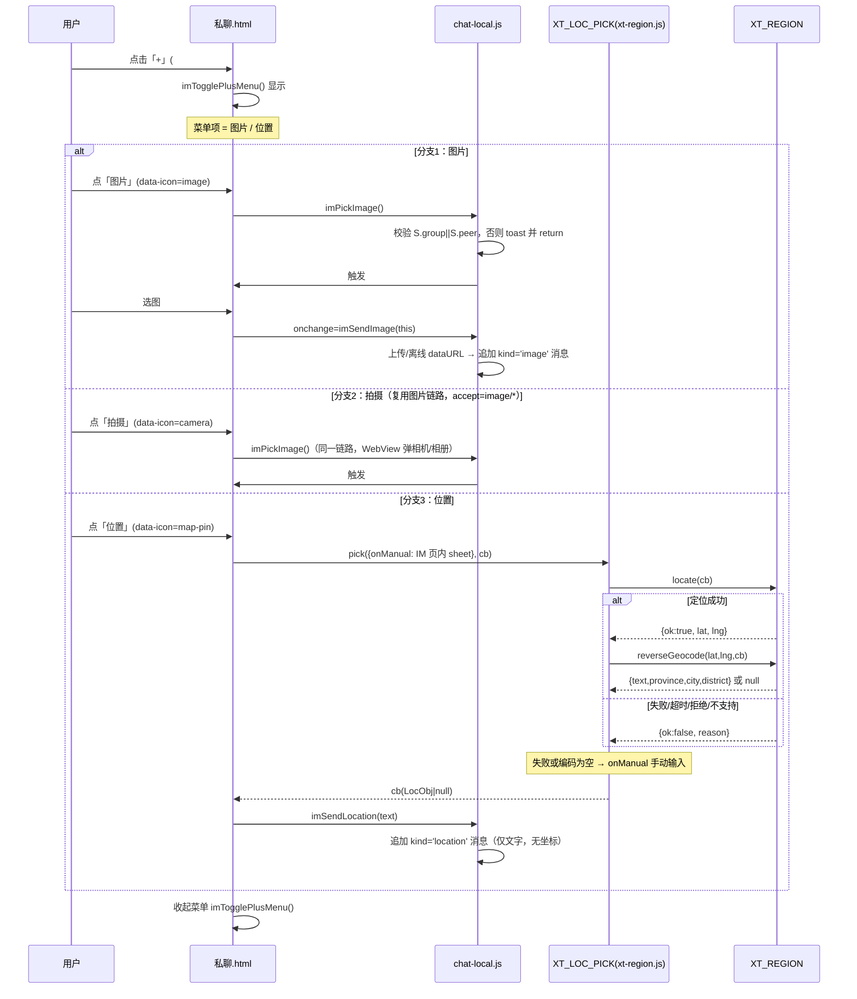
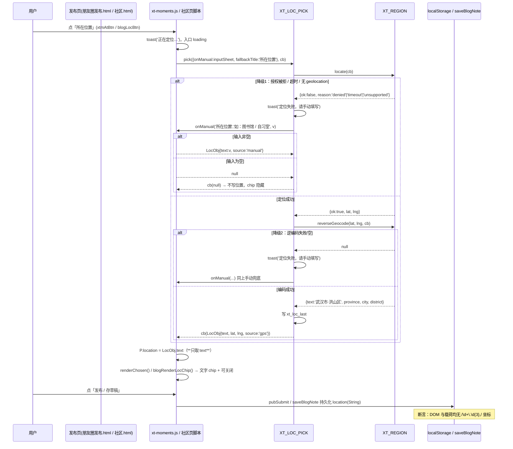
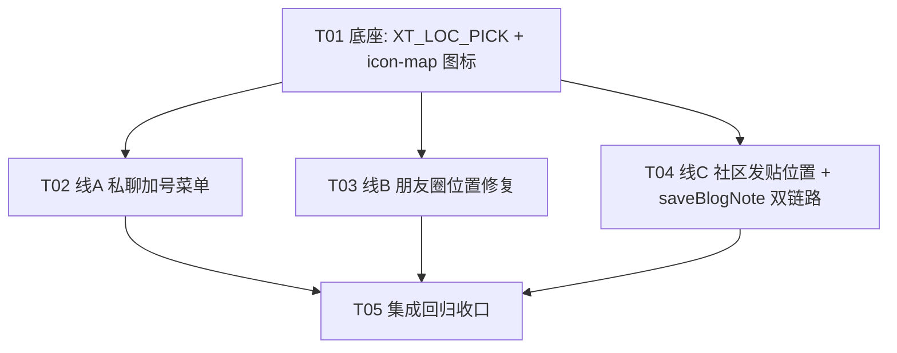

# 系统设计与任务分解 · R88-H 位置定位能力 + R88-I 私聊加号菜单

> 文档类型：增量系统设计 + 任务分解
> 版本：R88（2026-09-18）
> 作者：架构师 高见远（Gao）
> 上游依据：`docs/prd-r88-hi-位置定位与私聊加号菜单.md`（PM Alice）
> 唯一可写代码树：`D:\下载的文件\学习工作台`

---

## 1. 实现方案总览

**整体思路**：本批不新造轮子，而是**把 R86-B 已有的 `assets/xt-region.js`（ISO 省市区数据 + JSONP 逆地理编码 + `navigator.geolocation` 封装）提升为「三处发布路径共享的位置能力底座」**，在这之上新增**一个统一的位置选择入口函数 `XT_LOC_PICK.pick(opts, cb)`**（写在 `xt-region.js` 尾部，与 `XT_REGION` 同进程同文件，零新增文件），由它统一实现「自动定位 → 逆地理编码 → 失败降级手动输入 → 返回文字地址」这条主链路，然后把朋友圈发布（`xt-moments.js`）、社区发贴（`社区.html`）、私聊（`私聊.html` + `chat-local.js`）三处**全部改为调用同一个 `XT_LOC_PICK.pick`**。

**关键决策：复用 + 扩展，不新建组件。**

| 方案 | 判断 | 理由 |
|---|---|---|
| A. 复用 `xt-region.js` 并追加 `XT_LOC_PICK` 到同文件 | ✅ **采用** | `XT_REGION.locate` / `reverseGeocode` 已经是完备的、失败必回调 null 的健壮底座（`xt-region.js:379-430`）；`地区选择.html` 是「带 UI 的整页选择器」，而本批需要的是「无 UI 的内联落点函数」，两者职责不同，所以**不跳转 `地区选择.html`**，而是就地调用函数。追加到 `xt-region.js` 尾部（`window.XT_REGION = {...}` 之后）可让所有已引入 `xt-region.js` 的页面零成本获得能力。 |
| B. 新建 `assets/xt-locpick.js` 独立组件 | ❌ 不采用 | 会多一个文件 + 多一处 `<script>` 引入（`私聊.html`/`社区.html` 目前都**没有**引入 `xt-region.js`，见 §2 注意），且与 `xt-region.js` 强耦合（要拿 `XT_REGION`），拆开只增加耦合面与引入风险。 |
| C. 跳转 `地区选择.html` 选点、回写 localStorage | ❌ 不采用 | `地区选择.html` 是「省市逐级点选 / 关键词搜索」的**整页**交互，会中断发布流程（要跳走再回来），且它是「选行政区」而非「记录当前位置」。仅私聊/发布需要「一键定位 + 手动兜底」，用函数更轻。 |

**关于 `地区选择.html`**：本批**不改**它的主流程（PRD 3.2 明确 Out of Scope），只在 §2 中把它列为「参照实现」而非「待改文件」。`xt-region.js` 只在尾部**追加**新函数，不改既有导出。

**三处调用点差异**：
- 朋友圈（`xt-moments.js:875-884`）：把原来的 `getCurrentPosition` 直接写经纬度的代码整体替换为 `XT_LOC_PICK.pick` 调用，**这是 P0 违规修复点**。
- 社区发贴（`社区.html`）：新增「所在位置」入口 + 隐藏存储字段，发布/存草稿时随 `saveBlogNote` 落库。
- 私聊（`私聊.html` + `chat-local.js`）：新增「+」加号 → 浮层菜单（图片 / 位置），位置项复用 `XT_LOC_PICK.pick` 发出 `kind='location'` 消息。

**服务端判断：本批不动服务端。** 理由与替代方案见 §3.5。

---

## 2. 文件清单

> 行尾标记为**实测值**（二进制统计 `\r\n` 与 `\n` 计数一致判定）。改动一律**二进制读写**，改完必须复查行尾不变。

| # | 文件相对路径 | 新建/修改 | 行尾（实测） | 改什么（具体到函数/行号） | 并行线 |
|---|---|---|---|---|---|
| F1 | `assets/xt-region.js` | 修改（**仅尾部追加**） | **LF**（25544 B，CR=0） | 在 `window.XT_REGION = {...}`（L432-443）之后、`})();`（L444）之前**追加** `window.XT_LOC_PICK = {...}`：新增 `pick(opts, cb)`、`quickPick(opts, cb)`、`isCoordinateText(s)`、`LAST_KEY` 常量。**不改**任何既有函数（`locate`/`reverseGeocode`/`textOf` 原样） | **线 D（底座，其余线前置）** |
| F2 | `assets/icon-map.js` | 修改 | **CRLF**（39055 B，CR=LF） | 在 `window.LUCIDE_ICONS = {...}`（L28-772）字典内新增 3 项：`"map-pin"`、`"navigation"`、`"camera"`（写法照抄既有 `"map": svg('<path .../>')` 形式，路径用 lucide 官方 24×24 viewBox）。**不动** `lucideIcon` / `autoRender` | **线 D（底座，线 A/B/C 前置）** |
| F3 | `assets/xt-moments.js` | 修改 | **CRLF**（49747 B，CR=LF） | ① L875-884 `xtmAtBtn` 分支：删掉 `getCurrentPosition` + `'经纬度 '+lat+','+lng` 拼接，改为 `XT_LOC_PICK.pick({ fallbackTitle:'所在位置' }, function(r){ if(r&&r.text){ P.location=r.text; renderChosen(); toast('已记录当前位置'); } })`；② L707 `renderChosen()` 中 `'📍 ' + esc(P.location)` 的 emoji 改为 `ico('map-pin',14,'📍')` 生成的图标容器（复用既有 `ico()` 助手 L42）；③ L714 选中态判断保持（`P.location` 仍为真值）。**不改** `pubSubmit`（L726 已带 `location: P.location`），不改 `inputSheet`/`pickerSheet` | **线 B** |
| F4 | `朋友圈发布.html` | 修改 | **CRLF**（12044 B，CR=LF） | L54 `<span class="xtm-fn" id="xtmLocBtn">📍 位置</span>` → `<span class="xtm-fn" id="xtmLocBtn"><span class="nav-icon" data-icon="map-pin" data-icon-size="14"></span> 位置</span>`；L57 `id="xtmAtBtn"` 的 `🧭 所在位置` → `<span class="nav-icon" data-icon="navigation" data-icon-size="14"></span> 所在位置`。**保留 id 与文案**（去 emoji 对齐 P1-1） | **线 B** |
| F5 | `社区.html` | 修改 | **CRLF**（43479 B，CR=LF） | ① 编辑器底部功能栏（L300-310 区）新增「所在位置」按钮（`id="blogLocBtn"`）+ 位置 chip 容器（`id="blogLocChip"`）；② 新增隐藏字段参与 `saveBlogNote` 数据；③ 在页尾脚本区（L619 `shareUrl` 附近）新增 `window.blogPickLoc()` 调 `XT_LOC_PICK.pick`、`blogRenderLocChip()`、`blogClearLoc()`；④ `saveBlogNote` 的位置写入**不在本文件**（见 F8/F9，`saveBlogNote` 实际定义在 app.js/api.js）；⑤ 补 `<script src="assets/xt-region.js?v=20260918a"></script>` | **线 C** |
| F5b | `assets/app.js` | 修改（**最小变更**） | **CRLF**（3167937 B，9757 行） | **L7929-7953 `saveBlogNote`（本地链路）**：取位置 `var loc = (document.getElementById('blogLocChip') && document.getElementById('blogLocChip').getAttribute('data-loc')) || '';`；在编辑态 `Object.assign(n, {...})`（L7942）与新建态 `appData.notes.push({...})`（L7946）的字段里各加 `location: loc`。**仅这两行 + 1 行取值**，不动其余逻辑。行尾保持 CRLF | **线 C（与 F5 同文件域，归 T04）** |
| F5c | `assets/api.js` | 修改（**最小变更**） | **CRLF**（需实测，归 T04 落盘时确认） | **L810-831 `saveBlogNote`（服务端链路，运行时生效）**：在 `var payload = {...}`（L819）里加 `location: (document.getElementById('blogLocChip') && document.getElementById('blogLocChip').getAttribute('data-loc')) || ''`。payload 为 `PUT`/`POST` 共用，故改 1 处即覆盖编辑态与新建态。行尾保持 CRLF | **线 C（与 F5 同文件域，归 T04）** |
| F6 | `私聊.html` | 修改 | **CRLF**（59158 B，CR=LF） | ① L159-170 `.im-composer`：L167 发图按钮**移入菜单**（HTML 保留按钮但改为菜单项），新增「+」按钮 `id="imPlusBtn"`（`data-icon="plus"`，已有图标）+ 浮层菜单容器 `id="imPlusMenu"`（含「图片」「位置」两项，图片走 `data-icon="image"`，位置走 `data-icon="map-pin"`）；② `<script src="assets/xt-region.js?v=20260918a"></script>` 补引入；③ 页尾新增 `window.imTogglePlusMenu()` / `imPickLocation()`；④ `.ac-composer`（L203-206 管理员会话）**不改**（PRD 视情况，建议本批不动，见 §8-3）。**保留** `#imImgInput` 与 `onchange="imSendImage(this)"` 原样 | **线 A** |
| F7 | `assets/chat-local.js` | 修改 | **CRLF**（230839 B，CR=LF） | ① 新增 `window.imPickLocation()`（若未在 HTML 定义）或由 HTML 定义后此处接线发送 `kind='location'` 消息；② `imSendLocation(text)`：复用现有 `imSendText` / 消息追加链路，新增消息类型 `kind:'location'`，渲染为位置卡片（无坐标）；③ 保持 `imPickImage`（L2137-2163 区）**函数体不变**，仅调用入口从工具栏改由菜单触发。**不改** L2137/L2163 既有守卫逻辑 | **线 A** |

**新文件**：本批**不新增任何文件**（这是刻意的——避免多 `<script>` 引入点，降低并行冲突面）。

**⚠️ 关键补充：`saveBlogNote` 双定义（详见 §3.6）** —— `assets/app.js`（本地链路）与 `assets/api.js`（服务端链路，**运行时实际生效**）**各有一份 `saveBlogNote`，两份都必须加 `location` 字段**（同名 `location: String`），否则会出现「脚本顺序变化 → 位置凭空消失」的隐性 bug。这两文件的改动**都归入 T04（线 C）**，因为它们只服务社区发贴这一条链路，且与线 A/B 零重叠。

**并行性（零重叠）：**

- **线 D（F1 + F2）= 底座**：`xt-region.js` + `icon-map.js`，两文件互不重叠，**必须先完成**，因为线 A/B/C 全部依赖 `XT_LOC_PICK` 与 `map-pin`/`navigation` 图标。
- **线 A（F6 + F7）**：私聊，与 B/C 零重叠。
- **线 B（F3 + F4）**：朋友圈，与 A/C 零重叠。
- **线 C（F5 + F5b + F5c）**：社区（`社区.html` + `app.js` + `api.js`）。**`app.js`/`api.js` 是巨型共享文件（app.js 3167937 B）**，改动必须是**最小变更**（各 1–2 行）。因线 A 改的是 `chat-local.js`、线 B 改的是 `xt-moments.js`，**与 app.js/api.js 不重叠**，故线 C 仍可与其他线并行。
- **线 A / B / C 三方文件完全不相交**，可在 D 完成后**三线并行**。

---

## 3. 数据结构与接口

### 3.1 位置对象 schema（三处统一）

统一位置对象 `LocObj`：

```js
{
  text:     String,   // 人类可读地址，必填，≤64 字符，如 '武汉市·洪山区' 或 '图书馆'
  province: String,   // 省/直辖市，可空（手动输入时为空串）
  city:     String,   // 市，可空
  district: String,   // 区/县，可空
  lat:      Number,   // 纬度，仅当来自 GPS 时存在（**只存不展示**）
  lng:      Number,   // 经度，仅当来自 GPS 时存在（**只存不展示**）
  source:   String    // 'gps' | 'manual'
}
```

**硬规则**：
- `text` 是**唯一允许进入 DOM 的字段**；`lat`/`lng` **禁止以任何形式拼接进任何 string 展示**（含 `'经纬度 '+lat+','+lng`）。
- 落库/落 localStorage 时可保留 `lat`/`lng`（便于未来缓存），但渲染层严禁读取。
- 兼容既有存储：朋友圈 `P.location` 目前是 **String**（`xt-moments.js:707/714/726` 均按字符串使用）→ **发布载荷保持 `location: String`（存 `text`）**，不破坏既有 `pubSubmit` 与历史数据结构；扩展字段（`lat/lng/source`）仅存在于 `XT_LOC_PICK` 内部与 localStorage 缓存，**不塞进朋友圈/社区既有持久化字段**，避免污染既有 schema。

### 3.2 localStorage key 约定

| key | 结构 | 用途 | 归属 |
|---|---|---|---|
| `xt_loc_last` | `JSON.stringify(LocObj)` | 最近一次位置（P1-4 一键复用） | `xt-region.js` 的 `XT_LOC_PICK` 写入 |
| `xt_region_pick` | 既有（`地区选择.html:110`），**不动** | 地区选择页回写 | 既有，禁止改 |

### 3.3 新增函数签名（`assets/xt-region.js` 尾部追加，全部挂 `window.*`）

```js
window.XT_LOC_PICK = {
  /**
   * 主入口：一键定位 → 逆地理编码 → 文字地址；任一环节失败降级手动输入。
   * @param {Object}   opts  { fallbackTitle?:String, allowManual?:Boolean=true, lastKey?:String,
   *                            testLat?:Number, testLng?:Number, onManual?:Function }
   *        ⚠️ testLat/testLng 为【测试钩子】：两者均为有限数时，**跳过 navigator.geolocation**，
   *           直接用给定坐标走 reverseGeocode → 文字地址。供 QA 在 file:// 下独立证明
   *           「经纬度 → 文字地址」这条链真的通（GPS 在 file:// 必拿不到）。
   *           生产路径永不传该参数。
   * @param {Function} cb    回调 cb(LocObj|null)，null = 用户放弃 / 未设位置
   */
  pick: function (opts, cb) { ... },

  /**
   * 仅读缓存，不触发定位（供"一键复用上次位置"）。
   * @param {Function} cb cb(LocObj|null)
   */
  last: function (cb) { ... },

  /**
   * 判断一段文字是否为坐标明文（CI 断言用）。
   * @param {String} s
   * @returns {Boolean} 命中 /经纬度|\d+\.\d{3}\s*,/ 返回 true
   */
  isCoordinateText: function (s) { ... }
};
```

**`pick` 内部调用链（顺序即降级顺序）**：
0. **测试钩子优先**：若 `opts.testLat` 与 `opts.testLng` 均为有限数 → 跳过第 1 步，直接以该坐标为 `r={ok:true,lat,lng}` 进入第 2 步（供 QA 驱动，见共享知识 §7-12）。
1. `XT_REGION.locate(function(r){...})` —— 失败（`r.ok===false`）→ 走第 4 步手动输入。
2. 成功 → `XT_REGION.reverseGeocode(r.lat, r.lng, function(g){...})`。
3. `g` 非空 → 组 `LocObj{ text:g.text||..., province, city, district, lat:r.lat, lng:r.lng, source:'gps' }` → 写 `xt_loc_last` → `cb(LocObj)`。
4. `g` 为空 或 第 1 步失败 → 用 `window.XT_TOAST`/调用页传入的 `inputSheet` 能力唤起**手动输入**（见下）→ 非空 → `LocObj{ text, source:'manual' }`；空 → `cb(null)`。

**手动输入的依赖注入**：`xt-region.js` **不应**强依赖朋友圈的 `inputSheet`（那是 `xt-moments.js` 内部私有函数）。因此 `XT_LOC_PICK.pick` 支持两种手动输入源：
- `opts.onManual(title, placeholder, cb)` —— 调用方注入自己的输入弹层（朋友圈传 `inputSheet`，私聊/社区传各自页面的 sheet 或全局 `XT_TOAST` 的输入能力）；
- 缺省时回退到 `window.prompt` 的**禁用替身**：若既无 `opts.onManual` 又无全局 `XT_INPUT`，则 `cb(null)` + `toast('定位失败，请手动填写')`（**绝不落坐标**）。

> 依据硬约束「禁原生 alert/confirm/prompt」，`xt-region.js` 缺省分支必须是 `cb(null)` 而非 `prompt`。调用页必须传 `onManual` 才能用手动兜底。

### 3.4 图标（`assets/icon-map.js`）新增规范

现网字典结构（已核实）：`window.LUCIDE_ICONS = { "name": svg('<children/>'), ... }`，其中 `svg(body)` 用固定模板包裹：
```js
'<svg xmlns="http://www.w3.org/2000/svg" width="20" height="20" viewBox="0 0 24 24" ' +
'fill="none" stroke="currentColor" stroke-width="2" stroke-linecap="round" ' +
'stroke-linejoin="round">%BODY%</svg>'
```
**新增 3 个 key（追加进字典，写法照抄 `"map": svg(...)` 形式）**：

```js
"map-pin": svg(
  '<path d="M20 10c0 4.993-5.539 10.193-7.399 11.799a1 1 0 0 1-1.202 0C9.539 20.193 4 14.993 4 10a8 8 0 0 1 16 0"/>' +
  '<circle cx="12" cy="10" r="3"/>'
),
"navigation": svg(
  '<polygon points="3 11 22 2 13 21 11 13 3 11"/>'
),
"camera": svg(
  '<path d="M14.5 4h-5L7 7H4a2 2 0 0 0-2 2v9a2 2 0 0 0 2 2h16a2 2 0 0 0 2-2V9a2 2 0 0 0-2-2h-3l-2.5-3z"/>' +
  '<circle cx="12" cy="13" r="3"/>'
),
```
**渲染方式**（零 emoji）：HTML 静态写 `<span class="nav-icon" data-icon="map-pin" data-icon-size="14"></span>`，`icon-map.js` 的 `autoRender()` 在 `DOMContentLoaded` 自动水合；动态插入的节点调用方手动 `window.lucideAutoRender()`。JS 内需要图标时用 `window.lucideIcon('map-pin', 14)` 或朋友圈的 `ico('map-pin',14,'📍')`。

### 3.5 服务端接口 —— 本批**不新建**

**结论：本批不动 `server/`，不新建任何后端接口。**

理由：
1. `XT_REGION.reverseGeocode` 已选择 `nominatim` 免 Key 路径作为兜底（`xt-region.js:381/394`，`GEO.amapKey === ''` 时自动降级），**无需服务端中转即可工作**，满足「展示即真可用」。
2. 服务端部署链路复杂（`server/main.py` FastAPI + 110.42.134.62 部署脚本 + APK 打包），本批插入服务端改动会显著拉长交付链且**用户尚未批准**。
3. Nominatim 有 CORS 友好 + JSONP 支持，其**唯一已知限制是 `file://` 与 HTTP 明文下 Geolocation 可能被拒**——但这是**浏览器安全策略**，服务端中转**解决不了 GPS 拿不到的问题**（服务端只能解决「编码 Key 暴露」，而当前走免 Key 的 nominatim 本就不暴露 Key）。

**替代方案（写死在设计里）**：
- 逆地理编码：`nominatim` 免 Key（默认）；**若后续要配高德/腾讯 Key，只需在 `xt-region.js:206` 的 `GEO.amapKey`（或 `GEO.provider`）填值即可，`reverseGeocode` 会自动切分支，无需改任何架构/调用方代码。**
- GPS 不可用（`file://` / HTTP / 拒绝授权）：**一等公民降级** → toast「定位失败，请手动填写」→ 手动输入地点文字。这条路径是本批的**主路径之一**，必须做到体验无损。
- 若**将来**要服务端中转：预留契约 `GET /api/geo/reverse?lat=&lng=` → `{code:0, data:{text, province, city, district}, message:''}`，接入点在 `xt-region.js` 的 `reverseGeocode` 增加 `provider === 'server'` 分支。**本批仅书面预留，不实现。**

### 3.6 ⚠️ `saveBlogNote` 双定义漏洞与处置（**新增 · 必读**）

**已核实事实**：`社区.html` 同时引入 `assets/app.js?v=20260917b`（L445）与 `assets/api.js?v=20260917b`（L447），而 **`saveBlogNote` 在两个文件里各有一份定义，是互斥双链路**：

| # | 定义位置 | 链路 | 数据结构 |
|---|---|---|---|
| ① | `assets/app.js:7929-7953` | **纯本地**：`appData.notes.push({...})` / `Object.assign(n,{...})`，`saveData()` | 对象字段（`title/category/privacy/cover/tags/content/status/excerpt/...`） |
| ② | `assets/api.js:810-831` | **服务端**：`async`，`POST /api/notes` 或 `PUT /api/notes/{id}`，body = `payload` | `var payload = {title,content,category,privacy,status,cover,tags}` |

**为什么两份都必须改（不可只改一份）**：
- `api.js` 后加载 → **运行时覆盖** `app.js` 版本 → 现网实际生效的是 **api.js 服务端链路**。
- 但 `app.js` 那份仍是**活代码**（一旦脚本顺序变化 / 其他页面直接调 `saveBlogNote` 就会翻转生效），是「潜在回归炸弹」。
- 两条链路各自独立存储（本地对象 vs 服务端 payload）→ **若只改一条，就会出现"某个加载顺序下位置凭空消失"的隐性 bug**。

**字段统一约定（两条链路必须同名）**：
```
location: String   // 人类可读文字地址（= LocObj.text），≤64；无位置时为空串 ''（空则不渲染 chip）
```
- **编辑态与新建态都要带**：`app.js` 的 `Object.assign(n,{...})` 与 `appData.notes.push({...})` 都要加 `location`；`api.js` 的 `payload` 与 `PUT`/`POST` 共用同一 payload，故只需在 `payload` 里加一次即覆盖两态。
- **禁止**把 `lat`/`lng` 写入这两处（§3.1 硬规则）。

**服务端兼容性（已核实，无需改服务端）**：
- `server/schemas.py:165` `class NoteIn(BaseModel)` 只声明 `title/content/category/privacy/status/cover/tags`，**未设** `model_config`/`extra` → Pydantic v2 默认 `extra='ignore'`。
- `server/database.py:75` `class Note(Base)` **无 `location` 列**。
- → 结论：`payload` 里多带 `location` **不会 422、不会被拒**，但**服务端不会持久化**（静默丢弃）。
- **降级策略（本批口径）**：位置字段**以本地链路为准**——`app.js` 本地链路会把 `location` 存进 `appData.notes` 并随 `saveData()` 落 localStorage；`api.js` 服务端链路虽被静默丢弃，但**渲染层仍从本地 `appData.notes` 读位置**（见下），因此**功能不回归、无 422、无需改服务端**。若**将来**要求服务端也持久化，再单独提案（需加 `notes.location` 列 + `NoteIn.location` 字段 + `note_card` 输出，属**下一批**）。

**渲染层改动位置**：`renderBlogList` / `renderBlogMine` / 详情视图由**工程师在 T04 自行定位**（这几个函数同在 `app.js`/`api.js` 内，与 `saveBlogNote` 同文件相邻；优先复用既有 chip 样式类 `.blog-loc-chip`）。**唯一硬要求**：渲染只读 `location` 字符串，**任何路径不得渲染坐标**。

---

## 4. 程序调用流程

### 4.1 时序图①：私聊点加号 → 菜单 → 三条分支



### 4.2 时序图②：发布时选位置（含三个降级分支）



### 4.3 降级矩阵（实现验收依据）

| 场景 | `locate` 返回 | 表现 | 是否落位置 |
|---|---|---|---|
| 正常 | `{ok:true}` + 编码成功 | chip「武汉市·洪山区」 | ✅ |
| 拒绝授权 | `{ok:false,reason:'denied'}` | toast「定位失败，请手动填写」→ 手动弹窗 | 非空才落 |
| 超时 | `{ok:false,reason:'timeout'}` | 同上 | 非空才落 |
| 无 API（file:// 老 WebView） | `{ok:false,reason:'unsupported'}` | 同上 | 非空才落 |
| 定位成功但编码空 | `cb(null)` | 同上 | 非空才落 |
| 手动输入为空确认 | — | chip 隐藏 | ❌ |
| **任何路径** | — | **绝不出现 `经纬度 x,y`** | — |

---

## 5. 任务列表（有序 · 含依赖 · 多线并行）

> **共 5 个任务（T01–T05）**。T01 是底座，T02/T03/T04 三线并行，T05 收口集成。每个文件**只归属一个任务**，零冲突。

### T01 · 位置能力底座 + 图标字典（**前置，其余全依赖它**）
- **标题**：`XT_LOC_PICK` 统一位置能力 + `icon-map.js` 新增图标
- **负责文件**：`assets/xt-region.js`（LF）、`assets/icon-map.js`（CRLF）
- **依赖**：无
- **完成标准**：
  1. `assets/xt-region.js` 尾部追加 `window.XT_LOC_PICK = { pick, last, isCoordinateText }`，**不改**任何既有函数与 `window.XT_REGION` 导出；行尾仍为 **LF**；ES2017 合规。
  2. `pick` 实现「locate → reverseGeocode → 成功回文字 / 失败调 `opts.onManual` / 无 onManual 则 `cb(null)`」；**全程不产出经纬度字符串**。
  3. 成功路径写 `localStorage['xt_loc_last']`；`last(cb)` 可读回。
  4. `icon-map.js` 新增 `map-pin` / `navigation` / `camera` 三 key，`lucideIcon('map-pin',14)` 返回合法 `<svg>`；行尾仍为 **CRLF**。
  5. `node --check`（或等效）两文件语法通过。
- **优先级**：P0
- **并行**：T01 内部 F1/F2 两文件可再并行；**T01 整体完成后**才解锁 T02–T04。

### T02 · 私聊加号菜单（**线 A**）
- **标题**：私聊输入栏「+」浮层菜单（图片 / 位置）
- **负责文件**：`私聊.html`（CRLF）、`assets/chat-local.js`（CRLF）
- **依赖**：**T01**
- **完成标准**：
  1. `私聊.html` 输入栏新增 `#imPlusBtn`（`data-icon="plus"`）+ `#imPlusMenu` 浮层，含「图片」「位置」两项；点遮罩/再点「+」收起。
  2. 原 `#imImgInput` 与 `onchange="imSendImage(this)"` 原样保留；`imPickImage()` 链路功能不回归。
  3. 补引入 `<script src="assets/xt-region.js?v=20260918a">`。
  4. `chat-local.js` 新增 `kind='location'` 消息渲染（仅文字，无坐标）；`imSendLocation(text)` 可用。
  5. 未选会话 / 空输入点「+」不报错（沿既有守卫）。行尾保持 **CRLF**。
- **优先级**：P0
- **并行**：与 T03、T04 零重叠，可三线同时进行。

### T03 · 朋友圈发布位置修复（**线 B**，P0 违规消除）
- **标题**：消除朋友圈经纬度明文 + 位置入口去 emoji
- **负责文件**：`assets/xt-moments.js`（CRLF）、`朋友圈发布.html`（CRLF）
- **依赖**：**T01**
- **完成标准**：
  1. `xt-moments.js:875-884` 的 `xtmAtBtn` 改为调 `XT_LOC_PICK.pick`，**删除** `'经纬度 '+lat.toFixed(3)+','+lng.toFixed(3)`；编码失败 → `inputSheet` 手动兜底。
  2. `renderChosen()`（L707）的 `📍` 改用 `ico('map-pin',14,'📍')`；`朋友圈发布.html:54/57` 的 `📍/🧭` 换为 `data-icon`。
  3. 全文件 `grep` 不到 `经纬度`、不到 `lat.toFixed`；DOM 断言不匹配 `/\d+\.\d{3},/`。
  4. `pubSubmit` 载荷 `location` 仍为 String。行尾 **CRLF** 不变。
- **优先级**：P0（本批最高）
- **并行**：与 T02、T04 零重叠。

### T04 · 社区发贴位置（**线 C**，含 `saveBlogNote` 双定义修复）
- **标题**：社区发贴编辑器新增「所在位置」+ 两条 `saveBlogNote` 链路统一加 `location`
- **负责文件**：`社区.html`（CRLF）、`assets/app.js`（CRLF，**最小变更**）、`assets/api.js`（CRLF，**最小变更**）
- **依赖**：**T01**
- **完成标准**：
  1. 写发贴编辑器（`showBlogView('edit')` 视图）新增「所在位置」按钮 + 位置 chip 容器（`id="blogLocChip"` 携带 `data-loc` 属性存文字地址），交互与朋友圈一致（同图标 `map-pin`、同文案「所在位置」、同失败文案）。
  2. 补引入 `xt-region.js`。
  3. **`app.js:7929-7953`**：`saveBlogNote` 编辑态 `Object.assign`（L7942）与新建态 `push`（L7946）各加 `location`；**`api.js:810-831`**：`payload`（L819）加 `location`。字段同名同为 `String`。
  4. 详情/列表（`renderBlogList`/`renderBlogMine`/详情视图）渲染位置 chip，**无坐标**；空 `location` 不渲染 chip。
  5. 服务端不明文拒（已核实 `NoteIn` `extra='ignore'`、无 `location` 列 → 静默丢弃不报错，见 §3.6）。
  6. 行尾 **CRLF** 不变（`app.js`/`api.js` 改完必须复测字节数与 CR/LF 计数差 ≤改动行数）。
- **优先级**：P0
- **并行**：与 T02、T03 零重叠（A 改 chat-local.js、B 改 xt-moments.js）。

### T05 · 集成回归 + 三处一致性收口
- **标题**：三处位置入口一致性收口 + 全链路验证
- **负责文件**：无新增业务文件（如需微调，回写对应线文件；**本任务只做验证与小修**）
- **依赖**：**T02 + T03 + T04**
- **完成标准**：
  1. 三处图标 / 文案（统一「所在位置」）/ 失败提示文案（统一「定位失败，请手动填写」）完全一致。
  2. 全树 grep 确认无 `经纬度` / `\d+\.\d{3},` 残留在渲染路径。
  3. 三处均复用 `XT_LOC_PICK`，无第二套逆地理编码实现。
  4. 四条主链路（朋友圈发布 / 社区发帖 / 私聊发位置 / 私聊发图）冒烟通过。
  5. **QA 专用**：用测试钩子 `XT_LOC_PICK.pick({testLat,testLng}, cb)` 端到端验证「坐标 → 文字地址」链路，断言结果 `text` 为文字且全链无坐标。
- **优先级**：P0
- **并行**：串行收口（依赖三条线）。

**依赖图**



**并行切分方案**：T01 完成后，**工程师1→T02 / 工程师2→T03 / 工程师3→T04** 零冲突并行；T05 由任一人（或集成者）在三条线全部完成后执行。文件边界 = 任务边界，同一文件不跨任务（T04 持有 `社区.html`+`app.js`+`api.js` 三文件，其余线不碰）。

---

## 6. 依赖包列表

**本批不需要任何新增第三方库。**

- 逆地理编码：`xt-region.js` 自实现 **JSONP**（`_jsonp`，L303）+ `navigator.geolocation`（`locate`，L403），零依赖。
- 图标：`icon-map.js` 自实现内联 SVG 字典（lucide 官方 path，MIT），零 CDN、零 npm。
- 弹层：复用朋友圈既有 `inputSheet` / `pickerSheet` 与项目 `assets/xt-toast.js`。
- 服务端：本批不引入（见 §3.5）。
- **注意**：本批**修改** `assets/app.js`（3167937 B）与 `assets/api.js` 属**现有站点资产的最小补丁**（各 1–2 行加 `location`），**不是新增依赖**；`package.json` 无需改动。

> ⚠️ 结论：**`package.json` 无需改动**，无 `npm install` 步骤；沿用纯静态多页 HTML + 原生 ES2017 栈。

---

## 7. 共享知识（跨文件约定 · 并行工程师无需沟通即可对齐）

1. **位置对象**：统一 `LocObj = {text, province, city, district, lat?, lng?, source}`；**进入 DOM/载荷只允许 `text`（String ≤64）**，`lat/lng` 只存不显。
2. **全局函数名（唯一入口，禁止各自造）**：
   - `window.XT_LOC_PICK.pick(opts, cb)` —— 主入口
   - `window.XT_LOC_PICK.last(cb)` —— 读上次位置
   - `window.XT_LOC_PICK.isCoordinateText(s)` —— 坐标断言
   - `window.lucideIcon(name, size)` / `window.lucideAutoRender()` —— 图标（既有）
3. **localStorage key**：`xt_loc_last`（新，仅 `XT_LOC_PICK` 写）；`xt_region_pick`（既有，**禁改**）。
4. **CSS 类名前缀**：私聊菜单用 `im-`（如 `.im-plus-menu`）；位置 chip 朋友圈沿用 `.xtm-chosen`，社区新增 `.blog-loc-chip`；图标容器统一 `.nav-icon` + `data-icon` + `data-icon-size`。
5. **图标 name**：定位=`map-pin`，所在位置/指南针=`navigation`，拍摄/图片=`camera`/`image`（均零 emoji）。
6. **文案统一口径**：
   - 入口标题：**「所在位置」**
   - 定位中：**「正在定位…」**
   - 失败：**「定位失败，请手动填写」**（四条路径一字不差）
   - 成功（聊天）：**「已记录当前位置」**
   - 手动输入占位：**「如：图书馆 / 自习室」**
7. **消息类型**：私聊位置消息 `kind:'location'`，字段 `{kind:'location', content:String, sub:String, lat:Number|null, lng:Number|null}`。**（R104 项3 · 2026-09-19 · 经用户拍板解除原「禁止 `lat/lng` 进消息体」红线）** 坐标仅用于接收端地图缩略图，统一经后端 `/api/geo/staticmap` 代理（Key 只存 `server/.env`，不落前端，前端**绝不**直连 `apis.map.qq.com`）；`lat/lng` **不进入**任何面向用户展示的文本 / 会话预览 / AI 上下文文案。无坐标（`lat`/`lng` 为 null 的旧消息）→ 接收端回退纯文字卡，向后兼容。
8. **行尾铁律**：`xt-region.js`=**LF**；`icon-map.js`/`xt-moments.js`/`chat-local.js`/`app.js`/`api.js`/`地区选择.html`/`私聊.html`/`社区.html`/`朋友圈发布.html`=**CRLF**。一律**二进制读写**，改完复测 CR/LF 计数不变。
9. **ES2017 上限**（老 WebView）：禁 `?.`/`??`/对象展开/对象剩余/`.replaceAll(`/`Object.fromEntries`/`.at(`/后行断言/`**`/可选 catch 绑定；CSS 禁 `clamp()/min()/max()`。用 `var` + `function`。**注意 `app.js`/`api.js` 是巨型共享文件，`api.js` 风格用 `var`+`function`、`app.js` 混有 `const`/箭头函数（既有代码），新增行请随该文件既有风格，不做格式化。**
10. **禁原生弹窗**：一律 `toast()` 与项目 sheet 组件，禁 `alert/confirm/prompt`。
11. **社区位置字段传递契约**：`社区.html` 用 `#blogLocChip` 的 `data-loc` 属性（String 文字地址）作为**唯一真源**；`app.js` 与 `api.js` 的 `saveBlogNote` **都**从 `document.getElementById('blogLocChip').getAttribute('data-loc')` 读同一值 → **两条链路字段名 `location`、取值来源同一 DOM 节点**，保证渲染层不会各认一个名字。
12. **🧪 测试钩子（QA 独立验收必需）**：因 GPS 在 `file://` 下必拿不到，QA 无法通过真实定位证明「经纬度 → 文字地址」链路。为此：
    - `window.XT_LOC_PICK.pick({ testLat: 30.59, testLng: 114.31 }, cb)` —— 传测试坐标时**跳过 geolocation**，直接走 `reverseGeocode`，QA 可端到端验证逆编码并断言 `cb` 结果 `text` 为文字、**不含坐标**。
    - `window.XT_REGION.reverseGeocode(lat, lng, cb)` —— 既有导出，QA 可直接驱动、单测编码分支（`cb(null)` 视为失败）。
    - 上述钩子**仅测试用**，生产调用一律不传 `testLat/testLng`。
13. **版本戳刷戳清单**：本批需刷戳的文件 = `assets/app.js`、`assets/api.js`（因内容变更）→ 社区页 L445/L447 的 `?v=20260917b` 需同步刷到本批戳；`xt-region.js`/`icon-map.js`/`xt-moments.js`/`chat-local.js` 若已有机引用戳则按项目既有刷戳规范处理。**这与硬约束"不 bump 既有版本戳"的冲突以主理人裁定为准**（见 §8-7）。

---

## 8. 待明确事项（需主理人 / 用户拍板）

> **状态更新（2026-09-18 · team-lead 已拍板）**：原第 1–6 项**已定**，直接按下述执行，不再回问。
> - **(1) 服务端逆编码中转：本批不做**（nominatim 免 Key 兜底足够）。已按此写入 §3.5，并补「后续配高德 Key 仅改 `GEO.amapKey`，无需改架构」。
> - **(2) 社区 `saveBlogNote`：允许工程师最小扩展**，精确行号已补（app.js:7929-7953 / api.js:810-831，见 §3.6、F5b/F5c、T04）。
> - **(3) `.ac-composer`（联系管理员）本批不改** ✔
> - **(4) 私聊位置消息 = 纯文字卡片不可跳转** ✔ → **已由 R104 项3 修订（2026-09-19 · 用户拍板）**：升级为微信式地图卡片，消息体允许 `{kind:'location', content, sub, lat, lng}`（坐标仅用于地图缩略图，前端统一走后端 `/api/geo/staticmap` 代理，不直连地图服务商）；无坐标旧消息仍回退纯文字卡（向后兼容）。
> - **(5) 「+」菜单不放假预留占位** ✔
> - **(6) 本地验收 = 手动输入路径 + 代码级无坐标断言** ✔，并**新增测试钩子**（§7-12）供 QA 证明逆编码链路。

**仍未定 / 需注意（新增）**：

7. **【`app.js` / `api.js` 版本戳是否要 bump？】** team-lead 要求「`app.js` 改动后需刷戳、并纳入部署资产数量评估」。但这与项目既有硬约束「不 bump 戳」存在张力（现网 `app.js`/`api.js` 引用戳为 `?v=20260917b`）。**请最终确认刷戳口径**（推荐：按项目既有规范统一刷到本批戳，并在部署清单里 +2 资产）。已写入 §7-13。
8. **【社区位置字段的服务端持久化】** 已核实服务端 `NoteIn`/`Note` 目前**无 `location`**、且 `extra='ignore'` → 前端加 `location` 不报错但服务端会丢弃。本批口径：**位置以本地链路（`appData.notes`）为准**，功能不回归（§3.6）。若要求服务端也持久化（跨设备可见），属**下一批**（需加列 + schema + `note_card` 输出），**请确认接受本批"仅本地持久化"**。
