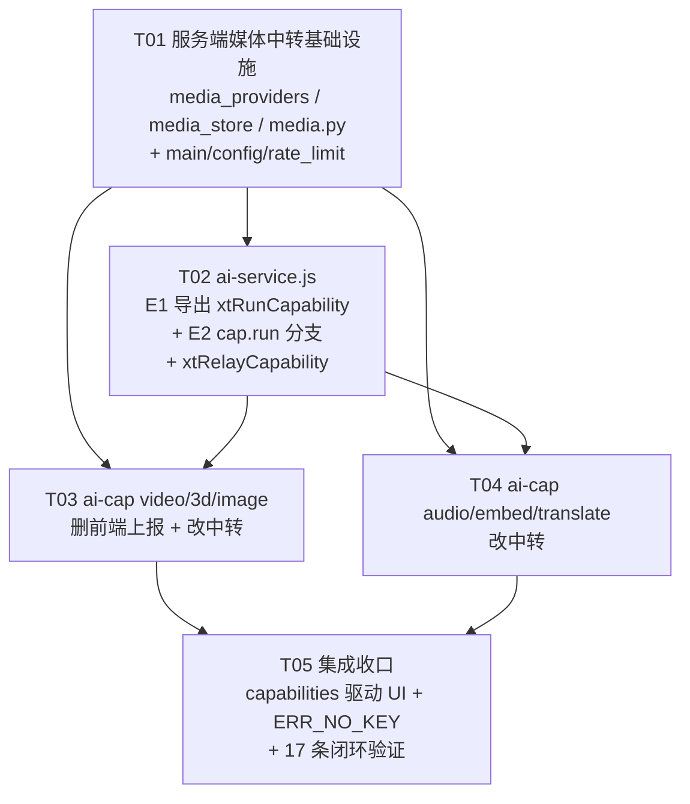

# 系统设计与任务分解 · R88-B 服务端中转端点与「真可用」修复

> 文档类型：增量系统设计（架构级修复）+ 任务分解
> 版本：R88-B（2026-09-18）；**修订 r2（2026-09-18，合并 team-lead 5 项裁定 + 3 条追加要求 + R88-B 修复链合并）**
> 作者：架构师 高见远（Gao，teammate `software-architect-apk`）
> 上游依据：`docs/audit-r88b-展示即真可用.md`（工程师 Kou 审计报告，17 条「展示即不可用」证据）
> 前置参考：`docs/design-r88-hi-位置定位与私聊加号菜单.md`（同批设计风格/约束写法）
> 唯一可写代码树：`D:\下载的文件\学习工作台`
> **本文档只做设计，不含任何业务代码改动。**

> **r2 变更摘要（team-lead 裁定已全部生效，不再回问）**
> - **裁定①硅基 Key = 补配**：用户本人填 `.env`；实现须「缺失时优雅降级 `ERR_NO_KEY(501)` + 健康检测如实标红 + 填上后自动恢复、无需改代码」。
> - **裁定②生图 = 共用 `ARK_API_KEY`**：须核实方舟账号生图模型开通情况，不一致的模型 id 在「待明确」标注、**不在代码硬编码**。
> - **裁定③Gemini/OpenRouter = 不纳入中转**：前端展示侧口径已定（§6.10）。
> - **裁定④`/usage/consume` = 保留**：新记账链路走**服务端内部 `record_usage`（不经 HTTP）**，与 R88-F 对 `/usage/consume` 的加固**互不影响**（§5.4）。
> - **裁定⑤产物 TTL = 下一批**：本批不做清理，须写明**残留风险 + 增速预估 + 下一批策略**（§4.5）。
> - **追加要求**：① `ERR_NO_KEY(501)` 语义统一（§2.0.1）；② 视频/3D 扣费红线测试策略（§12 新增）；③ **17 条闭环映射表**（§13 新增，无遗漏）。
> - **任务链合并**：R88-B 审计修复（E1/E2/E4）与本批中转改造**合并为一条统一任务链 T01–T05**（§8），不再两批互等。

---

## 0. 一句话结论（给 team-lead / 用户）

**新建独立 router 文件 `server/routers/media.py`（+ 配套 `server/media_providers.py` 适配层 + `server/media_store.py` 落盘层），彻底不改 `server/routers/ai.py`**；把生图 / 视频 / 3D / 语音 / 向量 / 重排 / 翻译七类能力从「浏览器直连第三方」改为「服务端中转」；**视频/3D 的异步轮询放在服务端**（`POST /api/media/tasks` 创建 → `GET /api/media/tasks/{id}` 由**服务端**向上游轮询并缓存状态，前端轮询的是**我们自己的服务端**，不直连上游）；产物**落盘到 `server/uploads/media/` 并返回同源 URL**（方案 B，理由见 §4）；**用量记账改由服务端在中转时直接写 `quota_ledger`**，前端不再直连上报；鉴权口径与 R88-F 对齐（游客可用、登录用户额外走每日限额、`/usage` 游客脱敏不变）。

---

## 1. 方案总览

### 1.1 根因回顾（审计已定论）

审计 §2.0 / §3 的三条根因：

| 编号 | 根因 | 证据 |
|---|---|---|
| **E3** | 服务端**只有 `/api/ai/chat`**，无 image/video/3d/audio/embed/rerank 端点；`.env` 无 siliconflow key（且 DEEPSEEK/QWEN/KIMI/OPENAI 为空）→ 非对话能力**全部押注浏览器直连第三方 + 前端硬编码 Key + 第三方 CORS** | `server/routers/ai.py:171`（仅 /chat）；`server/config.py:78-83`（siliconflow 已定义未配 key）；`assets/ai-config.js:20-74`（前端明文 Key） |
| **E1** | `xtRunCapability` 已定义（`ai-service.js:1941`）但**未导出**（`ai-service.js:3218-3238`）→ `ai-page.js:901 capRunner()` 恒返回 `null` | 审计 E1 |
| **E2** | `xtCallCapability`（`ai-service.js:1748`）**从不判断 `cap.async`、从不调用 `cap.run`** → 视频/3D 只能拿到 `taskId`，永远拿不到 MP4/GLB | 审计 E2 |

**E1/E2 是「前端接线断」，E3 是「服务端架构缺」——本批两条一起修，缺一不可。**

### 1.2 架构决策：**新建独立 router，刻意不改 `ai.py`**

| 方案 | 判断 | 理由 |
|---|---|---|
| **A. 新建 `server/routers/media.py`（+ `media_providers.py` + `media_store.py`），`main.py` 加一行 `include_router`** | ✅ **采用** | ① **彻底避开与 R88-F 的冲突**——R88-F 正在改 `ai.py`（P0 安全：/usage 游客脱敏、/usage/consume 限流+白名单、/usage/reset fail-closed）。本批**一行都不动 `ai.py`**，零冲突；② 职责清晰：`ai.py` = 文本/SSE 对话，`media.py` = 非对话能力（生图/视频/3D/语音/向量/重排/翻译）；③ `main.py` 的改动只有 **1 行**（`from routers import media` + `app.include_router(media.router)`），且 `main.py` **不在任何在跑线的文件清单里**（§1.4 已核）；④ 复用 `quota_ledger` / `security` / `rate_limit` / `config` 全部现成模块，**不复制记账逻辑**。 |
| B. 改 `server/routers/ai.py` 追加端点 | ❌ 不采用 | 与 R88-F **正面冲突**（同文件并发写）。且 `ai.py` 的 `/usage/consume` 语义是「前端直连后上报」，与本批「服务端中转直接记账」正交，混在一起会让 R88-F 的安全加固失效。 |
| C. 在 `main.py` 里内联所有端点 | ❌ 不采用 | `main.py` 已是装配入口，内联业务会破坏分层、拉长单文件，且不便后续拆能力。 |

> **⚠️ `main.py` 冲突复核**：`server/main.py`（3333 B / CRLF）在编队任务中**未被任何在跑线声明**（R88-A=`assets/xt-aiusage.js`、R88-B=`assets/ai-cap-video.js`/`ai-cap-3d.js`/`ai-service.js`、R88-F=`server/routers/ai.py`、R88-I=私聊三文件）。故 `main.py` 的 1 行装配改动**安全**，但仍**排在所有服务端任务之首**，由单人串行完成（见 §8）。

### 1.3 能力与上游平台对照（决定适配层抽象）

| 能力 | 前端现直连端点 | 上游平台 | Key 来源 | 同步/异步 |
|---|---|---|---|---|
| 生图 | `POST /v1/images/generations` | 火山方舟（arkimage）/ 硅基（siliconflow） | `.env ARK_API_KEY` ✅ / **无 siliconflow key** | 同步 |
| 视频 | `POST /api/v3/contents/generations/tasks` | 火山方舟 | `.env ARK_API_KEY` ✅ | **异步**（创建→轮询→取 URL） |
| 3D | 同视频端点 | 火山方舟 | `.env ARK_API_KEY` ✅ | **异步** |
| 语音 ASR | `POST /v1/audio/transcriptions`（multipart） | 硅基 | **无 siliconflow key** | 同步 |
| 向量 | `POST /v1/embeddings` | 硅基 | **无 siliconflow key** | 同步 |
| 重排 | `POST /v1/rerank` | 硅基 | **无 siliconflow key** | 同步 |
| 翻译 | `POST /api/v3/responses`（方舟专用结构） | 火山方舟 | `.env ARK_API_KEY` ✅ | 同步 |

| 翻译 | `POST /api/v3/responses`（方舟专用结构） | 火山方舟 | `.env ARK_API_KEY` ✅ | 同步 |
| 生图（硅基 `sf-kolors`） | `POST /v1/images/generations` | 硅基 | `SILICONFLOW_API_KEY`（**将补配**，裁定①） | 同步 |

**关键结论**：
1. 方舟系（生图 arkimage / 视频 / 3D / 翻译）**服务端已有 `ARK_API_KEY`，中转后立刻可通**；
2. 硅基系（语音 / 向量 / 重排 / `sf-kolors` 生图 / `sf-*` 视觉）**依赖 `SILICONFLOW_API_KEY`** —— **裁定①：用户将自行补配**，故本批实现必须做到「**有 key 即通 / 无 key 优雅降级 `ERR_NO_KEY(501)` + 健康检测如实标红 / 用户填 key 后自动恢复（零改代码）**」（§2.0.1）。

> **裁定②补充（生图 Key 共用 `ARK_API_KEY`）**：生图（`ark-*` 系列）与文本共用同一 `ARK_API_KEY`（前端 `ai-config.js:38` 注释已证实「Key 与 ark 相同」，`.env` 无需新增 `ARKIMAGE_API_KEY`）。**但须核实方舟账号是否已开通生图/视频/3D 模型权限**——若 `model_registry.json` 的生图模型 id 与方舟控制台实际开通的不一致，共用 key 也会报 `ModelNotOpen`。**该核实项列入 §11-2，且代码层不得硬编码模型 id（一律走 registry + `resolve_model_name`）**。

### 1.4 并行冲突总览（本设计避让面）

| 在跑线 | 正在改的文件 | 本批如何避让 |
|---|---|---|
| R88-A | `assets/xt-aiusage.js` | **本批不碰**该文件（用量展示不在本批范围） |
| R88-B（审计线） | `assets/ai-cap-video.js`、`ai-cap-3d.js`、`ai-service.js` | ⚠️ **强冲突**：三文件本批**必须改** → 全部排到「R88-B 审计写完之后」（§8 T02/T03/T05 明确标注 `wait-for: R88-B`） |
| R88-F | `server/routers/ai.py` | **本批一行不改** `ai.py`（§1.2 决策 A） |
| R88-I | `私聊.html` / `chat-local.js` / `icon-map.js` | **本批不碰**这三文件 |
| 本批 | `server/routers/media.py`（新）、`server/media_providers.py`（新）、`server/media_store.py`（新）、`server/main.py`（1 行）、`assets/ai-cap-*.js`（改：video/3d/image/audio/embed/translate）、`assets/ai-service.js`（改） | 与上述四条线**零重叠**（除 `ai-service.js` 需 wait-for R88-B） |

---

## 2. 服务端端点契约（逐能力）

### 2.0 通用约定（所有 `/api/media/*` 端点共享）

- **前缀**：`router = APIRouter(prefix="/api/media", tags=["media"])`
- **统一响应体**：`{"ok": bool, "data": {...} | null, "error": str, "code": str}`
  - 成功：`{"ok": true, "data": {...}, "error": "", "code": "OK"}`（HTTP 200）
  - 业务失败：`{"ok": false, "data": null, "error": "人类可读中文提示", "code": "ERR_XXX"}`（HTTP 4xx/5xx）
- **统一错误码表**：

| `code` | HTTP | 含义 | 触发点 |
|---|---|---|---|
| `OK` | 200 | 成功 | — |
| `ERR_BAD_REQUEST` | 400 | 入参缺失/非法 | 路由层校验 |
| `ERR_NO_KEY` | 501 | **该能力服务端未配置 Key**（不是客户端错） | `media_providers` 取 key 为空 |
| `ERR_UNKNOWN_MODEL` | 400 | modelId 不在白名单 | `known_model_ids()` 未命中 |
| `ERR_QUOTA_EXHAUSTED` | 200 | 额度耗尽，**绝不转发上游**（沿用 `/chat` 的 200+exhausted 口径） | `check_quota()` 返回 False |
| `ERR_UPSTREAM_HTTP` | 502 | 上游非 2xx | 透传 + 友好化（复刻 `ai.py:_STATUS_HINTS`） |
| `ERR_UPSTREAM_TIMEOUT` | 504 | 上游超时 | httpx 超时 |
| `ERR_TASK_NOT_FOUND` | 404 | 异步任务 id 不存在/已过期 | 服务端任务表未命中 |
| `ERR_TASK_FAILED` | 200 | 异步任务本身失败（上游 failed/cancelled/expired） | 任务状态映射 |
| `ERR_RATE_LIMITED` | 429 | 限流 | `rate_limit("media")` |
| `ERR_STORE_FAILED` | 500 | 产物落盘/取回失败 | `media_store` |

- **鉴权**：`user: User | None = Depends(get_current_user_optional)`
  - **游客（`user is None`）允许使用**——与 `ai.py:189 chat()` 口径一致（§5.1 详述）；
  - 登录用户额外走 `_record_usage(db, user.id)` 每日限额（复用 `ai.py` 同款逻辑，**但本层自己再实现一份到 `media.py`，不改 `ai.py`**）。
- **限流**：`_rl: None = Depends(rate_limit("media"))` —— 需在 `config.py` 增 `RATE_AI_MEDIA_PER_MIN`（默认 10 次/分钟，媒体类调用贵，比文本 30 更严）+ `rate_limit.py` 的 `_LIMITS` 加 `"media"` 键。（`rate_limit.py` / `config.py` 均**不在在跑线清单内**，安全。）
- **Key 安全铁律**：中转层从 `config.py` 的 provider 配置读 key（服务端 `.env`），**任何响应体 / 错误信息 / 日志绝不回显 key**（错误信息走 `_STATUS_HINTS` 友好化，原始报文截断 300 字符并过滤 `Bearer`/`api_key` 子串）。

#### 2.0.1 ⭐ `ERR_NO_KEY(501)` 统一语义（追加要求 ①，**所有端点共用一套**）

**动机**：裁定① 要求「无 Key 时前端显示『未配置 Key』而非『可用』」，且「用户填上 Key 后自动恢复、无需改代码」。若各端点各写一套错误，前端无法统一识别 → 必须**全局统一**。

**统一契约（唯一实现，放在 `media.py` 的 `_require_key(provider_id)` 助手）**：

```json
// HTTP 501 Not Implemented
{
  "ok": false,
  "data": null,
  "error": "该能力尚未在服务端配置密钥（SILICONFLOW_API_KEY），请在 server/.env 填写后重启服务",
  "code": "ERR_NO_KEY",
  "detail": {
    "capability": "asr",            // 端点对应的能力名（image|video|model3d|asr|embed|rerank|translate）
    "provider": "siliconflow",      // 缺失的 provider
    "envKey": "SILICONFLOW_API_KEY" // 缺失的 env 变量名（供运维定位，**不含任何 key 值**）
  }
}
```

**统一规则（所有端点必须遵守）**：
1. **判定方式统一**：一律调 `_require_key(provider_id)`，它读 `config.AI_PROVIDERS[provider_id]["api_key"]`（即 `.env` 实际值），为空即抛统一的 `ERR_NO_KEY(501)`。
2. **HTTP 状态码统一 501**（NOT_IMPLEMENTED —— 语义是「服务端未实现该能力的凭据配置」，不是客户端错误，故**不用 4xx**）。
3. **`error` 文案统一模板**：「该能力尚未在服务端配置密钥（{ENV_KEY}），请在 server/.env 填写后重启服务」。
4. **绝不假装可用**：无 key 时**不打上游、不返回 mock、不返回空成功**；`GET /api/media/capabilities` 对应项返回 `false`。
5. **健康检测如实标红**：`ai-service.js` 的 `probe`/`healthCheck` 命中 `ERR_NO_KEY` → 该模型 health 记为 **不可用（红）/ 原因「服务端未配置密钥」**，**不得**因「无记录」被当作可用（直击审计 E6 的「无 health 记录 → 默认可视」盲区）。
6. **零改代码自动恢复**：`config.py` 的 `configured_providers()` / `AI_PROVIDERS` 是**每次进程启动读 `.env`**；用户填 key → **重启服务** → `_require_key` 自动通过、`capabilities` 自动 `true`、健康检测自动转绿。**代码零改动**（这是裁定①的验收标准之一）。
7. **前端识别**：前端只需判 `resp.code === 'ERR_NO_KEY'` → UI 显示「该能力服务端未配置密钥」+（可选）引导管理员配置。**不要**用 `error` 文案做字符串匹配。

> **`capabilities` 端点与 `ERR_NO_KEY` 的关系**：`GET /api/media/capabilities` 是**前置探测**（返回 `{image:true, video:true, model3d:true, asr:false, embed:false, rerank:false, translate:true}`），前端应在**发起调用前**先查它，从而**根本不发**必然失败的请求 —— 这是「展示即真可用」的最优路径；`ERR_NO_KEY(501)` 是**兜底**（前端漏查/状态过期时仍能明确报错）。

### 2.1 生图 `POST /api/media/image`

**请求体**（`ImageIn`）：
```json
{
  "modelId": "ark-seedream-4-0",      // 必填，须命中 known_model_ids()
  "prompt": "一只在图书馆看书的猫",       // 必填，1~4000 字符
  "size": "1024x1024",                // 可选，默认 1024x1024
  "batch": 1,                         // 可选，默认 1，上限 4（成本保护）
  "mode": "t2i",                      // 可选 t2i|edit
  "imageDataUrl": ""                  // edit 模式必填（data:image/...;base64,...）
}
```

**响应体**（成功）：
```json
{
  "ok": true,
  "code": "OK",
  "error": "",
  "data": {
    "urls": ["/uploads/media/img_20260918_ab12cd.png"],
    "stored": true,                    // true=已落盘返回自有 URL；false=回退上游临时 URL
    "size": "1024x1024",
    "mode": "t2i",
    "usage": { "kind": "imagegen", "n": 1, "size": "1024x1024" }
  }
}
```

**服务端流程**：`resolve provider(modelId)` → `check_quota` → 组上游 body（方舟 `images/generations` 参数与 `ai-cap-image.js:36 build()` 对齐）→ httpx POST → 取 `data[].url`（上游为 S3 预签名 1 小时过期）→ **立即下载并落盘 `server/uploads/media/`**（§4）→ `record_usage(modelId, n, ok=True)` → 返回自有 URL。

**错误码**：`ERR_NO_KEY`（方舟 arkimage 未配 → 当前用 `ARK_API_KEY` 兜底，见 §11-2）/ `ERR_UNQUOTA` / `ERR_UPSTREAM_HTTP`。

### 2.2 视频 `POST /api/media/video` + `GET /api/media/tasks/{id}`（**异步**）

**创建** `POST /api/media/video`（`VideoIn`）：
```json
{
  "modelId": "ark-seedance-1-0-pro",   // 必填，provider 须为 arkvideo
  "prompt": "海边日落延时",              // mode=t2v 必填
  "mode": "t2v",                       // t2v|i2v
  "imageUrl": "",                      // i2v 必填（可为 data URL 或 http(s) URL）
  "ratio": "16:9",
  "duration": 5,
  "resolution": "720p",
  "audio": false,
  "cameraFixed": true,
  "seed": -1
}
```

**创建响应**：
```json
{ "ok": true, "code": "OK", "error": "",
  "data": { "taskId": "cgt-xxxx", "status": "created",
            "pollUrl": "/api/media/tasks/cgt-xxxx",
            "pollAfterMs": 5000 } }
```

**查询** `GET /api/media/tasks/{id}`：
```json
{ "ok": true, "code": "OK", "error": "",
  "data": {
    "taskId": "cgt-xxxx",
    "status": "running",              // created|running|succeeded|failed|expired
    "attempts": 3,
    "result": null                    // succeeded 时填充 ↓
  } }
```
`succeeded` 时 `result`：
```json
{ "url": "/uploads/media/vid_20260918_ef34.mp4",
  "coverUrl": "/uploads/media/vid_20260918_ef34.jpg",
  "resolution": "720p", "duration": 5, "bytes": 1234567,
  "usage": { "kind": "video", "n": 1, "outTok": 103818, "exact": 2 } }
```

**服务端流程（关键：轮询放服务端）**：见 §3。

**错误码**：创建阶段 `ERR_NO_KEY` / `ERR_UPSTREAM_HTTP`（含「未开通」友好化："该视频模型尚未在火山方舟控制台开通"）；查询阶段 `ERR_TASK_NOT_FOUND` / `ERR_TASK_FAILED` / `ERR_STORE_FAILED`。

### 2.3 3D `POST /api/media/model3d` + `GET /api/media/tasks/{id}`（**异步，与视频共端点**）

与视频同端点（方舟 `/contents/generations/tasks`），差异：
- **入参**（`Model3DIn`）：`{ modelId, imageUrl（必填，图生 3D）, prompt?, subdivision:"medium", format:"glb" }`
- **结果**：上游 `content.file_url` 是 **`.zip`** → 服务端落盘后返回 `{ "url": "/uploads/media/3d_xxx.zip", "isZip": true, "format": "glb", "previewUrl": "" }`
- **任务表**与视频**共用**（同一上游任务体系，用 `kind: "video" | "model3d"` 区分），缓存 key 都是上游 `taskId`。
- **用量**：单次约 30,000 tokens（`ai-cap-3d.js:12`），`record_usage` 记 `outTok`。

### 2.4 语音 ASR `POST /api/media/asr`

**请求**：`multipart/form-data`
- `file`: 音频二进制（必填，≤ 10MB）
- `modelId`: 表单字段（如 `sf-sensevoice`）
- `language`（可选）

**响应**：
```json
{ "ok": true, "code": "OK", "error": "",
  "data": { "text": "识别出的文字", "raw": "1: 识别出的文字",
            "language": "zh", "segments": null,
            "usage": { "kind": "asr", "n": 1, "chars": 8, "seconds": 6, "exact": 3 } } }
```

**注意**：上游 `ai-cap-audio.js:43` 的 multipart 是**浏览器自动带 boundary**；服务端中转时 FastAPI 用 `UploadFile` 收，再以 httpx `files={"file": (name, bytes, mime)}` 转发 → **边界由 httpx 生成，不要手写 Content-Type**。

**错误码**：硅基无 key → `ERR_NO_KEY`（当前默认不可用，见 §11-1）。

### 2.5 向量 `POST /api/media/embed` / 重排 `POST /api/media/rerank`

**embed** `{ modelId, texts: [...] | text: "..." }` → `data: { vectors: [[...]], dim: 1024, usage: {kind:"embed", n, docs, dim, inTok, exact:3} }`
**rerank** `{ modelId, query, documents: [...], topN }` → `data: { ranked: [{index, score}], usage: {kind:"rerank", n, docs, inTok, exact:3} }`

均同步，硅基端点；无 key → `ERR_NO_KEY`。

### 2.6 翻译 `POST /api/media/translate`

**请求** `{ modelId, text, targetLang: "zh" }` → 走方舟 `POST /api/v3/responses`（结构见 `ai-cap-translate.js:16-28`）→ `data: { text, targetLang, usage: {kind:"text", inTok, outTok} }`。

**说明**：审计未把翻译列为「展示即不可用」（它走文本 kind），但**同样是浏览器直连方舟 `/responses`**，APK 端同风险。**纳入本批**（成本低，方舟 key 齐备）。

### 2.7 端点总表

| 方法 | 路径 | 能力 | 同步/异步 | 上游 | 服务端 key（`.env` 当前值） |
|---|---|---|---|---|---|
| POST | `/api/media/image` | 生图 | 同步 | 方舟 arkimage / 硅基 | `ARK_API_KEY` ✅ / `SILICONFLOW_API_KEY`（**将补配**） |
| POST | `/api/media/video` | 视频创建 | 异步 | 方舟 arkvideo | `ARK_API_KEY` ✅ |
| POST | `/api/media/model3d` | 3D 创建 | 异步 | 方舟 ark3d | `ARK_API_KEY` ✅ |
| GET | `/api/media/tasks/{id}` | 视频/3D 查询 | — | 方舟（服务端代理轮询） | `ARK_API_KEY` ✅ |
| POST | `/api/media/asr` | 语音识别 | 同步 | 硅基 | `SILICONFLOW_API_KEY`（**将补配**） |
| POST | `/api/media/embed` | 向量 | 同步 | 硅基 | `SILICONFLOW_API_KEY`（**将补配**） |
| POST | `/api/media/rerank` | 重排 | 同步 | 硅基 | `SILICONFLOW_API_KEY`（**将补配**） |
| POST | `/api/media/translate` | 翻译 | 同步 | 方舟 `/responses` | `ARK_API_KEY` ✅ |
| GET | `/api/media/capabilities` | **能力可用性探测**（前端据此前置判断隐藏/提示） | — | 本地 | — |

> `/api/media/capabilities` 返回**依 `.env` 实况**：补配 siliconflow key 前为 `{"image":true,"video":true,"model3d":true,"asr":false,"embed":false,"rerank":false,"translate":true}`；补配（+重启）后**自动**变 `{...,"asr":true,"embed":true,"rerank":true,...}` —— **零改代码**（裁定① 验收点）。前端据此**前置判断**：能力为 `false` 时显示「该能力服务端未配置密钥」，**不发必然失败的请求**。

---

## 3. 异步轮询方案（**核心难点**）

### 3.1 问题

视频/3D 是「创建任务 → 轮询状态 → 取结果」的分钟级异步流程（`ai-cap-video.js:176 run()`）。直连时轮询在浏览器（`POLL_MS=5000`、`POLL_MAX=120`）。
改中转后，**轮询放哪端？** 两个选项：

| 方案 | 描述 | 判断 |
|---|---|---|
| **甲：服务端只做「代理转发」，前端轮询服务端** | 前端仍按 5s 间隔调 `GET /api/media/tasks/{id}`，服务端每次调用**同步**去上游查一次并原样返回 | ✅ **采用** |
| 乙：服务端「代轮询」（后台线程/定时任务拉取到完成再通知前端） | 创建后服务端起后台协程，前端只长轮询到完成 | ❌ 不采用 |

### 3.2 决策：**甲（服务端只做代理转发 + 短时状态缓存）**，理由：

1. **与现有前端异步架构零改动对齐**：`ai-cap-video.js:141 poll()` 就是「定时 GET 直到 succeeded」的循环，前端只需把 `url` 从上游改成 `/api/media/tasks/{id}`，**轮询节奏、超时（10 分钟）、错误分类全不变**。改动最小。
2. **服务端无状态、可多进程横向扩展**：方案乙需要后台线程持有任务状态 + 推送通道（SSE/WebSocket），而项目是**单进程 fastapi + 内存限流**（`rate_limit.py:11` 明说"单进程够用"），引入后台任务会让「进程重启丢任务」成为新的可靠性缺口。
3. **成本可控**：每次 `GET /api/media/tasks/{id}` 只做一次上游轻量查询（无 token 计费——**查询不产生生成费用**，`ai-cap-video.js:279` 注释证实"提交才计费"），服务端**不额外轮询**，不会放大上游调用量。
4. **避免「服务端轮询完才发现前端已断开」的资源浪费**：方案乙在用户关闭页面后仍会轮询到超时，白白占用线程。方案甲**前端不轮询 = 服务端不查询**，天然省资源。

**但甲方案补一条「服务端短时缓存」**（否则每次前端轮询都打上游）：
- 服务端内存 `dict[taskId] = {"kind", "modelId", "createdAt", "lastPollAt", "lastStatus", "result", "usage"}`，**TTL 30 分钟**（覆盖 10 分钟轮询上限 + 余量）；
- `GET /api/media/tasks/{id}` 命中缓存且 `lastStatus in (succeeded, failed, expired)` → **直接返回缓存**（终态不再打上游）；
- 距上次查询 < **3 秒** → 返回缓存状态（**节流**，防止前端误刷爆打上游）；
- 否则向上去游查一次 → 更新缓存 → 返回。
- 缓存为**进程内 dict**（与 `rate_limit` 同风格，单进程够用）；进程重启丢缓存 → 前端下次查询会 `ERR_TASK_NOT_FOUND`，前端**降级为提示「任务查询失败，请稍后在历史记录查看」**（不阻断，因为上游任务本身仍在跑，产物可能已落盘）。

### 3.3 结果取回与记账时点

- 上游 `status=succeeded` → 服务端**立即下载产物落盘**（§4）→ 记 `record_usage(modelId, outTok, ok=True)` → 返回自有 URL。
- `status=failed/cancelled/expired` → `record_usage(modelId, 1, ok=False)`（只累 `failCalls`，不涨 `used`，与 `quota_ledger.record_usage` 语义一致）。
- **创建时不计账**（因为还没产生结果），**成功取回时才计账** —— 避免「创建成功但用户放弃轮询」时账实不符；但**成本已经发生**（上游创建即计费），故创建阶段也**预记一条 `calls`**（`record_usage(modelId, 0, ok=True)` 只 +1 calls 不增 used），产出成功后按真实 token 补 `used`。**这是本设计的成本诚实性设计点。**

### 3.4 时序图见 §4.4 / `docs/sequence-diagram.mermaid`。

---

## 4. 产物返回与落盘策略

### 4.1 三方案对比

| 方案 | 描述 | 判断 |
|---|---|---|
| A. 二进制回流（base64 / stream 直回前端） | 服务端把图片/视频字节直接塞进响应 | ❌ 不采用 |
| **B. 服务端落盘到静态目录 + 返回 URL** | 落 `server/uploads/media/`，返回 `/uploads/media/xxx` | ✅ **采用** |
| C. 回传上游临时 URL（不落盘） | 直接把方舟 S3 预签名 URL 给前端 | ❌ 不采用（仅作降级兜底） |

### 4.2 推荐方案 B，理由：

1. **上游 URL 会过期**：生图 `X-Amz-Expires=3600`（1 小时，`ai-cap-image.js:8`）、视频/3D `X-Tos-Expires=86400`（24 小时，`ai-cap-video.js:13`）。**回传上游 URL = 24 小时后用户历史记录里的图/视频全变 404**。审计 §4.1 已点名「生图结果 S3 预签名 URL 有本地落库兜底」是既有痛点。
2. **APK 端可达性**：方案 B 返回的是**同源相对路径**（Web 端 `/uploads/...`；APK 端拼 `STUDY_API_BASE` → `http://110.42.134.62:8000/uploads/...`）。**服务端已挂载 `/uploads` 静态目录**（`main.py:58` `app.mount("/uploads", StaticFiles(UPLOAD_DIR))`），**APK 打自己的服务器，不存在第三方 CORS / 代理问题** —— 这是「APK 真可用」的最后一公里，方案 A/C 都做不到（A 的 base64 会让视频文件撑爆内存，C 依赖第三方可达）。
3. **零新增挂载**：`media_store` 落 `UPLOAD_DIR / "media"`，而 `/uploads` 已覆盖 `UPLOAD_DIR`（`config.py:35`），**无需改 `main.py` 的静态挂载**（只需 mkdir）。
4. **方案 A 的否决理由**：视频 5s/720p 约数 MB~数十 MB，base64 膨胀 33%，经 JSON 传输会**在低端 WebView 上直接 OOM**；且视频还需支持 `<video>` 流式/断点，base64 无法 `Range`。**图片**虽小，但为统一口径也不走 A（避免前端两套取数据逻辑）。

### 4.3 落盘实现（`server/media_store.py`）

```
媒体目录：UPLOAD_DIR / "media"      → server/uploads/media/
命名：{kind}_{YYYYMMDD}_{8位随机}.{ext}
      img_20260918_ab12cd34.png / vid_20260918_ef56gh78.mp4 / 3d_20260918_ij90kl12.zip
返回：/uploads/media/{filename}      （相对路径，前端按 getApiBase() 拼绝对）
```

- **下载上游产物**：httpx GET（流式写入，`timeout=120`），**限制单文件上限 100MB**（视频/zip 保护），超限 → `ERR_STORE_FAILED` + 回退返回上游 URL（方案 C 兜底，`stored:false`）。
- **下载失败**（上游 URL 已过期/网络抖动）→ **不阻断主流程**：返回上游 URL + `stored:false`，前端照常展示（用户当次可用，只是不落盘）。**绝不因为落盘失败让用户看不到已经生成的产物。**
- **`/uploads` 静态目录已在 `main.py:56-58` 建目录并挂载**，`media` 子目录由 `media_store.ensure_dir()` 在首次落盘时 mkdir（`parents=True, exist_ok=True`）。

### 4.5 ⚠️ 产物 TTL 残留风险（裁定⑤：本批不做清理，但必须写明风险）

**背景**：裁定⑤ = 本批**不实现**定时清理，`server/uploads/media/` 会**单调增长**。为避免「上线后磁盘静默被占满」的事故，此处**明确量化风险**。

**单文件体积估算（依审计与能力模块注释的真实口径）**：

| 产物 | 典型体积 | 来源/依据 |
|---|---|---|
| 生图 PNG/JPG（1024×1024） | **1~3 MB** | 方舟/硅基 1024×1024 出图常规体积 |
| 生图最高（2048×2048） | ~8 MB | 该能力 1 张上限 |
| 视频 MP4（5s / 720p） | **3~15 MB** | 5s/720p 典型码率；`ai-cap-video.js:73 timeout=600000` 支持更长时间/更高分辨率 |
| 视频 MP4（10s / 1080p 上限） | ~30~60 MB | 极端场景 |
| 3D zip（glb/medium） | **5~20 MB** | `ai-cap-3d.js` 结果 `.zip` 含 glb |
| ASR 音频 | 不落盘（仅转发文本） | — |

**增速预估（按使用强度）**：

| 使用强度 | 生图/天 | 视频/天 | 3D/天 | **日增** | **月增** | **一年累积** |
|---|---|---|---|---|---|---|
| 轻度（个人试用） | 5 | 1 | 0.5 | ≈ 5×2 + 1×10 + 0.5×12 = **26 MB** | ≈ 0.8 GB | ≈ 9.5 GB |
| 中度（小团队） | 30 | 5 | 2 | ≈ 30×2 + 5×10 + 2×12 = **134 MB** | ≈ 4 GB | ≈ 49 GB |
| 重度（多人并发） | 200 | 30 | 10 | ≈ 200×2 + 30×10 + 10×12 = **820 MB** | ≈ 24 GB | ≈ 292 GB |

> **结论**：**轻度也一年近 10 GB**、重度一年近 300 GB。`server` 若部署在**小容量云盘**（常见 40~100 GB），**中度用量下约 1 个月、重度下约 3~7 天即可占满磁盘** → **磁盘占满是真实且紧迫的风险**。且磁盘满会导致**整个服务端（含文本对话/登录）写库失败**，影响面远超媒体能力。

**本批缓解措施（低成本、不动架构）**：
1. **单文件上限 100MB**（`media_store.MAX_BYTES`）—— 阻断单个超大文件。
2. **落盘开关**：`config.MEDIA_STORE_ENABLED`（默认 `true`）；运维可在磁盘紧张时设为 `false` → 产物**不落盘**、直接回传上游 URL（方案 C 兜底），**服务不中断**。
3. **目录可见性**：`GET /api/media/capabilities` 附带 `mediaDirBytes`（目录当前占用，仅登录用户可见）—— 运维/管理员可**随时观测增速**，不必等到报警。
4. **文档留痕**：`media_store.py` 顶部写清「无限增长风险 + 下一批清理策略」，避免后人不知情。

**下一批清理策略建议（裁定⑤「放下一批」，此处仅设计、不实现）**：
- **方案 a（推荐）：mtime TTL + 手动/定时清理脚本** `server/tools/clean_media.py`：删除 `mtime < now - 30天` 的文件；由运维 cron（如每日 03:00）驱动，或服务启动时顺带跑一次。
- **方案 b：容量水位触发的 LRU 淘汰**：目录 > 阈值（如 10 GB）时按 mtime 删最旧，直到降到水位 80%。无需 cron，随落盘过程触发。
- **方案 c：落盘元数据入库（SQLite `media_asset` 表）+ 引用计数**：只有「被消息/笔记引用」的产物才长期保留，未被引用 N 天后删。最精确但改动最大。
- **建议**：**下一批采用 a + b 组合**（cron 兜底 TTL + 落盘时水位淘汰），**不引入 c**（引用计数需要改多处业务表，收益/成本比低）。
- **与审计 §4.1「生图结果 1 小时失效 → 需本地落库」的既有痛点合并处理**：下一批顺带把 `ai-page.js:512 persistGeneratedImages` 的本地兜底与本次服务端落盘**统一口径**（服务端落盘为准，前端不再重复持久化）。

### 4.6 时序图（核心链路）

见独立文件 `docs/sequence-diagram-r88b-media.mermaid`（含 4 张图：生图同步中转 / 视频异步创建+服务端代理轮询 / 前端改造后的能力分派 / 用量记账）。

---

## 5. 鉴权与用量记账

### 5.1 鉴权口径（**与 R88-F 对齐，保持一致**）

| 项 | 口径 | 依据 |
|---|---|---|
| `POST /api/media/*` 是否要求登录 | **不要求**（`get_current_user_optional`），游客可用 | 与 `ai.py:189 chat()` 一致："游客（未登录）也可使用" |
| 游客保护 | **每 IP 限流**（`rate_limit("media")`，默认 10 次/分钟） | 与 `/chat` 游客保护同构 |
| 登录用户额外保护 | 每日调用限额（`_record_usage`，复用 `AI_DAILY_LIMIT=200`） | 与 `/chat` 一致 |
| `/usage` 游客脱敏 | **不变**（R88-F 的改动，本批不碰 `ai.py`） | 本批零改动 `ai.py` |
| `/api/media/capabilities` | **免登录**，只返回能力布尔值（**不含 key、不含任何模型明细**） | 供前端前置判断，无敏感信息 |

> **一致性的意义**：`/usage` 面板显示的是「服务端账本」，本批把媒体调用也记进**同一个 `quota_ledger`**，则 `GET /api/ai/usage`（R88-F 改后）能**顺带展示媒体用量**，无需前端再上报 —— 这是「服务端记账更可靠」的直接收益。

### 5.2 用量记账：从前端上报 → 服务端直接记账

**现状**（审计发现）：`ai-cap-video.js:56` / `ai-cap-3d.js:52` 在**前端**轮询完成后 `POST /api/ai/usage/consume`（headers **不带 token**）→ 依赖前端诚实上报，可被伪造/漏报。

**改造后**：
- 服务端在**中转完成/取回结果时**直接调 `quota_ledger.record_usage(model_id, amount, ok=...)` —— **模型 id、真实 token 数都由服务端从上游响应读取**（`usage.completion_tokens` 等），**不可伪造、不会漏报**。
- **前端 `reportUsage()` 调用点删除**（`ai-cap-video.js:52-62`、`ai-cap-3d.js:48-58` 整块移除）→ 双记账风险消除（否则服务端记一次 + 前端又报一次 = 翻倍）。
- **`POST /api/ai/usage/consume` 端点保留**（裁定④）：见 §5.4。

**记账口径对齐表**：

| 能力 | `amount` | `unit` | `ok` 时点 | 备注 |
|---|---|---|---|---|
| 生图 | `n`（张数，来自 `data[]` 长度） | 张 | 成功后 | 上游无 usage 字段，按张 |
| 视频 | `outTok`（`usage.completion_tokens`，实≈103818） | tokens | 取回成功后 | 创建时预记 calls |
| 3D | `outTok`（实≈30000） | tokens | 取回成功后 | 同上 |
| ASR | `1`（只计 calls） | 次 | 成功后 | `quota_ledger` 无「秒」维度 → 只计 calls，不猜 token（§11-6） |
| embed/rerank | `inTok` | tokens | 成功后 | — |
| 翻译 | `inTok+outTok` | tokens | 成功后 | 走文本口径 |

> `quota_ledger.record_usage` 签名 `(model_id, amount=1, ok=True)`（`quota_ledger.py:229`），**已在 `ai.py` 生产使用**，本批直接复用，**不改 `quota_ledger.py`**。

### 5.3 `check_quota` 前置检查（**绝不转发上游**）

沿用 `ai.py:201-204` 口径：转发前 `check_quota(modelId)`，未通过 → **HTTP 200 + `ERR_QUOTA_EXHAUSTED`，绝不转发**（避免产生真实费用）。这是**成本保护的第一道闸**，视频/3D 尤其重要（单次 10 万 token）。

### 5.4 ⭐ `/usage/consume` 与新记账链路的关系（裁定④）

**裁定④：`POST /api/ai/usage/consume` 保留**（兼容老 APK / 老客户端）。**但必须写清一点，避免工程师误以为新链路要调它**：

| 维度 | `POST /api/ai/usage/consume`（**保留，R88-F 加固**） | 本批**新**记账链路 |
|---|---|---|
| 调用方 | **前端 HTTP 调用**（老客户端：直连上游后自己上报） | **服务端内部函数调用**（`media.py` → `quota_ledger.record_usage`） |
| 是否走 HTTP | ✅ 走 HTTP（`/api/ai/usage/consume`） | ❌ **完全不经过 HTTP**，是进程内函数调用 |
| 是否受 R88-F 加固影响 | ✅ 受（R88-F 给它加**限流 + modelId 白名单校验**） | ❌ **不受影响**（不经过该端点，不触发其限流/白名单） |
| 鉴权 | 无 token 也放行（前端直连场景，R88-F 只做服务端加固） | 与 `/api/media/*` 同源：`get_current_user_optional` |
| 本批是否调用 | **本批前端不再调用它** | 本批**唯一**的新记账路径 |

> **⚠️ 给工程师的关键说明（重申）**：**不要**在 `media.py` 里 `httpx.post("/api/ai/usage/consume")` —— 那是**绕远路 + 会被 R88-F 的限流/白名单拦**。正确做法是**直接 `from quota_ledger import record_usage` 然后进程内调用**（与 `ai.py:295` 的做法完全一致）。
> **两通道共存不冲突**：老客户端继续走 `/usage/consume`（受 R88-F 加固约束），新客户端走 `/api/media/*`（服务端内部记账）。二者最终都写入**同一个 `quota_ledger`（`data/model_usage.json`）** → 账本口径统一，**不会双算**（因为新前端已删除自身上报）。

---

## 6. 前端改造点（精确到文件:行号）

> **行尾铁律（实测值，见 §7）**：`assets/ai-*.js` = **LF**；`server/**/*.py` = **CRLF**。**一律二进制读写**（Python `open(..., 'rb')` / `'wb'`），改完复测 CR/LF 计数不变。
> **ES2017 上限**：禁 `?.` `??` 对象展开 `.replaceAll(` `Object.fromEntries` `.at(` 后行断言 `**` 可选 catch 绑定。用 `var` + `function`。

### 6.1 `assets/ai-service.js`（LF，146973 B）—— **E1 + E2 修复 + 中转分派**

| 编号 | 位置 | 改什么 | 对应审计 |
|---|---|---|---|
| **F1** | `ai-service.js:1941 xtRunCapability` 定义后 | **E1**：在导出对象 `AI_SERVICE`（`ai-service.js:3218-3238`）中**新增 `xtRunCapability: xtRunCapability`**，并把 `xtCallCapability` 也一并导出（便于外部/测试直接驱动）。 | E1 |
| **F2** | `ai-service.js:1748 xtCallCapability` **函数开头** | **E2**：新增**服务端中转优先分支** —— 若能力命中「服务端中转」条件（见 F3），直接 `return xtRelayCapability(cap, modelCfg, input, opt, sink)`，**不再走 build/fetch 直连**。 | E2 |
| **F3** | 新增函数 `xtMediaUrl(kind)` / `xtRelayCapability(...)` | 新增**中转调用器**：按 kind 映射 `POST /api/media/{image|video|model3d|asr|embed|rerank|translate}`；`url = relayBase() + path`（**Web 端空串同源、APK 端 `STUDY_API_BASE`**，复用 `relayBase()` `ai-service.js:861`）；headers 带 `Authorization: Bearer <relayToken()>`（可选登录）；multipart（ASR）走 `xtXhrSend`（`ai-service.js:1690`，自动 boundary）；**响应体是 `{ok,data,error,code}`，取 `data` 转成 cap 既要的 `result` 形状**。 | E3 |
| **F4** | `ai-service.js:1748` 内 `cap.async && typeof cap.run === 'function'` | **E2 补充**：`xtCallCapability` 增加 `if (cap.async && typeof cap.run === 'function') { return cap.run({...}) }` 分支（**中转优先**：视频/3D 走中转时由 `run()` 内部打 `/api/media/video`+`/api/media/tasks/{id}`）。 | E2 |
| **F5** | `ai-service.js:1551-1560 XT_KIND_BY_TYPE` | 无需改（`video`→`video`、`3d`→`model3d` 已在）。确认 `translate`→`text` 保持。 | — |
| **F6** | `ai-service.js:3112-3118` 附近健康检查 | **中转后**：`probe` 对已中转能力应打**服务端** `/api/media/capabilities`（而非直连上游）→ 让「检测全部」真实反映服务端可用性。**本项为 P1**（视频/3D `probeNoAuto` 仍不进批量）。 | E6 |

**F1 导出后哪些调用点会生效**（回答 team-lead 的问题）：
- `ai-page.js:901 capRunner()` → `window.AI_SERVICE.xtRunCapability` 变为 `function` → `ai-page.js:924` 的 **ASR 直连链路立即生效**（不再退 `callAI`）。
- `ai-page.js` 其他潜在消费点（`Grep` 确认 `xtRunCapability` 仅 `capRunner` 引用）→ 一期只有 ASR 受益。
- **ASR 通路**：中转后 ASR 走 `/api/media/asr`；**用户补配 siliconflow key（裁定①）+ 重启后自动可用**，无需改代码；未补配时返回 `ERR_NO_KEY(501)` → 前端显示「该能力服务端未配置密钥」（§6.9）。

> **⚠️ 关于「wait-for R88-B」的修订（r2）**：裁定宣布 **R88-B 审计修复（E1/E2/E4）与本批中转改造合并为一条任务链**（不再两批互等）。
> - 因此 `ai-service.js`（F1–F6）**不再标注「wait-for R88-B 批次」**，而是**本任务链内 T02 自身就要完成的 E1/E2 修复**；
> - `ai-cap-video.js` / `ai-cap-3d.js`（F8–F11）同样**在本链 T03 内完成**；
> - 仍存在的**唯一等待关系**是**文件级**：若 R88-B 审计线（`software-engineer-r88b`）**此刻仍持有这三个文件的未提交改动**，则本链 T02/T03 **须等其提交后方可落盘**（避免同文件并发写）。**此为文件锁层面的等待，非批次等待。**

### 6.2 `assets/ai-cap-video.js`（LF，14861 B）—— **文件锁：见 §6.1 修订说明**

| 编号 | 位置 | 改什么 |
|---|---|---|
| **F8** | `ai-cap-video.js:52-62 reportUsage()` | **删除整个函数**及 `run()` 内 `reportUsage(...)` 调用（`:198-200`）→ 记账移交服务端。 |
| **F9** | `ai-cap-video.js:104-110 build()` 的 `url` | 改为**服务端中转端点** `relayBase() + '/api/media/video'`（走 F3 的 `xtMediaUrl('video')`），**不再直连方舟 tasks**；`headers` 去 `Authorization`（key 在服务端）。 |
| **F10** | `ai-cap-video.js:141-170 poll()` | `url` 改为 `relayBase() + '/api/media/tasks/' + taskId`（服务端代理轮询入口）；**轮询节奏/超时/错误分类不变**。`parseDone` 对接 `data.result`（`url/coverUrl/resolution/duration`）与 `data.usage`。 |
| **F11** | `ai-cap-video.js:284-310 probe` | 中转后探针改打服务端 `/api/media/capabilities`（P0，因裁定①「健康检测如实标红」）。 |

### 6.3 `assets/ai-cap-3d.js`（LF，15769 B）—— **文件锁：见 §6.1 修订说明**

同 F8/F9/F10/F11，差异：端点 `/api/media/model3d`，`parseDone` 对接 `data.result.isZip/format/previewUrl`。

### 6.4 `assets/ai-cap-image.js`（LF，3822 B）

| 编号 | 位置 | 改什么 |
|---|---|---|
| **F12** | `ai-cap-image.js:48-54 build()` | `url` 改服务端 `/api/media/image`；`headers` 去 `Authorization`。 |
| **F13** | `ai-cap-image.js:57-79 parse()` | 对接 `{ok,data:{urls,stored,size,mode}}` → `result.urls`（**注意：中转后 URL 是 `/uploads/media/...` 相对路径**，需 `relayBase()` 拼绝对，前端已有 `proxyWrapUrl`/`normalizeImageUrl` 可参考）。 |

### 6.5 `assets/ai-cap-audio.js`（LF，13050 B）

| 编号 | 位置 | 改什么 |
|---|---|---|
| **F14** | `ai-cap-audio.js:29-47 build()` | `url` 改 `/api/media/asr`；**保持 `formData`**（`xtXhrSend` 会自动带 boundary）；`headers` 去 `Authorization`。 |
| **F15** | `ai-cap-audio.js:49-77 parse()` | 对接 `{ok,data:{text,raw,language,segments,usage}}`。 |

### 6.6 `assets/ai-cap-embed.js`（LF，9513 B，含 EMB + RRK）

| 编号 | 位置 | 改什么 |
|---|---|---|
| **F16** | `ai-cap-embed.js:29-44`（EMB.build） | `url` 改 `/api/media/embed`。 |
| **F17** | `ai-cap-embed.js:82-97`（RRK.build） | `url` 改 `/api/media/rerank`。 |
| **F18** | `ai-cap-embed.js:46-69` / `99-121`（parse） | 对接 `data.vectors/dim` 与 `data.ranked`。 |

### 6.7 `assets/ai-cap-translate.js`（LF，11357 B）

| 编号 | 位置 | 改什么 |
|---|---|---|
| **F19** | `ai-cap-translate.js` build/parse | `url` 改 `/api/media/translate`，对接 `data.text`。 |

### 6.8 前端 `getApiBase()` 口径统一（回答 team-lead 问题）

- **现状**：`config.js:28-29` → `window.STUDY_API_SERVER = 'http://110.42.134.62:8000'`（**常量**）；`window.STUDY_API_BASE = isWeb() ? '' : SERVER`（**Web 空串同源 / APK 绝对地址**）。
- **team-lead 提到的 `STUDIO_API_SERVER` 实际是 `STUDY_API_SERVER`**（无 `STUDIO` 变量），已核实 `config.js:28`。
- **中转调用统一口径**：**一律用 `relayBase()`（`ai-service.js:861-865`）**，它读 `window.STUDY_API_BASE`：
  - Web 端 → `''` → 请求 `/api/media/image`（同源，无 CORS）；
  - APK 端 → `http://110.42.134.62:8000` → 请求 `http://110.42.134.62:8000/api/media/image`（**打自己的服务器，明文 HTTP 但同源白名单/WebView 已允许本 app 访问**，`api.js:13` 同款兜底）。
- **不要再引入第三套 base 逻辑**：所有 `ai-cap-*.js` 里的 `url` 都通过 `R.endpoint(...)` 或 `relayBase()` 产出，**禁止硬编码 `https://ark...`**（服务端中转后上游地址只应存在于 `server/media_providers.py`）。
- **`api.js:13` 的 `window.API_BASE` 与 `config.js` 的 `STUDY_API_BASE` 语义相同**（都是 Web 空 / APK 绝对），但 `ai-service.js` 走的是 `relayBase()`（读 `STUDY_API_BASE`）→ **统一到 `relayBase()`，不要用 `API_BASE`**，避免两套变量漂移。

### 6.9 `assets/ai-page.js`（LF，131014 B）—— **仅 UI 提示（P0，因裁定①/③ 要求）**

- `ai-page.js:901 capRunner()` **不用改**（F1 导出后自动生效）。
- **`ERR_NO_KEY` 统一提示（P0）**：在 `runAudioRecognition`（`ai-page.js:918`）的 reject 分支识别 `err.code === 'ERR_NO_KEY'` → toast「该能力服务端未配置密钥」（**判 `code`，不判文案**，§2.0.1 规则 7）。（`ai-page.js` 不在任何在跑线清单内，安全。）

### 6.10 ⭐ Gemini / OpenRouter 前端展示口径（裁定③：不纳入中转）

**裁定③：Gemini / OpenRouter 不纳入本批中转**（`.env` 无对应 key，纳入只是徒增不可用条目）。**但前端展示侧必须给明确口径**，否则这 5 个条目仍是「展示即不可用」：

| 条目 | 数量 | 现展示位置 | **本批展示口径** |
|---|---|---|---|
| Gemini（`gm-flash` / `gm-flash-lite`） | 2 | `ai-config.js:661-685`；分区「对话与识图」 | **保留展示，但显式标注「需自备网络（海外）」** —— 因其 `needVPN:true`/`needProxy:true`，属**平台固有约束**（非本批能力缺口），审计已归为「⚠️ 依赖外部条件」而非「❌ 展示即不可用」。**不改隐藏**（隐藏会误伤有 VPN 的用户）。 |
| OpenRouter（`or-auto`/`or-nemotron-super`/`or-nemotron-ultra`） | 3 | `ai-config.js:625-659` | 同上：**保留展示 + 标注「需自备网络」**。 |

**为什么「保留展示」而非隐藏**：裁定③ 的理由是「纳入中转违反展示即真可用」；但这 5 条的可用性瓶颈是**网络可达性（需梯子）**，**中转也解决不了**（服务端在境内，同样连不上 Gemini/OpenRouter；若服务端在境外则可，但本项目服务器 `110.42.134.62` 在国内）。→ 它们**不是「展示即不可用」，而是「有条件可用」**，与审计 §2.9 的「⚠️ 有入口但依赖外部条件」定性一致。

**具体落地（P1，可选）**：
1. **文案统一**：这 5 个模型的说明/标签统一为「**需自备网络（海外）**」（去歧义）。
2. **健康状态**：`ai-service.js` 的 `probeProxyPlatforms()`（`ai-service.js:3213`）已对 `needProxy` 平台做可达性探测 → 不可达时 **health 标为「需代理」**（而非「可用」），与审计 E6 的「无记录默认可视」盲区口径一致。
3. **不新增中转端点**：`/api/media/*` **不含** gemini/openrouter 路径。

> **⚠️ 若用户后续要求「Gemini 也想在 APK 用」**：需**另立批次**（涉及服务端出海网络/代理，非本批范围）→ 列入 §11-5。

---

## 7. 文件清单（**标冲突**）

> 行尾为**实测值**（Python 二进制统计，见 §7.1 证据）。**改动一律二进制读写，改完复测行尾不变。**

| # | 文件 | 新建/改 | 行尾（实测） | 改什么 | 冲突标注 |
|---|---|---|---|---|---|
| **S1** | `server/media_providers.py` | **新建** | CRLF | 上游适配层：`PROVIDERS`（ark / siliconflow 的 base_url + key 读取，**复用 `config.py` 的 key，不新增 env 名**）+ `resolve(provider_id)` + `endpoint_for(kind, provider_id)` + 各能力 request 组包函数（`build_image_body` / `build_video_body` / `build_3d_body` / `build_translate_body` / upstream 路径映射） | ✅ 无冲突（新文件） |
| **S2** | `server/media_store.py` | **新建** | CRLF | 产物落盘：`ensure_dir()` / `save_from_url(kind, url) -> "/uploads/media/xxx"` / `save_bytes(...)` / `guess_ext()` / 100MB 上限保护 / 命名规则 | ✅ 无冲突（新文件） |
| **S3** | `server/routers/media.py` | **新建** | CRLF | **核心 router**：7 个端点 + `GET /api/media/tasks/{id}` + `GET /api/media/capabilities`；复用 `quota_ledger` / `security` / `rate_limit`；任务缓存 dict + TTL；记账 | ✅ 无冲突（新文件） |
| **S4** | `server/main.py` | 改（**1 行**） | CRLF（3333 B, CR=77） | `from routers import ... media`（`main.py:16-18` 的 import 组）+ `app.include_router(media.router)`（`main.py:48` ai 之后） | ✅ 无冲突（不在在跑线清单） |
| **S5** | `server/config.py` | 改（**2 行**） | CRLF（5766 B, CR=117） | 新增 `RATE_AI_MEDIA_PER_MIN = int(_get("RATE_AI_MEDIA_PER_MIN","10"))`；`MEDIA_DIR = UPLOAD_DIR / "media"` | ✅ 无冲突 |
| **S6** | `server/rate_limit.py` | 改（**1 行**） | CRLF（4688 B, CR=121） | `_LIMITS` 加 `"media": RATE_AI_MEDIA_PER_MIN` | ✅ 无冲突 |
| **F-SVC** | `assets/ai-service.js` | 改 | **LF**（146973 B, CR=0） | §6.1 F1–F6（**含 E1/E2 修复，本链 T02 内完成**） | ⚠️ **文件锁**：若 `software-engineer-r88b` 仍持未提交改动则等其提交（§6.1 修订说明） |
| **F-VID** | `assets/ai-cap-video.js` | 改 | **LF**（14861 B, CR=0） | §6.2 F8–F11 | ⚠️ **文件锁**（同上） |
| **F-3D** | `assets/ai-cap-3d.js` | 改 | **LF**（15769 B, CR=0） | §6.3 F8–F11 | ⚠️ **文件锁**（同上） |
| **F-IMG** | `assets/ai-cap-image.js` | 改 | **LF**（3822 B, CR=0） | §6.4 F12–F13 | ✅ 无冲突 |
| **F-AUD** | `assets/ai-cap-audio.js` | 改 | **LF**（13050 B, CR=0） | §6.5 F14–F15 | ✅ 无冲突 |
| **F-EMB** | `assets/ai-cap-embed.js` | 改 | **LF**（9513 B, CR=0） | §6.6 F16–F18 | ✅ 无冲突 |
| **F-TRN** | `assets/ai-cap-translate.js` | 改 | **LF**（11357 B, CR=0） | §6.7 F19 | ✅ 无冲突 |
| **F-PAGE** | `assets/ai-page.js` | 改（P0） | **LF**（131014 B, CR=0） | §6.9 ERR_NO_KEY 提示 + §6.10 Gemini/OR 标注（如需） | ✅ 无冲突 |

**不碰的文件（明确避让）**：`server/routers/ai.py`（R88-F **仍在改**）、`server/quota_ledger.py`（复用不改）、`server/.env`（**用户本人填 key**，非工程改动）。

**已释放（R88-A / R88-H / R88-I 已完成，可视为可写）**：`assets/xt-aiusage.js`、`ai-settings.html`（R88-A）；`私聊.html` / `assets/chat-local.js` / `assets/icon-map.js`（R88-I）；`assets/xt-moments.js` / `朋友圈发布.html` / `社区.html` / `assets/app.js` / `assets/api.js`（R88-H）。**本批不需要改它们**（列出仅供确认无遗漏）。

### 7.1 行尾实测证据（Python 二进制统计，2026-09-18）

```
assets/ai-service.js          size=146973  CR=0    LF=3252   → LF
assets/ai-cap-video.js        size=14861   CR=0    LF=313    → LF
assets/ai-cap-3d.js           size=15769   CR=0    LF=296    → LF
assets/ai-cap-image.js        size=3822    CR=0    LF=87     → LF
assets/ai-cap-audio.js        size=13050   CR=0    LF=174    → LF
assets/ai-cap-embed.js        size=9513    CR=0    LF=233    → LF
assets/ai-cap-translate.js    size=11357   CR=0    LF=254    → LF
assets/ai-page.js             size=131014  CR=0    LF=2418   → LF
server/routers/ai.py          size=15760   CR=310  LF=310    → CRLF
server/main.py                size=3333    CR=77   LF=77     → CRLF
server/config.py              size=5766    CR=117  LF=117    → CRLF
server/rate_limit.py          size=4688    CR=121  LF=121    → CRLF
server/quota_ledger.py        size=14648   CR=404  LF=404    → CRLF
```
> **新建的 3 个 server 文件（S1/S2/S3）行尾 = CRLF**（与 `server/**/*.py` 铁律一致）。

---

## 8. 任务列表（有序 · 依赖 · 冲突标注）—— **合并后的统一任务链**

> **⭐ r2 关键变化：R88-B 审计修复（E1/E2/E4）与本批中转改造合并为同一条任务链 T01–T05。**
> 理由：两者都指向同一个目标「展示即真可用」——E1/E2 修的是**前端接线断**，本批修的是**服务端架构缺**，**必须同时到位才能让能力真正可用**（只修 E1/E2 无服务端端点 = 仍不可用；只加服务端端点不修 E1/E2 = 前端从不调用）。**拆两批会互相等待、且中间态永远不可用**，故合并。
> **共 5 个任务（T01–T05，硬上限）。** 每文件只归属一个任务。
> **唯一等待关系 = 文件锁**（非批次等待）：`ai-service.js` / `ai-cap-video.js` / `ai-cap-3d.js` 三文件若仍被 R88-B 审计线持有未提交改动，则等其提交后落盘。

### T01 · 服务端媒体中转基础设施（**P0 · 前置 · 无依赖**）
- **标题**：`media_providers.py` + `media_store.py` + `media.py` + `main.py`/`config.py`/`rate_limit.py` 装配
- **负责文件**：`server/media_providers.py`（新，CRLF）、`server/media_store.py`（新，CRLF）、`server/routers/media.py`（新，CRLF）、`server/main.py`（改 1 行）、`server/config.py`（改 2~3 行，含 `MEDIA_STORE_ENABLED`）、`server/rate_limit.py`（改 1 行）
- **依赖**：无
- **完成标准**：
  1. `GET /api/media/capabilities` 依 `.env` **实况**返回 7 个布尔；**响应体绝不含 key**；附带 `mediaDirBytes`（登录用户可见，§4.5）。
  2. **`ERR_NO_KEY(501)` 全局统一**（§2.0.1）：`_require_key()` 助手唯一实现；`asr|embed|rerank` 无 key 时返回统一结构（含 `detail.envKey`），**不报 500、不静默成功、不打上游**。
  3. `POST /api/media/image`（方舟 arkimage，共用 `ARK_API_KEY`）端到端可通（**mock/最小参数，见 §12**）；产物落 `server/uploads/media/` 返回 `/uploads/media/xxx`，`GET` 可取回。
  4. `POST /api/media/video` 创建 + `GET /api/media/tasks/{id}`（30 分钟 TTL + 3 秒节流 + 终态缓存）可通（**mock 上游，见 §12**）。
  5. `POST /api/media/translate`（方舟 `/responses`）可通。
  6. **记账走进程内 `record_usage`**（**不经 `/usage/consume` HTTP**，§5.4）；`check_quota` 前置未过返回 `ERR_QUOTA_EXHAUSTED`（200）**不转发**。
  7. **`MEDIA_STORE_ENABLED` 开关**：置 `false` 时产物不落盘、回传上游 URL（§4.5 磁盘保护）。
  8. **未改 `server/routers/ai.py` 一个字节**（`git diff --stat` 验证）；三新文件行尾 = CRLF。
- **优先级**：P0
- **冲突**：✅ 无（全部新文件 + 3 个无人在跑的服务端文件）
- **并行**：S1/S2/S3 内部可再并行；**T01 完成后**才解锁 T02–T04。

### T02 · `ai-service.js` 中转分派 **+ E1/E2 修复**（**P0 · 依赖 T01**）
- **标题**：导出 `xtRunCapability`（**E1**）+ `cap.async→cap.run` 分支（**E2**）+ `xtRelayCapability` 中转调用器
- **负责文件**：`assets/ai-service.js`（LF）
- **依赖**：**T01**
- **文件锁**：⚠️ 若 `software-engineer-r88b` 仍持未提交改动 → 等其提交（**非批次等待**）
- **完成标准**：
  1. **E1**：`window.AI_SERVICE.xtRunCapability` 为 `function`（`ai-page.js:904 capRunner()` 可命中）；顺带导出 `xtCallCapability`。
  2. **E2**：`xtCallCapability` 增加 `if (cap.async && typeof cap.run === 'function') return cap.run(...)` 分支 + 服务端中转优先分支。
  3. `relayBase()` 两口径（Web 空串 / APK 绝对）均正确；登录带 token / 游客不带均可。
  4. 响应 `{ok,data,error,code}` 正确转 `result` + `sink.capUsage`；`code==='ERR_NO_KEY'` 原样透传（不吞）。
  5. 行尾 LF 不变；ES2017 合规。
- **优先级**：P0
- **冲突**：⚠️ 文件锁（`assets/ai-service.js`）

### T03 · `ai-cap-{video,3d,image}.js` 改中转（**P0 · 依赖 T01+T02**）
- **标题**：视频/3D（异步，含**删前端上报**）+ 生图 改走服务端中转
- **负责文件**：`assets/ai-cap-video.js`（LF）、`assets/ai-cap-3d.js`（LF）、`assets/ai-cap-image.js`（LF）
- **依赖**：**T01 + T02**
- **文件锁**：⚠️ video/3d 两文件同 T02（等 R88-B 提交）；`ai-cap-image.js` 无锁
- **完成标准**：
  1. video/3d 的 `reportUsage()` **整块删除**，`run()` 不再调用。
  2. video/3d `build()` 打 `/api/media/video|model3d`；`poll()` 打 `/api/media/tasks/{id}`；**轮询节奏 5s / 上限 10 分钟不变**。
  3. 生图 `build()` 打 `/api/media/image`；`parse()` 对接 `data.urls`（相对路径拼 `relayBase()`）。
  4. 三文件 `probe` 改打服务端 `/api/media/capabilities`（**裁定①：健康检测如实标红**）。
  5. 三文件**不再出现 `ark.cn-beijing.volces.com`**（`Grep` 断言）；行尾 LF 不变。
- **优先级**：P0
- **冲突**：⚠️ 文件锁（video/3d）；`ai-cap-image.js` ✅ 无

### T04 · `ai-cap-{audio,embed,translate}.js` 改中转（**P0 · 依赖 T01+T02**）
- **标题**：ASR / embed / rerank / translate 改走服务端中转
- **负责文件**：`assets/ai-cap-audio.js`（LF）、`assets/ai-cap-embed.js`（LF）、`assets/ai-cap-translate.js`（LF）
- **依赖**：**T01 + T02**
- **文件锁**：✅ 无
- **完成标准**：
  1. ASR `build()` 打 `/api/media/asr`（**multipart，`xtXhrSend` 自动 boundary**）；`parse()` 对接 `data.text/segments`。
  2. EMB / RRK `build()` 打 `/api/media/embed|rerank`；`parse()` 对接 `data.vectors/ranked`。
  3. 翻译打 `/api/media/translate`，对接 `data.text`。
  4. 四文件**不再出现 `api.siliconflow.cn` / `ark.cn-beijing.volces.com`**（`Grep` 断言）。
  5. ASR 的 `probe` 改打服务端 `capabilities`（裁定①：健康标红）。
  6. `ERR_NO_KEY` 原样透传（供 T05 UI 提示）；行尾 LF 不变。
- **优先级**：P0
- **冲突**：✅ 无

### T05 · 集成收口 + 真可用验证（**P0 · 依赖 T01–T04**）
- **标题**：端到端联调 + 健康探测接中转 + `ERR_NO_KEY` 提示 + **17 条闭环验证** + 文档
- **负责文件**：`assets/ai-page.js`（P0 提示，LF）+ §6.10 文案（如需）+ 回写 T02–T04 微调（**仅修不回设计**）
- **依赖**：**T01 + T02 + T03 + T04**
- **完成标准**：
  1. `/api/media/capabilities` 驱动 UI：**无 key 能力显示「未配置密钥」而非「可用」**（裁定① 硬要求）。
  2. `ERR_NO_KEY` 按 **`code`** 识别（`ai-page.js:918` reject 分支），**不按文案匹配**。
  3. `ai-service.js` 健康探测对已中转能力改打服务端 `capabilities`（F6/F11）；**无 key → 如实标红**。
  4. **三端冒烟**：Web 同源 / APK 绝对 / 游客 + 登录；**按 §12 测试策略执行（禁用生产 key 跑视频/3D）**。
  5. **全树 grep 断言**：`assets/ai-cap-*.js` 内**无** `ark.cn-beijing.volces.com`、无 `api.siliconflow.cn`；`ai-cap-video.js`/`ai-cap-3d.js` 内**无** `usage/consume`。
  6. **§13 的 17 条映射表逐条验收**（每条：修复前不可用 → 修复后可用/**有条件可用**，如实标注）。
  7. 更新 `docs/` + 刷版本戳（按项目既有规范）。
- **优先级**：P0
- **冲突**：✅ 无（`ai-page.js` 无人占用）

### 依赖图（合并链）



**并行切分**：T01 完成后 → **工程师A 做 T02（等 R88-B 提交）**；T02 完成后 → **T03（video/3d 仍等 R88-B；image 可先做）** 与 **T04 零冲突并行**；T05 收口。

**冲突处理总则**：`assets/ai-service.js` / `ai-cap-video.js` / `ai-cap-3d.js` 三文件**必须等 R88-B 审计线提交后再改**；若 R88-B 长时间未提交，T03 可**先做 `ai-cap-image.js`**（无前置），不空转。

---

## 9. 依赖包列表

**本批不新增任何第三方依赖。** 服务端复用现有栈：

```
- fastapi（现有）：路由 + UploadFile + JSONResponse
- httpx（现有，ai.py 已用）：上游异步 HTTP 客户端（复用 StreamResponse 风格需 asyncio；媒体端点用同步 httpx.Client 亦可）
- sqlalchemy（现有）：复用 get_db / SessionLocal（记账走 quota_ledger，不直接建表）
- python-dotenv（现有）：.env 读取
- pydantic（现有）：请求体 schema（在 media.py 内定义 ImageIn/VideoIn/... ，可另建 media_schemas.py 或置于 media.py）
```

- **前端**：零新增（`fetch` / `XMLHttpRequest` / `FormData` 全部现有）。
- **`server/requirements.txt` 无需改动**（599 B，CRLF，不动）。
- ⚠️ **注意**：若 T01 选择「异步 httpx.AsyncClient + 流式下载」，无需新依赖；若用 `aiofiles` 流式写盘 —— **不引入**，用同步 `open('wb')` + `shutil.copyfileobj` 分块写即可（标准库）。

---

## 10. 共享知识（跨文件约定 · 并行工程师无需沟通即可对齐）

1. **统一响应体**：`{ok, data, error, code}`；成功 `code="OK"`；失败 `code="ERR_XXX"`（表见 §2.0）。**前端只读 `ok` / `data` / `error` / `code`**，不再直接读上游原始结构。
2. **端点前缀**：`/api/media/*`；前端路径由 `relayBase()`（`ai-service.js:861`）拼 → **Web 空串同源 / APK `STUDY_API_BASE`**。**禁止硬编码上游域名**（`ark.cn-beijing.volces.com` / `api.siliconflow.cn` 只应存在于 `server/media_providers.py`）。
3. **异步任务协议**：`POST /api/media/{video|model3d}` → `{taskId, pollUrl, pollAfterMs}`；`GET /api/media/tasks/{taskId}` → `{taskId, status, attempts, result}`；`status ∈ created|running|succeeded|failed|expired`。**轮询放前端，服务端只代理 + 缓存（TTL 30min / 节流 3s / 终态直返）**。
4. **产物返回**：一律 `/uploads/media/{kind}_{YYYYMMDD}_{8位随机}.{ext}` **相对路径**；`stored:false` 表示落盘失败、回退上游 URL（仍可用）。前端展示时拼 `relayBase()`。
5. **Key 铁律**：服务端从 `config.py` 读 key；**响应/日志绝不回显 key**；上游错误透传前过滤 `Bearer`/`api_key` 子串、截断 300 字符、走 `_STATUS_HINTS` 友好化。
6. **鉴权**：`get_current_user_optional`；**游客可用**，登录用户走 `_record_usage` 每日限额；`GET /api/media/capabilities` 免登录且**不含模型明细/key**。
7. **限流**：`rate_limit("media")`（新增分组，默认 10 次/分钟/IP）。
8. **记账（服务端唯一）**：`quota_ledger.record_usage(modelId, amount, ok)`（**复用，不改**）；**前端删除 `reportUsage`**；`check_quota` 前置，未通过**不转发**。
9. **行尾铁律（实测）**：`assets/ai-*.js` = **LF**；`server/**/*.py` = **CRLF**；**新建 server 文件 = CRLF**。二进制读写 + 改完复测。
10. **ES2017 上限**（前端）：禁 `?.` `??` 对象展开 `.replaceAll(` `Object.fromEntries` `.at(` 后行断言 `**` 可选 catch 绑定；CSS 禁 `clamp/min/max`；用 `var` + `function`。
11. **禁原生弹窗**：一律 `toast()` / 项目 sheet 组件，禁 `alert/confirm/prompt`。
12. **模型白名单**：`modelId` 必须命中 `quota_ledger.known_model_ids()`（`model_registry.json`），否则 `ERR_UNKNOWN_MODEL`。provider 归属从 registry 的 `provider` 字段读（`arkimage`/`arkvideo`/`ark3d`/`ark`/`siliconflow`）。
13. **`.env` key 名**：ark 系复用 `ARK_API_KEY` / `ARK_BASE_URL`；硅基用 `SILICONFLOW_API_KEY`（**裁定①：用户本人填**）。**工程师不得写 `.env`**；实现必须「无 key → `ERR_NO_KEY(501)` + 健康标红；有 key → 自动恢复零改代码」（§2.0.1）。
14. **成本红线**：视频/3D 单次 ~10 万 / 3 万 token；**禁止在生产 key 上跑真实视频/3D 生成**；测试策略见 §12。
15. **不碰清单**：`server/routers/ai.py`（R88-F 仍在改）、`server/quota_ledger.py`（复用不改）、`server/.env`（**用户填**）。已释放文件（R88-A/H/I 产物）本批也无需改。

---

## 11. 风险与待明确（**team-lead 已裁定 5 项，r2 已按裁定更新**）

### 11.1 硅基 Key —— **已裁定：补配** ✅

- **裁定**：用户**本人**将 `SILICONFLOW_API_KEY` 填入 `server/.env` → 语音(5)/向量(3)/重排(1) 共 **9 条一并修好，不隐藏**。
- **对本设计的约束（已落进实现要求）**：
  1. **无 key 时优雅降级**：`ERR_NO_KEY(501)` 统一结构（§2.0.1）；**健康检测如实标红**；前端显示「未配置 Key」而非「可用」。
  2. **有 key 后自动恢复、零改代码**：`config.py` 每次启动读 `.env`；重启即生效（`capabilities` 自动 `true`、健康自动转绿）。**这是验收标准之一**（§13 表中「asr/embed/rerank」条目的验收口径）。
  3. **工程师不写 `.env`**，只保证代码对「有/无 key」两种状态都正确。

### 11.2 生图 Key —— **已裁定：共用 `ARK_API_KEY`** ✅（**附核实项**）

- **裁定**：生图与文本共用 `ARK_API_KEY`（`.env` 不新增 `ARKIMAGE_API_KEY`）。
- **⚠️ 仍需核实（列入本节，不在代码硬编码）**：**方舟账号是否已开通生图模型权限（`ark-seedream-*`）**。
  - **核实方法（需用户/运维）**：方舟控制台「模型广场/开通管理」确认 `doubao-seedream-4-5-251128`、`doubao-seedream-4-0-250828`（`model_registry.json:28-29`）处于**已开通**状态。
  - **若未开通**：共用 key 也会返 `ModelNotOpen`（`ai-cap-video.js:189` 同款错误）→ 该条目为「**有条件可用（需开通）**」，**如实标注、不隐藏**（符合裁定①「不隐藏」精神，但**不能标成"可用"**）。
  - **若 registry 的模型 id 与方舟实际开通的不一致**：**在 registry/文档标注修正，不在代码硬编码**（代码一律走 `resolve_model_name`）。→ **§11.2 待核实项，需用户侧确认，不阻塞开发。**

### 11.3 上游平台适配抽象粒度 —— **Gemini/OpenRouter 不纳入（已裁定）** ✅

- 各厂商 API 形态差异大（方舟 `tasks`/`responses`、硅基 OpenAI 兼容）。`media_providers.py` 内**按 (provider_id, kind) 显式映射**（一张 dict 表 + 少量组包函数），**不做万能框架**。
- **Gemini / OpenRouter 不纳入中转**（裁定③）；前端展示口径见 **§6.10**（保留展示 + 标「需自备网络」，因其瓶颈是网络可达性而非能力缺口）。

### 11.4 `/usage/consume` —— **已裁定：保留** ✅

- 保留（兼容老客户端）；R88-F 对其的加固（限流+白名单）**不影响**本批新记账链路（本批走**服务端进程内 `record_usage`，不经 HTTP**）。详见 **§5.4**。

### 11.5 Gemini/OpenRouter「将来要中转」的路径（非本批）

- **若用户后续要求 Gemini 也在 APK 用**：需**另立批次**（涉及服务端出海网络/代理，本项目服务器在国内，**中转本身救不了海外可达性**）。

### 11.6 ASR 记账口径（已定，不再待确认）

- `quota_ledger` 无「秒」维度 → ASR **`record_usage(modelId, amount=1, ok=True)` 只计 calls**，不猜 token。**若需精确按秒配额 → 扩 `quota_ledger`（下一批）。**

### 11.7 产物 TTL 清理 —— **已裁定：放下一批** ✅

- **本批不做清理**；**残留风险 + 增速预估 + 下一批策略**见 **§4.5**（已量化：轻度一年 ≈9.5GB、重度一年 ≈292GB，磁盘占满是真实风险）。

### 11.8 APK 明文 HTTP 与产物 URL（风险，非阻断）

- APK 端 `STUDY_API_BASE = http://110.42.134.62:8000`（明文）。产物返回相对路径 → APK 拼接后为 HTTP 明文 URL。
- **风险**：Android 9+ 默认禁明文（unless `usesCleartextTraffic`）；但**文本对话/上传已用同一通道且工作**（审计 §4.0）→ **同源媒体 URL 无新增风险**。若 APK 未开明文，则整个通道都不通，属**前置问题**（非本批引入）。

### 11.9 服务端单进程任务缓存可靠性（风险）

- 任务缓存为进程内 dict，多 worker 下不共享 → 可能 `ERR_TASK_NOT_FOUND`。
- **缓解**：本项目**当前单进程部署**（`main.py` 启动无 `--workers`，`rate_limit.py:11` 明示单进程）→ 风险低。**若未来多进程**：换 Redis 或 SQLite `media_task` 表（**下一批**）。

---

## 12. ⭐ 测试策略与扣费红线（追加要求 ②）

> **背景**：视频单次 ≈ **103,818 tokens**、3D ≈ **30,000 tokens**（审计 §2.7/§2.8，`ai-cap-video.js:12`、`ai-cap-3d.js:12`）；方舟免费额度 200 万 → **只够约 19 个视频 / 66 个 3D**。且 `.env` 是否为生产 key **未确认**（审计 §5-5）→ **默认按生产 key 对待，严禁乱测。**

### 12.1 铁律（**违反即事故**）

1. **严禁**在 `.env` 的（疑似）生产 key 上执行**任何真实视频/3D 生成请求**（含 `cap.probe`——审计已注明 `probe` **只提交不轮询，但提交即计费**，`ai-cap-video.js:277-283`）。
2. **严禁**把「检测全部」批量 scan 指向视频/3D（`probeNoAuto=true` 已拦，`ai-cap-video.js:284`，**不得移除该标记**）。
3. **严禁**脚本/CI/QA 自动遍历模型列表并逐个真实调用媒体能力。
4. 若确需真实验证视频/3D，**必须用户提供测试专用 key 或明确书面授权**，且仅用**最小参数**（`duration=5, resolution=720p` 已是下限，不再加长/加清），**单次上限 1 个**，并**事前告知用户预计扣费**。

### 12.2 开发/验证阶段的分层测试（**不消耗真实额度**）

| 层级 | 验证内容 | 手段 | 是否扣费 |
|---|---|---|---|
| **L1 契约层（必做）** | 端点路由注册、请求体构造、`{ok,data,error,code}` 结构、`ERR_NO_KEY` 结构、`capabilities` 布尔 | FastAPI `TestClient`（**不触发上游**：无 key 路径 / `capabilities` / 参数校验 4xx） | ❌ 零成本 |
| **L2 组包层（必做）** | `media_providers.build_video_body/build_3d_body/build_image_body/build_translate_body` 产出的 body 是否与前端 `ai-cap-*.js` 原直连 body **逐字段一致** | **纯函数单测**（传固定 input，断言 JSON）；**不联网** | ❌ 零成本 |
| **L3 上游 mock（推荐）** | 异步全链路：创建→轮询→终态→落盘→记账 | **monkeypatch `httpx`**（或注入 fake transport）返回**录制 fixture**：`{"id":"cgt-test"}` → `{"status":"running"}` → `{"status":"succeeded","content":{"video_url":"http://fake/x.mp4"},"usage":{"completion_tokens":10}}`；落盘用**本地小文件**（写 1KB 假 mp4） | ❌ 零成本（**不打上游**） |
| **L4 记账 layer（必做）** | `record_usage` 被调用、`amount/ok` 正确、`check_quota` 未过不转发 | 直接断言 `quota_ledger` 内存/`data/model_usage.json` | ❌ 零成本 |
| **L5 真实扣费（仅授权后）** | 上游真实可达性、真实出图/出片 | 真实调用，**最小参数** | ⚠️ **扣费**（需授权） |

**"录制 fixture"口径**：L3 的 fixture 由**审计线已记录的真实响应结构**反推（`ai-cap-video.js:8-14` 注释已记录真实字段：`{id:"cgt-..."}`、`content.video_url`、`content.file_url`、`usage.completion_tokens`）→ **fixture 基于真实结构但不真调上游**，可完整验证解析逻辑。

### 12.3 QA 阶段「能验」与「不能验」（**如实列出，不编造**）

| # | 断言 | QA 能否验证 | 方式 |
|---|---|---|---|
| 1 | 7 个 `/api/media/*` 端点已注册、返回统一结构 | ✅ **能** | `TestClient` |
| 2 | 无 siliconflow key → `asr/embed/rerank` 返 `ERR_NO_KEY(501)` | ✅ **能** | 直接调（**零成本**） |
| 3 | 补 key 后 `capabilities` 自动转 `true`（**零改代码**） | ✅ **能** | 临时设环境变量 → 重启测试进程 → 断言（**不打上游**） |
| 4 | `ERR_NO_KEY` 结构与 §2.0.1 一致（含 `detail.envKey`） | ✅ **能** | `TestClient` |
| 5 | 请求体与前端原直连 body 一致 | ✅ **能** | L2 纯函数断言 |
| 6 | 视频/3D 异步全链路（mock 上游）→ 落盘 → 记账 | ✅ **能** | L3 monkeypatch |
| 7 | 前端 `xtRunCapability` 已导出、`capRunner()` 非 null | ✅ **能** | jsdom / node 加载 + 断言（前端已有既有验证手法） |
| 8 | `ai-cap-*.js` 内无上游域名硬编码、`reportUsage` 已删 | ✅ **能** | `Grep` 断言 |
| 9 | `ai-py` 未被改动 | ✅ **能** | `git diff --stat` |
| 10 | **APK 真机上媒体能力端到端可用** | ⚠️ **条件验证** | 需真机 + 真实 key；**视频/3D 受 §12.1 限制** |
| 11 | **上游真实出图/出片成功** | ❌ **不能（未授权）** | **需用户授权/测试 key**（审计 §5 已列） |
| 12 | **方舟账号模型是否已开通** | ❌ **不能（无控制台权限）** | **需用户侧确认**（§11.2） |
| 13 | **生产 key 是否有效/余额** | ❌ **不能** | **需用户确认**（审计 §5-5） |
| 14 | **磁盘长期增速** | ❌ **不能（本批不清理）** | 按 §4.5 估算；需上线后观测 `mediaDirBytes` |

> **一句话**：**契约/组包/mock 链路/记账/前端接线 → 全部能验且零成本**；**上游真实生成 / 账号开通状态 / 生产 key 有效性 → 不能验，需用户授权或侧确认，绝不编造**。

---

## 13. ⭐ 审计 17 条闭环映射表（追加要求 ③ —— 验收依据）

> **口径**：审计 §2.9 明确「❌ 展示即不可用 = 语音 5 + 向量 3 + 重排 1 + 视频 5 + 3D 3 = **17 个模型条目**」。
> **本表逐条映射**：审计条目 → 修复端点 → 负责任务 → 修复后状态。**17 条逐条闭环，无遗漏**（另附审计 §2.9 提到的额外 4 条「仅 registry 未展示」的说明）。

### 13.1 语音识别（`types: audio`）—— 5 条（审计 §2.4，E1+E3）

| # | 模型 id | 修复端点 | 负责任务 | 修复前 | **修复后** |
|---|---|---|---|---|---|
| 1 | `sf-sensevoice` | `POST /api/media/asr` | T01 建端点 + T02（E1 导出 `xtRunCapability`）+ T04（cap 改中转）+ T05（ERR_NO_KEY UI） | ❌ 链路断（`capRunner()` 恒 null） | ✅ **可用**（**前提：用户补 `SILICONFLOW_API_KEY`**，裁定①）；未补时 → 「未配置 Key」如实标注（非静默不可用） |
| 2 | `sf-asr-v32` | 同上 | 同上 | ❌ | ✅ 同上 |
| 3 | `sf-asr-ultra` | 同上 | 同上 | ❌ | ✅ 同上 |
| 4 | `sf-asr-diarize` | 同上 | 同上 | ❌ | ✅ 同上 |
| 5 | `sf-qwen-asr` | 同上 | 同上 | ❌ | ✅ 同上 |

### 13.2 向量嵌入（`types: embedding`）—— 3 条（审计 §2.5，E1+E4+E3）

| # | 模型 id | 修复端点 | 负责任务 | 修复前 | **修复后** |
|---|---|---|---|---|---|
| 6 | `sf-bge-m3` | `POST /api/media/embed` | T01 + **T02（E1 导出 = E4「无调用入口」的前置）** + T04 + T05 | ❌ 无调用入口 | ✅ **可用**（补硅基 key 后）；`xtRunCapability('sf-bge-m3',{texts})` 可调 |
| 7 | `sf-bge-zh` | 同上 | 同上 | ❌ | ✅ 同上 |
| 8 | `sf-bge-en` | 同上 | 同上 | ❌ | ✅ 同上 |

> **注（E4 闭环说明）**：审计 E4 指出「向量/重排/视频/3D 在 UI 无生成入口」。本批修复的是**能力层可达**（`xtRunCapability` 导出 + 中端点存在）→ 使**任何调用方**（含未来 UI 入口、控制台、脚本）都能调通。**「是否补 UI 按钮」属 UI 范围**，不在本批（裁定未涉）→ 若用户要求「必须点按钮可用」，需另立 UI 批次。**本表口径：能力层闭环 = 可达。**

### 13.3 结果重排（`types: rerank`）—— 1 条（审计 §2.6，E1+E4+E3）

| # | 模型 id | 修复端点 | 负责任务 | 修复前 | **修复后** |
|---|---|---|---|---|---|
| 9 | `sf-bge-reranker` | `POST /api/media/rerank` | T01 + T02 + T04 + T05 | ❌ 无调用入口 | ✅ **可用**（补硅基 key 后） |

### 13.4 视频生成（`types: video`）—— 5 条（审计 §2.7，E2+E3+E4）

| # | 模型 id | 修复端点 | 负责任务 | 修复前 | **修复后** |
|---|---|---|---|---|---|
| 10 | `ark-seedance-1-0-pro` | `POST /api/media/video` + `GET /api/media/tasks/{id}` | T01（端点+代理轮询）+ **T02（E2 修复：`cap.async→cap.run`）** + T03（cap 改中转 + 删前端上报） | ❌ 三点断裂（无入口/不轮询/无端点） | ✅ **可用**（`ARK_API_KEY` 已有；服务端代理轮询 + 落盘 MP4 自有 URL）**前提：方舟账号已开通该视频模型**（§11.2 同款核实） |
| 11 | `ark-seedance-1-0-pro-fast` | 同上 | 同上 | ❌ | ✅ 同上 |
| 12 | `ark-seedance-1-5-pro` | 同上 | 同上 | ❌ | ✅ 同上（**注：registry `expireAt=2026-09-21`，退役后自动标 expired**） |
| 13 | `ark-seedance-1-0-lite-t2v` | 同上 | 同上 | ❌ | ✅ 同上（**同上 expireAt 2026-09-21**） |
| 14 | `ark-seedance-1-0-lite-i2v` | 同上 | 同上 | ❌ | ✅ 同上（**同上 expireAt 2026-09-21**） |

### 13.5 3D 生成（`types: 3d`）—— 3 条（审计 §2.8，E2+E3+E4）

| # | 模型 id | 修复端点 | 负责任务 | 修复前 | **修复后** |
|---|---|---|---|---|---|
| 15 | `ark-seed3d-2-0` | `POST /api/media/model3d` + `GET /api/media/tasks/{id}` | T01 + T02（E2） + T03 | ❌ 三点断裂 | ✅ **可用**（落盘 zip + 返回下载 URL）**前提：方舟已开通该 3D 模型** |
| 16 | `ark-hyper3d-gen2` | 同上 | 同上 | ❌ | ✅ 同上 |
| 17 | `ark-hitem3d-2-0` | 同上 | 同上 | ❌ | ✅ 同上 |

### 13.6 闭环结论

- **17 条逐条覆盖：✅ 无遗漏。**
- **修复后状态分布**：
  - **方舟系 8 条**（视频 5 + 3D 3）：✅ **可用**（`ARK_API_KEY` 已配），**前提 = 方舟控制台已开通对应模型**（§11.2 核实项，属「有条件可用」，需用户侧确认）。
  - **硅基系 9 条**（语音 5 + 向量 3 + 重排 1）：✅ **可用**，**前提 = 用户补 `SILICONFLOW_API_KEY`**（裁定①）；未补时 → **如实显示「未配置 Key」**（非静默不可用）。
  - **生图 `sf-kolors`**（审计归「⚠️ 依赖外部条件」非 17 条内）：补硅基 key 后**可用**（走 `/api/media/image`）。
- **审计 §2.9 另提的「仅 registry 未展示」4 条**（`ark-seedance-2-0`/`2-0-fast`/`2-0-mini`/`2-5`）：审计已定性「**未展示 → 不构成展示即不可用**」。**本批不改前端展示**；本批端点建成后它们**同样可被 `modelId` 调用**（自然受益）。是否补前端展示（登记表一致性，审计 §6-P1-7）**属下一批**。
- **`ark-embedding-vision`**（审计 §5-6）：registry 归 `ark` 走 chat，**未展示**，不属 17 条；本批不处理（保持现状，待实测）。

> **验收方式**：T05 按本表**逐条勾选**；**「可用」须有 L1–L4 层证据（零成本）**；**「上游真实出图/出片」不在本批验收内**（§12.3），需用户授权后单独实测。

---

## 附：设计交付物清单

| 文件 | 说明 |
|---|---|
| `docs/design-r88b-服务端中转端点与真可用修复.md` | 本文件（系统设计 + 任务分解 + **§12 测试策略 + §13 17条闭环映射表**） |
| `docs/sequence-diagram-r88b-media.mermaid` | 4 张时序图（生图同步中转 / 视频异步创建+服务端代理轮询 / 前端能力分派 / 用量记账） |
| `docs/class-diagram-r88b-media.mermaid` | 类图（router / provider 适配层 / store / 前端 cap / quota_ledger 关系） |

> **命名说明**：不带 `-r88b-media` 后缀的 `docs/sequence-diagram.mermaid` / `docs/class-diagram.mermaid` 属**上一批 R88-HI（位置定位与私聊加号菜单）**的交付物（内容为 XT_LOC_PICK / 私聊菜单），**本批不改动它们**，以免覆盖在跑线的产出。

> 本设计**只做设计，不写业务代码**。所有行号基于 2026-09-18 实测；若 R88-B/R88-F 改动导致行号漂移，以「函数名 + 上下文」为准定位。
>
> **r2 更新日志（2026-09-18）**：① 5 项裁定全部落进设计（§5.4 / §6.10 / §11 / §4.5 / §13）；② 新增 §2.0.1 `ERR_NO_KEY` 统一语义、§4.5 TTL 残留风险量化、§12 测试策略、§13 17 条闭环映射表；③ §8 任务链与 R88-B 修复合并为统一 T01–T05；④ 明确「wait-for R88-B」降级为**文件锁**层面（非批次等待）。
