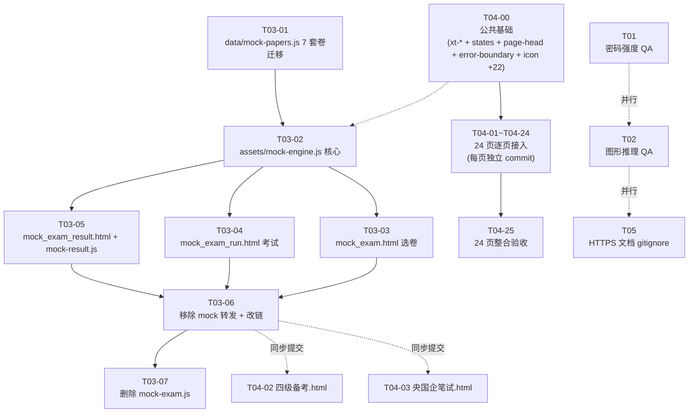

# 星途 · P0-B 重建增量架构设计 · 2026-09-12

> 作者：高见远（架构师）｜输入：许清楚《P0-B 重建增量 PRD》(§0~§10)、手册十二/十三/十四章、路线图 B0/B1/B2/T03 节、需求清单 §9(19)/§7(15)/§9(21)
> 边界：本文件只承接 PRD 「本批次要做/怎么做」落地为架构与任务分解；不改 PM 已拍板的 6 个决策（PRD §9.1~§9.6）；不写代码（代码是寇豆码的事）。
> 写作纪律：中文，可验证、可勾选、可追责；引用 PRD 用「§x」；路径全部绝对路径 `D:\下载的文件\学习工作台\`。
> 与 PRD 关系：PRD 是「做什么」，本文件是「怎么做」。

---

## Part A · 系统设计

### 1. 实现方案

#### 1.1 整体策略（5 个关键判断）

1. **T01/T02 不重写**：源码已 PASS 自测（PRD §2.2/§3.2），本批**只补 QA 脚本**。QA 跑通即可收口；任何代码改动视作越权。
2. **T03 必须整页重做**：弹窗版 `assets/mock-exam.js`（含 `.me-mask`/`.me-box`）整文件删除；新建**三独立页** `mock_exam.html` / `mock_exam_run.html` / `mock_exam_result.html`；新建 `assets/mock-engine.js`（`renderQuestion` 9 题型分发 + 计时器 + 答题卡 + 阶段进度 + 草稿持久化）。
3. **T04 必须从「图标替换」升档**：PRD §5.2 现状硬冲突已写明，光做图标 = 引入新分叉。本批**公共基础先行**（设计令牌 + 四状态组件 + 顶部结构 + 错误兜底 + 图标扩展），然后 24 页**逐页接入** + 逐页 commit（PRD §9.2 拍板）。
4. **T05 不入库**：PRD §7.6/§9.5，HTTPS 文档 `docs/HTTPS+APP跨端改造方案-2026-09-12.md` 工作区保留不入 git（加进 `.gitignore`）。
5. **状态机+数据双轨**：模考运行态走 `lsKey()` 持久化（PRD §6.1），UI 走 DOM 直更；恢复态进入时**只读**快照重建 DOM，**不重写**题库数据。

#### 1.2 T01 / T02（不重写 + QA 验证）

| 项 | T01 密码强度 | T02 图形推理题干 |
|---|---|---|
| QA 工具 | jsdom + 文件扫描（无 jsdom 依赖 = 自实现 fetch mock） | 复用现有 `tools/verify_q21_figures.js` + 增量字段自检 |
| 覆盖 AC | 1.1~1.7 共 7 项（PRD §2.3） | 2.1~2.5 共 5 项（PRD §3.3） |
| 验收节奏 | **AC 表逐条 PASS/FAIL 输出**；任一 FAIL = T01 不收口 | 同上；与 T01 并行 |
| 落点 | `tools/qa/qa_t01_password.js` | `tools/qa/qa_t02_figures.js` |
| 不做的事 | 不动 `登录.html` / `设置.html` / `server/schemas.py` | 不动 `assets/data/exam-bank.json` / `assets/app.js` loader |

QA 脚本设计要点：
- 节点 16 起 `node --check tools/qa/*.js` 必须 0 错（PRD §8.1 第 13 项）；
- T01 调用后端 curl stub，模拟前端注册 + 改密两条路径；
- T02 grep 禁词表用 `fs.readFileSync(...).toString().match(...)` 实现，不引入新依赖；
- 输出格式统一 `=== AC-x.x.x | <name> | PASS/FAIL | <备注> ===`，便于人类/机器解析。

#### 1.3 T03 真题模考引擎（🛑 整页重做）

**架构选择**：单一职责的 `assets/mock-engine.js` 作为状态机 + 渲染器核心；三个 HTML 页**不写业务逻辑**，只挂 DOM 容器 + 调 engine API。这样：
- 渲染逻辑可单测（QA 脚本能 jsdom 跑 `renderQuestion(q, state)` 拿 DOM）；
- 三页共用一份数据契约（`data-mock-papers.js` 挂 `window.MOCK_PAPERS_DATA`）；
- 计时器、答题卡、阶段进度都集中在一处，**禁再分叉**。

**核心难点与对策**：

| 难点 | 对策 |
|---|---|
| 倒计时刷新/断电不丢 | **基于 `Date.now()` 差值**计算剩余秒数（不存计时器计数）；`setInterval` 每 1s 仅触发重渲染；持久化字段 `startedAt + remainingSeconds`（PRD §4.3.2 AC-3.2.12） |
| 9 题型分发 | `renderQuestion(q, state, callbacks)` switch 9 个 case；每种题型一个独立渲染函数（`renderSingleChoice`...`renderFillBlank`）；**永远**有 `default → renderUnknown` 兜底（PRD §4.4） |
| 答题卡点击跳转 | DOM 用 `<button class="ac-item" data-qid="...">` + 事件委托；CSS 状态 class 三种：`.ac-unanswered` / `.ac-answered` / `.ac-current`（PRD §4.3.2 AC-3.2.4） |
| 阶段进度 pill | 顶部独立 `<div class="stage-pills">` 内 4 个 `.stage-pill`；状态 class：`.stage-active` / `.stage-done` / `.stage-pending`（PRD §4.3.2 AC-3.2.5） |
| 草稿持久化（每 5 秒） | 主观题 `input` / `textarea` 上挂 debounce 1000ms + 强制 flush 5s；用 `lsKey('study_workbench_mockexam_<paperId>_draft_<qid>')` 独立键；恢复时一次性回填 |
| 主观题不自动评分 | `engine.grade(q, answer)` 在 `scored=false`（essay/translation）路径**只返回 `{ scored: false, referenceAnswer, userAnswer }`**，UI 成绩页只展示用户答案 + 参考答案（PRD §4.3.3 AC-3.3.5 + §7.2 红线） |
| 移动端答题卡抽屉 | ≤768px 视口下 CSS media query 把 `.answer-card` 改为 `position:fixed; bottom:0; transform: translateY(...)` 抽屉式；展开按钮 ≥ 44×44px（PRD §4.3.2 AC-3.2.17） |
| 离页提示 | `window.addEventListener('beforeunload', ...)` 仅在 `status === 'running'` 时设 `returnValue`；切走/刷新均不阻断，仅提示（PRD §4.3.2 AC-3.2.18） |

**mock-engine.js 关键 API 签名**（PRD §4.4 + 引擎补充）：

```
window.MockEngine = {
  start(paperId): void                       // 进入考试态
  resume(paperId): void                      // 恢复未交卷态
  submit(auto?: boolean): Promise<runId>     // 交卷；auto=true 来自倒计时归零
  renderQuestion(q, state, callbacks): HTMLElement
  saveDraft(qid, value): void                // 主观题草稿持久化
  tick(): void                               // 每秒调一次：更新倒计时 + 答题卡 + pill
  state(): ExamState                         // 当前快照
}
window.MockResult = {                        // 成绩页独立渲染器
  render(paperId, runId): void
  bestCompare(paperId, currentRun): { best, delta }
}
```

**9 题型 schema**（PRD §4.4 + fill_blank 拍板 §9.6）：

| type | 必填字段 | 可选字段 | 渲染器骨架 |
|---|---|---|---|
| `single_choice` | `q, o[4], a` | `x`(解析) | `<button class="sc-op" data-i="N">A/B/C/D</button>` |
| `multiple_choice` | `q, o[], a[]` | `x` | `<button class="mc-op" data-i="N">...</button>`（多选 toggle） |
| `true_false` | `q, a:0\|1` | `x` | 两个大按钮「正确 / 错误」 |
| `reading` | `q, passage, subQ[]` | — | 左 50% 文章 + 右 50% 子题列表，子题可单选/多选/填空递归 |
| `cloze` | `passage, blanks[]` | `x` | 文章内嵌 `<select class="cloze-sel">`，下拉选项 |
| `essay` | `q, minWords` | `referenceAnswer` | `<textarea>` + 实时字数统计 + 5s 自动保存草稿 |
| `translation` | `cn, minWords` | `referenceAnswer` | 中文原文 + `<textarea>` + 字数统计 |
| `listening` | `q, o[], a, audioUrl` | `x` | `<audio controls>` + 选项按钮（音频本地路径或空） |
| `fill_blank` | `passage, blanks[]` | `x` | 文章内嵌 `{{i}}` 占位替换；`blanks[i].blankType='text'\|'select'` 决定 input/select |

**fill_blank schema 拍板（PRD §9.6 方案 C）**：

```
{
  "id": "cet-demo-fill-1",
  "type": "fill_blank",
  "stage": "reading",
  "q": "Read the passage and fill in the blanks.",
  "passage": "In {{1}} AD, the city of {{2}} became the capital of the {{3}} Empire.",
  "blanks": [
    { "index": 1, "blankType": "text", "answer": "330", "explanation": "..." },
    { "index": 2, "blankType": "select", "options": ["Rome", "Paris", "London"], "answer": 0 },
    { "index": 3, "blankType": "text", "answer": "Roman", "explanation": "..." }
  ],
  "scored": true
}
```

判分规则：`renderFillBlank` 把 `passage` 切分为 `[前文, 空1提示, 后文, 空2提示, ...]`，每个空按 `blankType` 渲染对应控件；提交时按 `blanks[i].answer` 比对。混合 text/select 共存。

#### 1.4 T04 24 页接入（公共基础 + 24 页逐页接入）

**公共基础架构（PRD §5.4）**：

| 模块 | 路径 | 输出 |
|---|---|---|
| 设计令牌 | `assets/common.css` 末尾追加 `:root { --xt-* }` | 30+ 个 CSS 变量（PRD §5.4 详列） |
| 按钮四级 | 同上 | `.xt-btn-primary/-secondary/-text/-danger` |
| 四状态组件 | 新增 `assets/states.css` | `.xt-skeleton` / `.xt-empty` / `.xt-error` / `.xt-toast` |
| 顶部结构 | 新增 `assets/page-head.css` | `.xt-page-head` + `.xt-subpage-header` |
| 错误兜底 | 新增 `assets/error-boundary.js` | `window.onerror` + `unhandledrejection` → `xtToast` + `console.error` |
| 图标扩展 | 修改 `assets/icon-map.js` | 字典补齐 22 个操作类（PRD §6.3） |

**6 步接入范式（PRD §5.5）**：每页必走 1) 设计令牌替换 → 2) 四状态接入 → 3) 保存反馈 → 4) 键盘可访问性 → 5) 顶部结构统一 → 6) mobile 自检。任一缺失 = 该页未接入。

**HTML 公共 head 引入顺序**（24 页统一）：

```
1. <meta> 标签
2. <link href="assets/common.css?v=20260912c">
3. <link href="assets/page-head.css?v=20260912c">
4. <link href="assets/states.css?v=20260912c">
5. <script src="assets/icon-map.js?v=20260912c" defer></script>
6. <script src="assets/error-boundary.js?v=20260912c" defer></script>
7. <script src="assets/app.js?v=20260912c" defer></script>   (按需)
8. <script src="data-xxx.js?v=20260912c" defer></script>     (按需)
9. <script src="assets/page-yyy.js?v=20260912c" defer></script>(按需)
```

`icon-map.js` 必须**早于**任何使用 `data-icon` 的页面脚本；`error-boundary.js` 必须**早于**业务脚本以捕获其异常。

**版本号 bump**（PRD §1）：现网 `20260912a` → 目标 `20260912c`。仅改真实 `<script src>` / `<link href>` 行；脚本自动化（架构师不写脚本，工程师实现）。

---

### 2. 文件清单（绝对路径 + 改动类型）

#### 2.1 T01 / T02（新增 QA 脚本）

```
[新] D:\下载的文件\学习工作台\tools\qa\qa_t01_password.js
[新] D:\下载的文件\学习工作台\tools\qa\qa_t02_figures.js
```

#### 2.2 T03 真题模考引擎

```
[新] D:\下载的文件\学习工作台\mock_exam.html                      (选卷页)
[新] D:\下载的文件\学习工作台\mock_exam_run.html                  (考试页)
[新] D:\下载的文件\学习工作台\mock_exam_result.html               (成绩页)
[新] D:\下载的文件\学习工作台\data\mock-papers.js                 (7 套卷数据，挂 window.MOCK_PAPERS_DATA)
[新] D:\下载的文件\学习工作台\assets\mock-engine.js               (状态机 + renderQuestion + 计时 + 答题卡 + 草稿)
[新] D:\下载的文件\学习工作台\assets\mock-result.js               (成绩页渲染 + 历史最佳对比)
[改] D:\下载的文件\学习工作台\assets\mini-cet.js                  (移除 cet-mock 键转发，保留 cet-guide)
[改] D:\下载的文件\学习工作台\assets\mini-exam.js                 (移除 exam-mock 键转发，保留 exam-guide)
[改] D:\下载的文件\学习工作台\assets\mini.js                      (begin() 不再转 mock-exam，改 location.href 跳独立页)
[改] D:\下载的文件\学习工作台\assets\common.css                   (新增 .mock-* .answer-card .stage-pill .confirm-mask)
[改] D:\下载的文件\学习工作台\四级备考.html                       (真题模考卡 onClick 改跳 mock_exam.html?cat=cet-mock，移除 mock-exam.js script)
[改] D:\下载的文件\学习工作台\央国企笔试.html                     (同上，跳 ?cat=exam-mock)
[删] D:\下载的文件\学习工作台\assets\mock-exam.js                 (整文件删除；QA 脚本加白名单)
```

#### 2.3 T04 24 页接入（公共基础 + 24 页逐页接入）

```
[新] D:\下载的文件\学习工作台\assets\states.css                   (四状态组件)
[新] D:\下载的文件\学习工作台\assets\page-head.css                (顶部结构 + 面包屑)
[新] D:\下载的文件\学习工作台\assets\error-boundary.js            (全局错误兜底)

[改] D:\下载的文件\学习工作台\assets\common.css                   (设计令牌 :root{--xt-*} + 按钮四级 + .xt-toast)
[改] D:\下载的文件\学习工作台\assets\icon-map.js                  (字典补齐 22 个操作类图标)

[改] 24 页 HTML（每页独立 commit，T04-01~T04-24）：
  T04-01 学习工作台.html
  T04-02 四级备考.html         (与 T03 改链同步)
  T04-03 央国企笔试.html       (与 T03 改链同步)
  T04-04 高情商表达.html
  T04-05 商务礼仪.html
  T04-06 商务礼仪面试.html
  T04-07 PPT训练.html
  T04-08 PPT案例拆解.html
  T04-09 PPT版式库.html
  T04-10 万能金句库.html
  T04-11 场景话术库.html
  T04-12 学习博客.html
  T04-13 错题本.html
  T04-14 面试题库.html
  T04-15 行测刷题.html
  T04-16 四级词汇.html
  T04-17 工具.html
  T04-18 更多.html
  T04-19 设置.html
  T04-20 个人中心.html
  T04-21 私聊.html
  T04-22 动态.html
  T04-23 blog_wechat.html
  T04-24 登录.html            (无侧栏，独立页)
```

#### 2.4 T05 文档卫生

```
[改] D:\下载的文件\学习工作台\.gitignore                         (若未含则追加 docs/HTTPS+APP跨端改造方案-2026-09-12.md)
```

---

### 3. 数据结构与接口（classDiagram）

> 完整 class 图见 `docs/class-diagram.mermaid`。本节说明关键类与关系。

#### 3.1 模考引擎核心类（assets/mock-engine.js）

```
class MockEngine {
  - paper: Paper
  - state: ExamState
  - timerHandle: number | null
  - drafts: Map<qid, string>
  + start(paperId): void
  + resume(paperId): void
  + submit(auto?: boolean): Promise<runId>
  + tick(): void
  + state(): ExamState
  + saveDraft(qid, value): void
  + loadDrafts(): void
  - persist(): void
  - restore(): ExamState | null
  - gradeObjective(q, answer): { correct: boolean, explanation: string }
}

class RenderDispatch {
  + renderQuestion(q: Question, state: RenderState, callbacks: RenderCallbacks): HTMLElement
  - renderSingleChoice(q, state, cb): HTMLElement
  - renderMultipleChoice(q, state, cb): HTMLElement
  - renderTrueFalse(q, state, cb): HTMLElement
  - renderReading(q, state, cb): HTMLElement
  - renderCloze(q, state, cb): HTMLElement
  - renderEssay(q, state, cb): HTMLElement
  - renderTranslation(q, state, cb): HTMLElement
  - renderListening(q, state, cb): HTMLElement
  - renderFillBlank(q, state, cb): HTMLElement
  - renderUnknown(q, state, cb): HTMLElement
}

class AnswerCard {
  - groups: Map<stage, qid[]>
  + render(): HTMLElement
  + updateAnswered(qid, answered): void
  + setCurrent(qid): void
  + bindJump(cb: (qid) => void): void
}

class StageProgress {
  - stages: string[]
  - current: string
  + render(): HTMLElement
  + tick(): void
}

class Timer {
  - startedAt: number
  - remainingSec: number
  - totalSec: number
  + start(): void
  + pause(): void
  + reset(seconds): void
  + tick(): void
  + isExpired(): boolean
  + snapshot(): { startedAt, remainingSec, totalSec }
  + restore(snap): void
}

MockEngine --> RenderDispatch : 调用
MockEngine --> AnswerCard : 持有
MockEngine --> StageProgress : 持有
MockEngine --> Timer : 持有
```

#### 3.2 数据契约

**`data/mock-papers.js` 顶层结构**（PRD §4.3.4 + 本批扩展）：

```
window.MOCK_PAPERS_DATA = {
  cet4: {
    title: string,
    defaultMinutes: 125,
    stages: ["writing","listening","reading","translation"],
    papers: Paper[]
  },
  exam: { ... }    // 央国企同样结构
}
```

**`Paper` 类**：

```
class Paper {
  id: string                       // 唯一，如 "cet-demo-1"
  title: string                    // 显示用
  year: number | null              // 真题年份；占位 = null
  source: string | null            // 来源；占位 = "来源待核"
  difficulty: "易"|"中"|"难"
  minutes: number                  // 总时长（分钟）
  stageMinutes?: { writing?, listening?, reading?, translation? }
  questions: Question[]
  audioBase?: string               // 听力音频相对路径前缀
}
```

**`Question` 类**（按 type 分发）：

```
class Question {
  id: string
  type: "single_choice"|"multiple_choice"|"true_false"|"reading"|"cloze"|"essay"|"translation"|"listening"|"fill_blank"
  stage: "writing"|"listening"|"reading"|"translation"
  q: string                        // 题干
  // —— 以下按 type 选填 ——
  o?: string[]                     // single/multiple/listening 选项
  a?: number | number[] | boolean  // 正确答案
  x?: string                       // 客观题解析
  audioUrl?: string | null         // listening 专用
  referenceAnswer?: string | null  // essay/translation 参考答案
  scored?: boolean                 // false = 主观题，不自动评分
  // reading/子题专用
  passage?: string
  subQ?: Question[]
  // cloze/fill_blank 专用
  blanks?: Blank[]                 // fill_blank 用，cloze 可省 answer
  minWords?: number                // essay/translation
  cn?: string                      // translation 中文原文
}

class Blank {
  index: number
  blankType: "text"|"select"
  options?: string[]               // select 专用
  answer: string | number
  explanation?: string
}
```

#### 3.3 状态与持久化（ExamState）

```
class ExamState {
  paperId: string
  status: "idle"|"running"|"submitted"|"result"
  startedAt: number                // Date.now() ms
  totalSeconds: number
  remainingSeconds: number
  stageBreakdown?: {
    writing?: { totalSec, remainingSec }
    listening?: { totalSec, remainingSec }
    reading?: { totalSec, remainingSec }
    translation?: { totalSec, remainingSec }
  }
  currentQid: string
  answers: { [qid: string]: any }  // 单选=index，多选=index[]，判断=0/1，文本=string
  submittedAt?: number
  runId?: string                   // UUID，submitted 后生成
}
```

**localStorage 键（PRD §6.1）**：

| 键模式 | 写入时机 | 读取时机 |
|---|---|---|
| `lsKey('study_workbench_mockexam_<paperId>_state')` | 每次 tick + 答题 | 进入考试页 + 刷新 |
| `lsKey('study_workbench_mockexam_<paperId>_draft_<qid>')` | 主观题 5s flush | 进入考试页回填 |
| `lsKey('study_workbench_mockexam_<paperId>_runs')` | 交卷后追加 | 成绩页 + 选卷页历史最佳 |

实际写入 = `<用户名>_study_workbench_mockexam_<paperId>_state`（`app.js` 第 15 行已实现 `lsKey`）。

#### 3.4 全局工具接口

**`window.xtToast(state, msg, opts?)`**（PRD §5.4 + §6.4）：

```
function xtToast(state: "success"|"error"|"warning"|"info",
                 msg: string,
                 opts?: { duration?: number /* 默认 1600ms */ })
                  : void
```

实现要点：复用 `assets/common.css` 内 `.xt-toast` 样式；同一时刻最多 1 条（防堆叠）；DOM 内**追加**到 `<body>` 末，1.6s 自动移除。

**`window.errorBoundary`**（PRD §5.4 + §6.5）：

```
window.errorBoundary = {
  init(): void        // 脚本加载时自调，绑 onerror + onhandledrejection
  report(err, src?): void  // 手动上报
}
```

行为：`onerror` / `unhandledrejection` 触发 → `console.error` 必走 + `xtToast('error', '页面出了一点问题，已记录')` 软反馈；**不阻断** UI；生产模式可关 toast（`window.__XT_PROD__=true` 时仅 console）。

**`window.lucideIcon(name, size)`**：已存在（`assets/icon-map.js` 第 9 行），本批扩展字典 22 个 key。

**`window.lsKey(name)`**：已存在（`assets/app.js` 第 15 行），本批**只调用**。

---

### 4. 时序图（Program Call Flow）

> 完整时序图见 `docs/sequence-diagram.mermaid`。本节展示关键流程。

#### 4.1 考试主流程（选卷 → 启动 → 答题 → 交卷 → 成绩）

```
用户                 mock_exam.html       MockEngine       data-mock-papers.js    localStorage         mock_exam_result.html
 │                       │                   │                   │                    │                       │
 │ 点「真题模考」卡片      │                   │                   │                    │                       │
 │──────────────────────>│                   │                   │                    │                       │
 │                       │ 加载 window.MOCK_PAPERS_DATA             │                    │                       │
 │                       │────────────────────────────────────────>│                    │                       │
 │                       │                   │                   │                    │                       │
 │                       │ 渲染选卷列表        │                   │                    │                       │
 │                       │ 读 _runs 找历史最佳 │                   │                    │                       │
 │                       │───────────────────────────────────────────────────────>│                       │
 │ 点「开始考试」          │                   │                   │                    │                       │
 │──────────────────────>│ location.href      │                   │                    │                       │
 │                       │ =mock_exam_run.html?paper=cet-demo-1     │                    │                       │
 │                       │                   │                   │                    │                       │
 │ 加载 mock_exam_run.html                  │                   │                    │                       │
 │──────────────────────────────────────────────────────>       │                   │                       │
 │                       │ start(paperId)    │                   │                    │                       │
 │                       │──────────────────>│ 读 _state         │                    │                       │
 │                       │                   │─────────────────────────────────────>│                       │
 │                       │                   │ 恢复 / 新建 ExamState                  │                       │
 │                       │                   │ renderQuestion(q, state, cb)           │                       │
 │                       │<──────────────────│                   │                    │                       │
 │ 答题循环               │                   │                   │                    │                       │
 │ 点击选项 ──────────>  │ onAnswer(qid, val)│                   │                    │                       │
 │                       │──────────────────>│ persist(state)    │                    │                       │
 │                       │                   │─────────────────────────────────────>│                       │
 │ 主观题输入 ──────────>│ debounce 1s + flush 5s                   │                    │                       │
 │                       │──────────────────>│ saveDraft(qid, v) │                    │                       │
 │                       │                   │─────────────────────────────────────>│                       │
 │ tick 每 1s            │                   │                   │                    │                       │
 │                       │──────────────────>│ 倒计时更新 + 答题卡更新 + pill 更新  │                       │
 │ 点「交卷」 ──────────>│ submit(false)     │                   │                    │                       │
 │                       │──────────────────>│ 未答 N > 0 ?      │                    │                       │
 │                       │                   │ 弹 .confirm-mask  │                    │                       │
 │ 确认交卷 ──────────>  │ submit(true)      │                   │                    │                       │
 │                       │──────────────────>│ gradeObjective 跑所有客观题           │                       │
 │                       │                   │ 组装 run 写入 _runs                  │                       │
 │                       │                   │─────────────────────────────────────>│                       │
 │                       │                   │ 删 _state（防恢复 stale）             │                       │
 │                       │ location.href=mock_exam_result.html?paper=&run=         │                       │
 │                       │──────────────────────────────────────────────────────────────────────────────────────>│
 │                       │                   │                   │                   │                       │
 │                       │                   │                   │                   │ MockResult.render(paperId, runId)
 │                       │                   │                   │                   │<──────────────────────│
 │                       │                   │                   │                   │ 读 _runs → 当前 run + best
 │                       │                   │                   │                   │<──────────────────────│
 │                       │                   │                   │                   │ 渲染总分 + 解析 + 参考答案
```

#### 4.2 状态机切换

```
        ┌────────┐  start()  ┌─────────┐  submit()  ┌───────────┐  render() ┌────────┐
        │  idle  │──────────>│ running │──────────>│ submitted │──────────>│ result │
        └────────┘           └─────────┘           └───────────┘           └────────┘
            ▲                     │                     │
            │                     │ 倒计时归零            │ 再次挑战
            │                     ▼ (auto submit)        │
            │                 ┌─────────┐                │
            └─────────────────│ running │<───────────────┘
                              └─────────┘  (刷新/返回)
                                  ▲
                                  │ restore(_state) 进入考试页
```

关键不变量：
- `running → submitted`：**单向**；不允许直接 `idle → submitted`（必须先 start）；
- `result → running`：经「再次挑战」按钮新建 runId，**不读**旧 _state；
- 刷新/返回：`running` 态自动 restore；`submitted/result` 态强制跳对应页（防止再来一次）。

#### 4.3 数据流总览

```
数据源：data-mock-papers.js (挂 window.MOCK_PAPERS_DATA)
        │
        ▼
   MockEngine.start(paperId)        ◄──── lsKey('..._state') 恢复
        │
        ├──> Timer.tick() ─────────> 倒计时 DOM 更新
        ├──> AnswerCard.update() ──> 答题卡 DOM 更新
        ├──> StageProgress.tick() ─> 阶段 pill 更新
        │
        ▼
   renderQuestion(q, state, cb) ──> 题型渲染器 ──> DOM 节点
        │
        ▼
   用户答题 ──> onAnswer(qid, val) ──> ExamState.answers[qid] = val
        │                                    │
        │                                    ▼
        │                            persist() ──> lsKey('..._state')
        │
        ├──> 主观题 ──> debounce ──> saveDraft(qid, v) ──> lsKey('..._draft_<qid>')
        │
        ▼
   submit() ──> gradeObjective() ──> run object ──> lsKey('..._runs').push(run)
                                          │
                                          ▼
                                   MockResult.render() ──> 成绩页 DOM
                                          │
                                          ▼
                                   bestCompare() ──> 历史最佳对比
```

---

### 5. 待明确事项

| # | 项 | 状态 | 处理 |
|---|---|---|---|
| 5.1 | 真题版权（PRD §9.3 拍板 A） | 拍板 = 先小批量 1-2 套 + 标「来源待核」 | 数据 schema 已留 `source: null` 占位；本批 7 套卷中至少 2 套标 `source: "来源待核"`、`year: null` |
| 5.2 | fill_blank 形态（PRD §9.6 拍板 C） | 架构师定 schema | §1.3 / §3.2 已落地：`blankType: 'text'\|'select'` + `passage` 内 `{{i}}` 占位 |
| 5.3 | 设计令牌命名空间（PRD §9.4 拍板 A） | 拍板 = `xt-` | §3.3 / §1.4 已用 `--xt-*` + `.xt-*` class；与既有 `.mpc-icon` 不冲突 |
| 5.4 | 倒计时归零自动交卷（PRD §4.3.2 AC-3.2.13） | 拍板 = 自动 `submitExam(true)` | §4.1 时序已含分支 |
| 5.5 | 9 题型最小示例题（PRD §4.3.4 注） | 拍板 = 每种至少 1 题真实示例 | 数据迁移时同步落地；缺数据项列「待更新数据清单」 |
| 5.6 | 主观题是否显示参考答案（PRD §4.3.3 AC-3.3.5） | 拍板 = 显示用户答案 + 参考答案，不显示自动分 | §3.3 ExamState.scored + §3.1 gradeObjective 已处理 |
| 5.7 | T05 HTTPS 文档（PRD §9.5 拍板 B） | 拍板 = 工作区保留不入 git | 任务列表 T05：.gitignore 追加 + 「已撤回」清单 |
| 5.8 | 真题模考卡入口（PRD §9.1 拍板 A） | 拍板 = 保留卡片（改链接） | T03-06 + T04-02/T04-03 同步处理 |
| 5.9 | 24 页逐页 commit（PRD §9.2 拍板 A） | 拍板 = 逐页 commit | T04-01~T04-24 子任务编号已对应 |
| 5.10 | QA 工具链 | **新**：jsdom 引入与否？ | 建议**不引入**（PRD §8 用 node --check + 文件扫描即可）；如未来需 DOM 模拟再评估 |

---

## Part B · 任务分解

### 6. 依赖包

- **前端**：**零新增**（原生 JS + 原生 CSS，沿用手册 §17 + PRD §1）
- **后端**：**零新增**（需求 22 密码强度、需求 21 图形推理已落 `server/schemas.py`，不重写）
- **工具链**：
  - `node --check`：全仓 `.js` 语法校验（PRD §8.1 第 13 项）
  - jsdom：**不引入**（架构师建议保持零依赖；QA 脚本用 `fs` + 正则 + mock 实现）
  - `tools/verify_p0b_all.js`：复用既有 42/42 PASS 自测
- **图标**：内联 SVG，**零 CDN**（PRD §6.3 + 手册 §11）

---

### 7. 任务列表（按依赖顺序）

> 顶层任务 = 5 个（T01/T02/T03/T04/T05），每个含子任务编号。**符合「≤5 顶层任务」硬上限。**
> 任务 ID 命名：T01 / T02 / T03-0X / T04-0X / T05（与 PM 已用同款）。
> 优先级：P0 = 阻塞本批上线；P1 = 重要；P2 = 锦上添花。

#### T01 · 密码强度 QA（不重写 + 复测）

- **Task ID**：T01
- **Source Files**：
  - [新] `D:\下载的文件\学习工作台\tools\qa\qa_t01_password.js`
- **子任务**：
  - T01-01：写 `qa_t01_password.js`，jsdom stub + 文件扫描，遍历 AC-1.1~AC-1.7（PRD §2.3）共 7 项
- **Dependencies**：无（独立）
- **Priority**：P0
- **串/并行**：与 T02 并行
- **交付**：QA 报告 7 项 PASS/FAIL（任一 FAIL = T01 不收口）

#### T02 · 图形推理题干 QA（不重写 + 复测）

- **Task ID**：T02
- **Source Files**：
  - [新] `D:\下载的文件\学习工作台\tools\qa\qa_t02_figures.js`
- **子任务**：
  - T02-01：复跑 `verify_q21_figures.js` 禁词表 + AC-2.1~AC-2.5 自检（PRD §3.3）
- **Dependencies**：无
- **Priority**：P0
- **串/并行**：与 T01 并行
- **交付**：QA 报告 5 项 PASS/FAIL

#### T03 · 真题模考引擎（🛑 整页重做）

- **Task ID**：T03
- **Source Files**（聚合）：
  - [新] `mock_exam.html` / `mock_exam_run.html` / `mock_exam_result.html`
  - [新] `data/mock-papers.js`
  - [新] `assets/mock-engine.js`
  - [新] `assets/mock-result.js`
  - [改] `assets/mini-cet.js` / `assets/mini-exam.js` / `assets/mini.js`
  - [改] `assets/common.css`
  - [改] `四级备考.html` / `央国企笔试.html`
  - [删] `assets/mock-exam.js`
- **子任务**：
  - **T03-01**：迁移 `assets/mock-exam.js` 中 7 套卷数据到 `data/mock-papers.js`，补字段 `type / stage / source / year / scored / audioUrl / referenceAnswer / blanks / passage`，每种 type 至少 1 道示例题；`source: "来源待核"` 标至少 2 套（PRD §4.3.4）
  - **T03-02**：写 `assets/mock-engine.js`（状态机 + `renderQuestion` 9 题型 + Timer + AnswerCard + StageProgress + 草稿持久化；§1.3 / §3.1 / §3.3 详）
  - **T03-03**：写 `mock_exam.html`（选卷页，§4.1 时序入口）
  - **T03-04**：写 `mock_exam_run.html`（考试页，挂 engine.start() + DOM 容器）
  - **T03-05**：写 `mock_exam_result.html` + `assets/mock-result.js`（成绩页 + 历史最佳）
  - **T03-06**：`mini.js` / `mini-cet.js` / `mini-exam.js` 移除 mock 转发 + `四级备考.html` / `央国企笔试.html` 改链跳独立页
  - **T03-07**：删除 `assets/mock-exam.js` 整文件 + QA 白名单更新
- **Dependencies**：T04-00（公共基础）不阻塞 T03；但 T03-06 与 T04-02 / T04-03 须**同时提交**避免冲突
- **Priority**：P0
- **串/并行**：
  - T03-01 → T03-02 → (T03-03 ∥ T03-04 ∥ T03-05) → T03-06 → T03-07
  - T03-03/T03-04/T03-05 可并行（各自独立 HTML）
- **交付**：AC-3.1.1~3.3.8 全部 PASS（PRD §4.3）

#### T04 · 24 页接入（公共基础 + 24 页逐页接入）

- **Task ID**：T04
- **Source Files**（聚合）：
  - [新] `assets/states.css` / `assets/page-head.css` / `assets/error-boundary.js`
  - [改] `assets/common.css` / `assets/icon-map.js`
  - [改] 24 页 HTML（每页独立 commit，T04-01~T04-24）
- **子任务**：
  - **T04-00**：公共基础（**关键路径**，必须最早完成）
    - `assets/common.css` 追加 `:root { --xt-* }` 30+ 变量 + 按钮四级 + `.xt-toast`
    - `assets/icon-map.js` 字典补齐 22 个操作类（PRD §6.3）
    - 新增 `assets/states.css`（`.xt-skeleton` / `.xt-empty` / `.xt-error`）
    - 新增 `assets/page-head.css`（`.xt-page-head` / `.xt-subpage-header`）
    - 新增 `assets/error-boundary.js`（`window.onerror` + `unhandledrejection` → `xtToast` + `console.error`）
    - 实现 `window.xtToast(state, msg, opts?)`（PRD §5.4）
    - 实现 `window.errorBoundary.init() / report()`（PRD §6.5）
  - **T04-01~T04-24**：24 页逐页接入（每页独立 commit，互不阻塞）
    - 每页走 6 步范式：① 设计令牌替换 ② 四状态接入 ③ 保存反馈 ④ 键盘可访问性 ⑤ 顶部结构统一 ⑥ mobile 自检（PRD §5.5）
  - **T04-25**：24 页整合验收
    - 全仓 grep 验证：零 emoji 功能图标、零 `font-size:\s*\d+px` 硬编码、零 `me-mask/dialog/modal` 弹窗、零裸 `localStorage` 键
    - DevTools iPhone 12 / Pixel 5 两档视口手动过 24 页
- **Dependencies**：T04-00 是关键路径；T04-01~T04-24 仅依赖 T04-00 + 自身
- **Priority**：P0
- **串/并行**：
  - T04-00 必先
  - T04-01~T04-24 **可并行**（每页独立 commit）
  - T04-25 必须最后
  - T03 与 T04-01~T04-24 **可并行**（仅 T03-06 与 T04-02/T04-03 须同步）
- **交付**：24 页 × 6 步 = 144 个勾 + AC-4.1~AC-4.7 全部 PASS（PRD §5.6）

#### T05 · 文档卫生（HTTPS 文档不入库）

- **Task ID**：T05
- **Source Files**：
  - [改] `D:\下载的文件\学习工作台\.gitignore`
- **子任务**：
  - T05-01：检查 `.gitignore` 是否含 `docs/HTTPS+APP跨端改造方案-2026-09-12.md`；未含则追加；维护一份 `docs/WITHDRAWN.md` 列出「已撤回」清单
- **Dependencies**：无
- **Priority**：P2（合规即可，不阻塞上线）
- **串/并行**：与 T01/T02 并行
- **交付**：`.gitignore` 验证 + `WITHDRAWN.md` 一条记录

---

### 8. 共享知识（跨文件约定）

> 工程师实现时**必读**，避免重写或绕开既有约定。

#### 8.1 `lsKey()` 用法（不重写，只调用）

- 来源：`assets/app.js` 第 15-16 行 `function lsKey(name) { ... }` + `window.lsKey = lsKey;`
- 调用：`localStorage.getItem(window.lsKey('study_workbench_mockexam_<paperId>_state'))`
- 实际键：`<CURRENT_ACCOUNT>_study_workbench_mockexam_<paperId>_state`
- **禁**：裸键 `localStorage.getItem('study_workbench_xxx')`、自创 `getKey()` 别名（PRD §6.1）

#### 8.2 `data-*.js` IIFE 模板（不 fetch，挂 window）

- 来源：PRD §6.2
- 模板（伪代码）：
  ```
  (function () {
    'use strict';
    if (window.MOCK_PAPERS_DATA) return;       // 防重复注入
    window.MOCK_PAPERS_DATA = { /* ... */ };
  })();
  ```
- **禁**：`<script type="application/json">`、`fetch('data/*.json')`（`file://` CORS）、数据写进 HTML

#### 8.3 `icon-map.js` `lucideIcon()` 规范

- 来源：PRD §6.3
- HTML 调用（自动扫描）：`<span class="nav-icon" data-icon="play" data-icon-size="20"></span>`
- JS 动态调用：`element.innerHTML = window.lucideIcon('clock', 24);`
- 字典补齐（22 个）：`play / pause / check / close / arrow-left / clock / edit / delete / search / plus / star / fire / trophy / headphones / pen / mic / languages / chart / settings / logout / locked / done / in-progress`
- **禁**：手写 `<svg>`、emoji 功能图标、另建 `js/icons.js`（PRD §7.9 / §7.11）

#### 8.4 `xtToast()` 调用规范

- 接口：`window.xtToast(state, msg, opts?)`
- 调用场景：保存成功、加载失败、保存草稿、错误兜底
- **禁**：`alert()` / `confirm()` 大弹窗（PRD §7.12）

#### 8.5 `errorBoundary` 自动挂载

- 接口：`window.errorBoundary.init()` 在脚本加载时**自调**，绑定 `window.onerror` + `onunhandledrejection`
- 行为：console.error + xtToast（dev）/ console-only（prod）
- **不阻断**学习流（PRD §6.5）

#### 8.6 HTML 公共 head 引入顺序

> 24 页必须**统一**该顺序，违者 QA 不过。

```
1. <meta charset> + <meta viewport>
2. <title>
3. <link href="assets/common.css?v=20260912c">           (1) 设计令牌 / 按钮 / .xt-toast
4. <link href="assets/page-head.css?v=20260912c">         (2) 顶部结构 / 面包屑
5. <link href="assets/states.css?v=20260912c">            (3) 四状态组件
6. <script src="assets/icon-map.js?v=20260912c" defer></script>   (4) 图标字典 + 自动扫描
7. <script src="assets/error-boundary.js?v=20260912c" defer></script>  (5) 错误兜底
8. <script src="assets/app.js?v=20260912c" defer></script>           (6) lsKey / 通用工具（按需）
9. <script src="data-xxx.js?v=20260912c" defer></script>             (7) 页面数据（按需）
10. <script src="assets/page-yyy.js?v=20260912c" defer></script>     (8) 页面逻辑（按需）
```

`icon-map.js` 必须**早于**任何使用 `data-icon` 的页面脚本；`error-boundary.js` 必须**早于**业务脚本以捕获其异常。

#### 8.7 版本号 bump

- 现网：`20260912a` → 目标：`20260912c`（PRD §1）
- 仅改真实 `<script src>` / `<link href>` 行的 `?v=` 参数
- 工具：脚本自动化（架构师不写脚本，工程师实现 grep + sed）

#### 8.8 `renderQuestion` 统一签名（PRD §4.4 + 本批强化）

- 签名：`renderQuestion(q: Question, state: RenderState, callbacks: RenderCallbacks): HTMLElement`
- `RenderState`：`{ value: any, disabled: boolean, isCurrent: boolean, isAnswered: boolean }`
- `RenderCallbacks`：`{ onAnswer: (qid, value) => void, onNext?: () => void, onPrev?: () => void }`
- **禁**：渲染函数内直接读 `localStorage`、直接调全局（保证可测性）

#### 8.9 主观题判分契约

- 接口：`engine.gradeObjective(q, answer): { correct: boolean, explanation?: string }`
- 主观题路径：`scored === false` 时**不调** `gradeObjective`；成绩页只展示 `userAnswer` + `referenceAnswer`
- **禁**：主观题自动评分代码路径存在（PRD §7.2 / §8.1 第 11 项红线）

---

### 9. 任务依赖图



**关键路径**：`T04-00 → (T0401~T0424 并行) → T04-25`
**次关键路径**：`T03-01 → T03-02 → (T03-03 ∥ T03-04 ∥ T03-05) → T03-06 → T03-07`
**冲突点**：`T03-06` 与 `T04-02 / T04-03` 改的是同一文件，**必须同步提交**（建议工程师用同一 commit 或两 commit 紧邻 + 二次验证）。

---

### 10. 风险与红线（与 PRD §7 对齐 + 额外补充）

#### 10.1 PRD §7 既定红线（重申）

| # | 红线 | 触发 = 后果 |
|---|---|---|
| 7.1 | 学习功能用弹窗 / 模态框承载 | 整页回滚 |
| 7.2 | 主观题自动评分 | 整引擎回滚 |
| 7.3 | 企业笔试经验编造来源 | 数据回滚 |
| 7.4 | 把任意学习选择题混进客观题模板 | 该模块回滚 |
| 7.5 | `assets/mock-exam.js` 弹窗层继续打补丁 | 整文件删除 + 退回方案 |
| 7.6 | HTTPS 文档入库 | 该 commit 撤回 |
| 7.7 | localStorage 裸键（无 lsKey 前缀） | 该 commit 不允许提交 |
| 7.8 | fetch `data/*.json` | 该文件回滚 |
| 7.9 | 新建 `js/icons.js` 双轨 | 该文件删除 |
| 7.10 | 页面内硬编码颜色/字号/圆角/阴影/间距 | 该页不验收 |
| 7.11 | emoji 功能图标 | 该页不验收 |
| 7.12 | 大弹窗阻断学习流 | 该功能不验收 |
| 7.13 | 凭据入库（密码/JWT/API Key） | 紧急回滚 + 轮换密钥 |
| 7.14 | 单文件多处样式分叉 | 该文件重构 |

#### 10.2 本批额外补充红线

| # | 红线 | 触发 = 后果 |
|---|---|---|
| 10.2.1 | 倒计时刷新/断电丢秒数（用 `setInterval` 计数而非 `Date.now()` 差值） | 该考试页不验收 |
| 10.2.2 | 主观题草稿未持久化（5s flush + 恢复时回填） | 该题型不验收 |
| 10.2.3 | 答题卡无分组（按 stage）或无状态 class | 考试页不验收 |
| 10.2.4 | `renderQuestion` 内直接读 `localStorage` / 调全局（违反可测性契约） | 该渲染器重写 |
| 10.2.5 | 24 页 head 引入顺序乱序（`icon-map.js` 晚于 `data-icon` 元素） | 图标全丢，该页不验收 |
| 10.2.6 | `errorBoundary` 阻断 UI（白屏 / 大模态） | 该脚本重写 |
| 10.2.7 | 移动端答题卡未折叠为底部抽屉（≤768px 视口） | AC-3.2.17 FAIL |
| 10.2.8 | 9 题型某一种缺真实示例题 | 数据收口时打回（PRD §4.3.4 注） |
| 10.2.9 | 移动端按钮触控 < 44×44px 或字体 < 12px | AC-4.5 FAIL |
| 10.2.10 | 阶段进度 pill 缺勾选 / 当前态 / 完成态三种 class | AC-3.2.5 FAIL |

#### 10.3 风险点（需主理人知晓）

1. **T03-06 与 T04-02 / T04-03 同文件冲突**：建议提交顺序 = T04-00 → T04-02 → T04-03 → T03-06；或 T03-06 + T04-02/T04-03 合并为同一 commit。
2. **真实真题来源**：本批先用占位 + `source: "来源待核"`；P1 阶段再做人工校对（PRD §9.3 拍板）。
3. **24 页逐页 commit 数量**：共 24 个 commit 节点 + 公共基础 5 个 + T03 共 7 个 + QA 2 个 = **38 个 commit**。工程师需在 git 历史中保留清晰边界，便于回滚任一页。
4. **移动端验证**：iPhone 12 / Pixel 5 两档视口需工程师**手动过一遍 24 页**（无自动化）；建议工程师录屏或截图为证。
5. **`assets/icon-map.js` 字典扩展 22 个**：图标路径必须来自 lucide.dev 官方 MIT 协议 SVG（PRD §6.3 + 手册 §11）；不允许自创 / 截图替代。

---

### 11. 一句话 TL;DR（架构师版）

**T01/T02 只跑 QA；T03 整页重做弹窗→三独立页 + 9 题型 + Timer 用 Date.now() 差值 + 答题卡三状态 + 草稿 5s flush + 主观题零自动评分；T04 公共基础先行（xt- 设计令牌 + states/page-head/error-boundary + icon +22），24 页走 6 步范式逐页独立 commit；任何弹窗 / 主观题自动评 / 裸 localStorage 键 / emoji 功能图标 = 不允许上线。**

---

### 12. 我认为最关键的 1-2 个技术决策（提交评审用）

#### 决策 A · Timer 用 `Date.now()` 差值而非计数（关键）

- **理由**：浏览器后台标签页 `setInterval` 会被节流到 ≥1Hz；用户切走再回来，若用 naive `remaining--` 计数会**直接丢数十分钟**；用 `Date.now()` 差值计算 `remaining = totalSeconds - Math.floor((Date.now() - startedAt) / 1000)`，**任意时刻 refresh / 后台返回都能算出准确值**，与 PRD §4.3.2 AC-3.2.12「刷新不丢」强对齐。
- **代价**：每次 `tick()` 多一次 `Date.now()` 调用（性能可忽略）；持久化字段从 1 个变 2 个（`startedAt + totalSeconds`，剩余秒数 = 实时计算）。
- **风险**：时钟跳变（NTP 校时 / 用户改系统时间）会引入误差；建议 `tick` 时同时把 `startedAt` 重新基线化为 `Date.now() - (totalSeconds - remainingSeconds) * 1000`，**仅在用户主动操作（答题 / 切题）时刷新**。

#### 决策 B · `renderQuestion(q, state, callbacks)` 显式 state+callbacks 注入（关键）

- **理由**：渲染函数**只接参数、不读全局 / localStorage** → jsdom 单测可独立跑 9 个题型 → 满足 PRD §4.4「禁在渲染函数内直接读 localStorage」+ 手册第十四条第 3 项「9 题型 `renderQuestion()` 单测」；callback 注入 `onAnswer` 让外部 MockEngine 统一管理 state.answers 持久化。
- **代价**：每种题型都要补 `state.isCurrent / isAnswered` 判断（多写 1 行）；但单元测试可独立 mock callback 验证 DOM 结构。
- **风险**：开发惯性可能在某题型偷懒直接 `localStorage.setItem(...)`；QA 脚本需 grep `assets/mock-engine.js` 各 `render*` 函数体内**零** `localStorage` 调用。

---

*文档结束。架构设计不替代实现；工程师寇豆码基于本文件 + PRD 落地 T01~T05。如有歧义，架构师优先按 PRD §9 拍板决策；如需推翻，请主理人显式回复。*