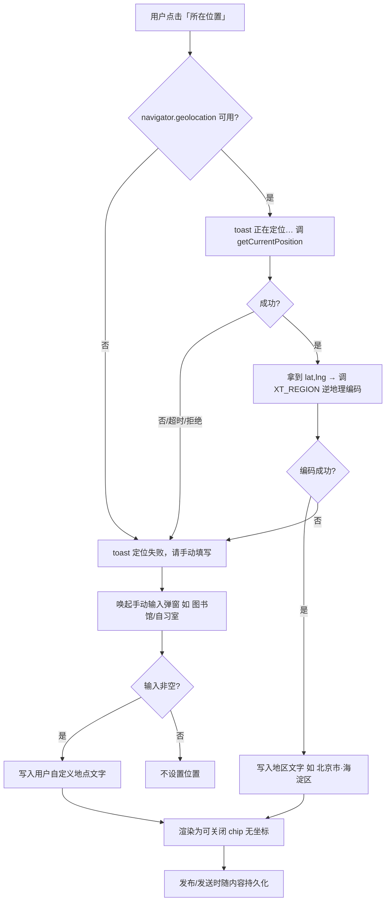
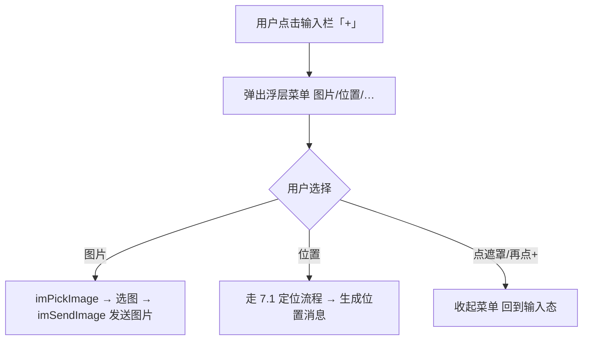
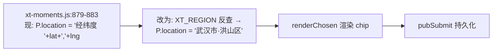

# PRD · R88-H 位置定位能力 + R88-I 私聊加号菜单

> 文档类型：增量 PRD（简单档）
> 版本：R88（2026-09-18）
> 作者：产品经理 Alice
> 落盘：`docs/prd-r88-hi-位置定位与私聊加号菜单.md`
> 上游依据：R86-B 已交付的地区选择与逆地理编码能力（`assets/xt-region.js` + `地区选择.html`）

---

## 1. 项目信息

- **Language**：中文
- **Programming Language / 技术栈**：沿用现有站点栈 —— 纯静态多页 HTML + 原生 ES5 级 JS（禁箭头函数 / 可选链 / 模板字符串，兼容老 WebView / Chrome 50+）+ 共享 `assets/*.js`（`icon-map.js` / `xt-moments.js` / `xt-region.js` / `chat-local.js`）。非 Vite/React 工程，本 PRD 明确按现网栈执行。
- **Project Name**：`xt_r88_geo_and_composer_menu`
- **原始需求复述**：
  1. **R88-H（位置/定位）**：在用户发布内容（朋友圈动态、社区发贴）时提供「所在位置」能力，展示**人类可读的地区文字**（如「北京市·海淀区」「武汉·图书馆」），**严禁展示原始经纬度数字**；已实现的位置入口需要核对与微信对齐。
  2. **R88-I（私聊加号菜单）**：私聊输入栏当前只有「表情 / 发送图片 / 发送」三个直接图标，需新增「**+ 加号**」入口，点开后以浮层菜单聚合更多发送类型（图片、位置、文件等），对齐微信交互。

---

## 2. 产品目标（Product Goals）

1. **内容带位置、位置可读**：所有带定位的内容，位置一律以「国家-省-市-区」或用户自定义地点文字呈现，**从渲染层彻底消除经纬度数字**，提升内容可信度与可读性。
2. **定位入口全对齐**：朋友圈发布 / 社区发贴 / 私聊三条发布路径，位置入口的出现位置、文案、交互形态一致，与微信「所在位置」的心智对齐。
3. **交互收敛、信息不丢**：私聊输入栏由「多图标平铺」收敛为「+ 加号 → 浮层菜单」，保留并归一现有能力（图片、表情、位置、文件），不减少任何现有功能。

---

## 3. 范围界定（Scope）

### 3.1 本次范围内（In Scope）

| 编号 | 事项 | 页面/文件 | 说明 |
|---|---|---|---|
| H-2a | **修复朋友圈发布的经纬度明文** | `assets/xt-moments.js:879-883` | 当前 `P.location = '经纬度 ' + lat + ',' + lng`，P0 必改 |
| H-2b | **社区发贴新增定位** | `社区.html`（写发贴编辑器） | 当前发贴编辑器无位置字段，P0 新增 |
| H-2c | 朋友圈发布位置入口去 emoji / 对齐 | `朋友圈发布.html:54/57` | `📍 位置` / `🧭 所在位置` 需核对文案与图标 |
| H-3 | 微信对齐补齐（位置展示形态） | 三处发布路径 | 位置以行内 chip 形式展示，可移除 |
| I-1 | **私聊加号菜单** | `私聊.html:159-170` | 新增 `+` 按钮 + 浮层菜单 |
| I-2 | 加号菜单项归位 | `私聊.html` + `chat-local.js` | 把「发送图片」等迁入菜单，保留原能力 |

### 3.2 本次范围外（Out of Scope）

- 不新增地图 SDK 地图控件、不引入地图可视化（仅做「点位 → 文字地址」的逆地理编码）。
- 不改动 `地区选择.html` 的省市选择主流程与 `xt-region.js` 的省市数据结构。
- 不做朋友圈/社区历史已发布内容的批量数据清洗（仅保证新发布 + 渲染层不出现经纬度）。
- 不新增后端接口（除非逆地理编码确认走服务端中转，见 §9 待确认）。

---

## 4. 用户故事与验收标准

### US-1 发朋友圈带可读位置
> **As a** 学生用户，**I want** 发布动态时一键记录并显示所在城市/地点，**so that** 别人看到的是「武汉·图书馆」而不是一串数字。

**验收标准（AC）**
- AC1：点击「所在位置」触发 `navigator.geolocation.getCurrentPosition`，成功后写入位置字段，**展示值为地区文字**（如「武汉市·洪山区」或用户自定义地点）。
- AC2：**任何路径下 UI 都不得出现 `经纬度 <num>,<num>` 形式的字符串**；DOM/文本断言不得匹配到 `/\d+\.\d{3},/` 样式坐标。
- AC3：定位失败 / 拒绝授权 / 超时 → 提示「定位失败，请手动填写」，且**不写入任何位置**（保持空）。
- AC4：位置以可关闭的 chip 展示，点芯片可重新编辑或清除。

### US-2 社区发贴带位置
> **As a** 社区作者，**I want** 发贴时附带地点标签，**so that** 帖子更有真实感与被同城用户发现的机会。

**验收标准**
- AC1：`社区.html` 写发贴编辑器新增「所在位置」入口（与朋友圈同款交互）。
- AC2：发布/存草稿时位置字段随帖子持久化（沿用现有 `saveBlogNote` 存储管道）。
- AC3：详情/列表中位置以文字 chip 展示，无坐标。

### US-3 私聊加号发更多类型
> **As a** 聊天用户，**I want** 点输入栏的「+」展开菜单，**so that** 我能发图片/位置/文件而界面不拥挤。

**验收标准**
- AC1：输入栏新增「+」按钮；点击弹出浮层菜单（从底部/输入栏上方弹出），点遮罩或再点「+」收起。
- AC2：菜单**至少**含「图片」「位置」两项，且原有「发送图片」能力迁移后功能不回归（仍可选中并发送图片）。
- AC3：菜单项图标统一走 `icon-map.js` 的 `data-icon`，**零 emoji**。
- AC4：未选中会话 / 空输入时点「+」不报错。

### US-4 位置入口交互一致
> **As a** 任意发布者，**I want** 三条发布路径的位置入口长得一样、说法一样，**so that** 我不用重新学。

**验收标准**
- AC1：朋友圈 / 社区 / 私聊位置的图标、文案（统一「所在位置」）、失败提示文案一致。
- AC2：三处均复用同一逆地理编码能力（`XT_REGION`），不重复造轮子。

### US-5 降级可用
> **As a** 弱网/无权限用户，**I want** 定位不可用时仍能手动填地点，**so that** 不会被卡住。

**验收标准**
- AC1：无 `navigator.geolocation` 或调用失败 → 自动回退为**手动输入地点**弹窗。
- AC2：手动输入为空时确认 = 不设置位置。

---

## 5. 需求池（Requirements Pool）

优先级：**P0 = Must have（本次必做）**；**P1 = Should have**；**P2 = Nice to have**。

### P0（必做）

- **P0-1 消除朋友圈经纬度明文**：改写 `xt-moments.js` 中 `xtmAtBtn` 的成功回调，不再拼接 `'经纬度 '+lat+','+lng`，改为调用逆地理编码得到地区文字后再写入 `P.location`；编码失败则回退手动填写。
- **P0-2 社区发贴新增位置字段**：`社区.html` 编辑器新增「所在位置」入口 + 存储字段，走 `saveBlogNote`。
- **P0-3 私聊加号菜单**：`私聊.html` 输入栏新增「+」→ 浮层菜单（含图片、位置），迁移原「发送图片」按钮到菜单内。
- **P0-4 位置展示统一为文字 chip，禁坐标**：三条路径渲染层统一，移除即关闭。

### P1（应做）

- **P1-1 位置入口去 emoji 升级**：`朋友圈发布.html:54/57` 的 `📍/🧭` 换为 `icon-map.js` lucide 图标（需新增 `map-pin` 类图标，见 §7/§9-D）。
- **P1-2 三处入口交互与文案统一**：图标、文案「所在位置」、失败提示对齐。
- **P1-3 私聊菜单补「位置」为**可发送**：把位置能力接入聊天消息（发送一条含位置的消息/卡片）。
- **P1-4 记忆最近一次位置**：同一会话/设备内可一键复用上次位置（localStorage）。

### P2（可选）

- **P2-1 逆地理编码结果缓存**：同坐标 5 分钟内复用，减少请求。
- **P2-2 常用地点快选**：给出「图书馆 / 自习室 / 家」等预设供快速选择。
- **P2-3 私聊菜单项扩展**：文件、收藏、名片等（预留扩展点，不在本次实现）。

---

## 6. UI 设计稿（文字线框）

### 6.1 朋友圈发布 / 社区发贴 —— 位置入口（行内功能栏）

```
┌───────────────────────────────┐
│  [正文编辑区 ................ ] │
│                               │
│  ┌ 位置 chip（有位置时展示）──┐  │
│  │ 📍 武汉市·洪山区       ✕ │  │   ← P0：文字地址，禁坐标；✕ 可移除
│  └──────────────────────────┘  │
│ ───────────────────────────── │
│  [⌖ 所在位置]  [谁可以看]  [提醒谁看]  │   ← P1：icon 走 data-icon，非 emoji
└───────────────────────────────┘
```

- 点击「所在位置」：先 toast「正在定位…」→ 成功后 chip 填地区文字；失败 → 手动输入弹窗。
- 手动输入弹窗：标题「所在位置」，占位「如：图书馆 / 自习室」，最长 64 字符（沿用现有 `inputSheet`）。

### 6.2 私聊输入栏 —— 加号菜单

```
未展开（默认）：
┌───────────────────────────────────────────┐
│ [输入消息…                ]  😊   ➕        │  ← 表情保留，图片按钮迁入“+”
└───────────────────────────────────────────┘

点「+」展开浮层（输入栏上方）：
┌───────────────────────────────────────────┐
│  ┌─────┐  ┌─────┐  ┌─────┐                │
│  │ 🖼 │  │ ⌖ │  │ ＋ │                │
│  │图片 │  │位置 │  │(预留)│                │  ← icon 全部 data-icon，零 emoji
│  └─────┘  └─────┘  └─────┘                │
├───────────────────────────────────────────┤
│ [输入消息…                ]  😊   ✕        │  ← “+” 变 ✕，再点收起
└───────────────────────────────────────────┘
点遮罩区域 / 再点按钮 → 收起菜单
```

- 「图片」= 迁移自现在的 `imPickImage()`（原有 `#imImgInput` change → `imSendImage` 逻辑不变）。
- 「位置」= 调 `XT_REGION` 逆地理编码 / 或手动填写，产出一条位置消息（P1-3）。

### 6.3 状态与降级

| 场景 | 表现 |
|---|---|
| 定位中 | toast「正在定位…」，入口置 loading 态 |
| 定位成功 | chip 显示文字地址 |
| 拒绝授权 / 超时 / 无 API | toast「定位失败，请手动填写」→ 唤起手动输入 |
| 手动输入为空确认 | 不设置位置，chip 隐藏 |

---

## 7. Mermaid 交互流程

### 7.1 定位 → 可读地址（R88-H 主流程）



### 7.2 私聊加号菜单（R88-I）



### 7.3 朋友圈发布 P0 修复点定位



---

## 8. 约束与依赖

### 8.1 硬约束（来自现网架构）

- **零 emoji 图标**：图标一律走 `assets/icon-map.js` 的 `data-icon`，禁自创 SVG / emoji。
- **ES5 语法**：禁箭头函数、可选链 `?.`、空值合并 `??`、模板字符串、顶层 `await`、`const/let`（用 `var`）；老 WebView（Chrome 50+）与 APK 内置浏览器可解析。
- **零 CDN / 离线可用**：不引外部地图 JS，逆地理编码走 JSONP 或服务端中转。
- **不破坏现有存储 key 与既有函数**：`saveBlogNote` / `imSendImage` / `xt-moments` 既有 localStorage 键保持兼容。

### 8.2 依赖

- `assets/xt-region.js`（R86-B）：省市数据 + 逆地理编码（JSONP，高德/腾讯需 Key，Nominatim 免 Key 兜底）。**R88-H 直接复用，不重写。**
- `assets/icon-map.js`：图标字典。**需新增 `map-pin`（定位）/ `camera`（图片，若菜单要用相机语义）等缺口图标**（见 §9-D）。
- `assets/xt-moments.js`：朋友圈发布逻辑（P0 修复点）。
- `assets/chat-local.js`：私聊消息发送逻辑（加号菜单项接线）。
- 浏览器 `navigator.geolocation` API。

---

## 9. 待确认问题（Open Questions）

> 以下为架构师/主理人需拍板项，产品侧已给出建议默认值，未确认前按【建议默认】执行。

| 编号 | 问题 | 影响 | 建议默认 |
|---|---|---|---|
| **a** | **「发布文章」与「发贴」是否同一入口？** | 决定 H-2b 改几个编辑器 | 现网 `社区.html` 通篇是「写发贴 / 发贴」，编辑器按钮为 `saveBlogNote('published')`，**未发现独立的「发布文章」入口**。建议：**视为同一入口**，只改这一处编辑器即可；若另有「发布文章」入口需主理人指认。 |
| **b** | **是否要地图选点 / 拖动微调？** | 决定是否引地图 SDK、工作量翻倍 | 建议：**本批不做地图选点/拖动**。仅「一键定位 → 文字地址 + 手动填写」两档，符合零 CDN 与老 WebView 约束。地图选点列为 P2 以后。 |
| **c** | **是否配高德/腾讯 Key，还是走服务端中转？** | 决定逆地理编码可用性与安全 | 建议：**优先服务端中转**（Key 不落前端，兼容 APK 与 CORS）；若后端暂无接口，则**先用 Nominatim 免 Key 兜底**，不可用时回退手动填写。Key 直配前端为下策。 |
| **d** | **icon-map 是否有 plus/camera/location 图标，要不要新增？** | 决定菜单与定位图标能否落地 | **实测**：`plus` ✅ 已有、`image` ✅ 已有、`map` ✅ 已有；**`camera` ❌ 无、`map-pin`/`location`/`navigation` ❌ 无**。建议：**新增 `map-pin`（定位）、`navigation`（所在位置/指南针）、`camera`（图片，可选）** 三个 lucide 图标，遵守固定 SVG 模板与基础图元。 |
| **e** | **GPS 拿不到时的降级默认口径** | 决定失败路径 UX | 建议：**不写任何位置 + toast「定位失败，请手动填写」+ 唤起手动输入**；手动输入为空确认 = 不设置位置。**绝不落经纬度数字**。可缓存「上次位置」供一键复用（P1-4）。 |

---

## 10. 附：本次已核实的事实（供架构师参考，避免重复排查）

- `assets/xt-moments.js:873-884`：`xtmLocBtn` = 手动输入地点；`xtmAtBtn` = `getCurrentPosition` 成功回调**直接写入** `'经纬度 '+lat.toFixed(3)+','+lng.toFixed(3)` → **P0 违规点**。
- `朋友圈发布.html:54` `📍 位置`（xtmLocBtn）、`:57` `🧭 所在位置`（xtmAtBtn）→ **emoji 违规点（P1）**。
- `社区.html`：发贴入口为 `blogTabEdit → showBlogView('edit')`（文案「写发贴」），编辑器**当前无位置字段** → P0 新增；发布按钮 `saveBlogNote('published')`。
- `私聊.html:159-170`：输入栏 = textarea + 表情(`smile`) + 发送图片(`image`) + 发送；**当前无「+」按钮** → P0 新增加号菜单。
- `assets/icon-map.js`：现役图标集合含 `plus` / `image` / `map` / `send` / `smile` / `video` 等；**缺 `camera` / `map-pin` / `navigation`**。字典 `lucideIcon(name,size)` + `data-icon` 自动水合机制可直接复用。
- `assets/xt-region.js`（R86-B）：提供省市区数据 + `XT_REGION` 逆地理编码（JSONP，高德/腾讯需 Key，Nominatim 免 Key 兜底，失败回调 null）→ **R88-H 复用底座**。

---
（完）
