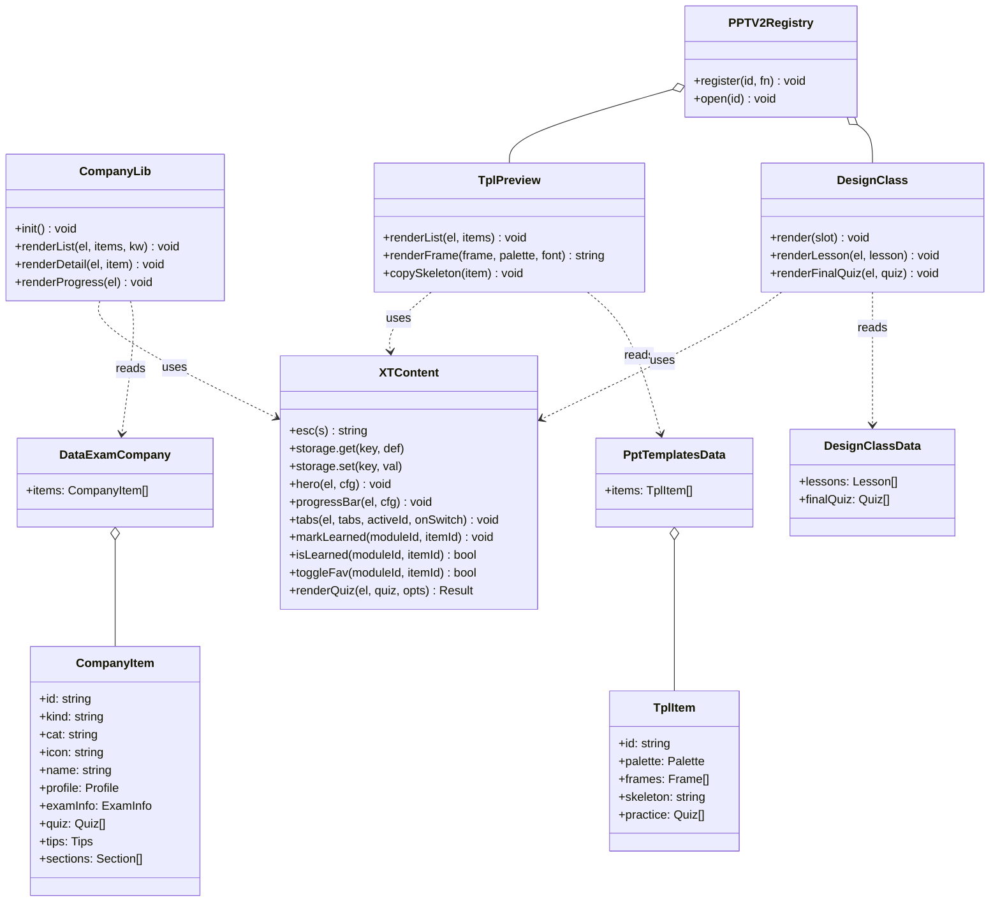
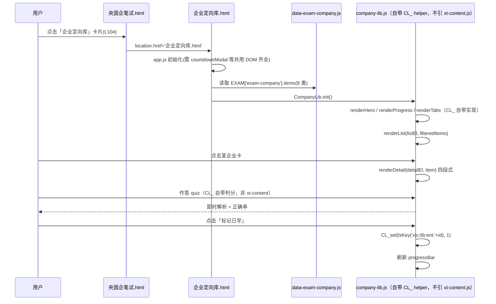
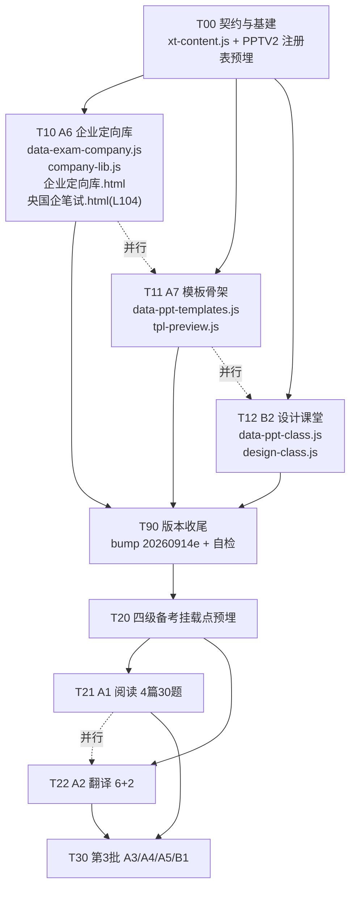

# 增量任务分解 · R48「9 页做真内容」

- 编制：高见远（架构师） / 2026-09-14
- 执行依据：`星途平台-页面做真内容生产方案-2026-09-14.md`（主）+ `星途平台-页面名实问题与重构优化方案-2026-09-14.md`（诊断部分）
- 路线：**做真内容，不改名**。版本戳 `20260914e`
- 范围：全前端 / 零构建 / `file://` 直开，不涉及后端与 APK

---

## 0. 一页速览（结论先行）

| 项 | 结论 |
|---|---|
| 第 1 批任务数 | **5 个**（T00 / T10 / T11 / T12 / T90） |
| 可并行 | **2 组**：`{T11 A7模板骨架}` ∥ `{T12 B2设计课堂}`；T10（A6）与 T00 之后可与两组并行 |
| 必须串行 | T00（契约+挂载点预埋）→ 其余；T90（版本收尾）最后 |
| 唯一新建页面 | `企业定向库.html`（A6） |
| 唯一新建一级目录 | **无**（新文件全部落在已有的 `assets/` 与 `data/`，规避打包脚本改造） |
| 新建 JS 文件（第 1 批） | `xt-content.js` / `company-lib.js` / `data-exam-company.js` / `data-ppt-templates.js` / `tpl-preview.js` / `data-ppt-class.js` / `design-class.js` |
| 核心架构手段 | **数据外置 + 后置覆盖** + **注册表（PPTV2 / CETV2）**，把 3 组并行任务的文件重叠压到 0 |
| **第 1 批状态** | ✅ **已交付，QA 128/128 PASS**（2026-09-14）。T00/T10/T11/T12 四条线全交付；禁改文件 `mini-exam.js` / `mini-ppt.js` / `mini-cet.js` / `app.js` **git 校验干净** |
| 已登记的偏离 | ① `企业定向库.html` **有意不引 `xt-content.js`**（§7.2）；② localStorage 键用 **`xtc:lib:ent:*`** 而非 `xtc:learn:*`（§7.3）；③ 第 3 批 B1 需补改 `CATS['ppt-tips']` 文案（§5） |

---

## 1. 前置事实校正（实测，与任务书/旧文档不一致处以此为准）

> 工作方式要求"只抽验一次即下判断"，以下均为一次性实测结论。

| # | 事实 | 影响 |
|---|---|---|
| F1 | `assets/mini.js` 的 `openMiniQuiz(id, containerId)` **第二个参数是死的**：`renderShell()` 里恒为 `m.className='mz-mask'` + `document.body.appendChild(m)`，`.mz-inline` / `.ppt-view-slot` 那套"内联"CSS 全靠**宿主页面自己把 `#mzMask` 挪进 slot**（`四级备考.html:532 mountMask()`、`PPT训练.html:26` 的 CSS 覆盖）。 | **不能**指望 `openMiniQuiz(id, slotId)` 直接内联渲染。所有新富内容必须走**自研渲染器 + 注册表**。 |
| F2 | `mini.js` 的 `renderInfo()` 只认 `{icon,title,body}` 扁平卡片 | 富结构（四段式/骨架/课堂）无法复用 mini.js，必须自研 |
| F3 | `央国企笔试.html` 企业定向库入口在 **L104**（不是 L161）：`openMiniQuiz('exam-company')` | 改跳新页改这一行 |
| F4 | `PPT训练.html` 已有成熟 `ppt-view` 全屏页内视图：`#pptPanel` + `.ppt-view-slot`，`openPptPanel(id)` 挂载，**非弹窗**（`position:fixed;inset:0`，带返回栏/锁滚动） | A7/B2/B1 复用此容器，符合"不用弹窗承载内容资产"；与 A1/A2 在 `四级备考.html` 的处理方式一致（方案 §四 只列了 1 个新建页面） |
| F5 | `app.js` 中无守卫的 DOM 绑定实测存在：`L6014 document.getElementById('blogEditorInput').addEventListener(...)`；`countdownModal` 相关（L1906）反而有守卫 | 新页面必须整段复制 `#countdownModal` 全套 + `#toast` + `#aiFab/#aiPanel`，否则初始化被打断 |
| F6 | `data/` 目录**已存在**（含 `mock-papers.js`），打包脚本 `android/build_apk.py|ps1|sh`、`tools/deploy_update_*.py` 已覆盖 | 新增数据文件放 `assets/` 或 `data/` 均**无需**改打包脚本 |
| F7 | `tools/deploy_update_20260914c.py` 与 `deploy_update_20260914e.py` **文件已存在** | 用 `20260914e` 前请主理人确认 d 是否已被线上占用；被占用则顺延 `20260914e`（见 §11 UNCLEAR-1） |
| F8 | `lsKey()` 定义于 `app.js:15`，`window.lsKey` 已导出 | 新组件统一 `typeof window.lsKey==='function' ? lsKey(k) : k` 防御式调用 |
| **F9** 🔴 | **`icon-map.js` 的 `[data-icon]` 自动扫描只在 `DOMContentLoaded` 跑一次（L806），且**没有 MutationObserver**；未知图标名在 L795 被 `continue` 静默跳过（不报错）** | **动态渲染（T10/T11/T12 全部命中）后必须补一次 `if (window.lucideAutoRender) window.lucideAutoRender();`**，否则图标为空 span 且无任何报错。已导出 `window.lucideAutoRender`（L802）与 `window.lucideIcon(name,size)`（L775）两个可用入口 |
| **F10** 🔴 | `openPptPanel` **唯一定义在 `PPT训练.html` 页尾 IIFE 顶层**（第 1 批改造前 **L394**，T00 交付后位移至约 **L404**）；写法是 `window.openPptPanel = function(id){}`（按函数名 grep 会漏）；内部已有 `CATS[id]` 注册表、`engine.__pptPatched` 守卫，内容挂载点是 **`#pptPanelSlot`**，`closePptPanel()` 会清 `#pptPanelSlot.innerHTML`。**`assets/mini-ppt.js` 全项目 grep `openPptPanel` 零命中**（该文件只放数据） | T00 必须在**原函数体内部**插入 `PPTV2` 分支（不是另起同名函数）；V2 渲染直接写 `#pptPanelSlot`，关闭复用既有 `closePptPanel()`。⚠️ §2 ADR-2 的代码块是**示意伪代码**，勿据此定位排工 |

---

## 2. 架构决策（ADR，先定死再开工）

### ADR-1：数据外置 + 后置覆盖，**不改** `mini-exam.js` / `mini-ppt.js` / `mini-cet.js`
新建独立数据文件，在 `mini-*.js` **之后**加载，用新结构覆盖同名 key：

```html
<script src="assets/mini-exam.js?v=20260914e" defer></script>
<script src="assets/data-exam-company.js?v=20260914e" defer></script><!-- 后置覆盖 EXAM['exam-company'] -->
```

- ✅ 旧 8 条 info 数据**一行不删**（铁律 1），回滚只需删一个 `<script>` 标签
- ✅ 3 组并行任务**零文件重叠**（历史上 3 次并行覆盖事故的根因就是同文件多写）
- ✅ 不调 `saveData()`（铁律 8），进度只写自己的 localStorage 键

### ADR-2：注册表模式隔离"宿主 HTML 单文件争用"
`PPT训练.html` 被 A7/B1/B2 三个任务同时需要，`四级备考.html` 被 A1/A2 同时需要。**由 T00 / T20 一次性预埋注册表与挂载点**，之后各任务只注册自己的渲染函数，永不再碰宿主 HTML：

```js
/* ⚠️ 下面是【示意伪代码】，不是源码抄录 —— 请勿按此定位或排工。
   真实唯一实现见 `PPT训练.html` 页尾 IIFE 顶层（第 1 批 T00 交付后位于约 L404），
   且 assets/mini-ppt.js 全项目 grep「openPptPanel」零命中。 */
window.PPTV2 = window.PPTV2 || {};               // { 'ppt-templates': fn(slotEl), ... }
window.openPptPanel = function (id) {            // 真实写法是 window.openPptPanel = function (id) {}
  var slot = document.querySelector('#pptPanel .ppt-view-slot');
  var fn = window.PPTV2[id];
  if (fn && slot) { /* open panel */ slot.innerHTML=''; fn(slot); return; }
  legacyOpenPptPanel(id);                         // 旧逻辑透传，不删
};
```

> **📌 源码位置澄清（2026-09-14 实测 + 第 1 批交付后复核）**
> - `openPptPanel` **唯一定义在 `PPT训练.html` 页尾 IIFE 顶层**（第 1 批 T00 改造后约 **L404**；改造前为 L394，行号因 T00 插入而位移）。
> - 写法是 **`window.openPptPanel = function (id) {}`**，不是 `function openPptPanel(){}` —— 按函数名 grep 会漏。
> - **`assets/mini-ppt.js` 全项目 grep `openPptPanel` 零命中**：mini-ppt.js 只放数据，不含任何渲染/入口逻辑。上文代码块**仅表达改造意图的示意片段**。
> - 内部还依赖 `CATS[id]` 注册表（标题/标签/描述）与 `engine.__pptPatched` 守卫，改造时必须**在原函数体内插分支**，不得另起同名函数。

`四级备考.html` 同构：`window.CETV2 = {'cet-read': fn, 'cet-translate': fn}`（T20 预埋，尚未实施）。

### ADR-3：承载形态判定
| 页面 | 形态 | 理由 |
|---|---|---|
| A6 企业定向库 | **新建独立 HTML 页** `企业定向库.html` | "库"字命中 §3.1 强制独立页；方案 §四 明确 |
| A7 / B2 / B1 | **页内全屏视图** `PPT训练.html#pptPanel`（非弹窗） | 已有 ppt-view 基建；与 A1/A2 在四级备考页同法；方案未列新建页 |
| A1 / A2 | **页内全屏视图** `四级备考.html#cetQuizView` | 方案 §四 原文即"四级备考.html 渲染升级" |
| A3 / A4 / A5 | 各自宿主页全屏视图（第 3 批同法） | 同上 |

> ⚠️ 若主理人坚持 A7/B2 也独立成页，见 §11 UNCLEAR-2（成本 +1 页 × 约 0.5 天）。

### ADR-4：版本戳 `20260914e` 统一收尾，不进并行任务
凡引用被改资源的页面都要同步 bump，否则老用户命中旧缓存。bump 是**跨文件横切操作**，与"并行零重叠"冲突 → 收口到 T90，用 `tools/bump_versions_20260914e.py` 一次性跑完 + 清单校验。

---

## 3. 数据结构定义（重点）

> 通用约束：① ASCII 文件名 / UTF-8 无 BOM；② `window.*` 挂载，不 fetch；③ 每条数据带稳定 `id`（ASCII），用作 localStorage 键后缀；④ 全文用户可见处标注「原创改编」。

### 3.1 A6 · `EXAM['exam-company']`（富结构 v2）

```js
/* assets/data-exam-company.js —— 后置覆盖 mini-exam.js 的同名 key */
window.MINI_BANK = window.MINI_BANK || {};
var EXAM = window.MINI_BANK;
EXAM['exam-company'] = {
  t: '央国企 · 企业定向库',
  mode: 'lib',               // 自研渲染器识别用；mini.js 遇到未知 mode 不会崩（它只看 'info'）
  v: 2,
  meta: { unit: '类', total: 8, credit: '原创整理 · 非官方考纲，以当年公告为准' },
  items: [
    /* —— 类型一：企业卡（kind:'company'）—— */
    {
      id: 'sgcc',            // 'sgcc' 等 ASCII id，localStorage 键：xtc:lib:ent:sgcc（禁止用 xtc:learn:*，见 §7.3）
      kind: 'company',       // 'company' | 'method'
      cat: '电网',           // 页签分组：电网/两桶油/建筑央企/金融国企/通用方法
      icon: 'building',      // icon-map.js 已核实存在：building/briefcase/award/file-text/
                             //   clipboard-list/badge-check/target/zap/lightbulb/bookmark/star
      name: '国家电网',
      tagline: '人民电业为人民',
      profile: {                                  // ① 企业名片
        mission: '…',                             // string  使命/愿景
        mainBiz: ['…', '…'],                      // string[] 主业
        slogan: '…',                              // string  最新口号/提法
        highlights: ['…', '…']                    // string[] 近一年大事（3-5 条）
      },
      examInfo: {                                 // ② 笔试考情
        form: '线上机考（第三方统一组织）',           // string
        structure: [                              // 题型构成
          { block: '综合能力', detail: '…', ratio: '约 40%' }
        ],
        hotPoints: ['…', '…'],                    // string[] 高频考点
        prepAdvice: '…'                           // string  备考建议
      },
      quiz: [                                     // ③ 考点自测 3–5 题（必带解析，铁律 2）
        { q: '…', o: ['A文本','B文本','C文本','D文本'], a: 1, x: '正确项怎么来的 + 干扰项为什么错' }
      ],
      tips: {                                     // ④ 面试/答题注意
        wording: ['…'],                           // string[] 规范用语
        stance: '…',                              // string  政治站位
        bonus: ['…']                              // string[] 加分点
      },
      links: [ { label: '去行测刷题 · 企业定向', url: '行测刷题.html?cat=company' } ]
    },
    /* —— 类型二：方法论卡（kind:'method'）—— */
    {
      id: 'exam-form', kind: 'method', cat: '通用方法', icon: 'clipboard-list',
      name: '历年笔试形式：怎么组织',
      tagline: '先搞清形式，再谈技巧',
      sections: [ { h: '小标题', body: '…' } ],   // 原 8 条 info 的 body 拆段迁入，内容不减
      quiz: [ /* 可选 0–3 题 */ ],
      tips: { wording: [], stance: '', bonus: [] }
    }
  ]
};
```

**字段缺省规则**：`kind:'method'` 允许 `profile/examInfo` 为 `null`，渲染器只画 `sections + quiz + tips`；`quiz` 为空则不画自测区（不留空壳）。

### 3.2 A7 · `PPT['ppt-templates']`（模板骨架 v2）

```js
/* assets/data-ppt-templates.js */
PPT['ppt-templates'] = {
  t: 'PPT · 实战模板库', mode: 'lib', v: 2,
  items: [{
    id: 'tpl-biz-report',
    name: '商务汇报风',
    scene: ['工作汇报', '年终总结', '方案汇报'],       // string[]
    summary: '深蓝+白灰，直角卡片，标题粗正文细。',
    palette: { main:'#1F4E79', accent:'#2E75B6', bg:'#FFFFFF', text:'#333333' },  // 4 色必填
    font: { title:'思源黑体 Bold 32pt', body:'思源黑体 Regular 18pt', note:'中英文各一族' },
    frames: [                                        // 5 帧骨架预览（代码自绘，不外链图片）
      { name:'封面', layout:'cover',
        blocks:[ {type:'title', text:'2026 年度工作汇报'}, {type:'sub', text:'部门 / 姓名 / 日期'} ] },
      { name:'目录', layout:'toc',    blocks:[ {type:'list', items:['一、…','二、…','三、…']} ] },
      { name:'内容双栏', layout:'two-col',
        blocks:[ {type:'h',text:'核心结论'}, {type:'col',items:['左栏要点','右栏要点']} ] },
      { name:'数据页', layout:'kpi',
        blocks:[ {type:'kpi', items:[{v:'128%',k:'同比'}, {v:'32',k:'项目数'}]}, {type:'chart',kind:'bar'} ] },
      { name:'结束页', layout:'end',  blocks:[ {type:'title',text:'谢谢'}, {type:'sub',text:'Q&A'} ] }
    ],
    skeleton: '<div class="xt-tpl tpl-biz">…</div>',  // 「套用框架」一键复制的 HTML 骨架字符串
    practice: [ { q:'…', o:[4], a:0, x:'…' } ]        // 可选 2 题
  }]
};
```

**骨架渲染约定**：`TplPreview.renderFrame(frame, palette, font)` 只消费 `layout + blocks + palette`，用 `<div>` 栅格 + 内联 `background/border-radius` 自绘；`layout` 白名单 `cover|toc|two-col|kpi|end`（防 XSS/畸形数据）。`skeleton` 字符串**只允许包含白名单标签**（div/span/h3/p/ul/li），复制前 `esc()` 过一遍再写入剪贴板。

### 3.3 B2 · `PPT['ppt-design']`（设计基础课堂 v2）

```js
/* assets/data-ppt-class.js —— 同时承担 B2；B1 走 data-ppt-tips.js（第 3 批） */
PPT['ppt-design'] = {
  t: 'PPT · 设计基础', mode: 'course', v: 2,
  lessons: [
    { id:'l1', title:'四原则', minutes: 6, icon:'target',
      sections:[
        { h:'对齐', body:'…',
          demo:{ type:'compare',                       // 正反例对比，代码自绘
                 good:{ caption:'对齐后', blocks:[{x:12,y:12,w:36},{x:12,y:36,w:36}] },
                 bad: { caption:'未对齐',  blocks:[{x:8,y:10,w:30},{x:22,y:38,w:40}] } } },
        { h:'对比', body:'…', demo:{ type:'swatch', colors:['#1F4E79','#E8EEF6'] } },
        { h:'重复', body:'…' }, { h:'亲密性', body:'…' }
      ],
      quiz:[ { q:'…', o:[4], a:1, x:'…' } ]            // 每节课后 2–3 题随堂测
    },
    { id:'l2', title:'配色系统', … },
    { id:'l3', title:'字体系统', … }
  ],
  finalQuiz: [ /* 原 mini-ppt.js 8 题原样迁入，作为「课后小测」，一字不改 */ ]
};
```

`demo.type` 白名单：`compare`（左右对照版式）/ `swatch`（色块）/ `type`（字号对比）/ `none`。

### 3.4 A1 · 四级阅读（4 篇 30 题）

```js
/* data/cet-reading.js  （放已有 data/ 目录，不改打包脚本） */
window.CET_READING = {
  v: 2, credit: '原创改编 · 依四级难度仿写，非真题原文',
  passages: [
    { id:'r1', type:'cloze',    title:'…', topic:'校园', level:'基础', minutes:9,
      text:'…{{1}}…{{2}}…',                       // {{n}} 为第 n 空占位
      wordBank:[ {w:'benefit', pos:'n.', cn:'益处'}, /* 共 15 词 */ ],
      questions:[ { no:1, o:['…','…'], a:1, x:'…' } ]   // 10 题（cloze 的 o 由词库动态生成亦可）
    },
    { id:'r2', type:'matching', title:'…', topic:'科技', level:'进阶', minutes:12,
      paras:[ {tag:'A', text:'…'}, /* 共 10 段 */ ],
      questions:[ { no:11, stem:'…', a:'D', x:'…' } ]   // 7 题，a 为段落 tag
    },
    { id:'r3', type:'careful',  title:'…', topic:'社会', level:'基础', minutes:10,
      text:'…', questions:[ {no:16, q:'…', o:[4], a:2, x:'…'} ]   // 5 题：细节/主旨/推断/词义/态度
    },
    { id:'r4', type:'careful',  …   // 5 题
    }
  ]
};
```

### 3.5 A2 · 四级翻译（6 单句 + 2 段落）

```js
/* data/cet-translate.js */
window.CET_TRANSLATE = {
  v: 2, credit: '原创命题 · 非真题原文',
  items: [
    { id:'t1', type:'sentence',  cn:'正是……才……', ref:'It is … that …',
      keywords:['it is','that','…'],       // 评分关键词（小写、去标点后匹配）
      points:['强调句 It is + 被强调部分 + that + 其余'],
      level:'基础' },
    /* t2–t6：倒装 / 被动 / 定语从句 / 非谓语 / 状语从句 */
    { id:'p1', type:'paragraph', cn:'（100 字级段落 · 传统文化）', ref:'…',
      keywords:[…], points:[…], level:'进阶' },
    { id:'p2', type:'paragraph', cn:'（100 字级段落 · 社会现象）', … }
  ]
};
```

**评分口径**（纯前端，不调 AI）：
```
score = 命中关键词数 / 关键词总数
≥0.8「译得很准 🎉」 / ≥0.6「基本到位，对照参考译文看差异」 / <0.6「先看要点再译一遍」
+ 强制展示：参考译文 + 要点 points（不做"错误标注"，避免误伤）
```

### 3.6 类图（渲染器与数据关系）



---

## 4. 第 1 批：文件级任务分解（可直接动手）

### T00 · 契约与基建（串行，最先做） —— P0

| 文件 | 做什么 |
|---|---|
| `assets/xt-content.js`（**新建**） | 通用内容页基建，接口见 §8.1。`esc / storage(lsKey 前缀化) / hero / progressBar / tabs / markLearned / isLearned / toggleFav / renderQuiz`。**禁止**调用 `saveData()` |
| `PPT训练.html` | ① 在 `</body>` 前追加 3 个 `<script>` 占位（`data-ppt-templates.js?v=20260914e`、`tpl-preview.js`、`data-ppt-class.js`、`design-class.js`，文件可由后续任务创建，先按此名写死）；② 把 `openPptPanel` 改造为 **ADR-2 注册表**版本（旧逻辑 `legacyOpenPptPanel` 保留不删）；③ 挂载点 `#pptPanel .ppt-view-slot` 保持原样 |
| 版本号 | T00 阶段**不 bump**，留给 T90 统一处理 |

- 依赖：无
- 风险：**中**。`openPptPanel` 改造若写错会导致设计基础/模板库/技巧提升三个入口全白屏 → 要求：`window.PPTV2[id]` 不存在时必须**原样透传**旧逻辑，且 `try/catch` 包裹新逻辑，异常自动回退旧路径
- 交付自检：三个入口点一遍，未注册时行为与改造前完全一致

### T10 · A6 企业定向库独立页 —— P0

| 文件 | 做什么 |
|---|---|
| `assets/data-exam-company.js`（**新建**） | 按 §3.1 写 8 类数据：4 张企业卡（电网/两桶油/建筑央企/金融国企）+ 4 张方法卡（通用清单/历年笔试形式/常见题型结构/时间分配）。**原 mini-exam.js 的 8 条 body 全部迁入 `sections`，一字不删**；企业卡各补 3–5 题自测（新命题，带解析） |
| `assets/company-lib.js`（**新建**） | `CompanyLib.init / renderList / renderDetail / renderProgress`，渲染函数签名见 §7.3 |
| `企业定向库.html`（**新建**） | 页面骨架见 §7.1/§7.2，**整段复制** `央国企笔试.html` 的 sidebar / topbar / bottom-nav / morePanel / **countdownModal 全套** / toast / aiFab+aiPanel；脚本按 §7.2 顺序引入 |
| `央国企笔试.html` | **仅改 L104 一行**：`onclick="location.href='企业定向库.html'"`；卡片 `feature-desc` 文案补一句"8 类 · 含考情与自测"。其余 DOM/功能不动 |

- 依赖：T00（用 `xt-content.js`）
- 风险：**高**
  1. 新页面漏复制共用 DOM → `app.js` 无守卫绑定抛错（F5）。**硬性检查项**：新页必须含 `countdownModal`/`cdName`/`cdDate`/`cdPinned`/`cdColorPicker`/`toast`/`aiFab`/`aiPanel`/`morePanel` 全部 id
  2. 中文文件名 `企业定向库.html` —— 已有多页面同例（场景话术库.html 等），低风险；但 `location.href` 跳转需 `encodeURI` 防御
  3. 8 类内容量大，易出现"某企业卡只有 2 段话"打回 → 数据自检脚本：每 `kind:'company'` 必须 `quiz.length>=3 && profile.highlights.length>=3`
- 可与 T11/T12 并行（零文件重叠）

### T11 · A7 实战模板库骨架 —— P0

| 文件 | 做什么 |
|---|---|
| `assets/data-ppt-templates.js`（**新建**） | 按 §3.2 写 **5 套**：通用 8 件套 / 商务汇报风 / 教育培训风 / 数据分析风 / 使用建议（第 5 条改造为 `kind:'method'` 风格的"选模板方法论"卡，内容不删）。每套 5 帧 + palette + font + skeleton + 2 题 practice |
| `assets/tpl-preview.js`（**新建**） | `TplPreview.renderList(el, items)` / `renderFrame(frame, palette, font)` / `copySkeleton(item)`；注册 `window.PPTV2['ppt-templates'] = fn` |
| （不动 `PPT训练.html`） | 挂载点由 T00 预埋；**本任务禁止改宿主 HTML** |

- 依赖：T00
- 风险：**中**
  1. `skeleton` 字符串复制功能在 `file://` 下 `navigator.clipboard` 可能不可用 → 用 `textarea + document.execCommand('copy')` 兜底
  2. 5 套 × 5 帧 = 25 帧自绘，容易做成"看起来都一样" → 要求 5 套的 `palette.main` 必须互不相同，帧布局至少 3 种 `layout` 差异化
- 与 T12 并行（零文件重叠：各写各的 data + ui 文件）

### T12 · B2 设计基础课堂 —— P1

| 文件 | 做什么 |
|---|---|
| `assets/data-ppt-class.js`（**新建**） | 按 §3.3 写 3 节课（四原则 / 配色 / 字体），每节 ≥3 个 section + 正反例 demo + 2–3 题随堂测；`finalQuiz` **原样迁入** mini-ppt.js 的 8 题 |
| `assets/design-class.js`（**新建**） | `DesignClass.render(slot)` / `renderLesson` / `renderFinalQuiz`；注册 `window.PPTV2['ppt-design'] = fn` |
| （不动 `PPT训练.html`） | 同 T11 |

- 依赖：T00
- 风险：**中低**。主要风险是 8 题迁移时手改导致与原文件不一致 → 要求逐字复制，并用 `tools/verifier` 风格做一次长度/条数比对（8 题、每题 4 选项）

### T90 · 版本收尾与自检（串行，最后） —— P0

| 文件 | 做什么 |
|---|---|
| `tools/bump_versions_20260914e.py`（**新建**，ASCII 名） | 把 `20260913o` → `20260914e`，范围：`assets/` 下被改/新增文件引用的所有 `<script>` / `<link>` 的 `?v=` 参数 |
| 受影响页面清单 | 引用 `mini-exam.js`：`央国企笔试.html`、`mock_exam.html`；引用 `mini-ppt.js`：`PPT训练.html`；**`企业定向库.html` 不引 `xt-content.js`（有意偏离，见 §7.2），只需 bump 其自身引入的 `data-exam-company.js` / `company-lib.js`**；以及所有引入 `app.js/icon-map.js` 的页面（若 app.js 被改则全站 bump —— **本批建议不改 app.js**，把范围压到最小） |
| 自检 | 见 §9 验收清单逐条打勾 |

- 依赖：T00/T10/T11/T12
- 风险：**中高**（漏 bump = 老用户白屏/旧数据）。缓解：脚本执行后 grep 全站 `?v=20260913o`，残留即视为失败

### 第 1 批时序图（A6 渲染主流程）



---

## 5. 第 2 / 3 批：文件级任务分解（大纲级，开工前再细化）

### T20 · 第 2 批挂载点预埋（串行先行） —— P0

| 文件 | 做什么 |
|---|---|
| `四级备考.html` | ① 追加 `data/cet-reading.js`、`cet-reading-ui.js`、`data/cet-translate.js`、`xt-translate.js` 四个 `<script>`；② `openCetQuizView` 改造为 `window.CETV2` 注册表（旧逻辑 `legacy` 保留）；③ 在 `#cetQuizView` 内新增「技巧速览」「表达积累」两个降级环节容器（承接原 10 道策略题 / 10 道表达辨析题，**不删**） |

### T21 · A1 阅读理解做真 —— P1（依赖 T20）

| 文件 | 做什么 |
|---|---|
| `data/cet-reading.js`（**新建**） | §3.4 结构，4 篇 30 题：选词填空 15 选 10×1、长篇匹配 10 段 7 题×1、仔细阅读 5 题×2。**全部原创仿写**，每篇标注「原创改编」+ 难度/主题/建议用时 |
| `assets/cet-reading-ui.js`（**新建**） | `CETReadingUI.render(slot)`；三种题型三套交互（选词填空下拉/匹配填字母/仔细阅读 ABCD）；计时 + 交卷 + 错题入错题本联动；注册 `CETV2['cet-read']` |
| `四级备考.html` | **不改**（T20 已预埋） |

- 风险：**最高**。内容量 4 篇 × 约 350 词 + 30 题解析；版权红线（必须原创仿写并标注）；`cet-read` 的 10 道策略题须完整保留在「技巧速览」区

### T22 · A2 翻译专项做真 —— P1（依赖 T20）

| 文件 | 做什么 |
|---|---|
| `data/cet-translate.js`（**新建**） | §3.5，6 单句 + 2 段落 + 关键词 + 要点 |
| `assets/xt-translate.js`（**新建**，可沉淀共用件） | `XTTranslate.render(el, item)` / `score(input, item)`，接口见 §8.2；注册 `CETV2['cet-translate']` |
| `四级备考.html` | **不改**（T20 已预埋） |

- 与 T21 并行（零文件重叠）
- 风险：**中**。关键词评分易误判（时态/单复数）→ 只做"命中提示"，不做"错误判定"

### T30 · 第 3 批（A3 案例 / A4 面试准备 / A5 面试后 / B1 技巧练习）—— P2

| 子任务 | 新建文件 | 宿主页 | 说明 |
|---|---|---|---|
| A3 案例拆解库 | `data/eq-case.js` + `assets/eq-case-ui.js` | `高情商表达.html`（注册表 `window.EQV2`） | 8 案例四段式；原 8 道情景选择题降为「验证题」保留 |
| A4 + A5 面试 | `data/interview-prep.js` + `assets/xt-interview.js` | `商务礼仪面试.html`（注册表 `window.IVV2`） | 8 题 STAR 框架+示范+自答输入+自查；面试后：输入复盘 → 生成改进清单；原 6 题保留为「复盘知识自测」 |
| B1 技巧练习 | `assets/data-ppt-tips.js` + 复用 `design-class.js` 的小组件 | `PPT训练.html`（**挂载点 `PPTV2['ppt-tips']` 已由 T00 预埋**） | 5 技巧 × 2–3 题 + checklist 实战任务；**另需同步改 `CATS['ppt-tips']` 两处旧文案，见下方遗留** |

> 第 3 批沿用同一套打法：**数据外置 + 注册表 + 宿主页一次性预埋**。

### ⚠️ 第 3 批 B1 必办遗留（2026-09-14 登记，QA 第 1 批走查发现）

`PPT训练.html` 的 `CATS['ppt-tips']`（PPT · 技巧提升）**入口文案仍是旧的**，与"名实相符"目标冲突：

| 位置 | 当前值（旧） | B1 落地时必须改为 |
|---|---|---|
| `CATS['ppt-tips'].tag` | `知识卡片` | 反映"学练闭环"的标签，如 `技巧速览 + 练习` |
| `CATS['ppt-tips'].desc` | `六个专题技巧…`（且"六个"与实际 5 条数据也对不上） | 与实际数据（`PPT['ppt-tips']` 5 条）一致的描述 |

- **背景**：实际数据 `PPT['ppt-tips']`（`assets/mini-ppt.js` L33-34）**尚未做真**，属第 3 批 B1 范围；第 1 批只动了 `ppt-templates` 与 `ppt-design`。
- **好消息**：挂载点 `PPTV2['ppt-tips']` **已由 T00 预埋**，B1 开工时**只需注册渲染函数，不必再动 HTML**——但上表两处 `CATS` 文案**在 HTML 里**，属 B1 交付内容的一部分，不能漏。
- **若不改**：B1 做完数据做真后，入口卡仍显示"知识卡片 / 六个专题技巧"，**等于又留一个名实不符**，直接命中验收标准第 7 条。

---

## 6. 并行分区方案（硬约束：文件零重叠）

```
时间轴 ──────────────────────────────────────────────────────►

[T00 串行]  xt-content.js  +  PPT训练.html 挂载点/注册表预埋
     │
     ├──────────────┬──────────────┬──────────────┐
     ▼              ▼              ▼              │
 ┌────────┐    ┌─────────┐    ┌─────────┐        │
 │ T10 A6 │    │ T11 A7  │    │ T12 B2  │        │   ← 三者零文件重叠，可同时开工
 └────────┘    └─────────┘    └─────────┘        │
     │              │              │              │
     └──────────────┴──────────────┴──────────────┘
                    ▼
              [T90 串行]  版本 bump 20260914e + 验收自检
```

### 文件归属矩阵（一格 = 一个 owner，任何文件不被两个任务写）

| 文件 | T00 | T10 | T11 | T12 | T90 |
|---|:--:|:--:|:--:|:--:|:--:|
| `assets/xt-content.js` | ✎ | –（不引，见 §7.2 有意偏离） | 读 | 读 | ✎(v) |
| `PPT训练.html` | ✎ | – | – | – | ✎(v) |
| `assets/data-exam-company.js` | – | ✎ | – | – | ✎(v) |
| `assets/company-lib.js` | – | ✎ | – | – | ✎(v) |
| `企业定向库.html` | – | ✎ | – | – | ✎(v) |
| `央国企笔试.html` | – | ✎ | – | – | ✎(v) |
| `assets/data-ppt-templates.js` | – | – | ✎ | – | ✎(v) |
| `assets/tpl-preview.js` | – | – | ✎ | – | ✎(v) |
| `assets/data-ppt-class.js` | – | – | – | ✎ | ✎(v) |
| `assets/design-class.js` | – | – | – | ✎ | ✎(v) |
| `assets/mini-exam.js` / `mini-ppt.js` / `mini.js` / `mini-cet.js` | **全批禁改**（ADR-1） | | | | |
| `assets/app.js` | **本批禁改**（一旦改了，全站 33 页都要 bump，风险不可控） | | | | |

### 必须串行的硬点
1. **T00 → 一切**：`xt-content.js` 接口与 `PPTV2` 注册表必须先冻结
2. **T90 最后**：版本 bump 是横切操作，提前做会被后续新增文件打脸
3. **同宿主 HTML 的挂载点预埋（T00/T20/T30）必须先于该宿主下的所有内容任务**

---

## 7. 新建页面 `企业定向库.html` 骨架设计

### 7.1 结构（对齐 `场景话术库.html` / `央国企笔试.html`）

```
<body class="theme-home">
<div class="app">
  <nav class="sidebar">            ← 整段复制 央国企笔试.html（data-page 保持 exam 高亮）
  <div class="main">
    <header class="topbar">        ← 整段复制（topbarTitle / gsWrap / topbar-stats / topbar-date / themeToggle）
    <div class="content">
      <div class="page active" id="page-company-lib">
        <div class="card" id="clHero"></div>        ← ① 模块 hero
        <div class="card" id="clProgress"></div>    ← ② 进度条（已学 X/8 类 · 收藏 N）
        <div class="card">
          <div id="clTabs"></div>                   ← ③ 分类页签
          <input id="clSearch" class="form-input" placeholder="搜索企业 / 考点…">
          <div id="clList"></div>                   ← ④ 内容卡列表
        </div>
        <div class="card" id="clDetail" hidden></div> ← ⑤ 详情（四段式）
      </div>
    </div>
  </div>
  <nav class="bottom-nav">         ← 整段复制
  <div class="more-overlay"> + <div id="morePanel">  ← 整段复制
  <!-- ★ 必须有：countdownModal 全套（含 cdName/cdDate/cdPinned/cdColorPicker）、#toast、#aiFab、#aiPanel -->
</div>
```

### 7.2 脚本引入顺序（严格）

```html
<script src="assets/icon-map.js?v=20260914e" defer></script>
<script src="assets/xt-toast.js?v=20260914e" defer></script>
<script src="assets/error-boundary.js?v=20260914e" defer></script>
<script src="assets/app.js?v=20260914e" defer></script>
<script src="assets/config.js?v=20260914e" defer></script>
<script src="assets/api.js?v=20260914e" defer></script>
<script src="assets/mini-exam.js?v=20260914e" defer></script>   <!-- 旧数据保留 -->
<script src="assets/mini.js?v=20260914e" defer></script>
<script src="assets/data-exam-company.js?v=20260914e" defer></script>  <!-- 后置覆盖 -->
<script src="assets/company-lib.js?v=20260914e" defer></script>
<script>document.addEventListener('DOMContentLoaded', function(){ CompanyLib.init(); });</script>
```

> **⚠️ 有意偏离（2026-09-14 主理人裁决：保持现状，不改代码，改文档）**
> **「`企业定向库.html` 有意不引入 `assets/xt-content.js`，自带极简实现（`CL_` 前缀 helper），属有意为之而非遗漏。」**
>
> 成因与理由：
> 1. T10 开工时 `xt-content.js`（T00 产物）尚未落盘，主理人要求 T10 **零依赖、不阻塞并行**；
> 2. 当前功能自洽、自验通过，强行补引只会新增耦合，且会引入 **localStorage 键名迁移风险**（见 §7.3 的 `xtc:lib:ent:*` 与 `xtc:learn:*` 命名空间冲突）；
> 3. 因此本页不走 `XTContent.*`，也不使用 `xtc:learn:*` 键。
>
> **后续约束**：第 2/3 批新建内容页若自带动效/进度需求，**默认仍应优先复用 `xt-content.js`**；只有在"并行阻塞 + 键名独立"同时成立时才可复刻本页的极简路线，且必须同步登记到本文档。

### 7.3 渲染函数签名（第 1 批直接照此实现）

```js
/* assets/company-lib.js —— IIFE，零依赖（不引 xt-content.js，自带 CL_ 前缀 helper，
   见 §7.2 的「有意偏离」说明）；只读 MINI_BANK['exam-company'] 数据 */
window.CompanyLib = {
  init(): void,                                   // 绑定 tabs / search / 初始化进度
  renderHero(): void,                             // -> XTContent.hero(#clHero, {...})
  renderProgress(): void,                         // -> XTContent.progressBar(#clProgress, {done,total:8,label})
  renderList(el: HTMLElement, items: Array, kw: string): void,
  renderDetail(el: HTMLElement, item: Object): void,   // 四段式：名片 / 考情 / 自测 / 注意
  renderMethod(el: HTMLElement, item: Object): void    // kind:'method' 的简化分支
};
```

**localStorage 键位**（全部经 `lsKey()` 前缀化）：

**键名以代码为准**（主理人 2026-09-14 中途下令改动，本表已对齐实现）：

| 键（经 `lsKey()` 前缀化） | 类型 | 说明 |
|---|---|---|
| `xtc:lib:ent:<id>` | `1` | 已学标记 |
| `xtc:lib:ent:<id>:fav` | `1` | 收藏 |
| `xtc:lib:ent:<id>:quiz` | `{best, total, ts}` | 自测最好成绩 |

> 🔴 **本页禁止写 `xtc:learn:*` 命名空间。**
> 原因：`xt-content.js` 的通用契约用的是 **`xtc:learn:<bankId>:<itemId>`**，企业定向库若沿用同一命名空间，会与后续接入 `xt-content.js` 的其他内容页**撞进同一键空间、互相覆盖用户学习进度**（同一 `itemId` 在不同库下语义不同）。故本库独立启用 **`xtc:lib:ent:`** 前缀。
> **推广到后续批次**：每新建一个内容库，必须启用**自己的二级前缀**（`xtc:lib:<库缩写>:`），**不得**直接复用 `xtc:learn:*`——那属于 `xt-content.js` 的通用契约专用区。

**四段式 DOM 结构**（`renderDetail` 产出）：

```html
<div class="cl-item">
  <div class="cl-head"><span class="nav-icon" data-icon="building"></span>
    <b>国家电网</b><span class="tag tag-primary">电网</span>
    <button onclick="CompanyLib.toggleFav('sgcc')">收藏</button>
    <button onclick="CompanyLib.markLearned('sgcc')">标记已学</button>
  </div>
  <section class="cl-sec" data-sec="profile"><h4>企业名片</h4>…</section>
  <section class="cl-sec" data-sec="examInfo"><h4>笔试考情</h4>…</section>
  <section class="cl-sec" data-sec="quiz"><h4>考点自测</h4><div id="clQuiz_sgcc"></div></section>
  <section class="cl-sec" data-sec="tips"><h4>面试 / 答题注意</h4>…</section>
  <div class="cl-credit">原创整理 · 非官方考纲，以当年招聘公告为准</div>
</div>
```

---

## 8. 共享约定（可沉淀的共用 JS 组件）

### 8.1 `assets/xt-content.js`（第 1 批建，owner: T00）

```js
window.XTContent = {
  esc: function (s) {},                                  // 全站统一转义
  storage: {
    get: function (key, def) {},                         // 内部 lsKey() 前缀化 + JSON 容错
    set: function (key, val) {}
  },
  hero: function (el, cfg) {},                           // cfg: {icon, title, sub, tags:[]}
  progressBar: function (el, cfg) {},                    // cfg: {done, total, label}
  tabs: function (el, tabs, activeId, onSwitch) {},      // tabs: [{id,label}]
  markLearned: function (moduleId, itemId) {},
  isLearned:   function (moduleId, itemId) {},           // -> bool
  toggleFav:   function (moduleId, itemId) {},           // -> bool(收藏后状态)
  renderQuiz:  function (el, quiz, opts) {}              // opts: {onDone(score,total), showAnalysis:true}
};
```

**硬约定**：
- 全部走 `data-icon` + `icon-map.js`，禁止 mask/filter/symbol/use
- **动态注入的图标必须补 hydration**（F9）：每次 `innerHTML` 渲染含 `data-icon` 的片段后，末尾调 `if (window.lucideAutoRender) window.lucideAutoRender();`；或在模板串里直接内联 `window.lucideIcon(name, size)`（`PPT训练.html:403` 即此写法）。图标名只用在 `icon-map.js` 中核实存在的：building / briefcase / bookmark / star / award / file-text / clipboard-list / badge-check / target / zap / lightbulb / graduation-cap / palette / sparkles / search / heart
- 全部走 `var` / ES5 语法为主（`file://` + 老 WebView 兼容），允许 ES6 但不用可选链/空值合并
- 任何写 localStorage 的地方**不得**调用 `saveData()`（铁律 8）
- 不引入任何 CDN、任何外链图片

### 8.2 后续可沉淀件（owner 见批次）

| 组件 | 文件 | 暴露接口 | 批次 |
|---|---|---|---|
| 翻译输入评分 | `assets/xt-translate.js` | `XTTranslate.render(el, item)` / `.score(input, item) -> {hit, total, level, ref, points}` | 2 |
| 面试开口自查 | `assets/xt-interview.js` | `XTInterview.renderSelfCheck(el, q)` / `.check(answer, checklist) -> {covered[], missed[]}` | 3 |
| 复盘生成 | `assets/xt-interview.js` | `XTInterview.renderReview(el, tpl)` / `.generate(form) -> {improvements[], summary}` | 3 |
| 骨架预览 | `assets/tpl-preview.js` | `TplPreview.renderFrame(frame, palette, font)` / `.copySkeleton(item)` | 1 |
| 内容页基建 | `assets/xt-content.js` | 见 8.1 | 1 |

> 组件放置原则：**一个组件一个文件、一个 owner**，`assets/` 下平铺（不新建子目录，规避打包脚本改造，铁律 7）。

---

## 9. 验收清单（方案 7 条 → 可执行检查项）

| # | 方案验收标准 | 可执行检查项 | 判定 |
|---|---|---|---|
| 1 | 阅读页能读到真实文章并作答 | 打开 `四级备考.html → 阅读理解`：出现 ≥3 种题型、文章正文可见字数 ≥800、可作答并可交卷；「技巧速览」区仍可见原 10 题 | 文件 + 目测 |
| 2 | 翻译页能输入译文并获参考对照与评分 | `四级备考.html → 翻译专项`：存在 `<textarea>`，输入后出参考译文 + 关键词命中提示；「表达积累」区仍可见原 10 题 | 交互点一遍 |
| 3 | 案例库每案例背景→冲突→处理→拆解四段完整 | `高情商表达.html → 案例拆解库`：随机抽 3 个案例，逐个确认 4 个 `<section>` 均非空 | DOM 抽查 |
| 4 | 面试准备有框架+示范+自答对比；面试后能生成改进清单 | `商务礼仪面试.html`：A4 每题含框架/示范/输入区；A5 提交后产出 ≥3 条改进项 | 交互点一遍 |
| 5 | **企业定向库为独立页面**，含进度/已学/收藏/自测题 | `企业定向库.html` 可 `file://` 直开；8 类页签齐全；点"标记已学"后进度条 +1 且刷新后保持；每企业 `quiz.length>=3` | 本批重点 |
| 6 | 模板库每套有可见骨架预览与套用入口 | `PPT训练.html → 实战模板库`：5 套 × 5 帧骨架肉眼可辨、配色互不相同；点「套用框架」剪贴板拿到 HTML 串 | 本批重点 |
| 7 | 全站无"名字承诺训练、实际只有选择题/弹窗文字"的页面 | 逐页走查 9 个页面；检查每个"内容资产型"入口**不再**走 `openMiniQuiz` 弹窗 | 走查表 |

### 第 1 批额外硬性检查项（打回线）

- [ ] `企业定向库.html` 含 `countdownModal` / `cdName` / `cdDate` / `cdPinned` / `cdColorPicker` / `toast` / `aiFab` / `aiPanel` / `morePanel` 全部 id（F5）
- [ ] 新页 F12/控制台零报错（尤其 `addEventListener of null`）
- [ ] `mini-exam.js` / `mini-ppt.js` / `mini.js` / `mini-cet.js` / `app.js` **git diff 为空**（ADR-1 + 表格禁令）
- [ ] 全站 grep `?v=20260913o` 无残留（除确认未被改的资源）
- [ ] 所有新文件：ASCII 文件名、UTF-8 无 BOM
- [ ] 未调用 `saveData()`；所有 localStorage 键经 `lsKey()`
- [ ] 图标全部走 `data-icon` 且名称在 `icon-map.js` 中存在
- [ ] 旧内容零删除：`exam-company` 原 8 条 body、`ppt-design` 原 8 题、`ppt-templates` 原 5 条、`ppt-tips` 原 5 条，逐字比对仍在

---

## 10. 风险登记（Top 5）

| 级别 | 风险 | 触发点 | 缓解 |
|---|---|---|---|
| 🔴 高 | **宿主 HTML 单文件争用**（PPT训练 / 四级备考 各被 2-3 个任务需要） | 并行开工后互相覆盖 | ADR-2 注册表 + 挂载点预埋（T00/T20 串行先行）；内容任务**禁止**改宿主 HTML |
| 🔴 高 | **版本戳 miss** | 新文件被老页面以 `?v=20260913o` 引用 | T90 统一 bump + 全站 grep 残留校验；本批禁改 `app.js` 以压缩范围 |
| 🟠 中 | **新页面漏复制共用 DOM** → `app.js` 无守卫绑定抛错，整页初始化中断 | T10 新建页面 | 硬性检查项（§9）；直接从 `央国企笔试.html` 复制整份再改内容区，不手写 |
| 🟠 中 | **内容量塌方**（30 题解析 + 8 类富结构 + 25 帧骨架） | 赶工时降级为"2 段话 + 1 题" | 数据自检脚本：企业卡 `quiz>=3 && highlights>=3`；模板 `frames==5 && palette.main 唯一` |
| 🟡 低 | **版权红线**（四级阅读/翻译） | T21/T22 内容生产 | 全部原创仿写 + 页面固定标注「原创改编 · 非真题原文」；不得整段搬运真题 |

---

## 11. Anything UNCLEAR（需主理人拍板）

1. ~~**版本戳 `20260914d` 是否已被占用**~~ → **已拍板：统一 `20260914e`**（2026-09-14 主理人）。实测 `tools/deploy_update_20260914b|c|d.py` 三个脚本均带同名 `.tar.gz`（说明 b/c/d 都已打包上线），而 `20260914e` 当前无同名脚本，安全。本文档已全局替换为 `20260914e`。
2. ~~**A7/B2 是否也要独立成页**~~ → **已拍板：采纳 ADR-3，走 `PPT训练.html#pptPanel` 页内全屏视图，不独立成页**（2026-09-14 主理人）。本条作废。
3. **A6 第 5 类"使用建议/通用清单"的归属**：方案写"8 类"但只列了 7 个明确项（4 企业 + 历年笔试形式 + 常见题型结构 + 时间分配）。本文档按"4 企业 + 4 方法"处理，其中第 4 张方法卡 = 原"通用备查清单" + "使用建议"合并。如主理人有第 8 类的明确定义，请补充。
4. **「套用框架」复制粒度**：复制整份 HTML 骨架字符串，还是复制"页面结构清单（纯文本）"？本文档按"HTML 骨架字符串 + 结构说明"双输出设计，最终以用户反馈调整。
5. **第 2/3 批是否需要错题本联动**：方案 §3.3 提到"验证段尽量联动现有错题本"。本文档 T21/T30 预留了联动位但**未定接口**（需读 `错题本.html` 的 storage 结构后补）。建议第 2 批开工前补一次 15 分钟的接口确认。

---

## 12. 附：第 1 批任务依赖图


