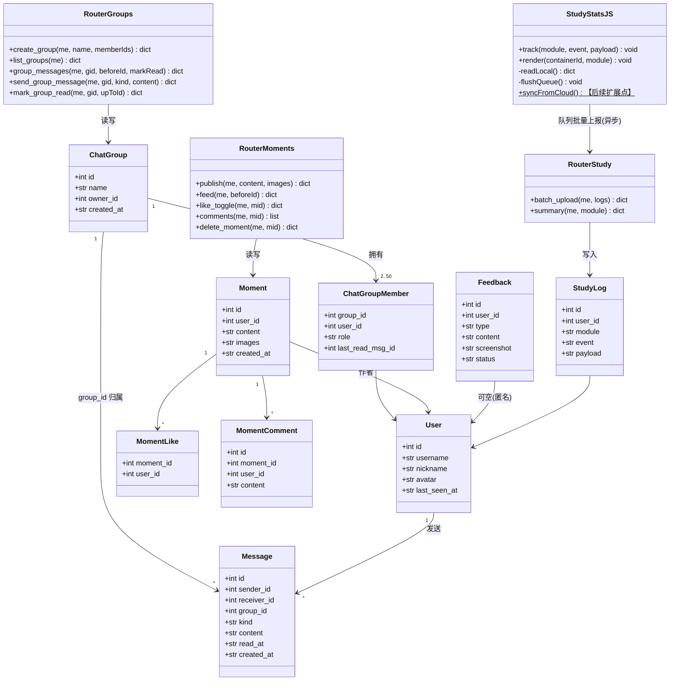
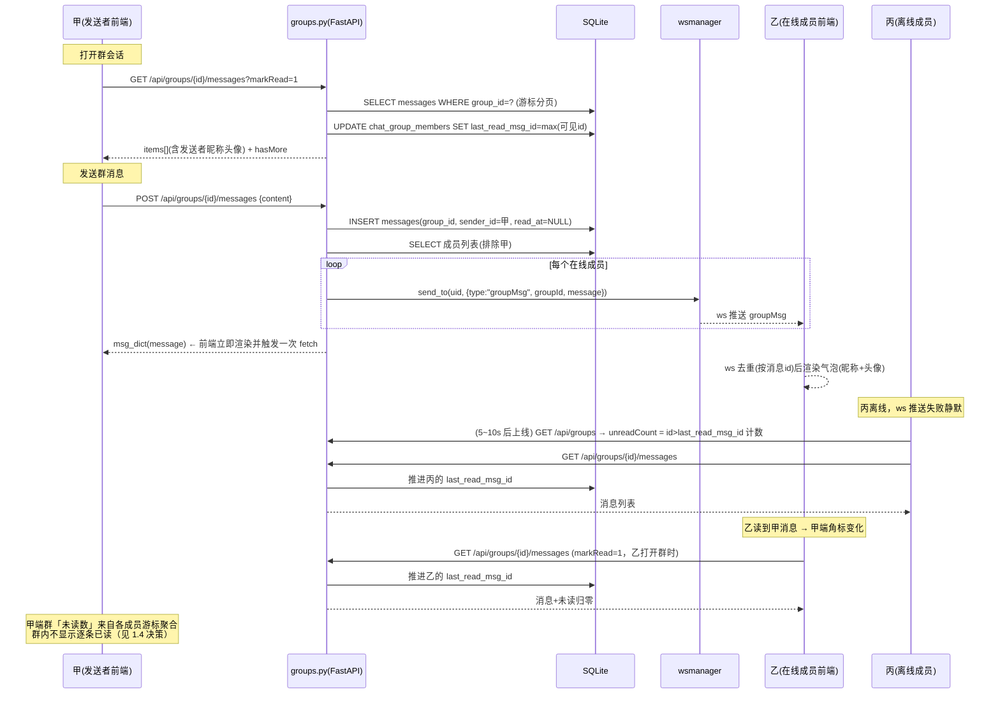
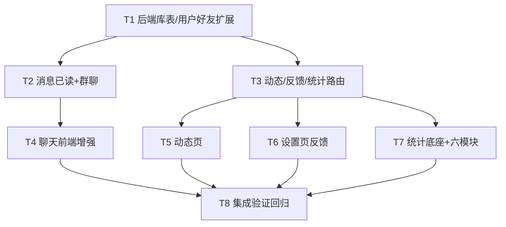

# 星途 · 增量架构设计与任务分解（2026-09-11）

> 作者：高见远（架构师）｜依据：许清楚《增量PRD-2026-09-11.md》
> 范围：P0 全部 14 项 + 前端扩展点；P1 仅在架构上预留、本轮不实现功能；P2 不做。

---

## 〇、现状勘察结论（设计前提）

| 事实 | 对设计的影响 |
|---|---|
| `chat.py` 已有 `Message.read_at`、`POST /{peer_id}/read`、`GET /unread`（按好友聚合）、`store_and_deliver()` 已接 wsmanager 推送 | P0-1 后端只差三小块：**拉取即已读、unread 明细微调、前端轮询/角标**，改动面很小 |
| `ws.py` 已实现私聊 `msg`/`readReceipt` 推送与心跳重连，`wsmanager.send_to(uid, payload)` 可按 uid 点对点投递 | 消息实时性有现成「加速通道」，但必须保持轮询为主干（见 §1.1 取舍） |
| `users.py` 公开主页已遵守隐私红线（只出 motto/bio/city/goal/tags）；`schemas.user_brief` 是公开字段统一出口 | P0-5/P0-6 的新字段必须挂在 `user_brief` 之外的**白名单增量**里，`is_friend`/`last_seen_at` 均非敏感 |
| `friends.py` 的 `is_blocked`、`is_friend`（好友对归一化 a<b）可直接复用 | 群聊建群校验、动态可见性查询直接调用，不重写 |
| `_upgrade_legacy_schema()` 已是 PRAGMA 守卫式 ALTER 模板 | 新增列照抄守卫式；**新表不用 ALTER**（`create_all` 自动建，只须同步 `建表SQL.sql`） |
| `chat-local.js` 是自包含 IIFE（自带 toast/avatar/esc/本地 AI 好友），`api.js` 覆盖层在其后加载、暴露 `api()` 与 `apiBase()` | 前端增量全部走「chat-local.js 内追加函数 + 私聊.html 追加 DOM 容器」，不动 `app.js`、不动 `chat.js`（死代码） |
| `config.js` 是唯一地址来源（`window.STUDY_API_BASE` / `getApiBase()`），版本号 `?v=YYYYMMDDx` 由 `tools/bump_versions_safe.py` 统一升 | 新 JS 一律 `apiBase()` 拼地址，禁止硬编码；改完统一 bump |

---

## Part A · 实现方案

### 1. 实现方案（逐条 P0）

#### 1.1 总体技术决策

- **架构模式**：维持「纯静态多页面 + FastAPI REST + SQLite + 轮询主干 + WebSocket 加速」。不引入消息队列、不拆服务、不加独立进程。
- **前端零新依赖**；后端零新增 pip 包（FastAPI/SQLAlchemy/pydantic 已覆盖全部需求）。
- **所有新功能遵循扩展三件套**：新增 DOM 容器 + `common.css` 末尾追加样式 + 空函数标【后续扩展点】。

#### 1.2 消息已读同步方案 —— **轮询为主干，ws 仅作在线加速**（P0-1 取舍结论）

| 方案 | 优点 | 缺点 | 结论 |
|---|---|---|---|
| A. 纯轮询（2~3s 动态间隔） | file:// 零坑、断线自愈、实现简单 | 空载请求多 | ✅ **主干** |
| B. 纯 WebSocket（ws.py） | 实时性最好 | file:// 下 WS 握手无 CORS 概念但代理/防火墙易挂；断线期间状态丢失需补拉逻辑；与轮询双通道去重复杂 | ❌ 不作主干 |
| C. 轮询主干 + ws 在线加速（在线时 ws 推送即时上屏，ws 断开自动回落轮询，重连/唤醒时强制全量拉一次） | 兼得两者，且 ws.py/`store_and_deliver`/readReceipt **已全部存在**，前端只需「收到 ws 推送就重置一次轮询计时」 | 需处理 ws 消息与轮询结果去重（按消息 id 去重即可） | ✅ **采纳** |

**具体改动**：
1. **后端 `chat.py`**：
   - `GET /{peer_id}/messages` 增加 `markRead` 参数（默认 1）：返回前把 `peer→me、id<=最新一条` 的未读消息批量置 `read_at`，并 `send_to(peer, readReceipt)` —— 实现「拉取时自动标记已读」，前端无需再显式调 read 接口（`POST /{peer_id}/read` 保留兼容）。
   - `GET /unread` 已返回 `total + items[{peerId,count,lastId,last}]`，补 `nickname/avatar` 两个字段（user_brief 白名单字段），供会话列表免二次请求渲染角标。
2. **前端 `chat-local.js`**：
   - 轮询间隔动态化：当前会话可见（`document.visibilityState==='visible'` 且会话打开）时 2.5s，否则 5s；页面隐藏时暂停。
   - `sendMsg()` 成功回调后立即触发一次 `fetchMessages()` + `fetchUnread()`（不等下一轮）。
   - 气泡渲染：自己发的消息根据 `read` 字段显示「✓已发送 / ✓✓已读」角标；收到 ws `readReceipt` 或轮询结果时局部更新 DOM（按 data-mid 定位），不整列表重绘。
   - 未读角标：会话列表项角标 = `/api/chat/unread` 的 `items[].count`；进入会话即清零（后端已随拉取置已读）。
3. **离线降级**：`api()` 失败即进入本地模式（沿用现有 localStorage 收发），角标隐藏（本地单机无「对方」概念），不报错。

#### 1.3 表情包方案（P0-2）—— 纯前端，**后端零改动**

- **决策：不新增 `kind='emoji'`，表情统一为 `kind='text'` + `[emoji:xx]` 文本内嵌语法**。理由：转发/搜索/历史渲染/本地模式全链路一致；服务端现有 5000 字长度校验天然适用；避免旧客户端遇到未知 kind 显示空白。
- **资源**：`assets/emoji/` 目录，两批资源：
  - `e001.png ~ e024.png`：24 个常用网络表情（单图 PNG，16×16 或 32×32，总大小控制在 ~200KB，随项目本地存放，不用 CDN、不用雪碧图——单图便于「收藏」按文件复用，HTTP 缓存已足够）；
  - Unicode 表情直接用字符渲染（无需资源文件）。
- **清单**：`assets/emoji/manifest.js`（IIFE，`window.STUDY_EMOJI = {list:[{code:'e001',file:'e001.png',name:'微笑'},...]}`），私聊页在 `config.js` 之后引入。
- **前端**：输入栏新增 😊 按钮 → 弹出表情面板（DOM 容器追加，含「最近使用/全部/我的收藏」三个 tab）；发送时把选中表情编码为 `[emoji:e001]` 拼进文本；气泡渲染函数 `renderContent()` 增加 `[emoji:xx]` → `` 的解析（先 esc 再替换，防注入）。
- **收藏**：常用表情存 `localStorage['study_workbench_emoji_fav']`（数组，≤16 个）。
- **降级**：纯前端逻辑，file:// 离线完全可用；对端若资源缺失，`` 回落显示 `[表情]` 文字。

#### 1.4 群聊方案（P0-3）

**新表**（同步 `database.py` + `建表SQL.sql`）：

```sql
CREATE TABLE chat_groups (
  id         INTEGER PRIMARY KEY AUTOINCREMENT,
  name       TEXT    NOT NULL,                -- ≤20 字
  owner_id   INTEGER NOT NULL REFERENCES users(id) ON DELETE CASCADE,
  avatar     TEXT,                            -- 群头像 URL（P0 默认 NULL，前端显示九宫格拼图占位）
  created_at TEXT    NOT NULL
);
CREATE TABLE chat_group_members (
  id               INTEGER PRIMARY KEY AUTOINCREMENT,
  group_id         INTEGER NOT NULL REFERENCES chat_groups(id) ON DELETE CASCADE,
  user_id          INTEGER NOT NULL REFERENCES users(id) ON DELETE CASCADE,
  role             TEXT    NOT NULL DEFAULT 'member',   -- owner / member
  last_read_msg_id INTEGER NOT NULL DEFAULT 0,  -- 群已读游标（见下）
  joined_at        TEXT    NOT NULL,
  UNIQUE(group_id, user_id)
);
CREATE INDEX ix_cgm_user ON chat_group_members(user_id);
-- messages 表加列（守卫式 ALTER）：group_id INTEGER NULL REFERENCES chat_groups(id)
-- 约定：group_id IS NULL = 私聊消息；group_id 非空 = 群消息（receiver_id 存 0 或冗余发送者，查询只用 group_id）
```

**群已读模型 —— 「每人 last_read_msg_id 游标」**（决策，见待确认 #3）：
- 每个成员在自己成员行上维护 `last_read_msg_id`；未读数 = 该群内 `id > last_read_msg_id 且 sender_id != 我` 的条数（`GET /api/groups` 列表时一并返回）。
- 打开群会话拉取消息后，自动 `POST /api/groups/{id}/read {upToId}` 推进游标。
- **群内不做逐条「对方已读」回执**（私聊才做），P0 只保证「自己的未读数准确」；群成员级已读回执列为【后续扩展点：群消息逐人已读回执】。

**新路由 `routers/groups.py`**（前缀 `/api/groups`，全部登录鉴权）：

| 方法 | 路径 | 鉴权/权限 | 说明 | 隐私字段 |
|---|---|---|---|---|
| POST | `/api/groups` | 登录；memberIds 须均为我的好友，2~49 人 | 建群（创建者自动入群 role=owner）；向每个成员 `send_to` 推 `{"type":"groupInvited"}` | 成员列表只回 user_brief 白名单 |
| GET | `/api/groups` | 登录 | 我的群列表：`items[{id,name,memberCount,lastMessage{content,kind,createdAt,senderId},unreadCount}]` | 无 |
| GET | `/api/groups/{id}` | 仅成员 | 群详情 + 成员列表（user_brief + role），上限 50 | 无 phone/gender/birthday |
| GET | `/api/groups/{id}/messages?beforeId=&limit=` | 仅成员 | 群消息分页（id 游标向前，时间正序 + hasMore），带 `markRead` 同私聊逻辑（自动推进游标） | 无 |
| POST | `/api/groups/{id}/messages` | 仅成员；黑名单不适用于群（群内屏蔽延后） | 发群消息：`Message(group_id=id, sender_id=me, receiver_id=0, kind, content)`；写库后对**除发送者外全部在线成员** `send_to` 推 `{"type":"groupMsg","groupId":..,"message":...}` | 无 |
| POST | `/api/groups/{id}/read` | 仅成员 | `{"upToId":n}` → 更新 `last_read_msg_id` | 无 |
| DELETE | `/api/groups/{id}/members/{uid}` | 仅群主 | 踢人（P1-4 提前占位，本轮实现最小版：群主可踢） | — |
| POST | `/api/groups/{id}/quit` | 登录成员 | 退群（群主退群=解散）【后续扩展点：群主转让】 | — |

- `messages.kind` 白名单扩为 `text/image/emoji-text`？——否，保持 `text/image`，emoji 走 §1.3 文本语法；`voice` 归 P1-1 本轮不开放。
- `ws.py` 增加对 `groupMsg`/`groupInvited` 的纯转发逻辑（消息仍以 REST 发送为主入口，ws 只负责在线加速投递，与私聊同模式）。
- **前端**：`私聊.html` 会话列表加「+ 发起群聊」入口 → 选人弹层（好友复选 + 搜索过滤 + 已选头像横排，≥2 人）→ 命名步（≤20 字）→ 创建后进入群会话视图；群气泡左侧显示发送者小头像+昵称（自己的消息保持右侧绿底）；`chat-local.js` 增加群会话的轮询（与私聊共用定时器，群消息端点不同）、群消息渲染、群未读角标。**本地模式**：入口置灰 + toast「群聊需要联网」。

#### 1.5 个人动态方案（P0-4）

**新表**：

```sql
CREATE TABLE moments (
  id         INTEGER PRIMARY KEY AUTOINCREMENT,
  user_id    INTEGER NOT NULL REFERENCES users(id) ON DELETE CASCADE,
  content    TEXT    NOT NULL DEFAULT '',     -- ≤2000 字
  images     TEXT    NOT NULL DEFAULT '[]',   -- JSON 数组，≤9 个 /uploads/images/ URL
  created_at TEXT    NOT NULL
);
CREATE INDEX ix_moments_user ON moments(user_id, id DESC);
CREATE TABLE moment_likes (
  id INTEGER PRIMARY KEY AUTOINCREMENT,
  moment_id INTEGER NOT NULL REFERENCES moments(id) ON DELETE CASCADE,
  user_id   INTEGER NOT NULL REFERENCES users(id) ON DELETE CASCADE,
  created_at TEXT NOT NULL,
  UNIQUE(moment_id, user_id)
);
CREATE TABLE moment_comments (
  id INTEGER PRIMARY KEY AUTOINCREMENT,
  moment_id INTEGER NOT NULL REFERENCES moments(id) ON DELETE CASCADE,
  user_id   INTEGER NOT NULL REFERENCES users(id) ON DELETE CASCADE,
  content   TEXT    NOT NULL,                 -- ≤500 字
  created_at TEXT NOT NULL
);
```

**动态可见性查询方案（仅好友）**：feed = `user_id IN (me ∪ 我的好友集合)`。好友集合用现有归一化 friends 表一次查出：
```python
friend_ids = {b if a==me else a for a,b in db.query(Friend.user_a, Friend.user_b)
              .filter(or_(Friend.user_a==me, Friend.user_b==me)).all()}
rows = db.query(Moment).filter(Moment.user_id.in_(friend_ids | {me}))...
```
不做逐行 is_friend 判断（N+1 问题），一次 IN 查询即可；`DELETE` 动态时级联删 likes/comments（FK CASCADE）+ 相关通知。

**新路由 `routers/moments.py`**（前缀 `/api/moments`，全部登录鉴权，**所有响应不含 phone/gender/birthday**，作者信息走 `user_brief`）：

| 方法 | 路径 | 权限 | 说明 |
|---|---|---|---|
| POST | `/api/moments` | 登录 | `{content, images[]}`；images ≤9 且必须以 `/uploads/images/` 开头（复用 uploads 上传，前端发布前 canvas 压缩到 ≤1MB/张） |
| GET | `/api/moments/feed?beforeId=&limit=` | 登录 | 好友动态流（含自己的），每条带 `likedByMe`、`likes[]`(昵称串)、`comments[]`、`canDelete` |
| GET | `/api/moments/user/{uid}` | 本人或其好友 | 某人动态列表（个人中心「我的动态」用） |
| POST | `/api/moments/{id}/like` | 登录 | 点赞 toggle；通知作者 `type='moment_like'` |
| GET / POST | `/api/moments/{id}/comments` | 登录 | 评论列表/发表；发评论通知作者 `type='moment_comment'` |
| DELETE | `/api/moments/comments/{cid}` | 评论本人 或 动态作者 | 删评论（PRD 明确作者可删他人评论） |
| DELETE | `/api/moments/{id}` | 动态作者本人 | 删动态 |

- **通知兼容**：`notifications.type` 是 `String(16)` 无 DB CHECK，直接写入 `moment_like`(11字)/`moment_comment`(14字) 放得下；`social.py` 的通知序列化按 type 补文案（前端 `api.js` 通知铃铛渲染补两种类型文案），`note_id` 置 NULL、新增 `moment_id` 冗余到通知的 `content` 摘要中（避免 notifications 表加列，采用「把 moment 摘要写进现有可扩展位」——若 social.py 通知渲染依赖 note_id 跳转，则对 moment 类通知前端不跳笔记、跳动态页）。
- **前端**：新增 `动态.html`（布局同模块页：.content 内单列 max-width 640px；发布卡 + 动态流 + 评论区 + 自己动态「···」删除二次确认；图片九宫格；lightbox 放大为 P1-2，本轮 DOM 容器预留【后续扩展点：动态图片 lightbox 放大浏览】）；`个人中心.html` 加「我的动态」入口卡与本人动态列表（含删除）。离线：发布框禁用 + 「动态需联网发布」；本地草稿暂存 `study_workbench_moment_draft`，恢复后一键补发【后续扩展点】。

#### 1.6 好友 UI 与在线状态（P0-5 / P0-6）

- **isFriend 字段**（P0-5）：`users.py public_profile` 与 `friends.py GET /api/friends/search` 响应各补 `"isFriend": is_friend(db, user.id, target.id)`。纯布尔，不碰隐私字段。前端：他人主页/好友申请页搜索结果，**按钮初始禁用「…」态**，接口回来后再切换「添加好友 / 发消息」；缓存上次已知状态于 `study_workbench_friend_hint`，接口失败时用缓存，无缓存保持禁用。
- **last_seen_at**（P0-6）：
  - `users` 表加列 `last_seen_at TEXT NULL`（守卫式 ALTER）。
  - 刷新点：`security.get_current_user()` 依赖内顺带刷新 —— 内存节流表 `_last_seen_cache: dict[uid, epoch]`，距上次落库 >60s 才 UPDATE（避免每请求写库）。
  - 展示口径：`online = (now - last_seen_at) ≤ 5 分钟`；文案分级：在线=绿点；<1h「x 分钟前在线」；<1d「x 小时前在线」；否则「x 天前在线」。
  - **接口**：并入 `GET /api/users/{id}` 返回 `lastSeenAt` + `online`（单点场景），另加批量接口 `GET /api/users/presence?ids=1,2,3`（私聊好友列表一次刷新全部好友状态；仅返回 `{id, lastSeenAt, online}`，非敏感，无隐私字段）。
  - 前端：私聊好友列表每 30s 刷一次 presence；失败显示「--」。

#### 1.7 帮助与反馈（P0-7）

```sql
CREATE TABLE feedbacks (
  id         INTEGER PRIMARY KEY AUTOINCREMENT,
  user_id    INTEGER REFERENCES users(id) ON DELETE SET NULL,  -- 匿名时仍记录（防滥用），对外不回显
  type       TEXT NOT NULL DEFAULT 'other',   -- bug/suggest/content/other
  content    TEXT NOT NULL,                   -- ≥10 字
  screenshot TEXT,                            -- /uploads/images/ URL（可选 1 张，复用 uploads）
  status     TEXT NOT NULL DEFAULT 'pending', -- pending / replied
  created_at TEXT NOT NULL
);
```

- 路由 `routers/feedback.py`：
  - `POST /api/feedbacks`：登录鉴权；`rate_limit.py` 限频（每用户 10 分钟 ≤1 条、每天 ≤5 条，沿用现有限频器）；返回 `{"id": 123}`，前端 toast「已收到，编号 #123」。
  - `GET /api/feedbacks/mine`：我的反馈列表（状态+时间），**回显时匿名=true 则不出昵称**。
  - 管理员查询/处理接口（P1-7）本轮只留【后续扩展点：反馈处理台】空函数。
- 前端 `设置.html`「数据管理」卡之后插入「🆘 帮助与反馈」卡：FAQ 手风琴（5~8 条纯前端静态内容，离线可用）+ 反馈表单（类型下拉/描述 ≥10 字/截图可选/匿名开关默认关）。降级：提交失败 → 本地暂存 `study_workbench_feedback_outbox` + 提示「反馈暂未送达，请稍后重试」，恢复后自动补发【后续扩展点】。

#### 1.8 学习统计底座 study-stats.js（P0-8，六模块共用）

**数据模型（本地优先）**：

```
localStorage['study_workbench_stats'] = {
  version: 1,
  modules: {                       // module key 固定枚举
    cet4:    { total: 0, days: { '2026-09-11': { minutes: 25, events: { start: 2, task: 1 } } } },
    xingce:  { ... }, eq: {...}, etiquette: {...}, ppt: {...}, tools: {...}
  },
  lastActiveDay: '2026-09-11',     // 连续打卡计算用
  streak: 3,                       // 冗余连续天数，跨天时惰性重算
  syncAt: 0                        // 最近一次与云端合并时间【后续扩展点：账号级云同步】
}
```

**API**（`routers/study.py`，登录鉴权，用于云端汇聚与【后续扩展点：云同步】）：

| 方法 | 路径 | 说明 |
|---|---|---|
| POST | `/api/study/logs` | 批量上报 `[{module,event,payload,createdAt}]`（≤100 条/次，幂等去重键 `user_id+module+event+payload_hash+createdAt`）；写 `study_logs` 表 |
| GET | `/api/study/summary?module=cet4` | 聚合：近 7 天每日分钟数/事件数、累计次数（服务端聚合口径） |

```sql
CREATE TABLE study_logs (
  id INTEGER PRIMARY KEY AUTOINCREMENT,
  user_id INTEGER NOT NULL REFERENCES users(id) ON DELETE CASCADE,
  module TEXT NOT NULL,            -- cet4/xingce/eq/etiquette/ppt/tools
  event  TEXT NOT NULL,            -- start/finish/task/answer/tool_use...
  payload TEXT NOT NULL DEFAULT '{}',  -- JSON（题型、正确数等）
  created_at TEXT NOT NULL
);
CREATE INDEX ix_study_user_module ON study_logs(user_id, module, created_at);
```

**study-stats.js（原生 JS，约 300 行）对外契约**：
- `StudyStats.track(module, event, payload)`：先写 localStorage（同步、即时可见），再把记录 push 进上报队列；后端可达时异步 `POST /api/study/logs`（fire-and-forget，失败静默留在队列下次重试）——**渲染永远只读本地**，云同步【后续扩展点：study-stats 云端合并 syncFromCloud() 空函数】。
- `StudyStats.render(containerId, module)`：渲染统一「📊 学习概况」卡（今日分钟/累计次数/连续打卡/7 天纯 CSS 柱图），样式 `.study-stats-*` 追加 common.css 末尾。
- 心跳计时长：页面 `visibilitychange` + 模块页进入/离开打点（`start`/`finish` 事件差值 = 分钟数）。

#### 1.9 六个学习模块功能项（P0-9 ~ P0-14，全部基于 1.8 底座，纯前端 + 可离线）

| # | 模块页 | 方案 |
|---|---|---|
| P0-9 | 四级备考 | 「🎯 考试冲刺」卡：目标日期存 `study_workbench_cet4_goal_date`，倒计时=日期差；每日任务三勾选（背词/阅读/听力）存 `study_workbench_cet4_daily_tasks`（按日期重置），勾选联动 `StudyStats.track('cet4','task')`；完成率环形 = conic-gradient 纯 CSS |
| P0-10 | 央国企笔试 | 读取现有行测本地做题记录（app.js 已有的错题/做题数据键，只读不改），按 5 题型聚合正确率 → 横向条形（>80 绿 / 50~80 黄 / <50 红）；最低题型置顶「今日建议练：XX」+「去练习」锚点跳转 |
| P0-11 | 高情商表达 | 情景题库扩充（本地 JS 数组追加）+ 答后正误反馈；「🤖 AI 点评」按钮 → `apiBase()+'/api/ai/chat'` 流式（Prompt 预置情景话术教练人设，密钥在后端）；离线时按钮隐藏 + 「需联网」提示 |
| P0-12 | 商务礼仪面试 | 题库四分类 tab（自我介绍/简历深挖/压力面/礼仪细节）；「开始模拟面试」→ 右下 AI 面板以面试官人设多轮对话（复用现有 AI 助手面板与 `/api/ai/chat`，追加面试官 system prompt 与追问策略）；结束后总评【后续扩展点：面试报告导出】 |
| P0-13 | PPT训练 | 三关步骤条（案例拆解→版式仿写→限时命题），进度存 `study_workbench_ppt_path`；作品集卡片网格（标题+缩略图 dataURL+日期+查看），存 `study_workbench_ppt_portfolio`（localStorage 容量超限时提示只存文本笔记） |
| P0-14 | 学习工作台（更多工具面板） | 四工具卡右上角灰色小字「x 天前用过 · 共 n 次」= `StudyStats` 读 `tools` 模块 `tool_use` 事件（payload.tool=ai_interview/ppt_assets/cet4_share/xuetu）；卡片按最近使用降序重排，默认顺序开关【后续扩展点】 |

### 2. 文件清单

| 路径 | 新增/修改 | 职责 |
|---|---|---|
| `server/database.py` | 修改 | 新增 6 表模型（chat_groups/chat_group_members/moments/moment_likes/moment_comments/feedbacks/study_logs 共 7 张）+ Message.group_id + User.last_seen_at + `_upgrade_legacy_schema` 补两条守卫 ALTER |
| `server/建表SQL.sql` | 修改 | 同步新表与加列 DDL |
| `server/routers/chat.py` | 修改 | messages 拉取即已读（markRead + readReceipt 回推）；unread 补 nickname/avatar |
| `server/routers/groups.py` | **新增** | 群聊全部路由（建群/列表/详情/消息/已读/踢人/退群） |
| `server/routers/moments.py` | **新增** | 动态发布/好友流/点赞/评论/删除 |
| `server/routers/feedback.py` | **新增** | 反馈提交（限频）/我的反馈 |
| `server/routers/study.py` | **新增** | 学习日志批量上报/聚合查询 |
| `server/routers/users.py` | 修改 | 公开主页补 isFriend/lastSeenAt/online；新增 GET /api/users/presence |
| `server/routers/friends.py` | 修改 | search 补 isFriend |
| `server/routers/social.py` | 修改 | 通知序列化兼容 moment_like/moment_comment 类型 |
| `server/security.py` | 修改 | get_current_user 内 60s 节流刷新 last_seen_at |
| `server/ws.py` | 修改 | 转发 groupMsg/groupInvited 推送（复用 wsmanager） |
| `server/main.py` | 修改 | 挂载 4 个新 router |
| `server/scripts/smoke_m5.py` | **新增** | 本轮冒烟脚本（建群→发消息→已读；发动态→点赞→评论；反馈；study 上报） |
| `assets/study-stats.js` | **新增** | 统一埋点 + 统计卡渲染（本地优先） |
| `assets/emoji/manifest.js` | **新增** | 表情清单（window.STUDY_EMOJI） |
| `assets/emoji/e001~e024.png` | **新增** | 24 个表情图（项目本地资源） |
| `assets/chat-local.js` | 修改 | 已读角标/动态轮询/表情面板/群聊会话/群建群弹层（函数级追加） |
| `私聊.html` | 修改 | 表情按钮+面板容器、发起群聊入口、群会话视图 DOM、presence 圆点 |
| `动态.html` | **新增** | 朋友圈式动态页（发布卡+流+评论+删除） |
| `个人中心.html` | 修改 | 「我的动态」入口卡与本人动态列表 |
| `设置.html` | 修改 | 「帮助与反馈」卡（FAQ 手风琴+反馈表单+我的反馈） |
| `assets/common.css` | 修改 | 末尾追加：表情面板/群聊/动态页/反馈卡/study-stats/在线圆点等样式段 |
| `四级备考.html` | 修改 | 统计卡容器 + 「考试冲刺」卡 |
| `央国企笔试.html` | 修改 | 统计卡容器 + 题型正确率条形组 + 弱项提示条 |
| `高情商表达.html` | 修改 | 统计卡容器 + 分类 tab + AI 点评按钮 |
| `商务礼仪面试.html` | 修改 | 统计卡容器 + 四分类 tab + 模拟面试入口 |
| `PPT训练.html` | 修改 | 统计卡容器 + 学习路径卡 + 作品集卡 |
| `学习工作台.html` | 修改 | 更多工具面板：使用痕迹小字 + 按最近使用排序 |
| `tools/verifier/test-increment.js` | **新增** | jsdom 前端断言（已读角标/表情编码解码/群弹层校验/study-stats 渲染/倒计时） |

### 3. 数据结构与接口（Mermaid classDiagram）



### 4. 核心调用流（群聊消息 + 已读，最复杂链路）



### 5. Anything UNCLEAR → 见 §7「待明确事项」

---

## Part B · 任务分解

### 6. 依赖包

- **后端：无新增 pip 包**（FastAPI + SQLAlchemy + pydantic + 现有 rate_limit/websockets 覆盖全部需求）。
- **前端：零依赖**（原生 JS + 纯 CSS 柱图/环形图 + 项目本地表情 PNG）。
- 验证工具沿用现有：`tools/verifier/`（jsdom 已装）、`node --check`、`python -m py_compile`。

### 7. 任务列表（按「后端先行 → 共享层 → 各页面 → 测试」排布）

#### T1 后端·库表与用户/好友侧扩展 【规模：中】
- **涉及文件**：`server/database.py`（7 张新表模型 + Message.group_id + User.last_seen_at + `_upgrade_legacy_schema` 两条守卫 ALTER）、`server/建表SQL.sql`、`server/routers/users.py`（isFriend/lastSeenAt/online + GET /api/users/presence）、`server/routers/friends.py`（search 补 isFriend）、`server/security.py`（60s 节流刷新 last_seen）、`server/schemas.py`（如需扩展白名单序列化）
- **依赖**：无
- **验收要点**：旧库启动无损（`_upgrade_legacy_schema` 幂等）；`GET /api/users/{id}` 返回 isFriend/lastSeenAt/online 且**响应 JSON 序列化后不含 phone/gender/birthday**（写断言）；`GET /api/users/presence?ids=` 批量返回；连续两次请求间隔 <60s 时 last_seen_at 不重复落库。

#### T2 后端·消息已读同步 + 群聊路由 【规模：大】
- **涉及文件**：`server/routers/chat.py`（markRead 拉取即已读 + readReceipt 回推、unread 补昵称头像）、`server/routers/groups.py`（新增，7 个端点 + 50 人上限 + 好友校验）、`server/ws.py`（groupMsg/groupInvited 转发）、`server/main.py`（挂载 groups）
- **依赖**：T1
- **验收要点**：甲乙互发消息，乙拉取后甲端 5s 内收到 readReceipt（smoke 脚本验证 read_at 非空）；非好友/非成员访问群接口 403；建群第 51 人被拒；群消息只有成员可见；`python -m py_compile` 全部通过。

#### T3 后端·动态/反馈/学习统计路由 【规模：中】
- **涉及文件**：`server/routers/moments.py`（新增）、`server/routers/feedback.py`（新增，rate_limit 限频）、`server/routers/study.py`（新增，批量上报幂等）、`server/routers/social.py`（通知兼容 moment_like/moment_comment）、`server/main.py`（挂载 3 个新 router）
- **依赖**：T1
- **验收要点**：feed 仅含自己+好友动态（用第三用户断言不可见）；作者可删他人对自己动态的评论；点赞后 notifications 出现 moment_like 记录；反馈 10 分钟内第二条被限频（429/400）；study 批量上报重复提交不产生重复行；所有公开响应无隐私字段。

#### T4 前端·聊天增强（已读角标 + 表情包 + 群聊） 【规模：大】
- **涉及文件**：`assets/emoji/`（24 张 PNG + manifest.js）、`assets/chat-local.js`（已读角标/动态轮询/表情面板/[emoji:xx] 渲染/建群弹层/群会话/群轮询/presence 圆点，函数级追加）、`私聊.html`（表情按钮+面板容器+发起群聊入口+群会话 DOM+在线圆点，扩展三件套）、`assets/common.css`（末尾追加）
- **依赖**：T2
- **验收要点**：断后端 file:// 直开——表情面板可选可发、本地模式收发不报错、群聊入口置灰；`node --check` 通过；jsdom 断言：`[emoji:e001]` 渲染为 img 且 esc 在替换前执行（XSS 用例）；气泡 ✓/✓✓ 角标随 mock 的 read 字段切换；选 1 人时「下一步」禁用。

#### T5 前端·动态页 + 个人中心入口 【规模：中】
- **涉及文件**：`动态.html`（新增，布局在 .content 内单列 640px）、`个人中心.html`（我的动态入口卡+列表+删除）、`assets/common.css`（动态卡/九宫格样式）
- **依赖**：T3
- **验收要点**：发布 3 图动态（本地 canvas 压缩后走 /api/uploads）→ 好友端动态页可见、点赞评论后作者通知铃铛出现新文案；作者能删自己的动态与收到的评论；后端不可用时发布框禁用提示且草稿暂存 localStorage；页面 div 配平。

#### T6 前端·设置页帮助与反馈 【规模：小】
- **涉及文件**：`设置.html`（帮助与反馈卡：FAQ 手风琴 + 表单 + 我的反馈列表）、`assets/common.css`（手风琴/表单样式）
- **依赖**：T3
- **验收要点**：FAQ 离线可展开收起；<10 字提交被前端拦截；成功 toast 显示编号 #id 且「我的反馈」出现记录；提交失败本地暂存 `study_workbench_feedback_outbox`。

#### T7 前端·学习统计底座 + 六模块增强 【规模：大】
- **涉及文件**：`assets/study-stats.js`（新增）、`四级备考.html`、`央国企笔试.html`、`高情商表达.html`、`商务礼仪面试.html`、`PPT训练.html`、`学习工作台.html`（更多工具面板重构）、`assets/common.css`（.study-stats-*）
- **依赖**：T3（study 上报接口）、T4 无依赖可并行
- **验收要点**：六页均出现统计卡；操作后数字/柱图即时变化；**断后端刷新统计不丢**（localStorage 持久）且上报队列不阻塞 UI；四级倒计时按目标日期正确；行测正确率条形与本地记录一致且最低题型出现「今日建议练」；AI 点评按钮断网时提示「需联网」且答题不受影响；PPT 三关进度与作品集刷新不丢；更多工具四卡显示「x 天前用过 · 共 n 次」并按最近使用排序。

#### T8 集成验证与回归 【规模：中】
- **涉及文件**：`tools/verifier/test-increment.js`（新增 jsdom 断言集）、`server/scripts/smoke_m5.py`（后端冒烟）、`tools/bump_versions_safe.py` 执行（全页 ?v= 升版）
- **依赖**：T4、T5、T6、T7
- **验收要点**：全部 19+ 页 div 配平、`node --check` 全绿、`python -m py_compile` 全绿；jsdom 断言全过；smoke_m5 走通「建群→发群消息→已读→发动态→点赞→评论→删评→反馈→study 上报」；隐私红线回归——公开主页/动态/群成员三类接口响应字符串中不含 phone/gender/birthday 键名。

**依赖图**：



### 8. 共享知识（跨文件约定）

1. **API 地址**：一律 `window.STUDY_API_BASE` / `getApiBase()`（config.js 唯一来源），新 JS 禁止硬编码；图片/语音 URL 存相对路径 `/uploads/...`，渲染时用 `apiBase()` 拼前缀。
2. **返回包格式**：沿用现状——成功直接返回业务 dict（列表类统一 `{"items": [...], "hasMore": bool, "nextBefore": n}`，分页游标用消息/动态 `id` 向前翻）；错误用 `HTTPException(400/401/403/404, "中文提示")`，前端 `api()` 统一抛错弹 toast。**不做全局 {code,data,message} 包装**（与现有全部接口保持一致，避免前端双轨）。
3. **字段命名**：对外 JSON 一律 camelCase（peerId/unreadCount/lastReadMsgId/likedByMe），内部 Python snake_case。
4. **隐私红线**：所有公开接口的作者信息一律经 `schemas.user_brief()` 出口，新增字段（isFriend/lastSeenAt/online）不得夹带 phone/gender/birthday；T8 有字符串级回归断言。
5. **localStorage 键**：新增键统一前缀 `study_workbench_*`（stats/cet4_goal_date/cet4_daily_tasks/ppt_path/ppt_portfolio/emoji_fav/feedback_outbox/moment_draft/friend_hint）；`chat-local.js` 既有 `study_im_*` 键保持不动（兼容存量数据）。
6. **版本号**：所有被修改的 html 中 `<script>/<link>` 引用统一 `?v=20260911a`，由 `tools/bump_versions_safe.py` 批量升级，新页面同样带版本号。
7. **表结构三同步**：任何新表/加列 → `database.py` 模型 + `建表SQL.sql` + （加列才需要）`_upgrade_legacy_schema()` 守卫 ALTER；新表靠 `create_all` 自动建。
8. **扩展三件套**：每个新增 UI 区块 = DOM 容器（带注释 `<!-- 【后续扩展点】... -->`）+ common.css 样式段 + 空函数（如 `syncFromCloud()`、`groupReadReceipt()`、`voiceCall()`、`momentLightbox()`、`feedbackAdmin()`），并保证空实现不报错。
9. **离线降级基线**：任何新功能在 `api()` 抛错时走 try/catch → 本地模式或明确提示，绝不白屏；`document.visibilityState==='hidden'` 时暂停所有轮询。
10. **server/ 现状纪律**：只允许新增文件 + 最小化修改现有 .py（本轮涉及 database/security/main/social/users/friends/chat/ws 八个文件的定点修改），禁止整目录重写；AI 密钥链路与 `app.js` 登录门禁零改动。

### 9. 待明确事项（≤5，附决策建议）

| # | 事项 | 建议 |
|---|---|---|
| 1 | **表情包不新增 kind='emoji'**，统一 text + `[emoji:xx]` 语法（PRD 原文写了 Message.type 支持 text/emoji） | 建议按本方案执行：转发/搜索/渲染统一、后端零改动；若坚持独立 kind 需增加 3 处兼容代码 |
| 2 | **群已读模型**：采用「每人 last_read_msg_id 游标」，群内不显示逐条「对方已读」，只保证自己未读数准确 | 建议接受；逐条已读回执在 50 人群下是 O(n²) 更新，SQLite+轮询架构不划算，已标【后续扩展点】 |
| 3 | **在线判定阈值**：5 分钟内有任意鉴权请求 = 在线（绿点）；presence 批量接口按需拉 | 建议接受；阈值后续可做成 config.py 常量 |
| 4 | **反馈匿名**：匿名时 user_id 仍落库（防滥用/追责），仅列表回显不出现昵称 | 建议接受；如用户要求彻底匿名则改 user_id 可空并放弃防滥用 |
| 5 | **P1-4 群聊管理**我提前实现了最小版（群主踢人 + 退群），转让/改群名留 P1 | 如认为应严格按 PRD 砍掉，删除 groups.py 两个端点即可，不影响其他任务 |

---
*设计完成时间：2026-09-11｜架构师：高见远*
