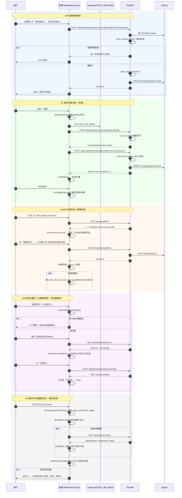
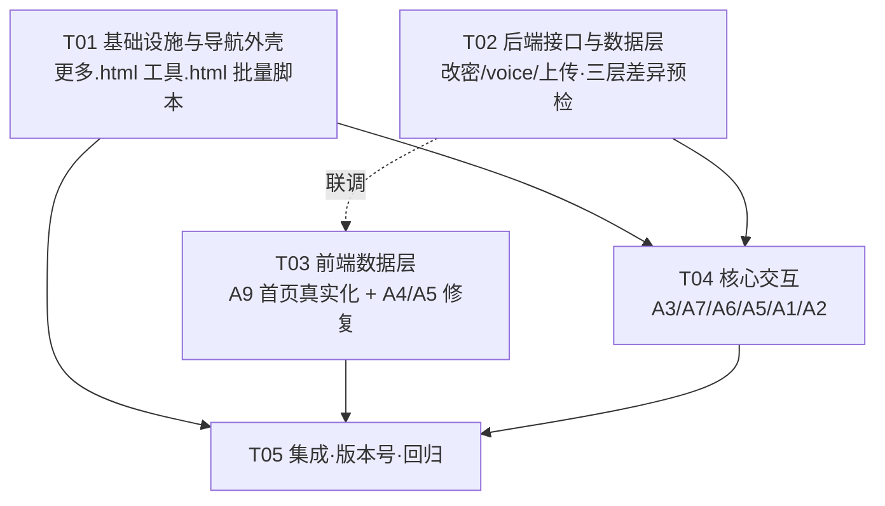

# 星途 · 增量架构设计（批次一）· 2026-09-11

> 作者：高见远（架构师）｜状态：待评审
> 范围：**仅批次一 A1–A9（9 项）**。批次二（B1–B6）/ 批次三（C1–C6）**不在本文件**，后续单独评审。
> 输入：《增量PRD-最终版-2026-09-11.md》（Alice）、《缺陷清单-2026-09-11.md》（Edward）、《运行说明.md》《增量修改说明.md》。
> 全部设计基于**源码逐行核对**（非推测），关键行号均已实测确认，见文末「附录 A：核实记录」。

---

## 0. 前置共识（设计必须遵守的硬约束）

| # | 约束 | 对设计的含义 |
|---|---|---|
| 1 | 多页纯静态 HTML，原生 JS，**零 CDN**，`file://` 必须可直开；无后端时功能降级 | 新功能全部**本地优先**；不得引任何外链库 |
| 2 | 后端地址**唯一来源** `assets/config.js`（`window.STUDY_API_BASE`：http 同源 `''`／`file:` 绝对地址） | 新 JS **禁止硬编码 IP**，一律 `window.STUDY_API_BASE ?? window.getApiBase()` |
| 3 | `assets/api.js` 是覆盖层，**必须在 `app.js` 之后加载**；`assets/chat-local.js` 是私信真实逻辑（`chat.js` 是死代码，**不要动**） | 新逻辑挂 `chat-local.js` 或新增独立文件，且保持在 `app.js` 之后 |
| 4 | **扩展三件套**：DOM 容器 + CSS + 空函数标【后续扩展点】；**不删原功能、保留原 DOM** | 旧弹层/旧整页全部保留可回退 |
| 5 | 新建页面**必须复制全站共用 DOM**（至少 `#countdownModal`，含 cdName/cdDate/cdColorPicker/cdPinned/countdownModalTitle + 取消/保存） | 否则 `app.js:1213` 顶层无守卫的 `getElementById('countdownModal').addEventListener` 抛异常，**打断整页初始化** |
| 6 | 旧库迁移只走 `server/database.py::_upgrade_legacy_schema()` 的 `PRAGMA` 守卫式 `ALTER TABLE`，无损 | 本批如需加列，全部追加到该函数末尾（幂等） |
| 7 | 🚨 **本地 `server/` 可能是旧副本**，服务器有而本地缺的以**服务器版为基线打补丁** | 每个后端文件改动前先做**三层差异预检**，绝不用本地旧版整文件覆盖（SOP 见 §E） |
| 8 | 隐私红线：公开接口**绝不返回** phone/gender/birthday | 新接口/新页面一律走 `schemas.user_brief` 白名单（`{id,nickname,avatarUrl}`） |
| 9 | 版本号：新引用写 `?v=YYYYMMDDx`；**注释里的资源引用不带版本号**；批量替换只作用于真正的 `<script src=`/`<link href=` 行 | 升级一律用 `tools/bump_versions_safe.py`，不得全局 sed |

---

# A 部分 · 系统设计

## 1. 实现方案（逐项 A1–A9）

> 每项格式：**目标 → 已核实根因 → 改法（文件:行） → 兼容/回退 → 离线降级**。

### A1 群聊弹窗定位（→ 健壮性加固）

- **目标**：弹窗强制居中、层级高于底部导航、遮罩/`Esc` 全端一致关闭。
- **已核实**：QA 首轮 5 档视口实测弹窗**严格居中**（`#imGroupModal` 是 `.app` 直接子级，`position:fixed` 未被祖先 transform 影响），**无可复现缺陷**。故按 PRD 走**预案②加固**。
- **改法**：
  - `assets/common.css`（末尾追加）：`.im-overlay` 补 `z-index:10000`（高于 `.bottom-nav` 的 z-index，见既有底部导航层级）、`padding:env(safe-area-inset-top) env(safe-area-inset-right) env(safe-area-inset-bottom) env(safe-area-inset-left)`；`.im-modal{ margin:auto; max-height:calc(100vh - 40px); max-height:calc(100dvh - 40px); overflow:auto }`。
  - `assets/chat-local.js`：新增**统一 `Esc` 关闭**——在 `imOpenGroupCreator()`（:927）打开时 `document.addEventListener('keydown', imEscClose)`；`imCloseGroupCreator()` 中移除该监听（避免泄漏）。
  - `私聊.html:199` 现有 `onclick="if(event.target===this)imCloseGroupCreator()"` 保持不动（点遮罩关闭已具备）。
- **兼容/回退**：只加样式与键盘监听，不改 DOM 结构；旧行为（点遮罩/✕ 关闭）不变。
- **离线**：纯前端，同样生效。

### A2 群聊/会话列表头像误触（→ 分区 + 防冒泡加固）

- **目标**：列表内头像点击**不外溢**（不跳主页、不误触会话、不触发全局委托），行点击才进会话；群聊多选列表头像**一律只走勾选**。
- **已核实根因**（QA A-② 确认）：
  - 群聊多选列表头像（`chat-local.js:950-956`、`:988-992`）**本就无 onclick**，冒泡到行 → `imToggleGroupMember`，**已符合预期**，仅需防回归加固。
  - **真实误触来源**：会话列表头像 `chat-local.js:178-182`、好友列表头像 `chat-local.js:261-262` 显式绑 `openUserHome(serverId)` → 跳对方主页 → 用户观感为“点错了”。
  - 全局点击委托仅 `app.js:5499`（只用于收起搜索下拉），**不会**造成跳转。
- **改法**：
  - `chat-local.js:178-182`（会话列表）：把头像点击从“跳主页”改为**次级显式动作**——给头像 `onclick="event.stopPropagation();imShowPeerHint(...)"` 不再直接 `openUserHome`；或保留 `openUserHome` 但**缩小可点热区**为头像内小图标（推荐前者，减少误触）。**行** `onclick="imOpenChat(id)"` 不变。
  - `chat-local.js:261-262`（好友列表）：头像/昵称上的 `openUserHome` 保留为「查看资料」，但**全部加 `event.stopPropagation()`**（已有），并把「发消息」按钮与行的进会话路径收敛到**同一** `imOpenChat`。
  - 群聊多选列表：给 `.im-av` 显式加 `onclick="event.stopPropagation();window.imToggleGroupMember(id)"`（**双保险**，即使无 onclick 也不外溢）。
- **兼容/回退**：仅调整 click 绑定，DOM/函数保留；`openUserHome` 仍可从资料入口进入（`个人中心.html?user=`）。
- **离线**：本地模式同样生效。

### A3 加好友 → 统一为 `.im-*` 模态弹层

- **目标**：私聊页「➕ 加好友」由**跳整页**改为**与群聊同源的模态**；旧整页 `好友申请.html` **保留可回退**。
- **已核实**：`私聊.html:89` 现为 `onclick="location.href='好友申请.html'"`；群聊弹层为 `.im-overlay/.im-modal`（`私聊.html:199-205`）；加好友逻辑现存在**三处**：`好友申请.html:99-121`（`.af-*`）、`chat-local.js:787-830`（搜索结果行内 `imAddServerFriend`）、`api.js:201`（他人主页按钮）。
- **改法（抽公共、避免两套逻辑）**：
  1. `私聊.html` 底部（紧邻 `#imGroupModal`，:196-205 之后）**新增** `#imAddFriendModal`（`.im-overlay`+`.im-modal`，同源样式）：标题「添加好友」+ ✕ + 搜索框（占位「输入昵称或 @账号」）+ `#imAfResults` 列表容器。**旧整页 `好友申请.html` 一字不动**。
  2. `私聊.html:89` 改 `onclick="imOpenAddFriendModal()"`（原 `location.href` 删除，改由新函数打开模态；**保留** `<a>` 指向旧页的隐藏回退入口，标【后续扩展点：旧页回退】）。
  3. `chat-local.js` **抽公共渲染函数** `imRenderFriendRows(items)`（结果行：头像 + 昵称 + `@账号` + 状态按钮），**同时**供新模态与既有搜索结果（`:787-798`）复用；状态判定统一为：`isFriend→「发消息」`、`已发送→禁灰「已发送」`、`blockedMe→「不可添加」`、否则`「加好友」`。
  4. `imOpenAddFriendModal()`/`imCloseAddFriendModal()`/`imAfSearch(kw)`（300ms 防抖）/`imAfSendRequest(uid,btn)`/`imAfOpenChat(uid,name)`（关模态→`imOpenChat`）新增在 `chat-local.js`。
- **兼容/回退**：旧整页仍在；`imAddServerFriend`（:810）保留（旧入口仍可调用）。
- **离线**：`!getToken()` 时模态入口置灰 + 提示「加好友需要联网」。
- **验收**：明暗主题下模态与群聊弹层按钮/卡片/头像/列表行视觉一致；页面 `div` 配平；旧 `好友申请.html` 可访问。

### A4 已是好友仍显示「加为好友」（→ 消费 `isFriend` + 修 `api.js:191` 类型错误）

- **已核实根因**（QA A-④ 确认，双重错误）：
  1. `assets/api.js:191` `var friends = await api('/api/friends'); isFriend = friends.some(...)` —— 后端 `GET /api/friends` 返回 **`{items:[…],total:n}`（对象非数组）**（`server/routers/friends.py:145-158`），对对象调 `.some` 抛 `TypeError`，被 `catch(e){}`(:193) 吞掉 → `isFriend` **恒 false**。
  2. 即便取出 `items`，元素是**平铺 peer brief**（`{...user_brief, motto, since}`），**没有 `.user` 嵌套**，`f.user` 恒 `undefined`。
  3. 后端 `GET /api/users/{id}` **已返回 `isFriend`**（`server/routers/users.py:150`），前端 `renderUserHome` 未消费。
- **改法**（`assets/api.js:187-202`）：
  ```js
  // 优先直接消费后端已返回的 isFriend（users.py:150），并兼容 {items:[]} 与数组两种结构
  var isFriend = !!u.isFriend;
  if (!('isFriend' in u)) {              // 兼容未升级的旧后端：回退查好友列表
    try {
      var f = await api('/api/friends');
      var list = (f && f.items) || (Array.isArray(f) ? f : []);
      isFriend = list.some(function (x) {
        return x.id === userId || (x.user && x.user.id === userId);
      });
    } catch (e) { isFriend = false; }
  }
  ```
  并把 `:196-202` 按钮分支收敛为：`isFriend` → **「💬 发消息」+「🗑 删除好友」**（A5）；否则 → 「👤 加为好友」。
- **同时**：`好友申请.html:104` 与 `chat-local.js:791-793` 的「已是好友」灰按钮 → 改为**可点「发消息」**（复用 `imRenderFriendRows` 的统一规则）。
- **兼容/回退**：函数签名不变；`removeFriend`（:250）仍可用。
- **离线**：本地可用 `study_workbench_friend_hint` 缓存上次判定；无缓存时按钮禁用（避免误判）。

### A5 新增「删除好友」入口（规模下调为 S）

- **已核实**：后端 `DELETE /api/friends/{peer_id}`（`friends.py:161-169`）**已存在**，语义 = **删除好友关系**（删 `friends` 行，双向失效），**不是**拒绝申请。前端 `removeFriend()`（`api.js:250-257`）已写好，但被 A4 布尔错误卡死不可达。
- **改法**：
  - A4 修好后，`api.js:199` 的「🗑 删除好友」自动可达（他人公开主页）。
  - **好友列表**新增入口：`chat-local.js renderFriends`（:259-269）每行「···」或显式「删除」，调用新函数 `imRemoveFriend(serverId, nickname)`。
  - **`好友申请.html`** 已好友行（`:104`）在改为「发消息」后，追加「删除好友」次级按钮。
  - 删除弹窗：`uiConfirm`/自定义模态，二次确认含昵称；勾选项「同时清空本机聊天记录」**默认不勾**。
- **「同时清空聊天记录」清哪些键/服务端是否支持**：
  - **本地**：`localStorage['study_im_local_data']` 中 `messages[peerId]` 与 `chats[peerId]`（键名见 `chat-local.js:36`）。
  - **服务端**：**当前无「删除会话/消息」接口**，服务端历史消息**不删除**（删好友后因 `require_friend`/`is_friend` 校验，双方无法再拉取，`chat.py:61`）。→ 明确提示用户「仅清除本机记录」；后续可加 `DELETE /api/chat/{peer_id}/messages`（列【后续扩展点】）。
- **离线**：无后端无好友关系 → **隐藏删除入口**。
- **验收**：删除后双方好友列表互不可见、无法再私聊（提示非好友）、动态流不含对方；重新搜索可再次添加；勾选清空时本地会话消失。

### A6 设置页「修改密码」（→ 新增后端接口 + 前端表单）

- **已核实**：
  - 前端 `设置.html:1034`：在线分支 `showToast('ℹ️ …（【后续扩展点】）'); return;`，**无表单无请求**；本地单机分支（:1035-1051）走 `study_workbench_users` + `stSimpleHash`，**已可用**。
  - 后端 `server/routers/auth.py` 只有 `register:32 / login:53 / refresh:61 / me:73`，**无 change-password**。
  - `server/security.py`：`hash_password(password)->str`(:56)、`verify_password(password, stored)->bool`(:62)、`create_token(user_id, token_type)`(:80)、`get_current_user`(:105)。
  - `users` 表**无 `token_version` 列**（`database.py:28-46` 无该字段；`_upgrade_legacy_schema` :331-372 也未建）→ **需守卫式 ALTER**（见 §3.1）。
- **改法**：
  - **后端**（`auth.py` 末尾新增，签名见 §3.1）：`POST /api/auth/change-password`，`Depends(get_current_user)` + `rate_limit("auth")`；校验 `oldPassword` → 强度（≥6 位）→ `hash_password(newPassword)` 落库 →（可选）`token_version += 1`。
  - **前端**（`设置.html:1034`）：在线分支改为**打开表单模态**（当前密码 / 新密码 / 确认新密码，≥6 位、两次一致）→ `POST /api/auth/change-password` → 成功 toast「密码已修改」并可选「其他设备需重新登录」。本地单机分支**保持原逻辑不动**。
- **`token_version` 方案（本批可选、建议先建列不启用）**：
  - **加列（幂等、无损）**追加到 `database.py::_upgrade_legacy_schema()` 末尾：
    ```python
    if "users" in names and "token_version" not in _table_columns("users"):
        with engine.begin() as conn:
            conn.execute(text("ALTER TABLE users ADD COLUMN token_version INTEGER DEFAULT 0"))
    ```
  - 同步 `User` 模型加 `token_version = Column(Integer, nullable=False, default=0)`。
  - **本批建议**：A6 **只加列、不在 `get_current_user` 强制校验**（避免 P0 引入全站鉴权风险）；`token_version` 的**签发/校验带版本**留到批次二 B3「退出所有设备」再落地（那时 `POST /api/auth/logout-all` 才需要）。→ 见 §D 待拍板 #2。
- **离线**：本地单机分支不变；在线接口不可达时给出明确错误（不白屏）。
- **验收**：改后旧密码登录失败、新密码登录成功；错误旧密码被拒（后端 400「当前密码不正确」）；<6 位前端拦截；两次不一致前端拦截。

### A7 聊天语音消息（新增）+ 语音识别降级（**不做 TTS 修复**）

- **已核实**：
  - `/api/tts`、朗读、`voiceplayer.js` **均正常**（QA A-⑥），本轮**不做 TTS 修复**；`social.py:312` 英文 `type=2` 小缺陷可作为顺手项（可选）。
  - 聊天语音消息**完全未实现**（全站 `MediaRecorder` 0 命中）。
  - `Message.kind` 现取值 **`text|image`**（`database.py:161` `kind String(16) default "text"`）；后端 `chat.py:98` **`if body.kind not in ("text","image"): body.kind="text"`** —— 若直接发 `voice` 会被**静默降级为 text**，语音条变 URL 文本。
  - `uploads.py` 只接受**图片**（`filecheck.ext_for` 仅识别图片魔数，`filecheck.py:28-31`），8MB 上限 → **需新增音频上传**。
- **改法**：
  - **`Message.kind` 扩展 `voice`（不破坏现有渲染）**：
    - `kind` 列已是 `String(16)`，**无需改表**；只需后端**放行** `voice`：`chat.py:98` 改为 `if body.kind not in ("text", "image", "voice"): body.kind = "text"`。
    - `content` 存放**音频 URL**（`/uploads/voice/…`）或离线时的 **dataURL**。
    - **兼容规则**（三端一致）：`kind=text`→文本；`kind=image`→图片；`kind=voice`→语音条；**未知 kind 一律按 `text` 渲染**（前向兼容，旧客户端把音频 URL 当文本显示，不崩）。
    - 未读预览 `chat.py:124` 与群聊预览 `chat-local.js:171` 的 `kind==='image'?'[图片]'` 扩展为 `voice→'[语音]'`。
  - **后端音频上传**（新增，签名见 §3.1）：`POST /api/uploads/voice`，≤2MB，魔数白名单 `webm/ogg/mp4(m4a)/wav`，存 `server/uploads/voice/`，返回 `{url:"/uploads/voice/xxx"}`。需在 `config.py` 加 `VOICE_DIR`、`main.py:48` 的目录循环加入 `VOICE_DIR`、`filecheck.py` 加音频魔数判定、`social.py` 静态挂载自动覆盖（`/uploads` 已挂 `UPLOAD_DIR`，voice 是其子目录 → **无需改 main 挂载，仅需 mkdir**）。
  - **前端录制**（`私聊.html` + `chat-local.js`）：
    - `私聊.html:106-114` 输入栏新增 🎤 按钮 `onclick="imToggleRecord()"`（**不改** textarea/😊/🖼/发送）。
    - `chat-local.js` 新增：`imToggleRecord()`（长按/点击切换）、`MediaRecorder` 采集（`audio/webm;codecs=opus`，回退 `audio/ogg`）；**≤60s 自动停 + 计时**；**≤2MB 校验**（超限拒绝并提示）；上传 `POST /api/uploads/voice`（带 Bearer）→ 发送 `POST /api/chat/{peer}/messages {kind:'voice',content:url}`；离线（无 token/后端不可达）→ 存 dataURL 到 `study_im_local_data`（**仅本地**）。
    - **气泡播放**：`renderMsgs`（`chat-local.js:542-565`）新增 `m.kind==='voice'` 分支：
      ```js
      } else if (m.kind === 'voice') {
        var vsrc = /^(https?:|data:)/.test(m.content) ? m.content : apiBase() + m.content;
        body = '<div class="im-m '+(isMe?'me':'ot')+'" data-mid="'+esc(m.id||'')+'">'+
               '<div class="im-voice" onclick="imTogglePlayVoice(this,this.dataset.src)" data-src="'+esc(vsrc)+'">'+
               '<span class="im-voice-ic">▶</span><span class="im-voice-bar"></span>'+
               '<span class="im-voice-dur">'+ (m.duration? m.duration+'″':'') +'</span></div>'+
               '<div class="im-mt">'+timeStr+'</div>'+readTag+'</div>';
      }
      ```
      `imTogglePlayVoice(el,src)`：单例 `Audio`，播放/暂停/续播；进度条随 `timeupdate`；播放中互斥（切歌即停上一首）。
    - **优雅降级**：`!window.MediaRecorder` 或 `navigator.mediaDevices` 缺失 / 非安全上下文 / 麦克风授权被拒 → 🎤 按钮**置灰** + 提示「当前环境不支持录音，请用 Chrome 或检查麦克风权限」，不报错、不白屏。
  - **语音识别降级**：`app.js:2748 startEnglishRecognition` 已有「不支持提示」（`:2754`）；本批**统一入口文案**——非 Chrome/未授权时提示「当前浏览器不支持语音识别，请使用 Chrome」，🔊 发音/听力不受影响。
- **离线**：语音消息仅本地；无麦克风权限/非 Chrome 优雅降级。
- **验收**：可录制（≤60s/≤2MB）、发送后气泡播放/暂停/续播、显示时长；超限拒绝并提示；非 Chrome 语音识别明确提示。

### A8 底部「更多/工具」改独立页面

- **已核实**：现为弹层——`app.js:864 toggleMorePanel / :872 toggleToolsPanel`；底部导航项在约 20 个 live 页（`学习工作台.html:311-314`、`私聊.html:130-133` 等）`onclick="toggleToolsPanel()/toggleMorePanel()"`；无 `更多.html`/`工具.html`。
- **改法**：
  - **新增 `更多.html`**（标题「更多功能」+ 卡片网格：学习统计/互动广场/错题本/设置/关于，行为与旧弹层同项一致）+ **新增 `工具.html`**（标题「工具」+ 工具卡：导入题库/万能金句/场景话术/PPT 版式/AI 助手/穿越英语）。
  - **骨架来源（最省事）**：从 **`四级备考.html`（或任一模块页）整页复制外壳**——它已含 `.app` + 完整 `.sidebar` + `.topbar` + `.content` + `.bottom-nav` + `#countdownModal`（全站共用 DOM）+ AI 悬浮窗 + 统一 `<script>` 引入顺序；把 `.content` 内替换为卡片网格即可。**不要**从 `学习工作台.html` 复制（首页内容太重）。
  - **共用 DOM 必含**：`#countdownModal`（cdName/cdDate/cdColorPicker/cdPinned/countdownModalTitle + 取消/保存）、`.bottom-nav`、`.sidebar`、`#toast`、AI 悬浮窗（与模块页一致），避免 `app.js` 顶层无守卫 `getElementById(...)` 抛错。
  - **底部导航高亮**：新页 `.bottom-nav-item` 的「更多/工具」项加 `class="active"`（静态高亮即可，因是独立页，不走 `navigateTo`）；顶部加「← 返回」按钮（`onclick="history.back()"`）。
  - **底部导航跳转**：把**所有 live 页**（约 20 个，见 §2 文件清单）底部「🧰 工具」→ `onclick="location.href='工具.html'"`、「☰ 更多」→ `onclick="location.href='更多.html'"`。**用幂等脚本** `tools/inject-more-tools-nav.js` 批量替换（仿 `tools/inject-api.js`），**只改这两个 `bottom-nav-item` 的 onclick，不碰其它**；`备份/` 与 `settings_*.html` 历史副本**不处理**。
  - **保留旧弹层**：各页 `#morePanel`/`#toolsPanel`/`toggleMorePanel`/`toggleToolsPanel` DOM 与函数**全部不删**（标【后续扩展点：旧弹层回退】），仅默认不再从底部导航触发。
- **兼容/回退**：旧弹层仍在，回退只需把底部导航 onclick 改回 `toggleXxxPanel()`。
- **离线**：纯前端页面，离线可用。

### A9 首页学习数据真实化

- **已核实**：首页数据来自 `appData.stats`（`学习工作台.html:113-152` 的 `#totalHours/#totalQuestions/#accuracy/#streakDisplay/#weekChart/#goalRing/#goalPercent/#badge*`）；`renderStats()`（`app.js:1000-1008`）与 `renderWeekChart()`（`:1038-1062`）读取 `appData.stats` 与 **mock `weekData`（`app.js:185` `[25,40,15,60,30,0,0]`）**；`appData.stats` 初值全 0（`app.js:178-184`），仅在本地做题时自增（`app.js:2243/2248/4025`）。**`study-stats.js` 已有本地底座**（`study_workbench_stats`，`StudyStats.track/render`，含 streak/今日分钟/7 天柱图），但首页**未接**。
- **改法（数据来源 → 聚合 → 渲染链路）**：
  1. **数据来源**：① `appData.stats`（本地做题/词汇：`totalQuestions`/`correctQuestions`，真实）；② `StudyStats` 本地（`study_workbench_stats`：`todayMinutes`/`streak`/近 7 天 minutes/`total` 事件数 → 估 `totalHours`）；③（在线可选，静默）`GET /api/study/summary`（`study.py:59`，`totalMinutes`/`totalEvents`/`days`）做**只增不减**合并。
  2. **聚合**：在 `study-stats.js` 新增**只读** `StudyStats.getSummary()` → `{todayMinutes, totalEvents, streak, week:[{date,minutes}x7], totalMinutes}`（**新增方法，不改既有 track/render**）。首页聚合优先级：**本地 StudyStats 优先**，在线 summary 取 `max(本地, 云端)` 防离线归零。
  3. **渲染**：改 `app.js renderStats()`/`renderWeekChart()`（`:1000-1062`）改为**读取真实值**（探测 `window.StudyStats`，缺失则回退 `appData`，保证旧环境不崩）：
     - `totalHours` = `Math.round((stats.totalMinutes || appData.stats.todayMinutes)/60)`（或 StudyStats 累计分钟 /60）；
     - `totalQuestions` = `appData.stats.totalQuestions`（真实）；`accuracy` = 现有公式（`app.js:1003`）；
     - `streakDisplay` = `StudyStats.getSummary().streak` ?? `appData.stats.streakDays`；
     - `weekChart` = `getSummary().week`（7 天 minutes）**替换 mock `weekData`**；
     - `goalRing/goalPercent` = 现有 `updateGoalProgress()`（任务完成率，`app.js:1010`）保持；
     - `badge*` 判据改用真实数据（`streak>=3`、`totalQuestions>=10`），不满足保持 `locked`。
     - **无数据时空态文案**：卡片底部显示「还没有学习记录，去学一章吧」，**数字显示 0，绝不显示假数据**。
- **兼容/回退**：`renderStats` 内全部**存在性守卫**（`if (el)`），`StudyStats` 缺失时行为与现状一致。
- **离线**：优先本地键；断网刷新**不归零**；无假数据。

---

## 2. 文件清单

> 「是否需上传服务器」= 该文件改动是否要部署到 `110.42.134.62` `/opt/study-workbench/`。后端文件一律「需上传 + **三层差异预检**」。

| 路径 | 新增/修改 | 职责 | 是否需上传服务器 |
|---|---|---|---|
| `更多.html` | **新增** | 更多功能独立页（学习统计/互动广场/错题本/设置/关于） | 需上传 |
| `工具.html` | **新增** | 工具独立页（导入题库/金句/话术/PPT 版式/AI/穿越英语） | 需上传 |
| `tools/inject-more-tools-nav.js` | **新增** | 幂等批量脚本：把各 live 页底部「更多/工具」改为跳独立页 | 否（工具脚本） |
| `assets/home-stats.js` | **可选新增** | 首页真实数据聚合薄壳（若不想动 app.js，可把 A9 逻辑独立成此文件，`app.js` 之后加载） | 需上传 |
| `assets/study-stats.js` | 修改 | 新增只读 `getSummary()`（A9）；**不动** track/render | 需上传 |
| `assets/app.js` | 修改 | `renderStats()`/`renderWeekChart()` 接真实数据（A9）；语音识别统一降级文案（A7）；**`countdownModal` 顶层监听保持** | 需上传 |
| `assets/api.js` | 修改 | 修 `:191` `isFriend` 类型错误 + 消费 `u.isFriend`（A4）；删除好友二次确认（A5，`:250`） | 需上传 |
| `assets/chat-local.js` | 修改 | 加好友模态逻辑（A3）、语音录制/播放（A7）、好友列表删除入口（A5）、头像点击加固（A2）、语音预览文案 | 需上传 |
| `assets/common.css` | 修改（末尾追加） | `.im-overlay/.im-modal` 加固（A1）；加好友模态、语音条样式（A3/A7）；新页卡片样式 | 需上传 |
| `私聊.html` | 修改 | 加好友模态 DOM（A3）、🎤 按钮（A7）、底部导航跳转（A8）、群聊弹层加固类名（A1） | 需上传 |
| `设置.html` | 修改 | `stChangePassword()` 在线分支改表单 + 调接口（A6）；底部导航跳转（A8） | 需上传 |
| `学习工作台.html` | 修改 | 首页 stats 卡空态文案 + 底部导航跳转（A8/A9） | 需上传 |
| `好友申请.html` | 修改 | 已好友行改「发消息」+ 追加「删除好友」（A4/A5）；**保留整页** | 需上传 |
| `四级备考.html`…（约 18 个 live 页） | 修改 | 仅底部「更多/工具」跳转（A8），由脚本批量改 | 需上传 |
| `server/routers/auth.py` | 修改 | 新增 `POST /api/auth/change-password`（A6） | **需上传 + 三层差异预检** |
| `server/schemas.py` | 修改 | 新增 `ChangePasswordIn`（A6）、`kind` 注释补 `voice`（A7） | **需上传 + 三层差异预检** |
| `server/routers/chat.py` | 修改 | 放行 `kind=voice`（`:98`）、未读预览 `[语音]`（`:124`）（A7） | **需上传 + 三层差异预检** |
| `server/routers/uploads.py` | 修改 | 新增 `POST /api/uploads/voice`（A7） | **需上传 + 三层差异预检** |
| `server/filecheck.py` | 修改 | 新增音频魔数 `ext_for_audio()`（A7） | **需上传 + 三层差异预检** |
| `server/config.py` | 修改 | 新增 `VOICE_DIR`（A7） | **需上传 + 三层差异预检** |
| `server/database.py` | 修改（可选） | `_upgrade_legacy_schema()` 末尾加 `users.token_version` 守卫 ALTER（A6 可选） | **需上传 + 三层差异预检** |
| `server/routers/groups.py` | 修改（可选） | 群消息放行 `kind=voice`（与私聊一致） | **需上传 + 三层差异预检** |
| `server/routers/social.py` | 修改（可选） | TTS 英文音色 `:312`（顺手项，非本批必需） | **需上传 + 三层差异预检** |
| `docs/增量架构设计-批次一-2026-09-11.md` | 新增 | 本文件 | 否 |

**live 页（底部导航需改的）**：`学习工作台.html`、`私聊.html`、`学习博客.html`、`个人中心.html`、`动态.html`、`四级备考.html`、`四级词汇.html`、`央国企笔试.html`、`高情商表达.html`、`商务礼仪面试.html`、`商务礼仪.html`、`PPT训练.html`、`PPT版式库.html`、`PPT案例拆解.html`、`PPT素材库.html`、`错题本.html`、`行测刷题.html`、`面试题库.html`、`场景话术库.html`、`万能金句库.html`、`设置.html`、`学途.html`、`四级经验分享.html`、`AI模拟面试.html`。
**不处理**：`备份/`、`settings*.html`、`profile*.html`、`blog_wechat.html`、`设置_旧版.html`（历史副本）。

---

## 3. 数据结构与接口

### 3.1 后端接口（新增/变更签名）

> 统一返回沿用现有约定：成功直接返回对象；错误 `HTTPException(status, detail)`（前端 `api.js:66` 读 `data.detail`）。

| 方法 | 路径 | 鉴权 | 请求体 | 响应体 | 备注 |
|---|---|---|---|---|---|
| `POST` | `/api/auth/change-password` | `Depends(get_current_user)` | `{"oldPassword":str, "newPassword":str}` | `{"ok":true}` | `rate_limit("auth")`；旧密码错 → `400 "当前密码不正确"`；新密码 <6 → `400` |
| `POST` | `/api/uploads/voice` | `Depends(get_current_user)` | `multipart/form-data`（`file`） | `{"url":"/uploads/voice/u{id}_{ts}.webm"}` | ≤2MB；魔数白名单；非音频 → `400` |
| `POST` | `/api/chat/{peer_id}/messages` | `Depends(get_current_user)` | `{"kind":"voice","content":"<url>"}` | `Message` 对象（`chat.py:28 msg_dict`） | **仅放行 `voice`**，其余逻辑不变 |

**新增 Pydantic 模型**（`schemas.py`）：
```python
class ChangePasswordIn(BaseModel):
    oldPassword: str = Field(min_length=1, max_length=64)
    newPassword: str = Field(min_length=6, max_length=64)
```

**`auth.py` 新增实现（草案）**：
```python
@router.post("/change-password")
def change_password(body: ChangePasswordIn, user: User = Depends(get_current_user),
                    db: Session = Depends(get_db), _rl: None = Depends(rate_limit("auth"))):
    if not verify_password(body.oldPassword, user.password_hash):
        raise HTTPException(400, "当前密码不正确")
    if body.newPassword == body.oldPassword:
        raise HTTPException(400, "新密码不能与当前密码相同")
    user.password_hash = hash_password(body.newPassword)
    # 可选（建议本批不启用，留 B3）：user.token_version = (user.token_version or 0) + 1
    db.commit()
    return {"ok": True}
```

**`uploads.py` 新增实现（草案）**：
```python
_MAX_VOICE = 2 * 1024 * 1024

@router.post("/voice")
def upload_voice(file: UploadFile = File(...), user: User = Depends(get_current_user),
                 db: Session = Depends(get_db)):
    data = file.file.read(_MAX_VOICE + 1)
    if len(data) > _MAX_VOICE:
        raise HTTPException(400, "语音超过 2MB")
    if not data:
        raise HTTPException(400, "空文件")
    ext = ext_for_audio(data)            # filecheck 新增
    if not ext:
        raise HTTPException(400, "仅支持 webm/ogg/mp4/wav 音频")
    VOICE_DIR.mkdir(parents=True, exist_ok=True)
    name = f"u{user.id}_{int(time.time() * 1000)}{ext}"
    (VOICE_DIR / name).write_bytes(data)
    return {"url": f"/uploads/voice/{name}"}
```

**`filecheck.py` 新增（草案）**：
```python
AUDIO_TYPES = {"audio/webm": ".webm", "audio/ogg": ".ogg", "audio/mp4": ".m4a", "audio/wav": ".wav"}

def detect_audio_mime(head: bytes) -> str | None:
    if head[:4] == b"\x1a\x45\xdf\xa3":                 # EBML / webm
        return "audio/webm"
    if head[:4] == b"OggS":
        return "audio/ogg"
    if len(head) >= 12 and head[4:8] == b"ftyp":        # MP4 / m4a
        return "audio/mp4"
    if head[:4] == b"RIFF" and len(head) >= 12 and head[8:12] == b"WAVE":
        return "audio/wav"
    return None

def ext_for_audio(data: bytes) -> str | None:
    return AUDIO_TYPES.get(detect_audio_mime(data[:64]) or "")
```

### 3.2 数据结构变更（DB）

| 对象 | 变更 | 默认值（最保守） | 落地方式 |
|---|---|---|---|
| `users.token_version` | 加列（**A6 可选**） | `0` | `_upgrade_legacy_schema()` 守卫 `PRAGMA`+`ALTER TABLE`，幂等无损 |
| `messages.kind` | **不加列**（`String(16)` 现有） | `"text"` | 仅后端放行 `"voice"` |
| （无） | — | — | 本批**不新增表** |

### 3.3 前端本地键（`study_workbench_*`）

| 键 | 用途 | 本批动作 |
|---|---|---|
| `study_workbench_stats` | StudyStats 本地统计（已有） | 新增**只读** `getSummary()` |
| `study_workbench_friend_hint` | A4 好友态缓存（无网络时禁用按钮） | 新增写读 |
| `study_im_local_data` | 本地私信（`messages`/`chats`，已有，`chat-local.js:36`） | 语音离线存 dataURL；删除好友可选清 `messages[peer]`/`chats[peer]` |
| `study_workbench_token`/`study_workbench_auth` | 在线态判定（已有） | 不改 |

### 3.4 类图（classDiagram）

见 `docs/class-diagram.mermaid`（本文档内嵌同一份）：

```mermaid
classDiagram
    class AuthRouter {
        +register(body)
        +login(body)
        +refresh(body)
        +me(user)
        +change_password(body, user) NEW
    }
    class Security {
        +hash_password(password) str
        +verify_password(password, stored) bool
        +create_token(user_id, typ) str
        +get_current_user(request, db) User
    }
    class User {
        +int id
        +str username
        +str password_hash
        +str nickname
        +str avatar
        +int token_version OPTIONAL
    }
    class Message {
        +int id
        +int sender_id
        +int receiver_id
        +str kind  // text|image|voice
        +str content
        +str created_at
    }
    class ChatRouter {
        +send_message(peer_id, body, user)
        +list_messages(peer_id, user)
        +unread(user)
    }
    class UploadRouter {
        +upload_image(file, user)
        +upload_voice(file, user) NEW
    }
    class FileCheck {
        +ext_for(data) str
        +ext_for_audio(data) str NEW
    }
    class FriendRouter {
        +list_friends(user) {items,total}
        +search_users(q, user)
        +remove_friend(peer_id, user)
    }
    class UserRouter {
        +public_profile(id, user)  // returns isFriend
    }
    class StudyStats_JS {
        +track(module, event, payload)
        +render(containerId, module)
        +getSummary() NEW
    }
    class ApiJS {
        +renderUserHome(userId, box)  // FIX isFriend
        +removeFriend(userId, name)
        +addFriend(userId)
    }
    class ChatLocal_JS {
        +imOpenAddFriendModal() NEW
        +imRenderFriendRows(items) NEW
        +imToggleRecord() NEW
        +imTogglePlayVoice(el, src) NEW
        +imRemoveFriend(serverId, name) NEW
        +renderMsgs()  // +voice branch
    }
    AuthRouter --> Security : uses
    AuthRouter --> User : reads/writes
    ChatRouter --> Message : writes
    ChatRouter --> FileCheck : (n/a)
    UploadRouter --> FileCheck : validates
    UserRouter --> FriendRouter : isFriend
    ApiJS --> UserRouter : GET /api/users/{id}
    ApiJS --> FriendRouter : GET/DELETE
    ChatLocal_JS --> ApiJS : reuses
    StudyStats_JS --> ApiJS : (local-first)
```

---

## 4. 程序调用流程（sequenceDiagram）

见 `docs/sequence-diagram.mermaid`（内嵌同一份）：



---

## 5. 待明确/假设（Anything UNCLEAR）

- **假设 1**：`更多.html`/`工具.html` 从「模块页外壳」复制（已含全站共用 DOM），不引入新布局体系。
- **假设 2**：语音消息**只覆盖私聊**为主；群聊语音列为可选（`groups.py` 同步放行 `voice` 即可，但本批可不做）。
- **假设 3**：A6 的 `token_version` **本批只建列不启用**（见 §D-2）。
- **假设 4**：新页底部导航「更多/工具」用**静态 active 高亮**（因是独立页）。
- **假设 5**：A9 的 `totalHours` 由 `study_workbench_stats` 累计分钟 /60 估算（原 `appData.stats.totalHours` 无写入口径）。

---

# B 部分 · 任务分解

## 6. 依赖包

| 端 | 依赖 | 说明 |
|---|---|---|
| 前端 | **零第三方依赖** | 纯原生 JS + CSS；`MediaRecorder` / `Audio` / `Web Speech` 均为**浏览器原生**；无 CDN（硬约束） |
| 后端 | **不新增依赖** | 复用现成 `fastapi`/`httpx`/`pyjwt`/`sqlalchemy`；音频仅做**魔数校验 + 落盘**，不引音频库 |

> 新增第三方包：**无**。（如强行需要，须先报主理人评审。）

## 7. 任务列表（≤5，按实现顺序）

> 规模：S（≤0.5 人天）/ M（0.5~1.5）/ L（≥1.5）。依赖尽量收敛到「仅依赖 T01/T02」。

### T01 — 项目基础设施与导航外壳　【P0｜M｜依赖：无】
- **任务**：站点骨架 + 共享 DOM + 底部导航批量跳转 + 样式底座。
- **源文件**：
  - **新增** `更多.html`、`工具.html`、`tools/inject-more-tools-nav.js`
  - **修改** 约 20 个 live 页底部导航（清单见 §2）、`assets/common.css`（末尾追加新页卡片样式）
- **验收要点**：新页可 `file://` 直开（含 `#countdownModal` 等共用 DOM，控制台无报错）；底部「更多/工具」进入独立页且对应项高亮；旧 `#morePanel/#toolsPanel` DOM 与 `toggleMorePanel/toggleToolsPanel` **仍在**；新页 `div` 配平；卡片点击行为与旧弹层一致。
- **产物**：新增 2 页 + 1 脚本；`node --check` 通过。

### T02 — 后端接口与数据层（**需三层差异预检**）　【P0｜M｜依赖：无（可与 T01 并行）】
- **任务**：改密接口 + 语音消息 kind 放行 + 音频上传 + 可选加列。
- **源文件**：`server/routers/auth.py`、`server/schemas.py`、`server/routers/chat.py`、`server/routers/uploads.py`、`server/filecheck.py`、`server/config.py`；可选 `server/database.py`（token_version 守卫 ALTER）、`server/routers/groups.py`、`server/routers/social.py`。
- **验收要点**：`POST /api/auth/change-password` 旧密码错 400、成功 `{ok:true}`、限频生效；`POST /api/uploads/voice` ≤2MB 通过、非音频 400；`POST /api/chat/{peer}/messages {kind:voice}` 落库 `kind=voice`（不再被降级）；`GET /api/chat/unread` 预览为 `[语音]`；旧库启动无损（有/无 `token_version` 两种库都能起）。
- **前置**：**上传前 100% 执行 §E 三层差异预检**；`social.py`/`chat.py` 等严禁用本地旧版整文件覆盖。
- **产物**：可用的改密/语音接口；`scripts/smoke_*` 可加一条改密冒烟。

### T03 — 前端数据层：首页真实数据 + 好友关系消费　【P0｜M｜依赖：无（建议在 T02 后联调）】
- **任务**：A9 首页真实化 + A4/A5 数据层修复。
- **源文件**：`assets/study-stats.js`（新增 `getSummary()`）、`assets/app.js`（`renderStats`/`renderWeekChart` 接真实数据 + 空态）、`assets/api.js`（`:191` 修复 + 消费 `isFriend` + 删除二次确认）、（可选）`assets/home-stats.js`。
- **验收要点**：首页四格/柱图/环形与真实学习行为一致；完成一次做题/背词后**刷新即变化**；断网刷新**不归零、无假数据**；无数据时空态文案；`GET /api/users/{id}` 返回 `isFriend:true` 时**不再出现「加为好友」**；`GET /api/friends` 返回 `{items:[]}` 时**不再抛错**。
- **兼容**：全部存在性守卫，`StudyStats`/字段缺失时回退现状。

### T04 — 核心交互组件：加好友模态 + 语音消息 + 改密表单 + 健壮性加固　【P0｜L｜依赖：T01、T02】
- **任务**：A3 模态、A7 前端录制/播放、A6 前端表单、A5 删除入口、A1/A2 加固。
- **源文件**：`私聊.html`（加好友模态 DOM、🎤 按钮、群聊弹层加固类名）、`assets/chat-local.js`（模态逻辑、`MediaRecorder`/播放、`imRemoveFriend`、头像点击加固、`renderMsgs` voice 分支）、`assets/common.css`（`.im-*` 加固、语音条、模态样式）、`设置.html`（改密表单）、`好友申请.html`（已好友「发消息」+ 删除）。
- **验收要点**：
  - A3：模态与群聊弹层**视觉同源**；明暗主题一致；`Esc`/点遮罩关闭；离线入口置灰；旧整页可访问。
  - A7：可录制（≤60s/≤2MB）、播放/暂停/续播、显示时长；超限拒绝；非 Chrome/无麦**优雅降级不报错**；超 2MB 拒绝。
  - A6：在线表单校验（<6 位/不一致前端拦截）→ 调接口；本地单机分支**不回归**。
  - A5：好友列表/公开主页可删；二次确认含昵称；勾选清本地会话。
  - A1/A2：弹窗居中、层级 > 底部导航、safe-area；列表头像**不外溢**、多选头像只勾选。
- **回退**：旧弹层/旧整页/旧函数全保留。

### T05 — 集成、版本号与回归　【P1｜S｜依赖：T01、T03、T04】
- **任务**：版本号统一 bump、兼容核对、跨页回归、旧弹层可回退验证。
- **源文件**：所有被改 HTML 的 `?v=`（用 `tools/bump_versions_safe.py`）、回归记录。
- **验收要点**：被改 HTML 的 `<script src=`/`<link href=` 版本号统一；**注释内引用不带版本号**；新页带版本号；全站无控制台报错、`div` 配平；A8 旧弹层仍可回退触发；APK 打包后**抽查包内符号**（`kind=voice`/`change-password`/`更多.html`）与源码一致（"代码修好≠包里有"）。

## 8. 共享知识（跨文件约定）

1. **后端地址**：一律 `window.STUDY_API_BASE ?? window.getApiBase()`（`config.js`）；**禁止硬编码 IP**；`file:` 场景 config.js 返回绝对地址。
2. **错误约定**：后端 `HTTPException(status, "中文 detail")`；前端 `api.js:66` 读 `data.detail`；`401` 触发静默 refresh 一次（`api.js:58-63`）。
3. **`kind` 扩展兼容规则**：`text|image|voice`；**未知 kind 一律按 `text` 渲染**（前向兼容）；`content` 存文本/图片 URL/音频 URL；预览文案 `image→[图片]`、`voice→[语音]`。
4. **localStorage 键命名**：新键统一 `study_workbench_*`（统计/设置/好友态/隐私）；私信本地数据沿用既有 `study_im_local_data`（**不改名**）。
5. **页面加载顺序**：`config.js` → `app.js` → `api.js` → 其它（`chat-local.js`/`study-stats.js`）；**api.js 必须在 app.js 之后**。
6. **新页共用 DOM**：至少 `#countdownModal`（cdName/cdDate/cdColorPicker/cdPinned/countdownModalTitle + 取消/保存）+ `.sidebar` + `.topbar` + `.bottom-nav`，否则打断 `app.js` 初始化。
7. **扩展三件套**：新东西 = DOM 容器 + CSS + 空函数标【后续扩展点】；**不删原 DOM/原功能**。
8. **版本号规则**：新引用 `?v=YYYYMMDDx`；注释引用**不带版本号**；批量替换只作用于真实 `<script src=`/`<link href=` 行。
9. **隐私白名单**：对外一律 `user_brief`（`{id,nickname,avatarUrl}`）；公开主页只加 `motto/bio/city/goal/tags/createdAt/isMe/isFriend/lastSeenAt/online/stats`；**绝不 phone/gender/birthday**。
10. **旧库升级**：只加列、不改表结构、不加约束；走 `_upgrade_legacy_schema()` 幂等守卫。

## 9. 任务依赖图



---

# C 部分 · 测试要点（给工程师 & QA 的可执行清单）

## C1 工程师自测（改完逐条）

**离线降级**
- [ ] 双击 `更多.html`/`工具.html`（file://）→ 无控制台报错、卡片可点、底部高亮正确。
- [ ] file:// 打开 `私聊.html` → 🎤 按钮置灰且有提示；「加好友」入口置灰「需要联网」。
- [ ] 断网刷新首页 → 数字**不归零**（有历史时），无历史时显示 0 + 空态文案。

**权限失败 / 边界**
- [ ] 拒绝麦克风权限 → 录制按钮提示「不支持录音…」，不报错、不白屏。
- [ ] 录制 >60s → 自动停止；>2MB → 拒绝并提示。
- [ ] 改密：旧密码错 → 400 文案；新密码 <6 → 前端拦截；两次不一致 → 前端拦截；新密码=旧密码 → 400。
- [ ] 上传 `.txt` 冒充音频 → `POST /api/uploads/voice` 返 400。

**兼容旧数据**
- [ ] 用**旧库副本**启动后端 → 启动无损、`/api/health` 正常；有/无 `token_version` 两种库都能起。
- [ ] 旧前端（未改）收到 `kind=voice` → 不崩（退化为文本 URL）。
- [ ] `GET /api/friends` 返回 `{items:[]}` → 前端**不抛错**、`isFriend` 判定正确。
- [ ] 明暗主题切换下，加好友模态/语音条/首页卡片样式均正确。

**跨页 & 包一致性**
- [ ] 全站无控制台报错，各页 `div` 配平（`node --check` + 手动核对）。
- [ ] 被改 HTML 版本号统一 bump；注释内引用**无**版本号。
- [ ] APK 重打包后，包内 `assets/chat-local.js`/`assets/api.js`/`更多.html` 关键符号与源码一致。

## C2 QA 复验（第二轮，真实账号 + 移动端视口）

- [ ] **A1**：移动端视口（375/390/360）+ 键盘弹起，弹窗**居中**且输入框不被遮挡；`Esc`/点遮罩关闭。
- [ ] **A2**：真实好友下，会话列表/好友列表**点头像不误开对方主页**、点行进会话；群聊多选点头像只勾选。
- [ ] **A3**：加好友模态与群聊弹层**同源视觉**；明暗主题一致；旧 `好友申请.html` 仍可访问。
- [ ] **A4**：已是好友在**搜索结果/公开主页**只出现「发消息」；非好友表现不变。
- [ ] **A5**：删除后双方互不可见、无法私聊、动态流不含对方；重搜可再添加；勾选清空后本机会话消失（服务端历史**保留**，需在文案中说明）。
- [ ] **A6**：真实账号在线改密 → 旧密码登录失败、新密码成功。
- [ ] **A7**：录制发送/播放/续播/时长；超限拒绝；非 Chrome 识别降级提示。
- [ ] **A8**：底部「更多/工具」进独立页、对应项高亮、旧弹层可回退。
- [ ] **A9**：完成一次背词/做题后刷新，首页数字变化；断网刷新不归零。
- [ ] **隐私回归**：所有新接口/新页响应字符串级断言**不含** phone/gender/birthday。

---

# D 部分 · 待明确事项（≤5，附建议）

| # | 事项 | 建议决策 |
|---|---|---|
| 1 | **`token_version` 本批是否启用？**（A6） | **建议：本批只加列（守卫 ALTER）、不启用校验**；`get_current_user` 的版本校验与 `POST /api/auth/logout-all` 留到批次二 B3，避免 P0 引入全站鉴权风险。若用户强烈要求改密即踢出其它设备，再单独评估。 |
| 2 | **群聊语音消息是否本批做？**（A7） | **建议：本批仅私聊语音**；群聊同步放行 `kind=voice`（后端一行）即可，前端群聊语音条可延后。降低 T04 规模。 |
| 3 | **「删除好友·同时清空聊天记录」服务端是否删？**（A5） | **建议：本批只清本地**（`study_im_local_data`），服务端历史保留；文案明确「仅清除本机记录」。`DELETE /api/chat/{peer_id}/messages` 列【后续扩展点】。 |
| 4 | **`更多.html`/`工具.html` 卡片项最终清单？**（A8） | PRD §4.2 已给基础项；**建议**：`工具.html` 的「穿越英语」入口**先占位隐藏**（C3 未做），其余项照抄旧弹层，避免指向不存在页面。 |
| 5 | **`social.py:312` 英文音色小修是否顺手做？**（A7） | **建议：顺手做**（`"1" if not is_zh else "2"`），一行、低风险；但**必须**走三层差异预检（该文件为旧副本风险最高）。 |

---

# E 部分 · 服务器上传清单 + 三层差异预检 SOP

## E1 上传清单（逐个文件）

**前端（直接覆盖，版本号已 bump）**：`更多.html`、`工具.html`、`assets/common.css`、`assets/study-stats.js`、`assets/app.js`、`assets/api.js`、`assets/chat-local.js`、`assets/home-stats.js`（若建）、`私聊.html`、`设置.html`、`学习工作台.html`、`好友申请.html` + 约 18 个 live 模块页（底部导航）。
**工具脚本**：`tools/inject-more-tools-nav.js`（可不传，本地执行）。
**后端（逐文件，均需三层差异预检）**：`server/routers/auth.py`、`server/schemas.py`、`server/routers/chat.py`、`server/routers/uploads.py`、`server/filecheck.py`、`server/config.py`、（可选）`server/database.py`、`server/routers/groups.py`、`server/routers/social.py`。

## E2 三层差异预检 SOP（**每个后端文件改动前必做**）

> 背景：本地 `server/` 可能是旧副本，**服务器有而本地缺**（如历史 `social.py` 留言板）→ 绝不用本地旧版整文件覆盖。**服务器版为基线，只打增量补丁。**

1. **第一层 · 清单级**：分别取「本地」与「服务器（`http://110.42.134.62` 对应部署目录）」的该文件，比对**类/函数/路由清单**（`grep -E '^(class|def|@router)'`）。**服务器多出的类/函数/路由，必须保留**。
2. **第二层 · 实质代码行**：忽略空白/注释后 `diff`，逐段确认本地缺的**实质代码块**；只把「本次要新增的补丁」贴到服务器版对应位置。
3. **第三层 · 字段级**：核对 DB 列/JSON 字段/响应键（如 `message.kind` 取值、`isFriend`、`{items,total}`）在两端一致；**服务器为准**。
4. **产出**：每个后端文件一份「基线=服务器版 + 本次增量补丁」的变更说明；**禁止整文件覆盖**。
5. **`server/` 现状核实补充**：本地 `server/routers/social.py` 当前**已包含留言板路由**（`/api/board`、`/api/board/{id}/like`、`/api/board/{id}/replies`、`/api/board/replies/{id}`，至约 287 行），**与「本地缺整个留言板」的旧描述不符**——说明本地副本已被更新或该前提已过期。**结论**：更要以服务器为基线做三层预检，不依赖任何单一版本的"记忆"。

## E3 部署后校验
- `GET /api/health` → `{ok:true}`；旧库启动无损。
- 前端抽查：`file://` 与 `http://110.42.134.62/` 双通道均正常（config.js 双分支）。
- 「代码修好≠包里有」：APK 重打包后核对包内 `kind=voice` / `change-password` / `更多.html` 符号。

---

## 附录 A：核实记录（本轮实测，供评审复核）

| 结论 | 证据 |
|---|---|
| `assets/api.js:191` 对 `{items:[]}` 调 `.some` → `isFriend` 恒 false | `api.js:190-193`；后端 `friends.py:145-158` 返回 `{items,total}` |
| 后端已返回 `isFriend` | `users.py:150`；前端 `api.js:187-202` 未消费 |
| `DELETE /api/friends/{id}` 存在，语义=删好友 | `friends.py:161-169` |
| `auth.py` 无改密接口 | `auth.py` 仅 `register:32/login:53/refresh:61/me:73` |
| `users` 表无 `token_version` | `database.py:28-46`；`_upgrade_legacy_schema:331-372` |
| `security.py` 哈希/校验函数 | `hash_password:56`、`verify_password:62`、`get_current_user:105` |
| `Message.kind` 现为 `text/image`，后端会静默降级非 text/image | `database.py:161`；`chat.py:98` |
| `kind` 未读预览仅处理 `image` | `chat.py:124`；群聊 `chat-local.js:171` |
| 上传仅接受图片 | `uploads.py:17-30`；`filecheck.py:28-31` |
| `/api/uploads` 是唯一上传口，`/uploads` 静态挂载 | `uploads.py:12`；`main.py:48-50` |
| 首页数据来自 `appData.stats` + mock `weekData` | `app.js:1000-1062`、`:178-185`；`学习工作台.html:113-152` |
| `study-stats.js` 已有本地底座但首页未接 | `study-stats.js`（`study_workbench_stats`）；首页无引用 |
| 底部弹层 | `app.js:864/872`；`学习工作台.html:311-314`、`私聊.html:130-133` |
| 加好友现为整页跳转 | `私聊.html:89` `location.href='好友申请.html'` |
| 会话/好友列表头像绑 `openUserHome` | `chat-local.js:178-182`、`:261-262` |
| 群聊多选头像无 onclick（只冒泡勾选） | `chat-local.js:950-956`、`:988-992` |
| 全局点击委托仅收起搜索 | `app.js:5499-5505` |
| `app.js:1213` 顶层无守卫监听 `#countdownModal` | `app.js:1213-1215` |
| 本地 `social.py` **已含**留言板路由 | `social.py` grep `/api/board*` 命中 146/185/207/220/239/261/286 |

> *产出时间：2026-09-11｜架构师：高见远｜范围：批次一 9 项｜任务数：5*
