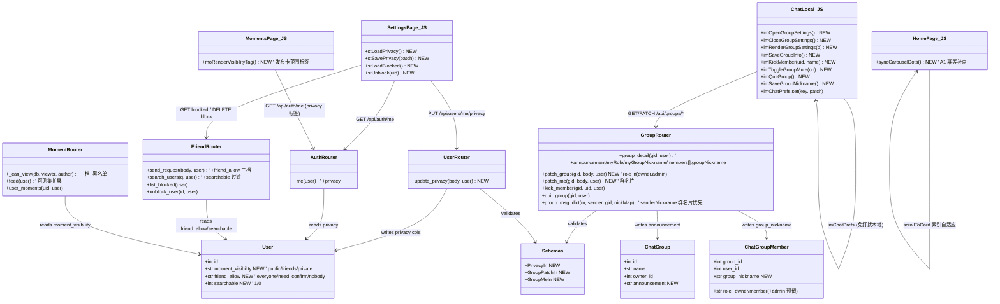
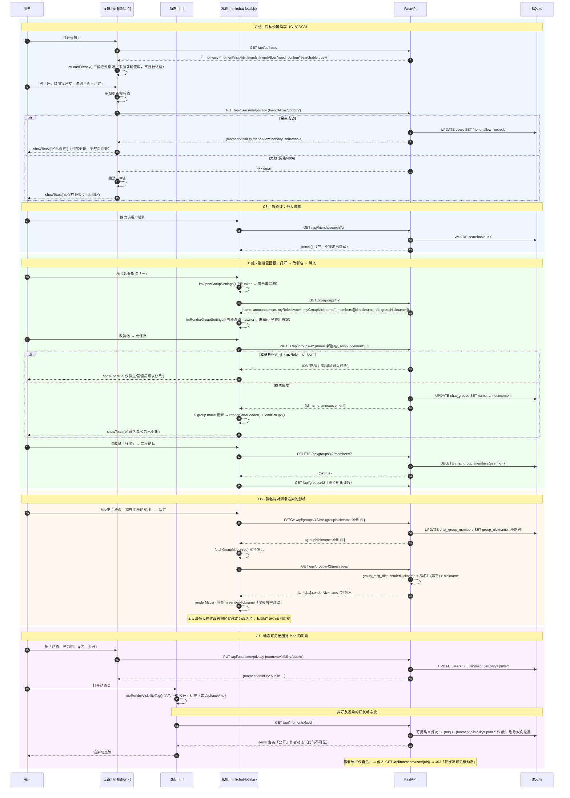
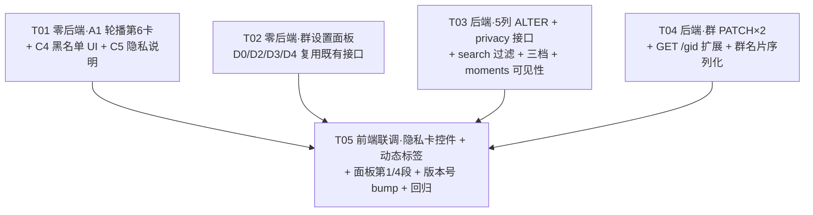

# 星途 · 增量架构设计（隐私与群设置）· 2026-09-11

> 作者：高见远（架构师）｜状态：待评审
> 范围：**仅本批 3 组 12 项** —— A1 首页轮播第 6 卡（1）+ C1~C5 设置页隐私（5）+ D0~D6 群设置（6，其中 D6 为结构占位）。
> **B1「最近登录时间」已于 2026-09-11 22:12 由用户拍板整项取消**：不加 `users.last_login_at` 列、不动 login/register、不做 `formatLastLogin`、主页不显示最近登录时刻；现有 `last_seen_at` + `formatPresence` 相对时间**保持原样不动**。PRD 中 B1 相关章节（§B 组、§5.1 表格首行、§5.2 前三行等）一律**作废**。
> 输入：《增量PRD-隐私与群设置-2026-09-11.md》（许清楚）。用户已拍板 6 条决策已并入设计（见 §0）。
> 全部设计基于**源码逐行核对**（非推测），关键行号均为本轮实测（与 PRD §7 有出入处已在 §附录 注明）。

---

## 0. 前置共识（硬约束 + 已拍板决策）

### 0.1 项目铁律（必须遵守）

| # | 铁律 | 本批落地要求 |
|---|---|---|
| 1 | **扩展必三件套**：DOM 容器 + CSS + 空函数标【后续扩展点】；不写死、不删原功能、保留原有 DOM | A1 移卡不删原节点、原位置留注释锚点；D0 面板骨架先落 DOM+CSS；D6 权限判定写死 `role in ('owner','admin')` 并标【后续扩展点：设置管理员】 |
| 2 | **不新建任何 `.html` 页面** | 群设置走 `私聊.html` 内 `.im-overlay` 模态；隐私走 `设置.html` 卡片。新页缺 `#countdownModal` 会让 `app.js` 顶层无守卫 `addEventListener` 抛 TypeError 整页静默失效——从源头规避 |
| 3 | 前端**零 CDN**、`file://` 双击可直开；后端地址只认 `assets/config.js` 的 `STUDY_API_BASE`（经 `api()` / `apiBase()` 封装） | 新增 fetch 一律走既有封装，禁止硬编码 IP；前端**零新增依赖** |
| 4 | 后端新列**全部走** `server/database.py::_upgrade_legacy_schema()`（`:347-397`，本轮实测确认写法）守卫式 ALTER，幂等无损；默认值 = 现状行为 | 5 个新列见 §3.1；`server/建表SQL.sql` 同步追加 |
| 5 | **隐私红线**：`GET /api/users/{id}` 等公开接口**绝不返回** phone/gender/birthday | 本批新字段（privacy 三项）只进 `/api/auth/me`（本人）；黑名单/群成员/搜索响应全部走 `user_brief`/`_peer_brief` 白名单 |
| 6 | 新增 FastAPI 代码如需直接返回 JSON，须显式 `from fastapi.responses import JSONResponse` 导入；错误仍用 `HTTPException(status, "中文 detail")`（前端 `api.js:66` 读 `data.detail`） | 见 §3.2 各接口错误契约 |
| 7 | 验证：版本号统一 bump 到 **`20260911i`**（`tools/bump_versions_safe.py`，只作用于真实 `<script src=`/`<link href=` 行，注释内引用不带版本号）+ `node --check` + `tools/verifier` jsdom 断言（零未捕获异常 + showToast 可用）+ `div` 配平 | T05 统一执行 |

### 0.2 用户已拍板决策（覆盖 PRD 待确认项）

| # | 决策 | 影响 |
|---|---|---|
| 1 | ~~B1 最近登录~~ → **整项取消** | 本批不动 `users` 在线状态链路；`formatPresence` 不改 |
| 2 | `friend_allow='everyone'` = **免验证直接成为好友**（复用 `friends.py:56-64` autoAccept 的 `friend_pair` 写法） | C2 后端分支 |
| 3 | 动态可见范围做**账户级默认**；本批**不加** `moments.visibility` 列；`动态.html` 发布卡只显示当前生效范围标签 | C1 规模从 L 降 M |
| 4 | 关闭「被搜索」只关 `/api/friends/search` 一条路径，**不影响已是好友/同群成员**；设置页说明文案写明 | C3 边界 + 文案 |
| 5 | 群管理员本批**只留代码判定点**（`role in ('owner','admin')`），不做管理员设置入口；只有群主可改名/公告 | D6 = P2 占位 |
| 6 | （随 B1 取消）存量用户最近登录问题不存在 | — |

### 0.3 环境坑（工程师必读）

| # | 坑 | 对策 |
|---|---|---|
| 1 | 本地 `server/` 是**旧副本**（历史上缺过 `DELETE /requests/{rid}`；本地副本曾被更新过，不能信任任何单一版本的记忆） | **只改指定 .py，改动前逐文件做三层差异预检**（清单级 → 实质代码行 → 字段级，服务器版为基线打增量补丁）；**严禁整目录/整文件覆盖上传** |
| 2 | `设置.html` 是正式页（中文名，约 1140 行）；`settings.html` 是废弃草稿（但其 `:284` 附近有可参考的隐私卡结构） | 只改 `设置.html`；`settings*.html` 一律不动 |
| 3 | 改大 HTML 前先备份；`Edit` 的 old_string 含 `</style>` 时 new_string 必须重新带上，否则白屏 | 改完 `node --check`（JS）+ `div` 配平 |
| 4 | `assets/chat.js` 是死代码 | **不要动** |
| 5 | 群会话头部 `#imCName`（`私聊.html:103`）由 `renderChatHeader()` 动态填充 | 「⋯」按钮放在头部 flex 行内、`#imCName` 之后，勿破坏移动端布局 |

---

# A 部分 · 系统设计

## 1. 实现方案与选型理由

### 1.1 总体技术选型

| 维度 | 选择 | 理由 |
|---|---|---|
| 架构模式 | **不引入新架构**。前端继续「多页静态 HTML + 原生 JS 覆盖层（api.js / chat-local.js）」；后端继续 FastAPI + SQLAlchemy + SQLite 分路由文件 | 项目铁律零 CDN / file:// 直开 / APK WebView 打本地资源；新增 `assets/*.js` 有「APK 未打包」风险，一律**追加到现有文件** |
| 隐私设置存储 | **服务端列（users 表 3 列）+ `PUT /api/users/me/privacy` 单接口**，前端**不落 localStorage** | ① 设置须多端生效、防篡改；② 复用既有 JWT 鉴权与 `rate_limit("default")`；③ 单接口三字段部分更新，避免 3 个接口 |
| 群设置形态 | **`.im-overlay` 模态面板**（与 `#imGroupModal` 同源样式），5 段式（群名公告/成员/免打扰/群名片/退群解散） | 铁律 2 不新建页面；`imEscClose`（`chat-local.js:1446`）统一 Esc 关闭链已存在，新增面板挂入该链即可 |
| 免打扰 | **复用本地 `study_workbench_chat_prefs`**（threadKey `g<id>`），不新增服务端列 | 机制已存在：左滑免打扰 + `imCountUnread()`（`:147-155`）已把 muted 排除出未读角标；群设置面板开关 = 同一存储键的第二个入口，天然两处一致 |
| 动态可见性 | **账户级列 `users.moment_visibility`**，`feed` 可见集一次 IN 查询扩展；`user_moments`/`_visible_moment` 按作者设置判定 | 已拍板决策 3；SQLite 规模小（单表 IN 查询），无需引入关系拆分 |
| 群名片 | **`chat_group_members.group_nickname` 列 + 序列化优先级**：`group_nickname(非空) > nickname > "已注销用户"` | 群消息渲染 `chat-local.js:859-864` 已是数据驱动消费 `m.senderNickname`，**前端渲染零改动**，只改后端序列化取值 |

### 1.2 「零后端改动」的 6 项如何复用既有接口（本批最快的见效部分）

| 项 | 复用的既有接口/机制（本轮实测确认存在） | 前端缺什么 |
|---|---|---|
| **A1** 轮播第 6 卡 | 纯 DOM 移动；`scrollToCard()`/scroll 监听（`学习工作台.html:201-247`）按 `querySelectorAll` 动态取集合，**自动适配 6 卡**；工具痕迹脚本只依赖 `#moreToolsGrid`（`:437-466`），移卡不影响 | 把 `#moreToolsCard`（`:255-283`）移进轮播内层 flex `div` 末尾 + 加 `home-carousel-card` 类 + 第 6 圆点 |
| **C4** 黑名单 UI | `GET /api/friends/blocked`（`friends.py:268-281`，返回 `_peer_brief`+`since`）、`DELETE /api/friends/block/{id}`（`:256-265`）、`POST /api/friends/block`（已有入口） | 仅设置页列表 UI + 移出按钮 |
| **C5** 隐私说明 | 纯静态文案（复用扩展 `个人中心.html:178`） | 无 |
| **D2** 成员管理/踢人 | `GET /api/groups/{gid}`（`groups.py:122-141`，含 role/joinedAt）、`DELETE /api/groups/{gid}/members/{uid}`（`:212-224`，群主限定、拒踢自己） | 仅面板成员网格 + 移出按钮（后端只补 `groupNickname` 字段返回，属 D5 顺带） |
| **D3** 群免打扰 | `study_workbench_chat_prefs` + `imChatPrefs.set('g'+gid,{muted})`（`chat-local.js:119-168`）+ `imCountUnread` 已排除 muted | 仅面板开关 |
| **D4** 退群/解散 | `POST /api/groups/{gid}/quit`（`groups.py:227-240`：成员退群删成员行；群主退群=解散清群） | 仅红色按钮 + 二次确认 |

### 1.3 逐项方案（A1 / C1~C5 / D0~D6）

#### A1 · 首页「更多工具」并入轮播（纯前端，S）

- **现状核实**：轮播 `#homeCardsCarousel` 内层 flex 有 5 张 `.home-carousel-card`（`学习工作台.html:106-189`）；`#carouselDots` 为 5 个静态 span（`:191-197`）；`#moreToolsCard`（`:255-283`）在轮播外、留言板卡之前；工具痕迹脚本 `:417-470` 只依赖 `#moreToolsGrid`，与卡片所在容器无关。
- **改法**：
  1. **整节点移动** `#moreToolsCard` 至轮播内层 flex `div`（第 5 张卡之后）末尾；**原位置留注释锚点** `<!-- 【后续扩展点：更多工具卡原地回退】 -->`（节点移回即可回退）。
  2. 该卡**追加** class `home-carousel-card` + 内联 `min-width:100%;scroll-snap-align:start;flex-shrink:0;`；**保留** `id="moreToolsCard"` 与 `class="card"`（不改既有类，只追加）。
  3. `#carouselDots` 追加第 6 个 span（默认 6px 圆点样式，`onclick="scrollToCard(5)"`）。
  4. 新增幂等 `syncCarouselDots()`（首页内联脚本）：`dots.length < cards.length` 时只补齐空 span，**不删原 DOM**。
- **唯一易错点**（写进验收）：漏加 `home-carousel-card` 类 → 圆点 6 个而卡片集合 5 个 → 第 6 圆点无效且滚动索引错位。
- **离线**：纯前端，同样生效。

#### C1 · 动态可见范围（账户级默认，M）

- **现状核实**：`moments.py` 写死"仅好友"——`_can_view()`（`:31-32`）= 作者或好友；`feed()`（`:109-126`）可见集 = `friend_ids_of | {self}`；`user_moments()`（`:129-149`）同。**现状 feed 未剔除黑名单**（拉黑不删好友关系，被拉黑好友的动态仍在 feed 中——本批按 PRD §6.1-C1④ 补上）。
- **后端改法**（`moments.py` + `users` 加列）：
  - `_can_view(db, viewer_id, author)` 改为按**作者** `moment_visibility` 三档判定：`public` → 任何登录用户；`friends` → 好友或本人（现状）；`private` → 仅本人。**黑名单双向优先拒绝**（双向任一拉黑 → 不可见）。
  - `feed()` 可见集 = `好友 ∪ {我} ∪ {moment_visibility='public' 的全部用户 id}`（一次 `User.id` IN 查询），查询后再剔除「与我双向拉黑」的作者；分页语义 `hasMore/nextBefore` 不变。
  - `user_moments()` / `_visible_moment()` 走新 `_can_view`；不可见 → 403「仅好友可见该动态」（文案沿用，不新增文案分支）。
- **前端改法**：`设置.html` 隐私卡三段控件（`stSeg` 同款，见 §1.4）；`动态.html` 发布卡（`#moPublish`，`:75-89`）标题行追加当前生效范围小标签（如 `🔒 仅好友可见`，值来自 `GET /api/auth/me` 的 `privacy.momentVisibility`，离线不显示）。
- **离线降级**：涉网控件置灰 + 提示「需登录后在线使用」；隐私说明始终可读。

#### C2 · 谁可以加我好友（S）

- **现状核实**：`send_request()`（`friends.py:44-75`）流程 = 查用户 → 不能加自己 → **黑名单双向拒**（`:51`）→ 已是好友拒 → 对方 pending 互申请 autoAccept（`:56-64`）→ 我方 pending 拒 → 写 pending。
- **后端改法**：在**互申请 autoAccept 之后、写 pending 之前**插入三档判定（保持既有优先级不变）：
  - `to.friend_allow == 'nobody'` → `400 "对方暂不接受好友申请"`（不产生 pending 记录）；
  - `== 'everyone'` → 直接 `db.add(Friend(...))`（**复用 `:60-64` 的 `friend_pair` 写法**），返回 `{"ok": true, "autoAccepted": true, "user": _peer_brief(to)}`（与互申请分支**同响应结构**，前端零适配）；
  - `== 'need_confirm'`（默认，含存量 NULL/空值回退）→ 现状不变。
- **边界**：黑名单校验（`:51`）保持在最前，三档都不能绕过；B 从 need_confirm 改 everyone 后，此前已存在的 pending 申请**不自动转好友**（语义清晰：everyone 只影响新申请），列入共享知识。

#### C3 · 能否被搜索到（S）

- **现状核实**：`/search`（`friends.py:190-209`）按 `username/nickname` LIKE + 排除自己 + `id desc limit 10`，无任何过滤。
- **后端改法**：查询链追加 `.filter(User.searchable != 0)`（存量 NULL 视为可搜——SQLite `NULL != 0` 为 NULL 不命中，故 ALTER 用 `DEFAULT 1` 且模型 `default=1`，配合 `or_(User.searchable.is_(None), User.searchable != 0)` 双保险写法，见 §3.1）。搜不到即返回空 `items`，**不提示"该用户已隐藏"**（防探测）。
- **边界（决策 4）**：只关搜索路径——好友列表 `GET /api/friends`、群成员 `GET /api/groups/{gid}`、公开主页 `GET /api/users/{id}` **均不受影响**；设置页说明文案写明。
- **前端**：隐私卡双按钮开关（`stToggle` 同款视觉）。

#### C4 · 黑名单 UI（零后端，S）

- 复用 §1.2 表中三接口；`设置.html` 隐私卡第 4 段：列表（头像 + 昵称 + @账号 + 「移出黑名单」描边按钮）+ 右上 `共 N 人` + 空态「暂无拉黑用户」+ 加载失败态「⬜ 加载失败，点此重试」（区分"为空"与"失败"）。
- 响应走 `_peer_brief`（id/nickname/avatarUrl/motto/username 由 `_peer_brief` 含 `user_brief`+motto——注意 `_peer_brief` 实际为 `user_brief + motto`，不含 username；前端展示 @账号时可仅显示昵称，或后续扩展。**实测 `friends.py:28-29` `_peer_brief` = `user_brief + motto`，PRD 文案中的「@账号」以实际返回为准：本批列表显示 头像+昵称，不显示 @账号**，避免为展示 username 改后端）。〔差异已列入 §附录〕

#### C5 · 隐私说明（纯文案，S）

- 隐私卡底部静态说明块，复用并扩展 `个人中心.html:178` 文案；文案终稿见 PRD §4.3（与实际接口行为逐条一致）；明暗主题均可读。

#### D0 · 群设置入口 + 面板骨架（M）

- **现状核实**：群会话头部 `renderChatHeader()`（`chat-local.js:773-797`）群分支只渲染 `#imCAv` + `#imCName`（群名 + N人群）；`私聊.html:100-104` 头部为 `#imBack`/`#imCAv`/`#imCName` 三个元素；全站无群设置界面。
- **改法**：
  - `私聊.html` 头部行内、`#imCName` 之后新增「⋯」按钮（`onclick="imOpenGroupSettings()"`，`title="群设置"`，仅群会话时由 `renderChatHeader()` 显示——**私聊会话不渲染**，用 `style.display` 控制而非删除 DOM）。
  - `私聊.html` 底部**紧邻 `#imGroupModal`（`:201-207`）之后**新增 `#imGroupSettingsModal`（`.im-overlay` + `.im-modal`，同源样式，`onclick` 遮罩关闭同款写法）；宽 `min(92%,420px)`、`max-height:calc(100dvh - 40px)` 可滚动（复用批次一 A1 对 `.im-modal` 的加固样式）。
  - `chat-local.js` 新增：`imOpenGroupSettings()`（校验 `getToken()`，拉取 `GET /api/groups/{gid}` 后渲染）、`imCloseGroupSettings()`、`imRenderGroupSettings(d)`（五段骨架：头部/群名公告/成员/免打扰/群名片/退群解散）；打开时 `bindModalEsc()`，关闭时 `unbindModalEscIfIdle()`，并把 `#imGroupSettingsModal` 纳入 `imEscClose()`（`:1446-1456`）检查链。
  - 面板状态存模块级 `GS = { gid, detail, muted }`（不落 localStorage）。
- **异常态**：404「群不存在或已解散」→ toast + 关面板 + `loadGroups()` 刷新；离线「⋯」置灰 + 提示「群设置需要联网」。

#### D1 · 改群名 + 群公告（M）

- **后端**：`chat_groups` 加 `announcement` 列（默认 `''`）；新增 `PATCH /api/groups/{gid}`（见 §3.2）；`GET /api/groups/{gid}` 增返回 `announcement`、`myRole`、`myGroupNickname`。
- **前端**：面板第 1 段——群名输入（`maxlength=20`，仅 `myRole in (owner,admin)` 为输入框，成员只读文本）；群公告文本域（`maxlength=300`，成员只读、空公告显示「群主还没有发布公告」灰字）；保存按钮仅可编辑角色显示、未改动置灰；成功 `showToast('✅ 群名与公告已更新')` 并**本地同步** `S.group.name` + `renderChatHeader()` + `loadGroups()`（群列表行内群名即时更新）。
- **D6 判定点**：权限判定统一写 `me.role in ("owner", "admin")`（本批 role 只有 owner/member，行为等价于仅群主），标注 `【后续扩展点：设置管理员】`；**不提供**升任/撤销接口与入口。

#### D2 · 成员管理 + 踢人（S）

- **后端**：仅 `GET /api/groups/{gid}` 的 `members[]` 增 `groupNickname`（D5 顺带），其余零改动。
- **前端**：面板第 2 段——成员头像网格（头像 + 群名片或昵称 + `群主`/`管理员`/`成员` 小标签——**管理员标签渲染分支预留**，标【后续扩展点：设置管理员】）+ 标题 `群成员（N）`；`myRole=='owner'` 时每行行尾「移出」按钮（**群主自己那行不渲染**）；二次确认文案见 PRD §4.4；点成员头像 → `openUserHome(uid)`（复用 `api.js`，与群消息头像点击行为一致）；移出成功后重拉详情刷新计数。
- 移出后该成员**下次拉取**群列表不再含该群（服务端已删成员行，无推送依赖）。

#### D3 · 消息免打扰（S，零后端）

- 面板第 3 段开关：读写**同一个键** `imChatPrefs.set('g'+gid, {muted})`（与左滑免打扰同源，两处状态天然一致）；开关后即时重渲染会话列表行（🔔/🔕 标识）与未读角标（`imCountUnread` 自动排除）。
- 离线：本地机制本身离线可用，但面板需在线才能打开（群数据在服务端）——入口提示沿用 D0。

#### D4 · 退出群聊 / 解散群（S，零后端）

- 面板第 5 段红色次级按钮：非群主「🚪 退出群聊」、群主「🗑️ 解散群聊」；二次确认文案按 PRD §4.4（解散含「不可恢复」警示）；成功后关面板 → `backToList()` → `loadGroups()` 刷新；取消无副作用。

#### D5 · 群内昵称 / 群名片（M）

- **后端**：`chat_group_members` 加 `group_nickname` 列（默认 `''`）；新增 `PATCH /api/groups/{gid}/me`（见 §3.2）；`group_msg_dict()`（`groups.py:22-33`）`senderNickname` 取值优先级改为：**`group_nickname(非空) > sender.nickname > "已注销用户"`**——实现上给 `group_msg_dict` 增加「成员昵称映射」参数（`group_messages` 与 `send_group_message` 两个调用点先查一次 `ChatGroupMember(group_id=gid)` 构建 `{user_id: group_nickname}` 映射再传入；函数签名变更为**服务端内部变更**，对外 API 契约不变）。
- **前端**：面板第 4 段「我在本群的昵称」输入（`maxlength=20`，占位 `留空则使用全局昵称：<当前昵称>`）+ 保存；成功 toast + `fetchGroupMsgs(true)` 重拉消息区（渲染层零改动，`m.senderNickname` 已数据驱动）。
- 边界：清空提交空串 = 清除群名片回退全局昵称；私聊/广场/好友列表仍用全局昵称（互不影响）。

#### D6 · 管理员（结构占位，P2）

- 仅 D1/D2 的权限与标签**判定点**写 `role in ('owner','admin')`；无入口、无接口。用户可见行为不变。

### 1.4 前端控件与样式约定（设置页隐私卡）

- **位置**：`设置.html`「🔐 账号与安全」卡（`:607-631`）之后、修改密码弹窗（`:634`）之前。
- **结构**：沿用 `.card` / `.setting-row` / `.setting-info` / `.setting-name` / `.setting-desc` / `.setting-actions`；三档分段用 `stSeg` 同款按钮组（`.setting-seg` 现有样式），双按钮开关用 `theme-option`（与 `stToggle` 视觉同款）；黑名单行与隐私说明用新前缀 `.privacy-*`（见 §8 共享知识）。
- **状态机**（PRD §4.3）：加载中控件置灰 + 「加载中…」（**不显示默认值**，避免未加载的默认值覆盖服务端设置）；保存成功局部更新激活态 + `showToast('✅ 已保存')`，**不整页刷新**；保存失败回滚选中态 + `showToast('⚠️ 保存失败：<原因>')`；未登录/单机涉网 4 段整体置灰 + 顶部提示「🔌 需登录后在线使用；当前为单机模式」，隐私说明始终可读。
- **读写函数**：`stLoadPrivacy()`（`GET /api/auth/me` 取 `privacy`）、`stSavePrivacy(patch)`（乐观更新 + 失败回滚 + `PUT /api/users/me/privacy`）、`stLoadBlocked()` / `stUnblock(uid)`（C4）；全部为 `设置.html` 内联脚本新增函数，**不动 `stToggle/stSeg` 既有实现**（本地设置仍走 `study_workbench_settings`，隐私三项不落本地）。

---

## 2. 文件清单

> 「上传」= 是否需部署到 `110.42.134.62` `/opt/study-workbench/`。后端文件一律「需上传 + **三层差异预检**」。**本批前端/后端均零新增文件、零新增页面**。

| 路径 | 新增/修改 | 一句话改动说明 | 上传 |
|---|---|---|---|
| `学习工作台.html` | 修改 | A1：`#moreToolsCard` 移入轮播成第 6 卡 + 第 6 圆点 + 幂等 `syncCarouselDots()` + 原位置注释锚点 | 需 |
| `设置.html` | 修改 | C1~C5：新增「🔐 隐私与安全」卡（5 段 + 离线置灰）+ 内联脚本 `stLoadPrivacy/stSavePrivacy/stLoadBlocked/stUnblock` | 需 |
| `动态.html` | 修改 | C1：发布卡标题行追加当前可见范围小标签（读 `/api/auth/me` 的 privacy，离线不显示） | 需 |
| `私聊.html` | 修改 | D0：群会话头部「⋯」按钮 + `#imGroupSettingsModal` 模态 DOM（紧邻 `#imGroupModal`） | 需 |
| `assets/chat-local.js` | 修改 | D0~D5：`imOpenGroupSettings/imCloseGroupSettings/imRenderGroupSettings/imSaveGroupInfo/imKickMember/imToggleGroupMute/imQuitGroup/imSaveGroupNickname` + 纳入 `imEscClose` 链 | 需 |
| `assets/common.css` | 修改（末尾追加） | `.privacy-*`（隐私卡/黑名单行/说明块）+ `.im-gs-*`（群设置面板分段/成员网格/角色标签/红色危险按钮）样式，明暗主题双适配 | 需 |
| `server/database.py` | 修改 | 5 个守卫式 ALTER（§3.1）+ User/ChatGroup/ChatGroupMember 模型加列 | 需+预检 |
| `server/建表SQL.sql` | 修改 | 同步追加 5 列（新库建表即含） | 需+预检 |
| `server/schemas.py` | 修改 | 新增 `PrivacyIn` / `GroupPatchIn` / `GroupMeIn` | 需+预检 |
| `server/routers/auth.py` | 修改 | `GET /api/auth/me` 响应增 `privacy` 对象（仅此处；login/register/refresh **均不动**） | 需+预检 |
| `server/routers/users.py` | 修改 | 新增 `PUT /api/users/me/privacy` | 需+预检 |
| `server/routers/friends.py` | 修改 | `/search` 加 `searchable` 过滤；`send_request` 增三档分支 | 需+预检 |
| `server/routers/moments.py` | 修改 | `_can_view` 三档化 + 黑名单拒绝；`feed` 可见集扩展并剔除双向拉黑 | 需+预检 |
| `server/routers/groups.py` | 修改 | 新增 `PATCH /{gid}`、`PATCH /{gid}/me`；`GET /{gid}` 增 announcement/myRole/myGroupNickname/members[].groupNickname；`group_msg_dict` 群名片优先 | 需+预检 |
| `docs/增量架构设计-隐私与群设置-2026-09-11.md` | 新增 | 本文件 | 否 |

**明确不改动**：`assets/api.js`（B1 取消后本批零改动）、`assets/app.js`、`assets/chat.js`（死代码）、`assets/config.js`、`个人中心.html`、`好友申请.html`、`settings*.html`（废弃草稿）、`备份/`、AI 密钥链路、`server/routers/chat.py`、`security.py`。

---

## 3. 数据结构与接口

### 3.1 DB 变更（5 列，全部守卫式 ALTER，默认值 = 现状行为）

| 表 | 列 | 类型 | 默认值 | 取值 | 用途 |
|---|---|---|---|---|---|
| `users` | `moment_visibility` | TEXT(16) | `'friends'` | `public/friends/private` | 动态可见范围（C1，账户级） |
| `users` | `friend_allow` | TEXT(16) | `'need_confirm'` | `everyone/need_confirm/nobody` | 谁可加我（C2） |
| `users` | `searchable` | INTEGER | `1` | `1/0`（1=可被搜索） | 能否被搜到（C3） |
| `chat_groups` | `announcement` | TEXT | `''` | ≤300 字 | 群公告（D1） |
| `chat_group_members` | `group_nickname` | TEXT | `''` | ≤20 字（空=用全局昵称） | 群名片（D5） |

**模型同步**（`database.py`）：`User` 加 `moment_visibility/friend_allow/searchable` 三列（`default` 同上，`nullable=False`）；`ChatGroup` 加 `announcement`；`ChatGroupMember` 加 `group_nickname`。**本批不新增表**。

**守卫式 ALTER 写法**（追加到 `_upgrade_legacy_schema()` 末尾，与既有 `:395-397` token_version 段同款模式）：

```sql
-- users 三列（一个 begin 块内逐列守卫）
ALTER TABLE users ADD COLUMN moment_visibility TEXT NOT NULL DEFAULT 'friends'
ALTER TABLE users ADD COLUMN friend_allow TEXT NOT NULL DEFAULT 'need_confirm'
ALTER TABLE users ADD COLUMN searchable INTEGER NOT NULL DEFAULT 1
ALTER TABLE chat_groups ADD COLUMN announcement TEXT NOT NULL DEFAULT ''
ALTER TABLE chat_group_members ADD COLUMN group_nickname TEXT NOT NULL DEFAULT ''
```
（每条前均以 `_table_columns()` 判存在性；幂等，可重复执行。）

**存量兼容**：旧库行新列取默认值 → 行为与现状完全一致（仅好友可见 / 需验证 / 可被搜索 / 无公告 / 无群名片），老用户零感知。`searchable` 判定统一用 `or_(User.searchable.is_(None), User.searchable != 0)` 写法防御历史 NULL。`server/建表SQL.sql` 的 `users`（`:10`）、`chat_groups`（`:92`）、`chat_group_members`（`:101`）建表语句同步加列。

### 3.2 接口契约（新增 3 个 / 修改 6 个）

> 约定：错误一律 `HTTPException(status, "中文 detail")`；前端 `api.js` 读 `data.detail`。所有新接口挂 `Depends(get_current_user)`；写操作建议 `rate_limit("default")`。

#### 新增接口

| 方法/路径 | 鉴权 | 请求体 | 响应体 | 错误 |
|---|---|---|---|---|
| `PUT /api/users/me/privacy` | 登录 + rate_limit | `{momentVisibility?: "public"\|"friends"\|"private", friendAllow?: "everyone"\|"need_confirm"\|"nobody", searchable?: bool}`（三选一起，部分更新） | `{momentVisibility, friendAllow, searchable}`（**全量**返回，searchable 为 bool） | 非法枚举/空请求体 → `400 "设置值不合法"` |
| `PATCH /api/groups/{gid}` | 登录；`require_group` + `require_member` + **`me.role in ("owner","admin")`**【D6 判定点】 | `{name?: str, announcement?: str}`（部分更新；name 1~20 字，announcement 0~300 字） | `{id, name, announcement}` | 非成员/无权限 → `403 "仅群主/管理员可以修改"`；群名空/超长 → `400`（沿用建群文案「群名称不能为空」/「群名称最长 20 字」）；公告超 300 → `400 "公告最长 300 字"`；群不存在 → `404 "群不存在或已解散"` |
| `PATCH /api/groups/{gid}/me` | 登录；`require_member`（仅本人） | `{groupNickname?: str}`（0~20 字；空串 = 清除回退全局昵称） | `{groupNickname}` | 非成员 → `403 "你不是该群成员"`；>20 字 → `400 "群昵称最长 20 字"`；404 同上 |

#### 修改接口（全部为**增量字段/收窄查询**，对既有前端**非破坏性**——旧前端忽略新字段即可）

| 方法/路径 | 改了什么 | 破坏性 |
|---|---|---|
| `GET /api/auth/me` | 响应增 `privacy: {momentVisibility, friendAllow, searchable}`（本人数据；既有 phone 等私有字段维持现状——该接口本就是本人接口） | ❌ 非破坏（纯增字段） |
| `GET /api/friends/search` | 查询链加 `searchable` 过滤（不可搜用户不出现在 items；搜不到返回空 `items`，不提示已隐藏） | ❌ 非破坏（行为收窄，契约不变；**旧前端无需改**） |
| `POST /api/friends/requests` | 增三档分支：`nobody` → 400「对方暂不接受好友申请」；`everyone` → 直接建好友，返回 `{"ok":true,"autoAccepted":true,"user":_peer_brief}`（与既有互申请 autoAccept **同构**）；`need_confirm` → 现状。优先级：黑名单 > 已是好友 > 互申请 autoAccept > **三档** > pending 重复 | ❌ 非破坏（既有调用方已能处理 autoAccepted 响应；400 分支为新增拒绝语义） |
| `GET /api/moments/feed` | 可见集 = 好友 ∪ 自己 ∪ `moment_visibility='public'` 作者，再剔除双向拉黑；`hasMore/nextBefore` 分页语义不变 | ❌ 非破坏（结果集扩大/收窄，契约不变） |
| `GET /api/moments/user/{uid}`（及 `_visible_moment` 供 like/comments 用） | 按作者 `moment_visibility` 三档判定 + 双向拉黑拒绝；不可见 → `403 "仅好友可见该动态"`（文案沿用） | ❌ 非破坏（对原本 403 的场景仍 403；`public` 作者对非好友从 403 变 200——**行为放宽**，旧前端正常渲染列表） |
| `GET /api/groups/{gid}` | 响应增 `announcement`、`myRole`、`myGroupNickname`；`members[]` 每项增 `groupNickname` | ❌ 非破坏（纯增字段） |
| `POST/GET /api/groups/{gid}/messages` | `group_msg_dict` 的 `senderNickname` 优先取群名片（非空）回退全局昵称；`senderAvatar` 不变 | ❌ 非破坏（字段语义微调：昵称值可能变为群名片，旧前端照常显示） |

#### 复用不动（零后端）

`GET /api/friends/blocked`、`DELETE /api/friends/block/{id}`、`POST /api/friends/block`（C4）；`DELETE /api/groups/{gid}/members/{uid}`（D2）；`POST /api/groups/{gid}/quit`（D4）。

### 3.3 前端本地键（`study_workbench_*`）

| 键 | 本批动作 |
|---|---|
| `study_workbench_chat_prefs` | **复用**（D3 群免打扰与左滑共用，threadKey `g<id>`；**不新增任何键**） |
| `study_workbench_settings` | **不动**（隐私三项只存服务端，不落本地，避免双源冲突） |
| `study_workbench_blocked_cache` | **不建**（PRD 列为 P2 可选；本批砍掉，黑名单每次在线拉取，减少不一致面） |

> **结论：本批 localStorage 零新增键。**

### 3.4 类图（classDiagram）



### 3.5 时序图（sequenceDiagram，覆盖 4 条关键链路）



---

## 4. 任务依赖图



---

# B 部分 · 任务分解

## 5. 依赖包

| 端 | 依赖 | 说明 |
|---|---|---|
| 前端 | **零新增** | 纯原生 JS/CSS；无 CDN（硬约束） |
| 后端 | **零新增** | 复用 fastapi / sqlalchemy / pydantic 既有能力；新接口若需直接 JSON 返回则 `from fastapi.responses import JSONResponse`（标准库内导入，非新包） |

## 6. 任务列表（T01~T05，按「零后端优先 → 加列+接口 → 影响面最大者最后」排序，可分批提交）

### T01 — 零后端：首页轮播第 6 卡 + 黑名单 UI + 隐私说明　【P0｜M｜依赖：无】

- **目标**：A1 + C4 + C5 三项纯前端（C4/C5 复用既有后端接口与静态文案）。
- **涉及文件**：`学习工作台.html`、`设置.html`、`assets/common.css`。
- **关键改动点**：① `#moreToolsCard` 整节点移入轮播内层 flex 末尾 + 追加 `home-carousel-card` 类与内联 snap 样式（**保留** id 与 `card` 类）+ 原位置注释锚点 + 第 6 圆点 + `syncCarouselDots()`；② `设置.html` 隐私卡骨架（五段容器 + 黑名单列表段 + 隐私说明文案块）+ `stLoadBlocked()/stUnblock()`（调既有三接口，含加载/空/失败三态）；③ `common.css` 末尾追加 `.privacy-*` 样式（黑名单行、说明块、置灰态）。
- **验收点**：A1 七条（PRD §6.1-A1：滑动可达第 6 卡、6 圆点一一对应、4 工具 onclick 逐字一致、使用痕迹小字与降序排序不回归、`#moreToolsCard/#moreToolsGrid` id 仍在、div 配平、零报错）；C4 六条（列表/移出即时生效/空态/失败可重试且不显示为空/响应不含 phone/gender/birthday 字符串断言）；C5 文案与接口行为逐条一致；`file://` 直开零报错；明暗主题正常。
- **规模**：M（A1=S，C4=S，C5=S，合计约 1 人天）。

### T02 — 零后端：群设置面板骨架 + 成员管理 + 免打扰 + 退群解散　【P0｜L｜依赖：无（可与 T01 并行）】

- **目标**：D0 + D2 + D3 + D4（全部复用既有接口；成员 `groupNickname` 字段此时可能未上线——渲染需做**字段缺失兜底**：`m.groupNickname || m.nickname`）。
- **涉及文件**：`私聊.html`、`assets/chat-local.js`、`assets/common.css`。
- **关键改动点**：① 头部「⋯」按钮（仅群会话显示）+ `#imGroupSettingsModal` DOM（`.im-overlay/.im-modal` 同源，紧邻 `#imGroupModal`）；② `imOpenGroupSettings/imCloseGroupSettings/imRenderGroupSettings`（`GET /api/groups/{gid}` 驱动，五段骨架；404 关面板刷新群列表；离线入口提示）；③ 成员网格 + 群主视角「移出」（`DELETE /members/{uid}` + 二次确认 + 重拉；群主自己行无按钮）；④ 免打扰开关（`imChatPrefs.set('g'+gid,{muted})` + 即时刷列表与角标）；⑤ 退群/解散红色按钮（`POST /quit` + 角色化确认文案 + 成功回列表刷群）；⑥ 纳入 `imEscClose`/`bindModalEsc`/`unbindModalEscIfIdle` 链（开关 10 次无监听泄漏）；⑦ `.im-gs-*` 样式（含 `role='admin'` 管理员标签**渲染分支预留**，标【后续扩展点：设置管理员】）。
- **验收点**：PRD §6.1 D0/D2/D3/D4 全部条目（Esc/遮罩/✕ 三路关闭且不泄漏；群主可移出且计数即时刷新、成员看不到移出、群主行无按钮；免打扰与左滑**同一状态**、角标即时减增；退群/解散后群列表不含该群、取消无副作用；明暗主题同源视觉）。
- **规模**：L（约 1.5~2 人天；本批最大前端任务，建议单独提交）。

### T03 — 后端：5 列守卫 ALTER + 隐私读写 + 搜索过滤 + 加好友三档 + 动态可见性　【P0｜L｜依赖：无（可与 T01/T02 并行；**每个文件改前三层差异预检**）】

- **目标**：C1/C2/C3 的全部后端改动 + 数据层。
- **涉及文件**：`server/database.py`、`server/建表SQL.sql`、`server/schemas.py`、`server/routers/auth.py`、`server/routers/users.py`、`server/routers/friends.py`、`server/routers/moments.py`。
- **关键改动点**：① `_upgrade_legacy_schema()` 末尾 5 条守卫 ALTER（§3.1 原样）+ 三模型加列；② `PrivacyIn` schema + `PUT /api/users/me/privacy`（枚举校验、全量返回）+ `GET /api/auth/me` 增 `privacy`；③ `/search` 加 `or_(searchable.is_(None), searchable != 0)` 过滤；④ `send_request` 在互申请 autoAccept 之后插三档分支（nobody 400 / everyone 直接建好友复用 `friend_pair` / need_confirm 现状）；⑤ `moments.py`：`_can_view` 三档 + 双向拉黑拒绝、`feed` 可见集扩展并剔除双向拉黑、`user_moments`/`_visible_moment` 走新判定。
- **验收点**：① 旧库副本启动无损、`/api/health` 正常，有/无新列两种库都能起（幂等重跑不报错）；② `need_confirm`/默认值下三接口行为与现状**逐字段一致**（老用户零感知回归）；③ `nobody` 申请 400 且无 pending 落库、`everyone` 免同意即成好友且双方列表互见、黑名单优先于三档；④ 关 searchable 后昵称/账号均搜不到、好友列表与群成员不受影响；⑤ `private` 他人 feed 不见 + `user/{uid}` 403、`public` 非好友 feed 可见、`friends` 与现状一致、双向拉黑动态互不可见；⑥ **隐私回归**：`/api/users/{id}`、`/api/users/presence`、`/api/friends/search`、`/api/friends/blocked`、`/api/groups/{gid}`、`/api/moments/*` 响应字符串级断言不含 `phone`/`gender`/`birthday`；⑦ `privacy` 字段只出现在 `/api/auth/me` 与 `PUT /me/privacy` 响应。
- **规模**：L（约 1.5 人天）。

### T04 — 后端：群设置两个 PATCH + 群详情扩展 + 群名片序列化　【P0｜M｜依赖：T03（列已加；若并行开发则 T04 自带临时本地验证亦可，合并时以 T03 的 ALTER 为准）】

- **目标**：D1/D5/D6 的全部后端改动。
- **涉及文件**：`server/routers/groups.py`（`server/schemas.py` 的 `GroupPatchIn/GroupMeIn` 若未在 T03 一并加，则本任务补）。
- **关键改动点**：① `PATCH /api/groups/{gid}`（`role in ("owner","admin")` 判定标【后续扩展点：设置管理员】；群名 1~20 字沿用建群校验文案；公告 ≤300 字）；② `PATCH /api/groups/{gid}/me`（仅成员本人；空串清除）；③ `GET /{gid}` 增 `announcement/myRole/myGroupNickname`、`members[].groupNickname`；④ `group_msg_dict` 增成员昵称映射参数，`senderNickname = 群名片(非空) > nickname > "已注销用户"`，`group_messages`/`send_group_message` 两调用点先查 `ChatGroupMember` 构建映射。
- **验收点**：成员直调 PATCH 得 403；空群名/超长群名/超长公告 400；改群名后其他成员拉取即见新名与公告；群名片设置后**双方**消息昵称均为群名片、清空回退全局、>20 字 400；`GET /{gid}` 新字段齐备且 members 无隐私字段；旧前端（未升级）消费 `GET /{gid}`/消息列表不报错（纯增字段回归）。
- **规模**：M（约 1 人天）。

### T05 — 前端联调：隐私卡控件 + 动态范围标签 + 面板第 1/4 段 + 版本号与全站回归　【P0｜L｜依赖：T01、T02、T03、T04】

- **目标**：C1/C2/C3 控件接真接口（T03）+ D1/D5 面板段接真接口（T04）+ 版本号 bump + 收口回归。
- **涉及文件**：`设置.html`、`动态.html`、`assets/chat-local.js`、`assets/common.css`（微调）、全部被改 HTML 的 `?v=`。
- **关键改动点**：① `stLoadPrivacy/stSavePrivacy`（加载置灰→激活；乐观更新+失败回滚+toast；离线 4 段整体置灰+单机提示）；② `动态.html` 发布卡范围标签（`moRenderVisibilityTag()`，离线不渲染）；③ 面板第 1 段群名/公告编辑（按 `myRole` 分可编辑/只读；未改动保存置灰）与第 4 段群名片（保存后重拉消息区）；④ `tools/bump_versions_safe.py` 统一 bump `20260911i`；⑤ `node --check` + div 配平 + `tools/verifier` jsdom 断言（零未捕获异常 + showToast 可用）+ 隐私字符串级回归复跑。
- **验收点**：PRD §6.1 C1~C3、D1、D5 全部条目 + §6.2 全站级七条（含 APK 重打包抽查包内符号 `moment_visibility`/`imOpenGroupSettings`/`patch_group` 等——"代码修好 ≠ 包里有"）；版本号只作用于真实 script/link 行、注释内不带。
- **规模**：L（约 1~1.5 人天）。

> **提交批次建议**：批 1 = T01+T02（纯前端，立即可上线）；批 2 = T03+T04（后端，预检后部署）；批 3 = T05（联调收口）。

## 7. 共享知识（跨文件约定，工程师必读）

1. **后端地址**：一律 `api()`（api.js）/`apiBase()`（chat-local.js）封装，唯一来源 `assets/config.js` 的 `STUDY_API_BASE`；禁止硬编码 IP；无新密钥。
2. **错误约定**：`HTTPException(status, "中文 detail")`；前端读 `data.detail`；401 静默 refresh 一次（既有机制，勿另造）。
3. **localStorage**：本批**零新增键**；D3 免打扰复用 `study_workbench_chat_prefs`（threadKey `g<id>`）；隐私三项**只存服务端**（`study_workbench_settings` 不碰）。
4. **CSS 前缀**：设置页隐私相关新样式统一 `.privacy-*`（如 `.privacy-blocked-row`/`.privacy-note`）；群设置面板统一 `.im-gs-*`（如 `.im-gs-section`/`.im-gs-members`/`.im-gs-role-tag`/`.im-gs-danger`），面板外壳复用既有 `.im-overlay/.im-modal`；不引入新视觉语言，明暗主题均需验证。
5. **函数命名**：设置页内联 `stLoadPrivacy/stSavePrivacy/stLoadBlocked/stUnblock`（沿用 `st*` 前缀）；群设置 `imOpenGroupSettings/imCloseGroupSettings/imRenderGroupSettings/imSaveGroupInfo/imKickMember/imToggleGroupMute/imQuitGroup/imSaveGroupNickname`（挂 `window`，沿用 `im*` 前缀）；首页 `syncCarouselDots`。
6. **群名片序列化优先级**（服务端 `group_msg_dict`）：`senderNickname = group_nickname(非空) > sender.nickname > "已注销用户"`；`senderAvatar` 恒取全局头像。前端渲染层零改动（`m.senderNickname` 数据驱动）；成员列表展示同样 `groupNickname || nickname` 兜底（兼容 T04 未上线窗口）。
7. **权限判定点**：群可编辑 = `me.role in ("owner","admin")`（D6 占位，本批实际仅 owner 命中）；前端**不渲染**无权限按钮（而非渲染后报 403）；群主自己那行无「移出」。
8. **加好友三档优先级**：黑名单双向 > 已是好友 > 互申请 autoAccept > `friend_allow` 三档 > pending 重复；`everyone` 档对**已存在的 pending 申请不追溯生效**。
9. **搜索口径**：`searchable=0` 只影响 `/api/friends/search`；搜不到返回空 `items`，绝不提示"该用户已隐藏"（防探测）；好友/群成员/公开主页不受影响（设置页说明文案必须写明）。
10. **presence/在线状态链路本批冻结**：`last_seen_at`、`_touch_last_seen`、`formatPresence`、`presenceText` **一律不动**（B1 取消的连带约束）。
11. **版本号**：统一 `?v=20260911i`，只用 `tools/bump_versions_safe.py`；注释内引用不带版本号；不得全局 sed。
12. **扩展三件套**：A1 原位置注释锚点；D6 判定点+标签分支标【后续扩展点：设置管理员】；免打扰多端同步、逐条动态可见范围、好友资料弹层精确时刻均列【后续扩展点】，本批不实现。
13. **后端部署**：逐文件三层差异预检（清单级→实质代码行→字段级），服务器版为基线打增量补丁，**严禁整文件/整目录覆盖**。

## 8. 待明确事项（不阻塞开发，均附默认建议）

| # | 事项 | 默认建议 |
|---|---|---|
| 1 | C1「公开」档下 feed 的 public 作者集合规模：现状一次 `User` 全量 IN 查询，用户量增大后需优化 | 本批保持一次 IN 查询（SQLite 单表现规模可接受）；列【后续扩展点：public 作者缓存/分页优化】 |
| 2 | 改群名/公告后是否给在线成员 ws 推送（现状无群信息变更推送，靠下次拉取） | 本批**不做** ws 推送；保存者本地即时刷新，其他成员下次拉取生效（与群成员被移除的感知方式一致）；列【后续扩展点：群信息变更推送】 |
| 3 | C4 黑名单行是否显示 @账号：实测 `_peer_brief` = `user_brief + motto`，**不含 username** | 本批列表只显示 头像+昵称+移出按钮（PRD 文案中的 @账号 从简）；若必须显示需后端加字段，另评审 |
| 4 | C2 `everyone` 档互为「对方先申请我」时仍走既有 autoAccept（响应同构），前端 toast 文案是否区分「已自动成为好友」两种来源 | 不区分（同一响应结构、同一 toast「已自动成为好友」），降低前端分支 |
| 5 | `PUT /me/privacy` 的 `searchable` 用 bool 还是 int | API 层 bool（JSON 布尔），DB 层 INTEGER 0/1（Pydantic 自动转换） |

---

## 附录 · 核实记录（本轮实测，与 PRD §7 的差异已标注）

| 结论 | 证据（本轮实测行号） |
|---|---|
| 轮播 5 卡 + 5 圆点、`scrollToCard`/scroll 按索引对应（与 PRD 一致） | `学习工作台.html:106-189`、`:191-197`、`:201-247` |
| `#moreToolsCard` 在轮播外、4 工具入口、痕迹脚本只依赖 `#moreToolsGrid`（一致） | `学习工作台.html:255-283`、`:417-470`（TOOL_MAP/renderToolTraces） |
| **`friends.py` 本地副本已含 `DELETE /requests/{rid}`**（PRD 环境坑提到"历史上缺"，现已在 `:179-187` 补回，注释标注 2026-09-11h 差异预检修复）——**印证必须逐次三层预检** | `friends.py:178-187` |
| `send_request` 流程与 autoAccept 位置（一致） | `friends.py:44-75`（黑名单 `:51`、autoAccept `:56-64`） |
| `/search` 无 searchable 过滤（一致） | `friends.py:190-209` |
| 黑名单三接口齐全（一致）；**`_peer_brief` 不含 username**（PRD C4 文案" @账号"与实际返回不符） | `friends.py:28-29`、`:240-281` |
| `moments` 可见性写死仅好友、feed 未剔除黑名单（一致；C1 需补剔除） | `moments.py:31-32`、`:109-126`、`:129-149` |
| `_upgrade_legacy_schema` 写法与末尾位置（一致） | `database.py:347-397`（token_version 段 `:395-397` 为新 ALTER 追加点范本） |
| `ChatGroup` 无 announcement、`ChatGroupMember` 无 group_nickname、role 仅 owner/member（一致） | `database.py:186-207` |
| `group_msg_dict` 直接用 `sender.nickname`（一致） | `groups.py:22-33` |
| 群详情/踢人/退群解散接口齐全（一致；踢人 `:212-224` 拒群主踢自己 `:219-220`；退群 `:227-240` 群主=解散） | `groups.py:122-141`、`:212-224`、`:227-240` |
| 群消息已放行 `kind` 含 voice（批次一产物，无需再动） | `groups.py:185` |
| 群会话头部结构（`#imBack/#imCAv/#imCName`，一致）；`renderChatHeader` 群分支无入口 | `私聊.html:100-104`、`chat-local.js:773-797` |
| `imEscClose` 统一关闭链存在（一致） | `chat-local.js:1446-1466` |
| 免打扰偏好与 `imCountUnread` 排除 muted（一致） | `chat-local.js:119-168`、`:147-155` |
| 群消息渲染数据驱动 `m.senderNickname`（一致，D5 前端零改动） | `chat-local.js:859-864` |
| `GET /api/auth/me` 现有字段（privacy 增量点）；`_presence_fields` 白名单（本批不动） | `auth.py:73-109`、`users.py:21-32` |
| `GET /api/users/{id}` 现返回 motto/bio/city/goal/tags/isFriend/presence，**不含** phone/gender/birthday（红线现状良好） | `users.py:123-160` |
| `设置.html`「账号与安全」卡 `:607-631`、修改密码弹窗 `:634`（隐私卡插其间）；`stToggle` `:817`、`stSeg` `:868` 既有实现可复用视觉 | `设置.html:607-634`、`:816-888` |
| `个人中心.html:178` 隐私说明文案存在（一致） | `个人中心.html:178` |
| `动态.html` 发布卡 `#moPublish` `:75-89`、发布走 `POST /api/moments` `:288`（范围标签挂载点） | `动态.html:75-89`、`:280-308` |
| `建表SQL.sql` 三表位置（users `:10`、chat_groups `:92`、chat_group_members `:101`） | `server/建表SQL.sql` |
| **B1 相关核实作废**：`last_login_at` 不存在、`formatPresence` 相对时间、presence 桥接——本批全部冻结不动 | （PRD §7 对应行仅作历史记录） |

> *产出时间：2026-09-11｜架构师：高见远｜范围：A1 + C1~C5 + D0~D6（B1 已取消）｜任务数：5*
