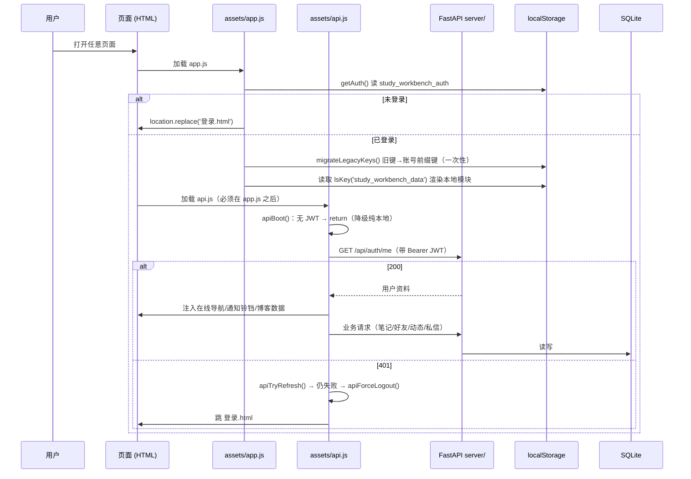

# 星途（原「学习工作台」）项目全景说明书

> 调研方式：只读实地核查（Glob / Grep / Read），关键结论标注依据文件路径。
> 根目录：`D:\下载的文件\学习工作台` ｜ 核查时间基准：工作区最新版本号 `20260912c`
> 文件体量一律以「行数」实计数，未使用估数。

---

## 一、一句话画像

**一个「无构建、无框架、无测试框架」的中文备考/求职多页静态站**，`file://` 双击即可跑；在纯前端 localStorage 底座上，逐年叠了一层 FastAPI+SQLite 多人同步层和一个 Android WebView 壳。前端核心是**两个巨型原生 JS 文件**（`app.js` 6432 行 + `chat-local.js` 2210 行），后端是 **15 个路由模块 / 84 个 HTTP 接口**。当前处于「手册级大改」进行中：代码已跑到 P0-A + 模考引擎重做，**但文档与部署管线都还没跟上**。

---

## 二、技术栈与运行时

| 层 | 技术 | 构建 | 启动方式 | 依据 |
|---|---|---|---|---|
| 前端 | 原生 HTML + 原生 ES5/ES6 JS + 手写 CSS。零框架、零 CDN、零打包器 | 无 | 直接双击 `学习工作台.html`（`file://`）或任意静态服务器托管 | `运行说明.md:106-112` |
| 本地逻辑层 | `assets/app.js`（6432 行） | 无 | 每页 `<script src="assets/app.js?v=20260912c" defer>` | `学习工作台.html:8` |
| 多人同步层 | `assets/api.js`（1469 行，覆盖层） | 无 | 必须**在 app.js 之后**加载 | `私聊.html:278→281`、`运行说明.md:33` |
| 后端 | FastAPI + SQLAlchemy 2.0 + SQLite + PyJWT + httpx + websockets | 无（直接跑源码） | `cd server && python -m uvicorn main:app --host 0.0.0.0 --port 8000`，首次自动建 `server/data.db` | `server/main.py:1-9`、`运行说明.md:88-104` |
| 移动端 | Android WebView 壳（无 Gradle，手写 aapt2/d8/zipalign/apksigner 管线） | `android/build-apk.sh` | 产物 `学习工作台-安卓App.apk`，包名 `com.study.workbench` | `android/build-apk.sh`、`android/AndroidManifest.xml` |
| 部署 | pscp/plink → 腾讯云 `110.42.134.62`，远端根 `/opt/study-workbench` | tar.gz 打包 | `python tools/deploy_update_20260912a.py` | `tools/deploy_update_20260912a.py:17-38` |

**后端地址唯一来源**：`assets/config.js:21` → `var SERVER = 'http://110.42.134.62:8000'`；http/https 场景 `window.STUDY_API_BASE=''`（走同源相对路径），`file:` 场景返回完整 SERVER（`config.js:23-29`）。

**依赖锁定**：`server/requirements.txt:1-13` 锁 `fastapi>=0.110,<1.0`，注释写明「响应类必须 `from fastapi.responses` 导入，否则 ImportError 直接起不来」。

---

## 三、代码规模（实测行数）

| 类别 | 数量 | 行数 | 说明 |
|---|---|---|---|
| 根目录 HTML 页面 | **48 个** | 合计 ~15,000 | 其中**活的 32 个 / 死的 16 个** |
| 最大单页 | `设置.html` | **1602 行** | 其次 `个人中心.html` 687、`PPT素材库.html` 617 |
| `assets/*.js` | **27 个** | **16,407** | `app.js` 6432、`chat-local.js` 2210、`api.js` 1469、`mock-engine.js` 1180 |
| `assets/*.css` | 4 个 | 3,209 | `common.css` 2629、`polish.css` 400、`page-head.css` 92、`states.css` 88 |
| `server/*.py`（主干） | 9 个 | 1,223 | `database.py` 433、`schemas.py` 267、`security.py` 137 |
| `server/routers/*.py` | **15 个** | **2,673** | 最大 `social.py` 377、`groups.py` 310、`friends.py` 300 |
| 后端 HTTP 接口 | **84 个** + 1 WS | — | 逐条数 `@router.*` 装饰器；另有 `/api/health` |
| 后端表 | **23 张** | — | `server/database.py` 中 23 个 `__tablename__` |
| `server/scripts/` 冒烟测试 | 11 个 | 1,685 | `smoke_local_backend.py` 505、`smoke_news.py` 239 等 |
| `tools/` 一级条目 | **~91 个** | — | py/js 脚本 ~80、tar.gz 部署包 9、plink/pscp exe 2、截图 3 |
| `tools/verifier/` | jsdom 校验套件 | — | 含完整 `node_modules`（jsdom/css-tree/undici） |
| 根目录一次性 Python 脚本 | **122 个** | — | `do_rename_*` / `fix_*` / `modify_*` / `unify_*` / `rename_*` / `restore_*` … |
| `备份/` | **80 个**一级备份 | — | 另含 2 份完整 `.git` 历史快照目录 |
| Android | 7 个构建文件 + `MainActivity.java` 708 行 | — | 含 `libs/webkit-1.10.0.aar`（v1.3 遗留，v1.4 起已不用） |

---

## 四、目录结构与职责（活 / 死判定）

| 路径 | 职责 | 状态 | 判定依据 |
|---|---|---|---|
| `*.html`（根目录） | 多页面站点，每模块一个独立页 | **32 活 / 16 死** | 部署脚本 `EXCLUDE_HTML`+`EXCLUDE_PREFIXES`（`tools/deploy_update_20260912a.py:34-36`） |
| — `settings*.html` ×12、`profile.html`/`_v2`/`_v3`、`设置_旧版.html` | 历史改版草稿 | ❌ **死代码** | 同上；`docs/增量PRD-图标与交互-2026-09-12.md:16`「按项目惯例忽略」 |
| — `mock_exam.html`/`_run`/`_result` | P0-B 重做后的模考三独立页 | ✅ 新活 | `mock_exam.html:15-16` |
| — `工具.html` / `更多.html` | A8「底部更多/工具改独立页」成果 | ✅ 活 | `assets/common.css:2025` 注释「A8 增量」 |
| `assets/` | 前端脚本与样式 | ✅ 活 | — |
| — `assets/chat.js`（267 行） | 早期私信实现 | ❌ **死代码** | `tools/qa/_apk_assets_check.txt:3`；三份 PRD 均写「死代码，不要动」 |
| — `assets/mock-exam.js.removed`（21 行） | 旧弹窗版模考，软删除留档 | ❌ 死 | `docs/p0b-rebuild-arch.md:17`「整文件删除」 |
| `data/` | **新增**一级目录，仅 `mock-papers.js`（730 行，7 套卷） | ⚠️ **活但部署管线未覆盖** | `mock_exam.html:15` 引用；`deploy_update_20260912a.py:61-67` 不打 `data/`（高危，见第八节） |
| `server/` | FastAPI 后端 | ✅ 活 | ⚠️ 本地副本与生产一致性无法自证 |
| `ai-server/` | 最早期 Express 版 AI 中转（4 文件） | ❌ **死代码** | `运行说明.md:370`「已被 FastAPI 后端取代，可整体删除」 |
| `android/` | APK 源码与免 Gradle 构建链 | ✅ 活 | `MainActivity.java` 708 行（v1.8：TTS 看门狗 + 多引擎枚举） |
| `tools/` | 部署/bump/校验/探针脚本 | ✅ 活（大量一次性脚本） | — |
| `docs/` | 13 份增量 PRD/架构/缺陷文档 + 2 份 mermaid | ✅ 活 | `docs/WITHDRAWN.md` 为已撤回文档 |
| `备份/` | 80 个历史备份 + 2 份 git 历史 | ❌ 归档 | 部署均排除 |
| `.qa/` | QA 复现截图 + 线上文件快照 + 探针 | ⚠️ 可清 | `docs/缺陷清单-2026-09-11.md:174` 自述「可整目录删除」 |
| `server/.venv/` | Python 3.13 虚拟环境 | ✅ 活但**不该入库** | — |

---

## 五、架构分层与数据流

### 5.1 分层图

```mermaid
graph TD
    subgraph P["表现层 · 32 个独立 HTML 多页（file:// 或 https 直开）"]
        H1[学习工作台.html 首页 hub]
        H2[四级/行测/央国企/高情商/礼仪/PPT 等学习页]
        H3[学习博客.html 动态.html 个人中心.html 设置.html]
        H4[私聊.html 好友申请.html]
        H5[mock_exam.html / _run / _result]
    end

    subgraph L["本地逻辑层 · assets/app.js（6432 行）"]
        A1[登录门禁 getAuth → 未登录 replace 登录.html]
        A2[navigateTo + PAGE_FILES 跨页跳转]
        A3[lsKey 账号前缀 + localStorage 读写]
        A4[学习模块：词汇/行测/错题本/倒计时/统计]
    end

    subgraph S["多人同步层 · assets/api.js（1469 行，覆盖层）"]
        B1[api /apiAuthedFetch + JWT 自动 refresh]
        B2[renderBlogList / renderProfilePage / renderUserHome]
        B3[通知铃铛 60s 轮询 + 私信未读 30s 轮询]
        B4[apiBoot：无 JWT 直接 return → 纯本地降级]
    end

    subgraph B["后端 · FastAPI（server/）"]
        C1[routers ×15：auth/users/notes/social/friends/chat/groups/moments/feedback/study/news/ai/uploads/migrate/ws]
        C2[security.py PBKDF2 + JWT · rate_limit.py 内存限流]
        C3[wsmanager.py 在线点对点推送（仅加速，不做主干）]
    end

    subgraph D["存储"]
        D1[(SQLite server/data.db · 23 表)]
        D2[(localStorage · 学习数据主存)]
        D3[server/uploads/ 静态挂载 /uploads]
    end

    subgraph M["移动端 · Android WebView"]
        E1[MainActivity · file:///android_asset + 干净 WebViewClient]
        E2[AndroidBridge.saveFile 导出桥 / AndroidTTS 发音桥]
        E3[打包时 sed 剔除 api.js → 纯本地单机版]
    end

    P --> L
    L --> S
    S -->|fetch window.API_BASE| B
    L -->|默认路径| D2
    S -->|覆盖/双写| D2
    B --> D1
    B --> D3
    C1 --> C3
    M -.打包同源.-> P
    M -.剔除 api.js.-> L
```

### 5.2 一次典型操作的数据流

**① 刷题并记录错题（纯本地，最强降级路径）**
```
用户答题 → app.js 判分 → appData.stats.totalQuestions++ (app.js:2422/4259)
        → 错题写入 lsKey('study_workbench_data') (app.js:228)
        → updateExamAccuracy() 即时刷正确率 (app.js:4243)
        → 推进全局连续打卡 getConvergedStreak() (app.js:6022)
        → study-stats.js 可选上报 POST /api/study/logs（幂等去重，study.py:29）
        → 后端不可用时：整条链路照常走完，只是不上报
```

**② 发一条动态（在线优先，硬依赖后端）**
```
动态.html → api.js → POST /api/moments (moments.py:141) → moments 表
        → GET /api/moments/feed (moments.py:157) 拉取
        → 点赞 POST /api/moments/{mid}/like (moments.py:204)
        → 后端不可达：api() 抛错 → 页面保持空态/报错，**无本地兜底**
```

**③ 私聊（轮询为主干 + WS 加速 + 离线本地兜底）**
```
私聊.html → chat-local.js（2210 行真实逻辑）
        → 发消息 POST /api/chat/{peer}/messages (chat.py:88)
        → 后端 store_and_deliver()：对方在线 → wsmanager.send_to 实时推；离线 → 入库为未读
        → 前端 2.5s/5s/30s 三条 setInterval 兜底轮询（页面不可见时跳过）
        → 无 JWT（离线单机）→ 走 study_im_local_data 本地会话
```



### 5.3 降级路径（四条，逐级）

| 级别 | 触发条件 | 行为 | 依据 |
|---|---|---|---|
| L1 无 JWT | 离线本地账号登录 | `apiBoot()` 直接 `return`，在线功能不初始化，完全回退本地逻辑 | `api.js:1082-1084` |
| L2 请求失败 | 后端 500 / 网络不可达 | `api()` 抛错被各调用点 catch；学习类模块本就本地存储，照常可用 | `api.js:48-68` |
| L3 401 令牌过期 | access token 过期 | 自动 `POST /api/auth/refresh` 续期重试；refresh 也失败才 `apiForceLogout()` | `api.js:70-94` |
| L4 APK 单机 | 打包时剔除 `assets/api.js` 标签 | 手机端天然只有本地层 | `android/build_apk.py:49`、`build-apk.sh:42` |

---

## 六、核心机制（6 个，都是踩过坑后定型的）

**1｜页面导航 `navigateTo()`（`app.js:911-950`）**
`PAGE_FILES`（`app.js:890-909`，20 条映射）是跨页唯一真源：`if(!document.getElementById('page-'+page)) location.href = PAGE_FILES[page]`——**所有跨页 onclick 一处改全站生效**。附带三条历史 bug 补丁：目标页不在 `.content` 内则隐藏 content（防上半部空白）、`document.body.className = themeMap[page] + (isDarkMode?' dark':'')`（防切页丢深色）、滚动复位加空守卫。

**2｜登录门禁（双轨）**
- 本地：`app.js:225` `if(!getAuth()) location.replace('登录.html')`；`登录.html` **不引用 app.js**，避免死循环。
- 在线：`api.js` 覆盖 `doLogout/confirmLogout`；JWT 存 `study_workbench_token`，refresh 存独立键。

**3｜localStorage 键位分布（P0-A T15 后已账号隔离）**
- 账号前缀机制：`window.CURRENT_ACCOUNT`（取自 `study_workbench_auth.account`，兜底 `last_account`→`'shared'`）+ `lsKey(name) = name + '@' + account`（`app.js:9-16`）。
- 一次性迁移：`app.js:21-62` 的 `migrateLegacyKeys()` 把 **24 个字面键 + 2 类前缀键**从无前缀键复制到账号前缀键后删旧键。
- **不加前缀的全局键**（有意保留）：`study_workbench_auth`、`_users`、`_token`、`_theme`、`_settings`、`_ai_fab_pos`、`_errors`。
- 业务主数据键：`study_workbench_data`（含 `countdowns / mockExams / tasks / notes / stats / profile`…）。

**4｜图标注入 `icon-map.js`（287 行）**
lucide 图标字典内联为 SVG 字符串（零 CDN），统一模板 `fill=none stroke=currentColor stroke-width=2 viewBox="0 0 24 24"`，**禁 mask/filter/symbol use**（老 WebView 不支持）。静态 HTML 写 `data-icon="book-open"`，`DOMContentLoaded` 时把内层替换为 SVG。当前字典 17~19 个 key。

**5｜版本号缓存机制**
所有资源引用带 `?v=20260912c`。升级流程 = `tools/bump_versions_0912a.py` 批量替换 + 内置校验（注释配对、div 平衡、可疑片段正则）。**踩过的坑**：旧脚本把版本号写死，无参运行会**把全站反向降级**；已改为必须显式传参。另有 Chrome `file://` 缓存中毒坑：file:// 按路径缓存、忽略 `?v=`、跨重启持久，唯一解法是换新文件名。

**6｜模考引擎（P0-B T03，已重做完成）**
```
data/mock-papers.js (730 行, 7 套卷, 挂 window.MOCK_PAPERS_DATA)
   ↓
mock_exam.html（选卷）→ mock_exam_run.html（答题）→ mock_exam_result.html（成绩）
   ↓ 共用
assets/mock-engine.js (1180 行)：状态机 + 9 题型 renderQuestion() + Timer(Date.now 差值)
   + 答题卡 + 阶段进度 + 主观题草稿持久化 + beforeunload 提示
   + 所有 localStorage 走 window.lsKey() 前缀化
assets/mock-result.js (313 行)：成绩页 + 历史最佳对比
```
旧弹窗版已软删除为 `assets/mock-exam.js.removed`。

---

## 七、当前进行中的工作（关键结论：**代码已跑到路线图前面**）

### 7.1 阶段判定

`星途平台-合并实施路线图-2026-09-12.md` 的「现状快照」写的是：**P0-A 全批未开工、B2 模考引擎重做未开工、A6/A8/A9 未实现**。
但**实测代码显示这些都已经在本地落地了**。版本令牌从路线图记录的 `20260912a` 已推进到 **`20260912c`**，说明文档至少滞后两个批次。

| 需求 | 路线图说 | 代码实测 | 依据 |
|---|---|---|---|
| **15** 数据按账号隔离 | 未开工 | ✅ 已实现（T15） | `app.js:7-62` `lsKey()` + `migrateLegacyKeys()` |
| **16** 倒计时日期解析 | 未开工 | ✅ 已实现（T16） | `app.js:1005` 规范化 + `858` 存量清洗 + `1363` 入库校验 |
| **18** 计数器同步 | 未开工 | ✅ 已实现（T18①②） | `app.js:2433/4243`、`6022-6028` 统一 `study_workbench_streak` |
| **21** 图形推理题干 | 已完成待收口 | ✅ | `tools/verify_q21_figures.js` 存在 |
| **22** 密码强度 | 已完成待收口 | ✅ 已进本地后端 | `server/schemas.py:22-33` + `scripts/smoke_password_strength.py` |
| **19** 真题模考 | 弹窗版待废，B2 未开工 | ✅ **已按手册重做为三独立页** | `mock_exam*.html` + `mock-engine.js` + `data/mock-papers.js` |
| A6 修改密码 | 未实现（占位） | ✅ 已实现 | 后端 `auth.py:122 POST /change-password`；前端 `设置.html:1212-1237` |
| A8 更多/工具独立页 | 未实现 | ✅ 已实现 | `工具.html`(280 行) / `更多.html`(267 行) + `common.css:2025` |
| A9 首页学习数据 | 硬编码 0 | ✅ 已接实时数据源 | `app.js:1137-1156` 计算并 `setStatText(...)` |
| **02** 图标系统 | 侧栏已做，其余未 | ✅ 侧栏 + 新增独立 `icon-map.js` | 工作区已是 `20260912c` |

### 7.2 已完成（本次核查可确认的）

- 批次一（A1–A9 含语音链路）、批次二（12 条）、批次四（隐私与群设置）、批次五（图标 T04 + bump `20260912a`）。
- **P0-A 数据隔离三件套（T15/T16/T18）代码落地**，`tools/verify_p0b_all.js` 自测 42/42 PASS。
- **P0-B 模考引擎重做（T03-01~T03-06）代码落地**。
- 后端新增：A6 改密、密码强度、84 个接口、23 张表、11 个冒烟脚本。

### 7.3 待办

- **B1**：剩余约 180 处 emoji 换 `icon-map` 图标；需求 03/04/05/12 删减（写作提升 / 数量关系·判断推理·资料分析·题型正确率 / 情景选择实战 / 工具页金句入口）；需求 07 PPT 训练重构。
- **B3–B6**：手册 10 个模块中**仍有 8 个未开工**（阅读/翻译/口语/综合知识/企业库/高情商案例/i 人专区/礼仪 SVG）。
- **C 线**：需求 08 好友菜单重排、10 广场重构、11 设置层级、24 私聊「演示模式」标签。
- **Q 线**：APP 跨端、聊天富媒体（语音/图片/视频）、HTTPS+域名（需用户拍板是否有域名）、群聊。
- **专属线**：需求 01 管理员账号；**M 线**：需求 29 做减法到 ~15 个功能库。
- **待拍板 4 件事**：真题 vs 模拟命名口径、mock-exam.js 去留（代码已按建议执行：废弃弹窗层、保留卷数据）、图标系统收口方式、数据文件形态（代码已落成 `data-*.js` 挂 window）。

### 7.4 已识别冲突（3 条，含 1 条高危）

| # | 冲突 | 现状 | 风险 |
|---|---|---|---|
| **C1** | 模考引擎「弹窗版 vs 三级独立页」 | 已按手册解决：弹窗版改名 `mock-exam.js.removed`，新建三页 + `mock-engine.js` + `data/mock-papers.js` | 🟢 已消解 |
| **C2** | **🔴 新增 `data/` 目录未进任何交付管线** | `mock_exam.html:15` / `_run:15` / `_result:15` 都引用 `data/mock-papers.js?v=20260912c`；但部署脚本与三份 APK 脚本都只复制 root html + `assets/` | **🔴 极高**：部署/打包后模考三页全 404，显示「题库加载失败：data/mock-papers.js 未注入」（`mock_exam.html:292`） |
| **C3** | 文档滞后于代码 | 路线图 / 缺陷清单 / 运行说明 三份文档内容均已被后续批次推翻；`运行说明.md` 目录结构里**没有 `data/`、`工具.html`、`更多.html`、`icon-map.js`、`subpage-router.js`** | 🟡 高：新人照文档判断会严重误判现状 |

---

## 八、技术债与风险（Top 8，按严重度排序）

1. **🔴 `data/` 目录未进部署与 APK 管线**（C2）。当前 `20260912c` 的模考三页在服务器和 APK 上必然是坏的。
   **建议**：改 `deploy_update_*.py` 增加 `data/` 打包 + APK 构建脚本增加 `cp -r data/`，并在探针里加一条 `data/mock-papers.js` 可达性检查。

2. **🔴 服务器凭据明文落盘**。`tools/deploy_update_20260912a.py:25-32` 在 `SW_HOST/SW_PASS` 未设时，会去读 `upload_v23.ps1` 里的 `pscp.exe -pw "<密码>" root@<IP>` 正则提取——**root 密码以明文存在仓库文件里**。与路线图「凭据红线」直接冲突。

3. **🔴 无构建、无测试框架、无 CI**。前端改完只能靠 `node --check` + div 平衡 + jsdom 探针脚本验证；后端只有 11 个手写 `smoke_*.py`。任何一次改动都可能静默破坏别的页面（历史上已发生过 `</style>` 被吞导致白屏、div 877:876 失衡等事故）。

4. **🟠 app.js 6432 行 + chat-local.js 2210 行 = 8642 行巨型文件**。`app.js` 同时承担登录门禁、设置、主题、AI、博客、词汇、行测、错题本、倒计时、统计、导出……且 `api.js` 用「后加载同名函数覆盖 `app.js`」的方式做增强（`renderProfilePage/doLogout/editProfile` 各定义两遍），**同名函数双份定义**（`api.js:172` 与 `api.js:1148`），极易改错文件。

5. **🟠 根目录 122 个一次性 Python 脚本 + 80 个备份文件 + 16 个废弃 HTML 草稿**。检索成本与误改风险持续累积；`docs/缺陷清单-2026-09-11.md:176` 自述「建议单独开一次『工作区清理』任务」。

6. **🟠 本地 `server/` 与生产一致性无法自证**。历史上出现过 `备份/social.py.backup-20260911-local-stale`。本地副本现已含 A6 改密 + 密码强度，但**是否等于生产版本无从在本机核实**（无 `SW_PASS`，所有匿名接口 401）。部署前必须做「以服务器版为基线的差异预检」。

7. **🟡 前端三套数据真相源并存**：`localStorage`（学习数据主存）+ 后端 SQLite（社交/笔记）+ `data/mock-papers.js`（静态挂 window）。没有统一的数据访问层，跨源一致性靠人工约定（`study-stats.js` 本地优先，`syncFromCloud()` 至今为空实现，`study.py:94-96`）。

8. **🟡 APK 工程结构性隐患**：
   - `android/libs/webkit-1.10.0.aar` + `webkit-classes.jar` 是 v1.3 遗留，**v1.4 已回归 file:// 并去掉 androidx 依赖**，属死资源。
   - 构建工具链（JDK17 / build-tools 34 / platform-35）在 `C:\Users\ATM\android-build\`，**不在项目内**，换机即不可构建；`platform-tools(adb)` 至今未装。
   - 血泪教训：**「代码修好 ≠ 包里有」**——曾出现 TTS 加固从没进过任何 APK。每次交付前必须抽查包内文件与源码关键符号一致性。

---

## 九、给主理人的 3 条建议（按性价比排序）

1. **立刻补 `data/` 进部署 + APK 管线**（风险 1）。这是一行 `cp -r` 的事，不补则 `20260912c` 的模考功能上线即坏。
2. **把 `upload_v23.ps1` 里的明文密码清掉**，改用环境变量或 SSH key（风险 2）。
3. **重做一份「现状快照」文档**取代滞后的 `运行说明.md`：新接手的人按现文档会漏掉 `data/`、`icon-map.js`、`subpage-router.js`、`工具/更多.html` 四个新增资产，也可能误改 16 个废弃草稿页。

---

## 十、关键结论依据索引

| 结论 | 依据文件 |
|---|---|
| 技术栈 / 启动 | `运行说明.md:88-112`、`server/main.py:1-9`、`server/requirements.txt` |
| 后端地址唯一来源 | `assets/config.js:21-32` |
| 代码规模 | `rg -c '^'` 全量实测 |
| 废弃页判定 | `tools/deploy_update_20260912a.py:34-36`、`docs/增量PRD-图标与交互-2026-09-12.md:16` |
| chat.js 死代码 | `tools/qa/_apk_assets_check.txt:3`、`docs/增量架构设计-隐私与群设置-2026-09-11.md:43` |
| ai-server 死代码 | `运行说明.md:370` |
| 导航机制 | `assets/app.js:890-950` |
| 登录门禁 | `assets/app.js:225`、`assets/api.js:1082-1084` |
| localStorage 键位 | `assets/app.js:9-62, 228, 5950-6028` |
| 图标注入 | `assets/icon-map.js:1-33` |
| 版本机制与坑 | `tools/bump_versions_safe.py:1-18`、`.workbuddy/memory/2026-09-08.md:55` |
| 模考引擎 | `assets/mock-engine.js:1-74`、`data/mock-papers.js:719`、`mock_exam.html:11-16` |
| **`data/` 未进管线** | `tools/deploy_update_20260912a.py:61-86`、`android/build_apk.py:95-97`、`android/build-apk.sh:52`、`android/build-apk.ps1:36` |
| 凭据明文 | `tools/deploy_update_20260912a.py:25-32`、`upload_v23.ps1:2-4` |
| 后端接口/表清单 | `server/routers/*.py` 装饰器统计、`server/database.py` 23 个 `__tablename__` |
| 路线图滞后 | `星途平台-合并实施路线图-2026-09-12.md:17-21, 126-155` vs 第七节实测表 |
| 缺陷清单滞后 | `docs/缺陷清单-2026-09-11.md:126,128-129` vs `server/routers/auth.py:122`、`设置.html:1212`、`app.js:1137-1156` |
| APK 教训 | `.workbuddy/memory/2026-09-09.md:47-59, 82-84` |

---

**调研边界说明**：
- 无法核实生产服务器（110.42.134.62）上 `server/` 与 `/opt/study-workbench/web/` 的真实内容——本机无凭据，所有匿名接口返回 401。因此「本地 vs 生产一致性」只能给出历史证据（`-local-stale` 备份），不能给出当前结论。
- 未使用 git（仓库 `.git` 有过损坏；`备份/` 内还存着两份历史 git 快照）。
- 全程只读，未修改任何业务文件。
