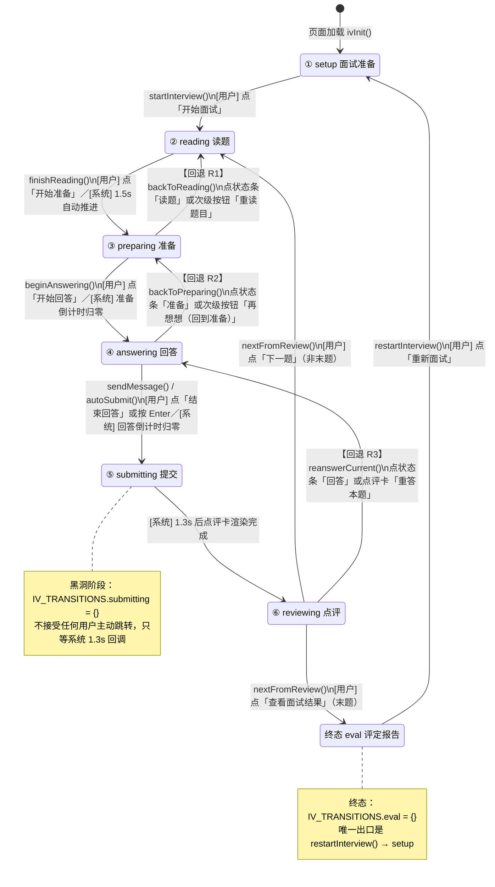

# 交互文档 · N9-19 模拟面试「六阶段状态机」

- **任务编号**：A4（批次 3+ · 20260916）
- **页面**：`AI模拟面试.html`（纯 CRLF）
- **协作脚本**：`assets/iv-prep.js`（纯 LF，只做「词汇统一 + 交接载荷 + 流程预览」）
- **文档基线**：`AI模拟面试.html` 70,853 B；`assets/iv-prep.js` 31,944 B
- **参照备份**：`AI模拟面试.html.bak-pre-l7-20260916`（48,684 B）、`assets/iv-prep.js.bak-pre-l7-20260916`（27,428 B）
- **兼容基线**：安卓 APK 老 WebView ≈ Chrome 50~58 → 全程 ES2017 及以下

---

## 一、六阶段状态机总览

页面把「一次模拟面试」抽象为 **六个阶段 + 一个终态**，由单一出口函数 `ivGotoStage(target, opts)`
统一驱动，保证「状态条 / 输入区 / 计时器」三方永远一致。

| 阶段 id | 名称 | index | 状态条段位 | 该阶段唯一主按钮 | 计时类型 |
|---|---|---|---|---|---|
| `setup` | 面试准备 | 0 | −1（不显示） | 开始面试 | `''` |
| `reading` | 读题 | 1 | 0 | 开始准备 | `''` |
| `preparing` | 准备 | 2 | 1 | 开始回答 | `prep` |
| `answering` | 回答 | 3 | 2 | 结束回答 | `answer` |
| `submitting` | 提交 | 4 | 3 | （无，AI 自动点评） | `''` |
| `reviewing` | 点评 | 5 | 4 | 下一题 / 查看面试结果 | `''` |
| `eval` | 评定报告（终态） | 6 | 5（终态全 done） | 重新面试 | `''` |

> 状态条（`.stage-bar #stageBar`）只渲染 `reading..reviewing` **五段**；`setup` 阶段整块对话区
> `#chatContainer` 带 `.hidden`，所以看不到状态条。`eval` 阶段 `#chatContainer` 同样隐藏，状态条
> 被 `markAllStagesDone()` 全部置为 `.done` 后随容器一起隐藏。

---

## 二、Mermaid 状态图



---

## 三、阶段明细表

### 3.1 阶段 / id / 进入条件 / 退出条件 / DOM / 埋点

| 阶段 | id | 进入条件 | 退出条件（→ 去向） | 涉及 DOM 容器 | 与 AI 的交互点 | 埋点 |
|---|---|---|---|---|---|---|
| ① 面试准备 | `setup` | `ivInit()` 末尾 `ivGotoStage('setup')`；或 `restartInterview()` | 用户点 `.start-btn`「开始面试」→ `startInterview()` → `reading` | `#setupPanel`（可见）、`#typeOptions`、`#posOptions`、`#topProgress`（隐藏）、`#chatContainer`（隐藏） | 无（纯本地选择，不调 AI） | 无 |
| ② 读题 | `reading` | `startInterview()` 600ms 后 `loadQuestion(0)` → `ivGotoStage('reading')`；或 `nextFromReview()` → `loadQuestion(n)`；或回退 R1 | ① 用户点 `#readBtn`「开始准备」→ `finishReading()`；② 系统 `armReadingAutoAdvance()` 1.5s 自动 → `finishReading()` | `#readComposer`（可见）、`#chatMessages`、`#qMsg{n}` 题干卡、`.q-block#tip{n}`/`#demo{n}`（答题提示/示范回答，默认 hidden） | 题干、`tip`、`demo` 均来自本地 `INTERVIEW_QUESTIONS`；`?q=` 自选题时题干来自 `IP_gotoAI()` 交接载荷 | 无 |
| ③ 准备 | `preparing` | `finishReading()` → `ivGotoStage('preparing')` + `startTimer(q.prep,'prep')`；或回退 R2 | ① 用户点 `#prepBtn`「开始回答」→ `beginAnswering()`；② 准备倒计时归零 → `beginAnswering()`；③ 回退 R1 点「重读题目」→ `backToReading()` | `#prepComposer`（可见）、`#timerLabel`（文案切「准备剩余」）、`#timerValue`、`#timerFill`、`.answer-aux` 内「重读题目」 | 无（本地计时） | 无 |
| ④ 回答 | `answering` | `beginAnswering()` → `ivGotoStage('answering')` + `startTimer(q.time,'answer')`；或回退 R3 | ① 点 `#sendBtn`「结束回答」→ `sendMessage()`；② `#inputBox` 按 Enter → `handleKeyDown` → `sendMessage()`；③ 回答倒计时归零 → `autoSubmit()`；④ 回退 R2 点「再想想」→ `backToPreparing()`；均汇入 `submitAnswer()` → `submitting` | `#textComposer`（可见）、`#inputBox`、`#answerAux`（可见）、`#tabText`/`#tabVoice`、`#modeHint` | 无（本地收集文本） | 无 |
| ⑤ 提交 | `submitting` | `submitAnswer()` → `ivGotoStage('submitting')`；用户消息入会话；`showTyping()` | 系统 `pendingFeedbackTimer` 1300ms 后：`hideTyping()` → `generateFeedback()` → `renderFeedbackCard()` → `ivGotoStage('reviewing')` | `#typingIndicator`（AI 正在点评 · 三个 typing-dot）、`#composer.idle`（整块底部输入区收起） | **AI 交互点①**：`generateFeedback(answer, question)` 三维打分（表达逻辑/内容深度/岗位匹配度）+ 优点/待改进/改进建议/参考回答 | 无 |
| ⑥ 点评 | `reviewing` | 系统回调 → `ivGotoStage('reviewing')` + `scrollChat()` | ① 非末题：点 `.fb-next`「下一题」→ `nextFromReview()` → `currentQuestion++` → `loadQuestion()` → `reading`；② 末题：点 `.fb-next`「查看面试结果」→ `addAIMessage()` + `markAllStagesDone()` + 1200ms → `showEvaluation()` → `eval`；③ 回退 R3 点「重答本题」→ `reanswerCurrent()` → `answering` | `.feedback-card`（三维 `.fb-bar-row` × 3 + `.fb-sec` × 4 + `.answer-aux` 内「重答本题」+ `.fb-next`）、`#composer.idle` | **AI 交互点②**：点评卡内容 = `generateFeedback()` 返回值；参考回答 = `question.demo` | 无 |
| 终态 评定报告 | `eval` | `showEvaluation()` → `ivGotoStage(IV_TERMINAL)`；`#chatContainer` 隐藏，`#evalPanel` 显示 | 点 `.eval-btn`「重新面试」→ `restartInterview()` → `setup` | `#evalPanel`、`#evalScores`（三维均分条）、`#evalGood`、`#evalImprove`、`#evalOverall` | **AI 交互点③**：`userResults` 三维均值 + `userAnswers` 平均长度聚合出总评 | 无 |

### 3.2 转移白名单（`IV_TRANSITIONS`）

| 当前阶段 | 可主动跳到 | 说明 |
|---|---|---|
| `setup` | `reading` | 由 `startInterview()` 承接 |
| `reading` | `preparing` | 由 `finishReading()` 承接 |
| `preparing` | `reading`、`answering` | `reading` = 回退 R1；`answering` = 正常推进 |
| `answering` | `preparing`、`submitting` | `preparing` = 回退 R2；`submitting` = 正常提交 |
| `submitting` | *(空)* | 黑洞阶段，只等系统回调 |
| `reviewing` | `answering` | 回退 R3；「下一题 / 查看面试结果」走 `nextFromReview()`，**不经白名单** |
| `eval` | *(空)* | 终态，只能 `restartInterview()` |

> ⚠️ **口径提醒**：`nextFromReview()`（下一题 / 查看结果）与 `showEvaluation()`、`submitAnswer()` 内的
> `submitting→reviewing` 属**系统自动转移**，不写进 `IV_TRANSITIONS`。`IV_TRANSITIONS` 只约束
> 「用户主动点击」的路径（`ivJumpToStage()` 入口）。

### 3.3 三条回退路径（R1/R2/R3）

| 编号 | 路径 | 触发入口（两条等价） | 副作用 |
|---|---|---|---|
| **R1** | `preparing → reading` | ① 状态条「读题」段（`data-jump="1"`）；② `#prepComposer` 次级按钮「重读题目」 | `armReadingAutoAdvance()` 重新起 1.5s 自动推进；**不丢任何输入**；`ivToast('已回到读题：重新审题后再进入准备')` |
| **R2** | `answering → preparing` | ① 状态条「准备」段；② `#answerAux` 次级按钮「再想想（回到准备）」 | `startTimer(q.prep,'prep')` 重启准备计时；`#inputBox` 内容**保留**；`ivToast('已回到准备：思路理清后再「开始回答」')` |
| **R3** | `reviewing → answering` | ① 状态条「回答」段；② `.feedback-card` 内「重答本题」 | **出栈**：`userResults.length = currentQuestion`、`userAnswers.length = currentQuestion`；**移除 DOM**：最后一张 `.feedback-card` + 最后一条 `.message.user`；`#inputBox` 清空并 focus；`startTimer(q.time,'answer')`；`ivToast('已回到回答：可重写本题答案并重新提交')` |

### 3.4 状态条视觉三态

| 类名 | 含义 | 视觉 |
|---|---|---|
| *(无)* | 未开始 | 灰点 `--border`，文字 `--text-muted` |
| `.active` | 进行中 | 蓝点 `--primary` + `box-shadow: 0 0 0 3px var(--primary-light)` 光环，文字 `--primary-dark` + 粗体 |
| `.done` | 已完成 | 蓝点 `--primary` + `opacity: .45`，文字 `--text-secondary` |
| `[data-jump="1"]` | 当前可点 | `cursor:pointer` + hover/focus 光环；`title` 见 `IV_BACK_HINT` |
| `[data-jump="0"]` | 当前不可点 | 无 cursor 提示；`title = '当前不可跳到「X」'` |

### 3.5 计时器口径

- `startTimer(seconds, mode)`：`mode` ∈ `'prep' | 'answer'`，`timeLeft` / `currentTotal` / `timerMode` 同步刷新。
- 只有 `preparing` / `answering` 两段跑表；`ivGotoStage()` 里对其它阶段统一 `clearInterval(timerInterval)`。
- 归零：`prep` → `beginAnswering()`；`answer` → `autoSubmit()`。
- 视觉告警：`answer` 模式 `≤20s` 加 `.warning`（橙 #f57c00），`≤10s` 加 `.danger`（红 #e53935）。
- 时长来源：`currentQ().prep`（15/15/15/20/15）与 `currentQ().time`（90/60/60/90/60，`?q=` 自选题固定 90/20）。

### 3.6 `?q=` 交接载荷（与 `assets/iv-prep.js` 的接缝）

```
面试准备页 (iv-prep.js)
  IP_gotoAI(question)
    → window.openInterviewDemo 存在？→ 同页浮层（当前站点未提供，走下一步）
    → location.href = 'AI模拟面试.html?q=' + encodeURIComponent(question)

AI模拟面试.html
  ivInit() → ivReadQuery()（手写解析，不用 URLSearchParams）
    → PENDING_PREP_Q = qs.q
    → SESSION_QUESTIONS = ivBuildSessionQuestions()   // 自选题目 unshift 到第 1 题
      · fromPrep:true，keywords:[]，time:90，prep:20
    → #setupPanel .setup-desc 前置提示「来自「面试准备」的自选题目已作为第 1 题加入本次面试。」
  ivSnapshot().fromPrep === true  // 供 QA 断言
```

`iv-prep.js` 侧只做三件事，**不含状态条本身**：

1. `IP_shareStages()`：仅在 `window.IV_STAGES / IV_BAR_STAGES / IV_STAGE_LABEL / IV_TERMINAL`
   **未定义**时写入（宿主页 HTML 内联脚本已顶层 `var` 定义同名，故绝不会覆盖宿主页口径）。
2. `IP_stageLegend()`：每张题目卡尾部「⑤ 五段流程」预览（读题→准备→回答→提交→点评）。
3. `IP_gotoAI()`：交接载荷（见上）。

> ⚠️ **ES5 语法约束**：`iv-prep.js` 整体在 IIFE 内，**零个零缩进顶层声明**；向全局只经
> `window.xxx = ...` 显式挂载。因此**不会与 `AI模拟面试.html` 顶层 `var INTERVIEW_QUESTIONS` /
> `var toastTimer` 产生重复声明**（重复 `var` 会把整个文件打成 SyntaxError 静默失效）。

---

## 四、走通路径（QA 照此点击，从首页到结束）

### 4.1 主路径 · 推荐 5 题全流程（含三条回退）

> 前置：本地静态服务（`tools/qa/_qa_origin.js` 自启），入口 `学习工作台.html`。

| # | 页面 / 位置 | 操作 | 期望结果（断言点） |
|---|---|---|---|
| 1 | `学习工作台.html` | 找到「AI模拟面试」入口卡片并点击 | 跳到 `AI模拟面试.html`；`#setupPanel` 可见，`#chatContainer` / `#evalPanel` 带 `.hidden` |
| 2 | `AI模拟面试.html` · 面试准备 | 面试类型点「半结构化面试」 | `.setup-option.active` 唯一；`selectedType === 'semi'` |
| 3 | 同上 | 应聘岗位点「运营岗」 | `.setup-option.active` 唯一；`selectedPos === 'operation'` |
| 4 | 同上 | 点「开始面试」 | `IV_SNAPSHOT().stage === 'reading'`；`#setupPanel` 隐藏；`#topProgress` 显示「第 1 / 5 题」；`#stageBar` 第 1 段 `.active`；`#stageTip` = 「第 2 / 6 阶段 · 读题」 |
| 5 | 读题阶段 | 展开题干卡内「答题提示」/「查看示范回答」 | `.q-block#tip0` / `#demo0` 去掉 `.hidden`，内容随 `INTERVIEW_QUESTIONS[0]` |
| 6 | 读题阶段 | **3 秒内**点 `#readBtn`「开始准备」 | `stage === 'preparing'`；`#readComposer` 隐藏，`#prepComposer` 显示；`#timerLabel` = 「准备剩余」 |
| 7 | 准备阶段 | 点「重读题目」（**R1**） | `stage === 'reading'`；`#readComposer` 显示；1.5s 后**自动**回到 `preparing` |
| 8 | 准备阶段 | 等 1.5s 自动推进后再点 `#prepBtn`「开始回答」 | `stage === 'answering'`；`#textComposer` + `#answerAux` 显示；`#timerLabel` = 「回答剩余」 |
| 9 | 回答阶段 | 点「再想想（回到准备）」（**R2**） | `stage === 'preparing'`；`#inputBox` 内容**保留** |
| 10 | 准备阶段 | 点 `#prepBtn`「开始回答」 | 回到 `answering` |
| 11 | 回答阶段 | `#inputBox` 输入 ≥ 120 字、含「第一/第二/曾经」的回答，点 `#sendBtn`「结束回答」 | `stage === 'submitting'`；`.message.user` 入会话；`#typingIndicator` 出现；`#composer` 加 `.idle` |
| 12 | 提交阶段 | 等 ~1.3s（勿点击） | `stage === 'reviewing'`；`.feedback-card` 出现；`.fb-bar-row` 计 3 条；`#typingIndicator` 消失 |
| 13 | 点评阶段 | 点点评卡「重答本题」（**R3**） | `stage === 'answering'`；`.feedback-card` 被移除；`.message.user` 被移除；`IV_SNAPSHOT().reviewed === 0` |
| 14 | 回答阶段 | 再次输入并点「结束回答」 | 回到 `reviewing`，`.feedback-card` 重新出现 |
| 15 | 点评阶段 | 点 `.fb-next`「下一题」×4（每轮：等 1.5s 自动推进准备 → 点「开始回答」→ 输入 → 点「结束回答」→ 等 1.3s） | 每轮 `IV_SNAPSHOT().question` 递增至 5；`#questionInfo` 同步「第 n / 5 题」；进度点逐个变 `.done` |
| 16 | 第 5 题点评阶段 | 点 `.fb-next`「查看面试结果」 | `stage === 'eval'`；`#evalPanel` 显示；`#chatContainer` 隐藏；`#evalScores` 3 条均分；`#evalGood` / `#evalImprove` / `#evalOverall` 非空；`#stageBar` 5 段全 `.done` |
| 17 | 评定报告 | 点 `.eval-btn`「重新面试」 | `stage === 'setup'`；`#setupPanel` 显示；`#evalPanel` 隐藏；残留 `.feedback-card` / `.message.user` 被清理；`#timerValue` = `—` |

### 4.2 分支路径 A · 倒计时自动提交

| # | 操作 | 期望 |
|---|---|---|
| A1 | 进入 `answering`，`#inputBox` **留空**，等 `#timerValue` 归零 | `autoSubmit()` 触发 → `submitting`；用户消息为「（时间到，未作答）」；点评卡「表达逻辑/内容深度/岗位匹配度」均为低分档（12/10/12 附近）；`.fb-sec-t.bad` 列出「本题未作答…」 |
| A2 | `preparing` 阶段等 `#timerValue` 归零 | `beginAnswering()` 自动触发 → `answering` |

### 4.3 分支路径 B · 键盘 Enter 提交

| # | 操作 | 期望 |
|---|---|---|
| B1 | `answering`，`#inputBox` 输入文字后按 **Enter** | `handleKeyDown()` → `sendMessage()` → `submitting` |
| B2 | 按住 **Shift+Enter** | **不提交**，文本域内换行；`textarea` 高度自适应（≤120px） |

### 4.4 分支路径 C · `?q=` 自选题目带入

| # | 操作 | 期望 |
|---|---|---|
| C1 | 打开 `AI模拟面试.html?q=请谈谈你的职业规划` | `#setupPanel .setup-desc` 前置「来自「面试准备」的自选题目已作为第 1 题加入本次面试。」；`IV_SNAPSHOT().fromPrep === true`；`total === 6` |
| C2 | 点「开始面试」→ 走完第 1 题 | 第 1 题题干 = 解码后的 `q`；点评卡**不**报 NaN，`.fb-sec-t.bad` 含「本题为自选题目，无内置要点清单…」 |
| C3 | 从面试准备页点「按五段流程练这道题」 | `IP_gotoAI()` → 跳 `AI模拟面试.html?q=<题干>`，同上 |

### 4.5 分支路径 D · 状态条直点（白名单 + 拒绝路径）

| # | 操作 | 期望 |
|---|---|---|
| D1 | `preparing` 时点状态条「提交」段 | `[data-jump="0"]` → 仅弹 `ivToast('不能从「准备」跳到「提交」')`，阶段**不变** |
| D2 | `setup` 阶段（状态条不可见）用 `IV_GOTO('reviewing')` | 被白名单拒绝，**不抛异常**，`stage` 仍为 `setup` |
| D3 | `reviewing` 时点状态条「回答」段 | 走 R3，等同「重答本题」 |
| D4 | 用 **Tab** 聚焦状态条段后按 **Enter / 空格** | `ivBindStageBar()` 的 `keydown` 分支触发，行为同点击 |

### 4.6 分支路径 E · 语音 Tab 灰显

| # | 操作 | 期望 |
|---|---|---|
| E1 | 点 `#tabVoice`「语音回答」 | `#modeHint` 去掉 `.hidden` 显示「语音回答即将上线，本次请使用文字作答」，2.2s 后自动隐藏；`#tabText` 仍 `.active`；阶段**不变** |

### 4.7 分支路径 F · 顶栏返回

| # | 操作 | 期望 |
|---|---|---|
| F1 | 点 `.header-back` | `goBack()`：`history.length > 1` → `history.back()` |
| F2 | 直接打开本页（无历史）后点返回 | 兜底：`document.referrer` 含「个人中心.html」→ 跳个人中心；否则跳 `学习工作台.html` |

---

## 五、QA 断言辅助接口（页面自带的只读句柄）

页面在 `ivExportApi()` 里挂出三个全局（**仅在未定义时写入**，不覆盖外部同名）：

| 全局 | 签名 | 用途 |
|---|---|---|
| `window.IV_SNAPSHOT()` | `() → { stage, index, inBar, question, total, answered, reviewed, fromPrep }` | 状态机只读快照，不改 DOM |
| `window.IV_CAN_GOTO(stage)` | `(string) → boolean` | 当前阶段能否**主动**跳到目标（走 `IV_TRANSITIONS`） |
| `window.IV_GOTO(stage)` | `(string) → void` | 按状态机跳转；不可跳则弹轻提示，**不抛错** |

`ivSnapshot()` 字段口径：

```
stage    当前阶段 id（六阶段之一，或终态 'eval'）
index    阶段序号：setup=0 … reviewing=5，eval=6
inBar    状态条段序号：reading=0 … reviewing=4；setup / eval = -1
question 当前第几题（1 起；不是索引）
total    本次面试总题数（内置 5；带 ?q= 时为 6）
answered userAnswers.length（每提交一题 +1）
reviewed userResults.length（每出一次点评 +1；R3 回退会减 1）
fromPrep 是否由 ?q= 带入自选题目
```

---

## 六、老 WebView（Chrome 50~58）兼容要点

| 风险点 | 本页做法 |
|---|---|
| 可选链 `?.` / 空值合并 `??` | 全页 0 命中（`grep` 已核） |
| `Element.closest()` | 不用；`ivFindSeg()` 手写 `parentNode` 回溯 |
| `URLSearchParams` | 不用；`ivReadQuery()` 手写 `split('&')` 解析 |
| `String.prototype.replaceAll` | 不用；统一 `String.replace(/…/g, …)` |
| `classList.toggle(cls, force)`（双参形式在老内核不可靠） | 统一走 `ivToggleClass(el, cls, on)` 显式 `add`/`remove` |
| 对象展开 `{...obj}` / 对象剩余解构 | 全页 0 命中 |
| 顶层 `await` | 无异步顶层；异步仅 `setTimeout` / `fetch` 回调 |
| `catch {}` 可选绑定 | 全部写作 `catch (e) { /* 忽略 */ }` |
| `Array.prototype.includes` / `Object.entries` | 不用；统一 `indexOf` / `hasOwnProperty` 风格遍历 |
| `scrollIntoView({block:'nearest'})` | 老内核可忽略 options 对象（不抛错）；jsdom 下 `window.scrollTo` 报 `Not implemented` 属**环境限制**，非缺陷 |
| 重复顶层 `var` 声明 | 已核：`iv-prep.js` **零个零缩进顶层声明**，全局只经 `window.xxx =` 挂载；不与 HTML 内联脚本的 `INTERVIEW_QUESTIONS` / `toastTimer` 冲突 |

---

## 七、未做视觉验证的项（需人工核验）

jsdom 不实现 CSS 布局与合成，以下**仅静态核对代码与类名**，外观需人工在真机 / Chrome DevTools 设备模拟下核验：

1. **状态条三态视觉**（`.stage-seg.active` 蓝色光环、`.done` 半透明蓝点）—— jsdom 只能验类名，验不了 `box-shadow` 光晕观感。
2. **AI 面试官 40px 圆形头像**（`#aiAvatar` 内联 SVG 猫头鹰）—— 只验了 `owlSvg(40)` 已注入，未验圆形裁切与描边。
3. **点评卡三维评分条宽度**（`.fb-bar-fill` 的 `style="width:N%"`）—— 只验了数值正确，未验渲染宽度与非零可见性。
4. **`.iv-toast` 轻提示动效**（`opacity` 过渡、`bottom:96px` 定位）—— 只验了 `.on` 类切换，未验实际浮出效果与安全区。
5. **`#composer.idle` 收起动画**—— 只验了类名（`display:none`），未验收起时的布局平滑度。
6. **safe-area 底部内边距**（`env(safe-area-inset-bottom)`）—— 需真机带底部手势条验证。
7. **滚动定位**（`scrollChat()` / `window.scrollTo(0,0)`）—— jsdom 报 `Not implemented`，需真机确认滚动到底 / 回顶。

**人工核验步骤**：Chrome DevTools → Toggle device toolbar → 选 `Pixel 2`（DPR 2.6 / 411×731）→
Network throttle 至 `Slow 3G` → 按 §4.1 表格逐行点击，重点看第 4 / 11 / 12 / 16 步的视觉表现；
再开 Rendering 面板勾 `Paint flashing` 确认状态条切换无大面积重绘。
